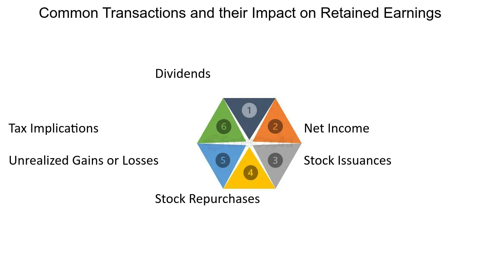

## Table of Contents

## What are retained earnings?

Retained earnings are the profits that a company keeps after it pays out dividends to its shareholders. Think of it like this: when a company makes money, it can either give some of that money back to the people who own its stocks or keep it to use for other things. The money they decide to keep is called retained earnings.

These earnings are important because they can be used to help the company grow. A company might use retained earnings to buy new equipment, pay off debts, or invest in new projects. It's like saving money in a piggy bank; the more a company saves, the more it can spend on things that can make the business even better.

## How do transactions affect retained earnings?

Transactions can change the amount of retained earnings a company has. When a company makes a profit, it adds to the retained earnings. But if the company has a loss, it takes away from the retained earnings. Also, if the company decides to pay dividends to its shareholders, this money comes out of the retained earnings, making them smaller.

Sometimes, other transactions can affect retained earnings too. For example, if a company corrects a mistake from a past accounting period, this can change the retained earnings. Or if the company buys back its own stock, this can also affect the retained earnings. So, many different kinds of transactions can make the retained earnings go up or down, depending on what the company does with its money.

## What is the difference between net income and retained earnings?

Net income is the money a company makes after it pays all its costs and expenses. It's like the money you have left after you pay for everything you need to buy. When a company does well and makes more money than it spends, it has a positive net income. If it spends more than it makes, it has a negative net income, which is called a loss.

Retained earnings are different because they are what's left of the net income after the company pays dividends to its shareholders. Think of it like this: if you earn some money (net income), and then you give some of it away (dividends), the money you keep is like your retained earnings. So, retained earnings are the savings a company keeps to use for future growth or other needs. They grow when the company makes a profit and decides to keep some of that profit instead of giving it all away.

## Can you explain the relationship between dividends and retained earnings?

Dividends and retained earnings are closely connected. When a company makes money, it has to decide what to do with it. It can either give some of that money back to its shareholders as dividends, or it can keep the money as retained earnings. If the company chooses to pay dividends, it takes money out of the retained earnings. So, the more dividends a company pays, the less money it has in retained earnings.

But if the company decides to keep more of its profits instead of paying them out as dividends, the retained earnings will grow. This is because retained earnings are like a savings account for the company. The company can use this saved money to buy new things, pay off debts, or invest in new projects that can help the business grow. So, the relationship between dividends and retained earnings is all about how the company chooses to use its profits.

## How are stock dividends accounted for in retained earnings?

When a company decides to give stock dividends instead of cash dividends, it affects the retained earnings in a different way. Stock dividends are when a company gives its shareholders more shares of stock instead of money. To account for this, the company takes some of the retained earnings and moves it to the common stock and additional paid-in capital accounts. This makes the retained earnings smaller, but it doesn't take any money out of the company.

The amount of retained earnings that gets moved depends on the value of the stock dividends. If the stock dividends are small, the company might use the market value of the stock to figure out how much to move. But if the stock dividends are big, the company might use the par value of the stock instead. Either way, the total value of the company stays the same, but the retained earnings go down, and the shareholders get more shares.

## What impact do stock repurchases have on retained earnings?

When a company buys back its own stock, it's called a stock repurchase. This can affect the retained earnings because the company uses some of its money to buy the stock. The money the company uses for the stock repurchase comes from the retained earnings, so this makes the retained earnings smaller. It's like taking money out of a savings account to buy something.

But stock repurchases can also make the remaining shares of the company more valuable. If the company buys back a lot of its stock, there are fewer shares left for people to own. This can make each share worth more money, which can be good for the shareholders who still own the stock. So, while the stock repurchase makes the retained earnings go down, it might help the value of the company go up in other ways.

## How do accounting adjustments like prior period adjustments affect retained earnings?

When a company finds a mistake in its past financial records, it needs to fix it. This fix is called a prior period adjustment. When this happens, the company changes its retained earnings to correct the mistake. It's like fixing a wrong number in your bank account from last month. If the company found it made more money than it thought before, the retained earnings go up. If it found it made less money, the retained earnings go down.

These adjustments are important because they make sure the company's financial records are correct. They help everyone know the true amount of money the company has kept from its past profits. By making these changes, the company can show a more accurate picture of how much it has saved up in retained earnings.

## What role do unrealized gains and losses play in the calculation of retained earnings?

Unrealized gains and losses are changes in the value of things a company owns, like stocks or property, but they haven't sold yet. These changes don't directly affect the retained earnings because they are not real profits or losses until the company actually sells the item. So, if a company owns stocks that go up in value, it has an unrealized gain, but it doesn't add to the retained earnings until the stocks are sold.

However, unrealized gains and losses can affect a part of the company's financial statements called "other comprehensive income." This part of the financial statements keeps track of changes in value that haven't been realized yet. While these unrealized gains and losses don't change the retained earnings directly, they can influence how much money the company thinks it has, which might affect decisions about dividends and other things that do change the retained earnings.

## How does the adoption of new accounting standards impact retained earnings?

When a company starts using a new accounting standard, it can change the way it keeps track of money. This might mean the company has to go back and change numbers from past years. If the new standard makes the company's past profits look bigger, the retained earnings will go up. If it makes the past profits look smaller, the retained earnings will go down. It's like changing the rules of a game and then having to fix all the scores from old games.

The change in retained earnings happens because the new standard might count money differently. For example, a new rule might say to count some costs in a different way, which changes how much profit the company made. When the company applies these new rules to past years, it adjusts the retained earnings to show the new, correct amount. This helps everyone see a more accurate picture of how much money the company has saved up from its past profits.

## What are the tax implications of transactions affecting retained earnings?

When a company's transactions change its retained earnings, it can also change how much tax the company has to pay. If the company makes more money and keeps it as retained earnings, it might have to pay more taxes because it's showing a higher profit. But if the company has a loss or pays out dividends, which reduces the retained earnings, it might pay less in taxes because its profit is smaller.

Sometimes, how the company uses its retained earnings can also affect taxes. For example, if the company uses the money to buy new equipment, it might be able to take a tax deduction for that expense. This can lower the amount of taxes the company has to pay. But if the company keeps the money without spending it on anything that can be deducted, it might have to pay more in taxes because it's just sitting there as profit.

## How can a company use retained earnings to reinvest in the business?

A company can use its retained earnings to help the business grow and get better. Imagine the retained earnings as a piggy bank where the company keeps the money it doesn't give back to shareholders. The company can take money from this piggy bank to buy new things like machines or computers that can help it make more products faster. It can also use the money to open new stores or offices in different places, so more people can buy its products or services. This helps the company reach more customers and make more money in the future.

Another way a company can use retained earnings is to pay off debts. If the company owes money to a bank or another business, using retained earnings to pay it back means the company doesn't have to pay interest on that debt anymore. This can save the company money and make it stronger financially. Also, the company might use retained earnings to invest in new projects or ideas. For example, it could start making a new type of product or try a new way of selling its products. By using the money it has saved, the company can try new things without needing to borrow more money or ask shareholders for more.

## What advanced financial strategies involve the manipulation of retained earnings for optimization?

Companies often use smart ways to handle their retained earnings to make their business stronger and more valuable. One strategy is called "earnings management." This is when a company carefully chooses when to report its profits or losses to make its financial reports look better. For example, if a company knows it will have a big expense next year, it might try to save up more retained earnings this year. By doing this, it can show a steady profit over time, which makes investors happy and can make the company's stock price go up.

Another way companies use retained earnings is through "share buybacks." When a company buys back its own stock, it uses money from the retained earnings to do this. This can make the remaining shares more valuable because there are fewer of them. It's like if you had a pizza and you took away some slices; the remaining slices become more valuable. This can be good for the shareholders who still own the stock because their shares might be worth more money. By using retained earnings in this way, a company can make its investors happier and possibly attract more people to buy its stock.

## What is the Role of Retained Earnings in Business Finance?

Retained earnings are a critical financial metric for companies, representing the portion of net income not paid out as dividends but instead reinvested in the business. These retained earnings play a vital role in business finance by providing a readily available source of internal finance, essential for funding new projects, supporting expansion plans, and managing unforeseen expenses without the need for external borrowing.

From an analytical perspective, retained earnings are reflected on the balance sheet under shareholders' equity and are calculated using the formula:

$$
\text{Retained Earnings} = \text{Retained Earnings at the beginning of the period} + \text{Net Income} - \text{Dividends Paid}
$$

### Influence on Company Valuation and Investor Perception

The reinvestment of earnings can significantly impact a company's valuation and attract investor interest. High retained earnings may suggest a company is confident in its growth prospects, opting to finance new endeavors internally instead of distributing profits as dividends. This can be attractive to investors looking for long-term capital appreciation, expecting that reinvested earnings will lead to higher future returns. Conversely, consistent accumulation of retained earnings without clear growth initiatives may signal to investors that the company lacks innovative avenues for investment, negatively impacting investor perception.

### Retained Earnings and Shareholder Value

The strategic management of retained earnings is intrinsically linked to shareholder value. Effective use of retained earnings can improve the company's return on equity (ROE), a vital metric for assessing a company’s financial performance and management efficiency. ROE can be broken down as follows:

$$
\text{ROE} = \frac{\text{Net Income}}{\text{Shareholders' Equity}}
$$

Where shareholders' equity includes retained earnings. By reinvesting profits wisely, a company can enhance its ROE, thereby increasing shareholders' wealth, indicating robust financial health and efficient operational management.

### Real-World Examples

A classic example of the strategic use of retained earnings is the technology sector, where companies like Apple and Microsoft have historically reinvested [earning](/wiki/earning-announcement) for innovation and development of new products and services. Apple, for instance, has consistently reinvested its vast retained earnings to ensure technological leadership and market expansion, resulting in a significant increase in shareholder value over time. This self-reinvestment has often been complemented by strategic share buybacks, further boosting stock value.

In contrast, companies in mature industries with limited growth opportunities tend to distribute higher dividends to satisfy income-focused investors, thereby demonstrating the industry-specific strategic implications of retained earnings management.

Overall, retained earnings are crucial not just for maintaining a company's financial flexibility, but also for positioning it strategically in the market to maximize shareholder value. Understanding how to balance between dividend distribution and reinvestment is a key aspect of corporate strategy and investor relations.

## References & Further Reading

[1]: ["Advances in Financial Machine Learning"](https://www.amazon.com/Advances-Financial-Machine-Learning-Marcos/dp/1119482089) by Marcos Lopez de Prado

[2]: Bergstra, J., Bardenet, R., Bengio, Y., & Kégl, B. (2011). ["Algorithms for Hyper-Parameter Optimization."](https://dl.acm.org/doi/10.5555/2986459.2986743) Advances in Neural Information Processing Systems 24.

[3]: ["Machine Learning for Algorithmic Trading"](https://github.com/stefan-jansen/machine-learning-for-trading) by Stefan Jansen

[4]: Zhang, Rui, et al. ["High-Frequency Trading, Stock Volatility, and Price Discovery."](https://papers.ssrn.com/sol3/papers.cfm?abstract_id=1691679) Journal of Financial Economics, 2020.

[5]: ["Quantitative Trading: How to Build Your Own Algorithmic Trading Business"](https://www.amazon.com/Quantitative-Trading-Build-Algorithmic-Business/dp/1119800064) by Ernest P. Chan

[6]: Gros, Daniel. ["Digital Currencies and the Future of the Payment System."](https://www.bis.org/speeches/sp210127.pdf) CEPS Research Report, 2019.

[7]: Balasubramaniam, V. M., et al. ["Blockchain Technology and its Applications in Finance."](https://ieeexplore.ieee.org/abstract/document/8048631) Journal of Banking & Finance, 2019.

[8]: ["Evidence-Based Technical Analysis: Applying the Scientific Method and Statistical Inference to Trading Signals"](https://www.amazon.com/Evidence-Based-Technical-Analysis-Scientific-Statistical/dp/0470008741) by David Aronson