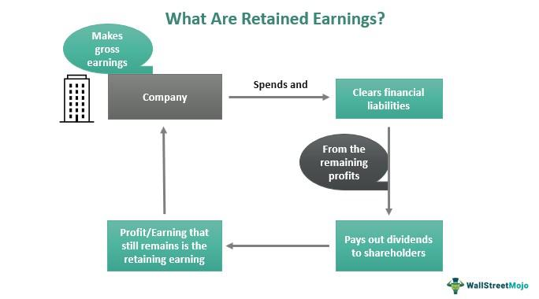

In the rapidly evolving world of finance, understanding the interplay between financial transactions, retained earnings, and algorithmic trading is crucial. As financial markets become increasingly complex, these elements serve as the foundational pillars that drive modern financial systems and strategies. Financial transactions, which encompass everything from depositing money into a bank to executing multi-billion-dollar deals, are fundamental to the economy's functioning. They enable the transfer of assets and resources within an economy, impacting everything from individual savings to global economic policies.

Retained earnings, on the other hand, are a key aspect of a company's financial health and strategic growth. They represent the portion of net income not distributed to shareholders as dividends but instead reinvested into the company. This reinvestment can fund new initiatives, help manage debts, or cushion against unexpected financial challenges. The way retained earnings are managed can significantly influence a company's valuation and investor perceptions, highlighting their importance in strategic financial planning.

Algorithmic trading, often known as algo trading, introduces a high-tech dimension to finance by automating trading activities through sophisticated algorithms. These algorithms can analyze vast datasets and execute trades at speeds unattainable by human traders, enhancing market liquidity and efficiency. However, they also raise challenges, such as regulatory oversight and the potential for market manipulation.

This article will explore how financial transactions, retained earnings, and algorithmic trading interact, influence each other, and redefine traditional financial strategies. We aim to provide insights that are valuable to both financial professionals and enthusiasts, showcasing the practical applications and implications of these concepts. As we navigate through these interconnected areas, readers will gain a clearer understanding of how they collectively shape the landscape of modern finance.

## Table of Contents

## Understanding Financial Transactions

Financial transactions form the bedrock of any economic framework by facilitating the exchange of assets and resources between entities. These transactions can range from simple exchanges of cash for goods or services to intricate arrangements involving numerous parties, complex financial instruments, and sophisticated legal agreements. The diversity of financial transactions underscores their centrality to the economic processes and growth.

In traditional settings, financial transactions were often manual and paper-based, involving significant time and labor resources. However, technology has radically transformed this landscape, making transactions faster, more secure, and accessible to a broader population. Innovations such as electronic banking, mobile payments, and contactless transactions provide consumers and businesses with efficient and convenient ways to move money. Moreover, these advancements help in reducing transactional friction, thereby boosting trade and commerce.

Among the transformative technologies reshaping financial transactions, blockchain stands out prominently. Blockchain technology offers a decentralized ledger system that increases transparency, reduces fraud, and enhances security by recording transactions across a network of computers. The immutability of blockchain records provides a robust audit trail, which is beneficial for both regulatory compliance and operational integrity.

Digital currencies, or cryptocurrencies like Bitcoin and Ethereum, are another innovation fundamentally altering transaction models. Cryptocurrencies provide a novel means of transferring value over the internet without the need for intermediaries such as banks. This feature lowers transaction costs and facilitates cross-border payments. However, they also introduce challenges regarding regulatory oversight, scalability, and [volatility](/wiki/volatility-trading-strategies), necessitating a balanced approach to their adoption and integration into standard economic practices.

Understanding these dynamics is crucial for modern financial operations. Embracing technological advancements not only optimizes transactional efficiency but also equips businesses and individuals with the tools needed to navigate an increasingly digital financial landscape. As technology continues to develop, stakeholders must remain vigilant and adaptive to leverage these tools effectively, ensuring that financial operations remain robust, secure, and responsive to emerging demands.

## The Role of Retained Earnings in Business Finance

Retained earnings are a critical financial metric for companies, representing the portion of net income not paid out as dividends but instead reinvested in the business. These retained earnings play a vital role in business finance by providing a readily available source of internal finance, essential for funding new projects, supporting expansion plans, and managing unforeseen expenses without the need for external borrowing.

From an analytical perspective, retained earnings are reflected on the balance sheet under shareholders' equity and are calculated using the formula:

$$
\text{Retained Earnings} = \text{Retained Earnings at the beginning of the period} + \text{Net Income} - \text{Dividends Paid}
$$

### Influence on Company Valuation and Investor Perception

The reinvestment of earnings can significantly impact a company's valuation and attract investor interest. High retained earnings may suggest a company is confident in its growth prospects, opting to finance new endeavors internally instead of distributing profits as dividends. This can be attractive to investors looking for long-term capital appreciation, expecting that reinvested earnings will lead to higher future returns. Conversely, consistent accumulation of retained earnings without clear growth initiatives may signal to investors that the company lacks innovative avenues for investment, negatively impacting investor perception.

### Retained Earnings and Shareholder Value

The strategic management of retained earnings is intrinsically linked to shareholder value. Effective use of retained earnings can improve the company's return on equity (ROE), a vital metric for assessing a company’s financial performance and management efficiency. ROE can be broken down as follows:

$$
\text{ROE} = \frac{\text{Net Income}}{\text{Shareholders' Equity}}
$$

Where shareholders' equity includes retained earnings. By reinvesting profits wisely, a company can enhance its ROE, thereby increasing shareholders' wealth, indicating robust financial health and efficient operational management.

### Real-World Examples

A classic example of the strategic use of retained earnings is the technology sector, where companies like Apple and Microsoft have historically reinvested [earning](/wiki/earning-announcement) for innovation and development of new products and services. Apple, for instance, has consistently reinvested its vast retained earnings to ensure technological leadership and market expansion, resulting in a significant increase in shareholder value over time. This self-reinvestment has often been complemented by strategic share buybacks, further boosting stock value.

In contrast, companies in mature industries with limited growth opportunities tend to distribute higher dividends to satisfy income-focused investors, thereby demonstrating the industry-specific strategic implications of retained earnings management.

Overall, retained earnings are crucial not just for maintaining a company's financial flexibility, but also for positioning it strategically in the market to maximize shareholder value. Understanding how to balance between dividend distribution and reinvestment is a key aspect of corporate strategy and investor relations.

## The Rise of Algorithmic Trading

Algorithmic trading, also known as algo trading, utilizes computer algorithms to automate trading decisions and transactions. These algorithms follow pre-defined criteria, enabling the execution of trades with high speed and accuracy. The precise nature of algo trading stems from its ability to process and analyze vast amounts of data in real-time, reducing the human error associated with manual trading.

The popularity of [algorithmic trading](/wiki/algorithmic-trading) can be attributed to several key advantages. Firstly, speed is a significant [factor](/wiki/factor-investing); algorithms can execute orders in fractions of a second, far quicker than a human trader. This speed allows participants to capitalize on minimal price discrepancies that may exist for a very short duration. Secondly, algo trading systems allow the execution of complex trading strategies which may be impossible to manage manually. For instance, statistical [arbitrage](/wiki/arbitrage) strategies involve taking advantage of quantitative models to identify price disparities across different markets or securities and act on them swiftly.

Understanding how algorithmic trading operates involves examining various underlying strategies. Common strategies include [market making](/wiki/market-making), arbitrage, and [trend following](/wiki/trend-following). Market making involves quoting both buy and sell prices for a financial instrument, profiting from the bid-ask spread. Arbitrage exploits price differentials of identical or similar financial instruments in different markets or forms. Trend following is based on algorithmic predictions that count on movements or trends in the financial market price data.

While algorithmic trading contributes greatly to market [liquidity](/wiki/liquidity-risk-premium) and pricing efficiency, it also poses certain risks. One of the main concerns is market manipulation. Algorithms with the ability to perform high-frequency trades might be used to manipulate market prices through practices like spoofing, where false orders are placed to create a misleading impression of demand or supply. Regulatory bodies continuously work to identify and mitigate these manipulative tactics through stringent rules and surveillance.

Regulatory concerns are significant in the context of algorithmic trading. Different jurisdictions enforce various guidelines to ensure fair trading practices and financial stability. For instance, certain regions mandate rigorous testing of trading algorithms before their deployment and require firms to possess automatic stop mechanisms in case of abnormal market behavior. These regulations aim to prevent scenarios that could lead to market destabilization, such as the "Flash Crash" of May 2010, where the rapid withdrawal of appealing orders caused an unprecedented drop in the U.S. stock market.

In summary, the rapid rise of algorithmic trading reflects a broader shift towards technology-driven finance, bringing increased efficiency and novel approaches to market operations, but necessitating ongoing regulatory oversight to safeguard market integrity and fairness.

## Integrating Financial Transactions with Algorithmic Trading

Combining traditional financial transaction methods with algorithmic trading strategies can significantly optimize investment outcomes by leveraging technology to enhance decision-making processes. The integration of these domains is facilitated by advancements in big data and [artificial intelligence](/wiki/ai-artificial-intelligence) (AI), which provide critical insights and improve transaction analysis and execution speeds.

Big data and AI play a pivotal role in this integration. The vast amounts of information generated from financial transactions can be processed and analyzed rapidly through algorithmic methodologies. Machine learning models, for instance, can be developed to predict market trends by learning patterns from historical data. This allows traders to make informed decisions quickly and accurately. For example, a [machine learning](/wiki/machine-learning) model might use transaction data to predict stock price movements, thereby informing algorithmic trading strategies that execute buy or sell orders in real-time to capitalize on these predictions.

AI-driven algorithms optimize these processes by refining execution strategies, reducing costs, and improving efficiency. A practical application of AI in trading is the use of Natural Language Processing (NLP) to interpret and analyze news articles or social media sentiment regarding a particular stock, translating this data into actionable trading strategies. This enhancement in transaction analysis not only improves response time but also minimizes human error, contributing to better investment outcomes.

Synergies between traditional financial transactions and algorithmic trading provide substantial competitive advantages. For instance, incorporating high-frequency trading ([HFT](/wiki/high-frequency-trading-strategies)) systems, which rely on complex algorithms to execute a large number of orders at extremely fast speeds, can lead to lower transaction costs and increased market liquidity. HFT systems take advantage of minor price fluctuations which occur over very short time frames, profiting from the speed of transactions enabled by integrated systems.

Furthermore, these systems can be equipped with real-time risk management protocols that mitigate potential losses, ensuring more stable and profitable trading environments. The strategic use of AI and machine learning insights facilitates the optimization of algorithms, increasing the accuracy of predicting market volatilities and minimizing associated risks.

Case studies highlight successful integrations and lessons learned from combining financial transactions with algo trading. One notable example is the use of algorithmic trading platforms by financial firms like Goldman Sachs, which employ AI to optimize their trading strategies, significantly reducing operational costs and improving trade execution efficiency. Another case study of significance would be Renaissance Technologies' Medallion Fund, renowned for its sophisticated quantitative models that process large amounts of transaction data to predict price movements, showcasing how integration leads to superior market performance.

In conclusion, the integration of traditional financial transactions with algorithmic trading, supported by big data and AI, offers substantial improvements in the speed and accuracy of trade executions. This integration not only generates competitive advantages through enhanced trading strategies but also encourages continuous innovation and adaptation in financial markets to maintain this edge. By understanding and implementing these synergies, financial professionals can better navigate and thrive in the rapidly evolving financial landscape.

## Future Trends and Conclusion

In the evolving financial landscape, emerging technologies such as quantum computing and machine learning promise to revolutionize financial transactions, retained earnings, and algorithmic trading. Quantum computing, with its ability to process complex computations exponentially faster than traditional computers, can transform transaction analysis and risk assessment, enabling quicker financial decision-making. Machine learning algorithms continue to enhance predictive analytics, optimizing trading strategies by learning from historical data and adjusting to market changes in real time.

The integration of these technologies highlights the necessity for financial institutions to continuously adapt and innovate to maintain competitive advantages. As the dynamics of financial transactions evolve with these technological advancements, institutions that leverage quantum computing for risk modeling or machine learning to refine trading algorithms will remain ahead of the curve. 

A key takeaway from this exploration is the interconnectedness of financial transactions, retained earnings, and algorithmic trading. Financial transactions form the foundation of economic systems and are continuously optimized through technology. Retained earnings provide a company with the financial flexibility needed for innovation and growth, while algorithmic trading enhances market efficiency and liquidity. Understanding these areas enables professionals to navigate complexities and strategize more effectively.

In conclusion, the synergy between financial transactions and trading algorithms is accentuated by technological breakthroughs. By staying informed and agile, financial professionals can anticipate industry shifts, drive innovation, and enhance overall financial strategies in an increasingly complex financial environment.

## References & Further Reading

[1]: ["Advances in Financial Machine Learning"](https://www.amazon.com/Advances-Financial-Machine-Learning-Marcos/dp/1119482089) by Marcos Lopez de Prado

[2]: Bergstra, J., Bardenet, R., Bengio, Y., & Kégl, B. (2011). ["Algorithms for Hyper-Parameter Optimization."](https://dl.acm.org/doi/10.5555/2986459.2986743) Advances in Neural Information Processing Systems 24.

[3]: ["Machine Learning for Algorithmic Trading"](https://github.com/stefan-jansen/machine-learning-for-trading) by Stefan Jansen

[4]: Zhang, Rui, et al. ["High-Frequency Trading, Stock Volatility, and Price Discovery."](https://papers.ssrn.com/sol3/papers.cfm?abstract_id=1691679) Journal of Financial Economics, 2020.

[5]: ["Quantitative Trading: How to Build Your Own Algorithmic Trading Business"](https://www.amazon.com/Quantitative-Trading-Build-Algorithmic-Business/dp/1119800064) by Ernest P. Chan

[6]: Gros, Daniel. ["Digital Currencies and the Future of the Payment System."](https://www.bis.org/speeches/sp210127.pdf) CEPS Research Report, 2019.

[7]: Balasubramaniam, V. M., et al. ["Blockchain Technology and its Applications in Finance."](https://ieeexplore.ieee.org/abstract/document/8048631) Journal of Banking & Finance, 2019.

[8]: ["Evidence-Based Technical Analysis: Applying the Scientific Method and Statistical Inference to Trading Signals"](https://www.amazon.com/Evidence-Based-Technical-Analysis-Scientific-Statistical/dp/0470008741) by David Aronson