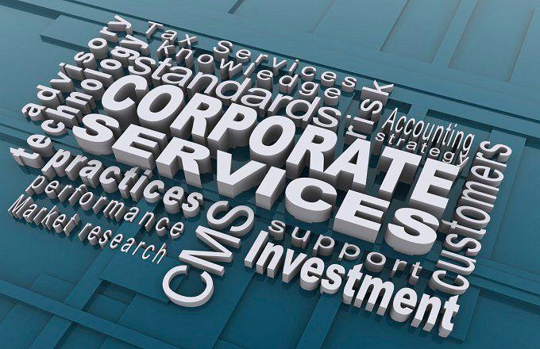

## Table of Contents

## What is the Transatlantic Trade and Investment Partnership (TTIP)?

The Transatlantic Trade and Investment Partnership (TTIP) is a proposed trade agreement between the United States and the European Union. The main goal of TTIP is to make it easier for businesses in the US and EU to trade with each other by reducing tariffs and other trade barriers. This would help increase the amount of trade and investment between the two regions, which could lead to more jobs and economic growth.

However, TTIP has been controversial. Some people worry that it could lower standards for things like food safety and environmental protection. They are concerned that big companies might have too much power and that the agreement might not be fair to smaller businesses or workers. Because of these concerns, negotiations for TTIP have been paused, and it's not clear if or when the agreement will be completed.

## Which countries are involved in the TTIP?

The TTIP involves the United States and the countries in the European Union. The European Union is a group of 27 countries that work together closely. Some of the countries in the EU are France, Germany, Italy, and Spain.

The idea behind TTIP is to make it easier for businesses in the US and the EU to trade with each other. This could help create more jobs and make the economy stronger in both places. But some people are worried that TTIP might not be good for everyone, so the talks about it have stopped for now.

## What are the main goals of the TTIP?

The main goal of the Transatlantic Trade and Investment Partnership (TTIP) is to make it easier for businesses in the United States and the European Union to trade with each other. By reducing tariffs and other trade barriers, TTIP aims to increase the amount of trade and investment between these two regions. This could lead to more jobs and help the economy grow in both the US and the EU.

However, TTIP has been controversial because some people worry about its effects. They are concerned that it might lower standards for things like food safety and environmental protection. There's also a fear that big companies might gain too much power, and the agreement might not be fair to smaller businesses or workers. Because of these concerns, the negotiations for TTIP have been paused, and it's not clear if or when the agreement will be completed.

## How does the TTIP aim to benefit participating countries economically?

The TTIP aims to help the economies of the United States and the countries in the European Union by making it easier for them to trade with each other. By getting rid of tariffs and other trade barriers, businesses in these places can sell their products more easily. This could lead to more trade and investment between the US and the EU. More trade means more jobs for people and more money for businesses, which can help the economy grow in both regions.

However, not everyone thinks TTIP is a good idea. Some people worry that it might lower the rules that protect things like food safety and the environment. They are also concerned that big companies might get too much power, and the deal might not be fair to smaller businesses or workers. Because of these worries, the talks about TTIP have been stopped for now, and it's not clear if or when the agreement will happen.

## What are the key sectors affected by the TTIP?

The TTIP could affect many different parts of the economy. Some of the main areas that might be changed by TTIP are farming, making cars, and services like banking and insurance. If TTIP goes through, it could make it easier for farmers in the US and EU to sell their food to each other. Car companies might also find it easier to sell cars in both places because the rules about making cars would be more similar.

However, not everyone thinks TTIP is a good idea. Some people worry that it might change the rules about food safety and the environment. They are concerned that big companies might get too much power, and the deal might not be fair to smaller businesses or workers. Because of these worries, the talks about TTIP have been stopped for now, and it's not clear if or when the agreement will happen.

## What is the current status of the TTIP negotiations?

The TTIP negotiations have been paused for a while now. The United States and the European Union started talking about TTIP in 2013, but they stopped in 2016. The main reason for the pause is that many people in both places had concerns about the agreement. They worried that TTIP might lower standards for things like food safety and the environment. There were also fears that big companies might get too much power, and the deal might not be fair to smaller businesses or workers.

Right now, it's not clear if or when the TTIP negotiations will start again. Both the US and the EU have other trade deals they are working on, and the political situation in both places has changed since the talks stopped. Some people still think TTIP could be good for the economy, but others believe the risks are too big. Until there is a new agreement to move forward, TTIP remains on hold.

## What are the major criticisms and concerns about the TTIP?

Many people have worries about the TTIP. One big concern is that it might lower standards for things like food safety and the environment. People are afraid that if TTIP goes through, the rules that keep our food safe and our environment clean might not be as strict. This could happen because the US and the EU have different rules now, and TTIP might make them more alike, but not always in a good way.

Another big worry is that big companies might get too much power because of TTIP. Some people think that the agreement could make it easier for big businesses to do what they want, even if it's not good for smaller companies or workers. They are concerned that TTIP might not be fair to everyone and could make it harder for small businesses to compete. Because of these worries, the talks about TTIP have been stopped for now, and it's not clear if or when the agreement will happen.

## How does the TTIP address regulatory cooperation between the U.S. and the EU?

The TTIP aims to make it easier for the U.S. and the EU to work together on rules and regulations. This is called regulatory cooperation. The idea is that if both places have similar rules, it will be easier for businesses to sell their products in both the U.S. and the EU. For example, if a car company in the U.S. wants to sell cars in the EU, it would be simpler if the safety rules for cars were the same in both places. TTIP wants to help make these rules more alike so that businesses don't have to follow two different sets of rules.

However, some people are worried about this part of TTIP. They think that making the rules more alike might mean lowering the standards that keep people and the environment safe. For example, if the EU has stricter rules about what can be in food, and the U.S. has looser rules, TTIP might make the EU change its rules to be more like the U.S. This could mean that food in the EU might not be as safe. Because of these worries, the talks about TTIP have been stopped for now, and it's not clear if or when the agreement will happen.

## What impact could the TTIP have on global trade standards?

The TTIP could change the way global trade works by setting new standards for how countries trade with each other. If the U.S. and the EU agree on rules about things like food safety and making cars, other countries might start to follow these rules too. This could make global trade easier because everyone would be playing by the same rules. But it could also mean that some countries might have to change their own rules to match the U.S. and the EU, even if they don't want to.

However, not everyone thinks the TTIP is a good idea. Some people worry that the new rules set by the U.S. and the EU might not be as strict as they should be. For example, if the EU has strict rules about what can be in food and the U.S. has looser rules, the TTIP might make the EU change its rules to be more like the U.S. This could mean that food safety standards around the world might go down. Because of these worries, the talks about TTIP have been stopped for now, and it's not clear if or when the agreement will happen.

## How does the TTIP handle issues related to labor and environmental standards?

The TTIP aims to make trade easier between the U.S. and the EU, but it also tries to keep labor and environmental standards strong. The agreement wants to make sure that workers in both places are treated fairly and that the environment is protected. This means that TTIP includes rules to stop companies from moving to places where they can pay workers less or pollute more. The idea is to make sure that trade doesn't hurt workers or the environment.

However, some people worry that TTIP might not do enough to protect labor and environmental standards. They think that the agreement could let big companies have too much power, and this might make it harder to keep strict rules about worker rights and the environment. Because of these worries, the talks about TTIP have been stopped for now, and it's not clear if or when the agreement will happen.

## What are the potential geopolitical implications of the TTIP?

The TTIP could change how countries work together around the world. If the U.S. and the EU make a big trade deal, it might make them stronger together. This could mean they have more power when they talk to other countries about trade and other important things. Other countries might want to make deals with the U.S. and the EU too, so they can be part of this big group. But some countries might feel left out or worried that the U.S. and the EU are getting too strong.

On the other hand, some people think that TTIP could cause problems between countries. If the U.S. and the EU set new rules for trade, other countries might not like these rules. They might feel like they have to follow what the U.S. and the EU want, even if they don't agree. This could make it harder for countries to work together and might cause arguments. Because of these worries, the talks about TTIP have been stopped for now, and it's not clear if or when the agreement will happen.

## How does the TTIP compare to other major trade agreements like the TPP?

The TTIP and the TPP are both big trade deals, but they are different in some ways. The TTIP is a trade agreement between the United States and the European Union. It wants to make it easier for businesses in these places to trade with each other by getting rid of tariffs and other trade barriers. The TPP, or Trans-Pacific Partnership, is a trade deal between countries around the Pacific Ocean, like the U.S., Japan, and Australia. It also wants to make trade easier, but it includes more countries and covers a bigger area of the world.

Both agreements have similar goals, like making trade easier and helping the economy grow. But they also have some big differences. The TTIP focuses on the U.S. and the EU, so it's more about making rules between these two places more alike. The TPP, on the other hand, tries to set rules for a lot of different countries, which can be harder because each country has its own rules. Also, the TPP has been signed by some countries, but the TTIP talks have been stopped for now because of worries about things like food safety and the environment.

## References & Further Reading

[1]: De Ville, F., & Siles-Brügge, G. (2017). ["The Impact of the Transatlantic Trade and Investment Partnership on Governance."](https://www.ssoar.info/ssoar/bitstream/handle/document/73246/ssoar-politicsgovernance-2019-3-de_ville_et_al-The_Impact_of_Brexit_on.pdf?sequence=1) Comparative Political Studies, 50(10), 1417-1450.

[2]: Hamilton, D. S., & Quinlan, J. P. (2015). ["The Transatlantic Economy 2015"](https://www.amazon.com/Transatlantic-Economy-2015-Investment-between/dp/0990772047) Johns Hopkins University, Center for Transatlantic Relations.

[3]: Woolcock, S. (2014). ["The Transatlantic Trade and Investment Partnership: Strategic Implications"](https://sgp.fas.org/crs/row/R43387.pdf) Governance: An International Journal of Policy, Administration, and Institutions, 27(3), 423–435.

[4]: Felbermayr, G., Heid, B., Lehwald, S., & Braml, M. (2015). ["Transatlantic Trade and Investment Partnership (TTIP) Who Benefits from a Free Trade Deal?"](https://onlinelibrary.wiley.com/doi/full/10.1111/twec.12670) Bertelsmann Stiftung.

[5]: Shaffer, G., & Ratner, S. R. (2017). ["The Limits of Transnational Law: Refugee Law, Policy Harmonization and Judicial Dialogue in the European Union"](https://assets.cambridge.org/97805211/98202/frontmatter/9780521198202_frontmatter.pdf) Cambridge University Press.