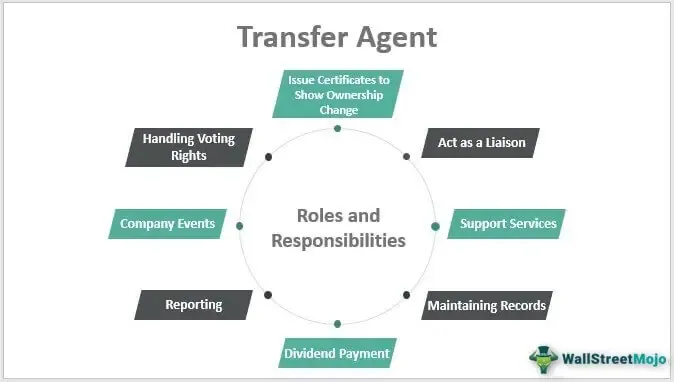

In the modern financial ecosystem, the interplay between transfer agents, financial services, corporate finance, and algorithmic trading forms an intricate and essential framework. Transfer agents are pivotal in facilitating the transfer of securities and maintaining shareholder records, effectively bridging companies and their investors. Their importance is magnified within corporate finance, where they ensure accurate stock ownership records and support key activities such as dividend distribution and proxy voting. This collaboration aids in the seamless flow of information and resources during corporate actions like mergers and acquisitions.

Financial services, which encompass asset management, banking, insurance, and investment services, rely heavily on transfer agents to ensure accurate and timely updates of transactional records. This interaction is crucial for sustaining the integrity and trust in financial markets, as it enables the management of shareholder transactions and account records, particularly within mutual funds.



The advent of algorithmic trading has introduced a transformative dynamic, fundamentally altering trade execution and settlement processes. Transfer agents adapt to these changes by incorporating advanced technologies to meet the demands for speed and precision in trade settlements. As technology permeates financial operations, it brings numerous benefits, including improved data accuracy, error reduction, and enhanced reliability in record-keeping.

Integrating technology within financial services facilitates automation, elevating the efficiency of data processing and shareholder communication. Transfer agents and financial services providers leverage these technological advancements to enhance compliance with regulatory standards, optimize operations, and maintain a competitive advantage. The synergy created through this integration underpins the future trajectory of the financial sector, emphasizing the value of technological investments to address emerging challenges.

## Table of Contents

## Understanding Transfer Agents

Transfer agents serve as crucial intermediaries in the financial markets by maintaining precise records of shareholders and facilitating the seamless transfer of company securities. These entities ensure investors receive timely payments and updates, acting as a vital communication link between companies and their investors. By managing essential shareholder information, transfer agents contribute to the transparency and efficiency of financial transactions.

One of the primary responsibilities of transfer agents is the accurate maintenance of shareholder records. This entails tracking the ownership of a company's securities, which is pivotal for corporations in managing their equity structure and for shareholders in receiving their entitled benefits. Transfer agents employ sophisticated systems to ensure records are up-to-date, reflecting any changes arising from trading activities, dividend payments, or corporate actions such as stock splits or mergers.

Transfer [agents](/wiki/agents) also ensure that investors receive timely payments, such as dividends. They manage the disbursement of these payments by verifying shareholder entitlements and coordinating with financial institutions to deposit funds directly into investors' accounts. This process is vital for maintaining investor relations and trust, as shareholders expect precise and prompt payment in accordance with their holdings.

Additionally, transfer agents function as a communication bridge between companies and shareholders. They distribute important financial updates and information about shareholder meetings, ensuring investors are informed of developments that may affect their investments. This role is crucial in facilitating shareholder engagement and participation in corporate governance activities, such as voting on key corporate resolutions.

Compliance with regulatory standards is a fundamental aspect of a transfer agent's duties. These regulations are designed to protect investors and ensure the integrity of securities markets. Transfer agents must adhere to guidelines set by regulatory bodies, such as the Securities and Exchange Commission (SEC) in the United States, which oversee the registration, reporting, and continuous monitoring of transfer agent activities. To meet these compliance requirements, transfer agents implement robust systems and procedures that govern their operations, from record-keeping to transaction processing.

By fulfilling these functions, transfer agents support the stability and reliability of the financial markets, ensuring that all parties in the securities transfer process can operate with confidence and security.

## Role of Transfer Agents in Corporate Finance

Transfer agents hold a pivotal position in corporate finance, particularly concerning the distribution of dividends and the management of proxy voting during shareholder meetings. By keeping precise records of shareholders, transfer agents ensure that dividend payouts are executed accurately and punctually, thereby maintaining shareholder satisfaction and investor confidence. Their role extends to organizing and overseeing proxy voting, which is crucial during shareholder meetings where significant corporate decisions are made, such as electing board members or approving mergers.

In mergers and acquisitions (M&A), transfer agents are indispensable. They ensure the seamless transition of ownership records, allowing for the smooth exchange of stock ownership. This task involves meticulous verification and updating of shareholder information to reflect changes post-merger or acquisition. Their capability to provide real-time updates and accurate data management is essential to minimizing disputes and delays in M&A deals.

Moreover, corporate finance relies heavily on transfer agents for effective equity management. Transfer agents manage the issuance and cancellation of shares, keep track of outstanding shares, and facilitate secondary market transactions. Their partnership with financial personnel helps maintain orderly and regulated trading environments essential for [liquidity](/wiki/liquidity-risk-premium) and market stability.

Effective shareholder communication is another significant responsibility of transfer agents. By disseminating timely information related to corporate actions, voting processes, and financial reports, transfer agents help maintain transparency and foster a relationship of trust between corporations and their investors. This is crucial not only for compliance with regulatory obligations but also for enhancing corporate reputation and investor relations.

## Financial Services and Transfer Agents

Financial services encompass a broad spectrum of activities, including managing investments, assets, and wealth for individuals and institutional clients. At the core of these operations lies the need for accurate and timely updating of ownership records, a task primarily handled by transfer agents. Transfer agents function as crucial intermediaries by ensuring the seamless transfer of securities between buyers and sellers while maintaining accurate shareholder records. This ensures that investor information is current and precise, contributing to the overall reliability of financial transactions.

Transfer agents play an indispensable role in the management of mutual funds. They oversee the execution of transactions, maintain shareholder account information, and provide reports on fund activities. Their services guarantee that all transactions are recorded correctly, dividends are distributed accurately, and any changes in ownership are documented promptly. This level of precision is vital for asset managers who depend on up-to-date data to make informed decisions and optimize their investment strategies.

The collaboration between financial service providers and transfer agents establishes a foundation of trust and integrity in financial operations. Financial institutions rely on transfer agents to safeguard the transactional processes, ensuring that client records are free from discrepancies and managed under strict compliance guidelines. This partnership is crucial for preserving the integrity of the financial markets, as it facilitates the meticulous handling of sensitive information and smooth execution of trading activities.

In effect, the interaction between financial services and transfer agents contributes significantly to maintaining transparency and accountability in the financial sector. By ensuring that all aspects of security ownership, from purchase and sale to record updates, are conducted with the highest level of precision and accuracy, they uphold the confidence of investors and the public in financial markets.

## Algorithmic Trading and Its Impact on Transfer Agents

Algorithmic trading refers to the use of computer algorithms to manage the buying and selling of securities with minimal human intervention. It relies heavily on complex mathematical models and formulas to make rapid trading decisions that balance multiple market factors. This approach has significantly altered the landscape of stock trading by enhancing both speed and efficiency. For example, algorithms can analyze multiple market variables and execute trades in milliseconds, far outpacing human capabilities.

The role of transfer agents in this evolving ecosystem is critical. They are tasked with ensuring smooth execution and settlement of trades by maintaining accurate and up-to-date shareholder records. In the context of [algorithmic trading](/wiki/algorithmic-trading), transfer agents must therefore work closely with traders and brokers to facilitate these rapid transactions. This involves the continuous updating of ownership records and ensuring that all transactions adhere to compliance standards.

The incorporation of algorithmic trading into financial markets has introduced several compliance challenges for transfer agents. One major issue is the need to handle large volumes of transactions quickly while maintaining stringent accuracy standards. The transfer agents must now incorporate advanced trading systems and technologies that can align with the pace of algorithmic trading. This requires the adoption of sophisticated IT infrastructure capable of handling high-speed data processing and carrying out complex reconciliations in real-time to avoid any discrepancies in shareholder records.

Additionally, technology integration has ushered in new avenues for error reduction and data accuracy improvement. This plays a crucial role in compliance, as transfer agents must ensure their processes conform to regulatory standards, such as the SEC in the United States or the FCA in the United Kingdom. This is facilitated by the use of automated systems which not only execute transactions with greater precision but also generate comprehensive audit trails that can be easily reviewed for compliance purposes.

From a practical standpoint, the relationship between algorithmic trading and transfer agents can be exemplified through code implementations. Below is a simplified Python snippet that demonstrates how a transfer agent might use an algorithm to process trades, ensuring they are recorded accurately:

```python
class TransferAgent:
    def __init__(self):
        self.records = {}

    def update_records(self, transaction):
        stock_id = transaction['stock_id']
        quantity = transaction['quantity']
        buyer = transaction['buyer']
        seller = transaction['seller']

        # Update buyer's record
        self.records[buyer] = self.records.get(buyer, 0) + quantity

        # Update seller's record
        self.records[seller] = self.records.get(seller, 0) - quantity

        # Log the transaction for audit purposes
        self.log_transaction(transaction)

    def log_transaction(self, transaction):
        print(f"Processed transaction: {transaction}")

# Example of processing a transaction
transaction = {
    'stock_id': 'AAPL',
    'quantity': 100,
    'buyer': 'Trader123',
    'seller': 'Trader456'
}

agent = TransferAgent()
agent.update_records(transaction)
```

This code snippet represents a very basic model of how trades are processed by updating records and logging transactions. In practice, much more complex systems are used which involve real-time data feeds and adherence to strict regulatory requirements.

In conclusion, algorithmic trading has necessitated a transformation in the operations of transfer agents, urging them to adopt more advanced technologies and systems. This partnership not only enhances trade execution and settlement but also fortifies the integrity and compliance of financial transactions.

## The Benefits of Technological Integration

Technological integration in financial operations significantly enhances data accuracy, reduces errors, and bolsters the reliability of record-keeping, which are critical aspects of modern finance. With the advancement of technology, especially in data processing and communication, transfer agents have been able to streamline their operations, resulting in various efficiencies and improvements.

Transfer agents, traditionally responsible for maintaining shareholder records and managing securities transfers, now leverage automation to substantially improve the speed and accuracy of their services. Automation allows for the rapid processing of transactions and facilitates effective communication with shareholders. Tasks that previously required manual input and verification are now managed by software systems that minimize human error and increase processing speed. For instance, automating dividend payments or stock transfer processes ensures that these transactions are executed accurately and efficiently, reducing the risk of discrepancies and delays.

Moreover, systematic technological upgrades play a pivotal role in helping transfer agents comply with the ever-evolving regulatory standards of the financial industry. Given the stringent requirements and the constant changes in financial regulations, staying compliant is crucial for transfer agents to maintain their operational legitimacy and trust with stakeholders. By integrating technology, transfer agents can swiftly adapt their systems to align with new compliance rules, ensuring that their operations continue without interruption. For example, many regulatory frameworks now require robust data protection measures, and advanced technological tools enable transfer agents to implement and manage these requirements effectively.

Furthermore, technology enables real-time data analytics and monitoring, allowing transfer agents to quickly identify and address potential issues before they escalate. This proactive approach not only improves the quality of service offered to clients but also fortifies the agents’ role in maintaining the integrity of financial markets.

In conclusion, the adoption and integration of technology by transfer agents and other financial service participants continues to reshape the financial industry's landscape. These advancements not only foster improvements in operational efficiency but also enhance compliance and data integrity, positioning these entities to navigate the complex future of financial services successfully.

## Conclusion: The Future of Financial Services

As financial markets continue to undergo rapid changes, the interconnected roles of transfer agents, corporate finance, and algorithmic trading become increasingly critical. Transfer agents, traditionally seen as intermediaries ensuring the accurate transfer of securities, are now pivotal in the technologically advanced trading landscapes driven by algorithmic trading strategies. The integration of algorithms has not only expedited trading processes but also increased the complexity and [volume](/wiki/volume-trading-strategy) of transactions that transfer agents must handle. This reflects a shift towards a more automated and seamless operational model in financial services, emphasizing the need for real-time data processing and compliance with dynamic market standards.

Corporations striving for efficiency and a competitive edge must leverage this interconnectedness. By synchronizing the efforts of transfer agents with corporate finance goals and the capabilities of algorithmic trading, companies can streamline shareholder communication, optimize asset distribution, and ensure robust regulatory compliance. This synergy allows organizations to not only manage resources more effectively but also to react swiftly to market fluctuations. For instance, during mergers and acquisitions, transfer agents play a crucial role in maintaining updated ownership records, pivotal for informed decision-making in corporate finance.

Investment in technological advancements emerges as an essential strategy for financial entities aiming to tackle future challenges. Technologies such as blockchain, [artificial intelligence](/wiki/ai-artificial-intelligence), and [machine learning](/wiki/machine-learning) can further enhance the efficiency and security of financial operations. Blockchain, for example, can offer transparent and tamper-proof records, improving trust and accuracy in transactions. Similarly, AI and machine learning can enable predictive analytics, allowing companies to anticipate market trends and adjust strategies proactively.

Thus, the future of financial services is poised on the edge of continuous evolution, with technology driving the transformation of how transfer agents, corporate finance, and algorithmic trading coalesce. Organizations that adapt by embedding these technologies into their frameworks can significantly enhance operational efficacy, achieving a sustainable competitive advantage in a fast-paced financial environment.

## References & Further Reading

[1]: Perrin, Olivier (2017). ["The Role of Transfer Agents in the Financial Services Industry."](https://editorial.rottentomatoes.com/guide/best-movies-on-amazon-prime-right-now/) The World Bank.

[2]: Securities and Exchange Commission. ["Transfer Agents."](https://www.sec.gov/about/divisions-offices/division-trading-markets/transfer-agents) U.S. Securities and Exchange Commission.

[3]: Marcos Lopez de Prado (2018). ["Advances in Financial Machine Learning."](https://www.amazon.com/Advances-Financial-Machine-Learning-Marcos/dp/1119482089) Wiley.

[4]: Securities Transfer Association. ["Guide to the Securities Transfer Process."](https://stai.org/page/guidelines) 

[5]: Chan, Ernest P. (2009). ["Quantitative Trading: How to Build Your Own Algorithmic Trading Business."](https://github.com/ftvision/quant_trading_echan_book) Wiley.

[6]: Jansen, Stefan (2018). ["Machine Learning for Algorithmic Trading."](https://github.com/stefan-jansen/machine-learning-for-trading) Packt Publishing.