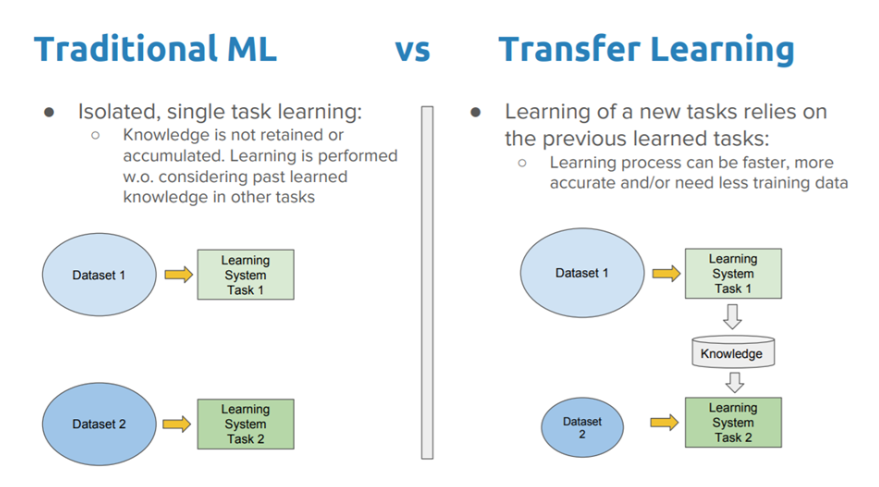

## Table of Contents

## What is transfer learning in machine learning?

Transfer learning in machine learning is a technique where a model developed for one task is reused as the starting point for a model on a second task. Imagine you've taught a computer to recognize cats in pictures. Instead of starting from scratch to teach it to recognize dogs, you can use what it already knows about cats to help it learn about dogs faster. This is particularly useful when you don't have a lot of data for the new task or when you want to save time and computational resources.

The process usually involves taking a pre-trained model, which has learned features from a large dataset, and fine-tuning it on a smaller, task-specific dataset. For example, if the pre-trained model was trained on a vast array of images to recognize various objects, you can adjust it slightly to recognize specific types of objects, like different breeds of dogs. This fine-tuning can be done by adjusting the weights of the model or by adding new layers that are trained specifically for the new task. This approach not only speeds up the training process but can also lead to better performance, especially when the new task is related to the original task the model was trained on.

## How does transfer learning differ from traditional machine learning?

Transfer learning and traditional machine learning differ mainly in how they start the learning process. In traditional machine learning, you begin from scratch. You collect data, preprocess it, and then train a model from the ground up for a specific task. This can take a lot of time and require a large amount of data. For example, if you want to teach a computer to recognize apples, you would show it many pictures of apples and train it to identify them.

On the other hand, transfer learning uses a shortcut. It starts with a model that has already been trained on a different but related task. For instance, if you have a model that can recognize fruits in general, you can use that model as a starting point to teach it to recognize apples specifically. You adjust or fine-tune the model with a smaller dataset of apple pictures. This way, you save time and can often get better results, especially when you don't have a lot of data for the new task.

Both methods have their place, but transfer learning is particularly useful when data is scarce or when you want to leverage existing knowledge to solve new problems more efficiently. It's like using what you already know to learn something new faster, rather than starting from zero every time.

## What are the main benefits of using transfer learning?

Transfer learning helps you save time and resources. Instead of starting from scratch, you can use a model that's already been trained on a similar task. This means you don't need to collect and process a huge amount of new data. For example, if you want to teach a computer to recognize different types of cars, you can start with a model that already knows how to recognize vehicles in general. This way, you can focus on fine-tuning the model with a smaller dataset, making the whole process quicker and less expensive.

Another big benefit is that transfer learning can improve performance, especially when you don't have a lot of data for your new task. The pre-trained model has learned useful features from a large dataset, which can be applied to the new task. This can lead to better results than training a model from zero with limited data. For instance, if you're trying to identify rare bird species, using a model pre-trained on a wide range of birds can help the model learn faster and more accurately than starting from nothing.

## Can you explain the concept of a pre-trained model in the context of transfer learning?

A pre-trained model is like a smart friend who has already learned a lot from a big school. In the world of transfer learning, this smart friend is a computer model that has been trained on a large dataset, usually for a general task. For example, it might have learned to recognize many different objects in pictures, like cats, dogs, cars, and trees. This model has a good understanding of basic features and patterns, which it can use to help with new tasks.

When you want to teach this model a new, specific task, you don't start from scratch. Instead, you use what the model already knows. Let's say you want to teach it to recognize different types of flowers. You take the pre-trained model and show it pictures of flowers. Because it already knows about shapes and colors from its previous training, it can learn to recognize flowers much faster and with fewer examples than if you started from nothing. This makes the whole learning process quicker and often more accurate.

## What are some common scenarios where transfer learning is particularly useful?

Transfer learning is really helpful when you don't have a lot of data for your new task. Imagine you want to teach a computer to recognize different types of rare birds. You might not have many pictures of these birds, but you can use a model that's already good at recognizing common birds. By starting with this pre-trained model, you can teach it about the rare birds much faster and with fewer pictures than if you started from scratch.

Another common scenario is when you want to save time and computing resources. Let's say you're working on a project to identify different breeds of dogs. Instead of training a new model from the beginning, you can use a model that's already learned to recognize animals in general. This way, you can focus on fine-tuning the model with a smaller dataset of dog pictures, making the process quicker and less expensive. It's like using what you already know to learn something new faster.

## How do you choose a pre-trained model for a specific task?

Choosing a pre-trained model for a specific task depends on how similar the original task is to your new task. If you want to teach a computer to recognize different types of flowers, it's best to start with a model that's already good at recognizing plants or objects in general. This way, the model already knows about shapes and colors, which makes it easier for it to learn about flowers specifically. For example, if you're working on recognizing different species of birds, a model trained on a wide variety of animals would be a good choice because it already understands animal features.

Another thing to consider is the architecture of the pre-trained model. Some models are better at certain types of tasks. For instance, if you're dealing with images, models like ResNet or VGG, which are known for image recognition, might be good choices. On the other hand, if you're working with text, models like BERT or RoBERTa, which are designed for natural language processing, would be more suitable. The key is to match the model's strengths with the needs of your new task, so you can get the best results with the least amount of extra work.

## What are the different approaches to implementing transfer learning?

There are a few different ways to use transfer learning, and which one you choose depends on your specific task and how much data you have. One common approach is called fine-tuning. With fine-tuning, you take a pre-trained model and adjust it a little bit to work on your new task. You might change some of the model's settings or add new parts to it. This is like taking a bike that's already built and tweaking it to ride better on a specific type of road. Fine-tuning works well when your new task is similar to what the model was originally trained on.

Another approach is called feature extraction. Here, you use the pre-trained model to find important features in your new data, but you don't change the model itself. Instead, you take these features and use them to train a new, simpler model for your specific task. This is like using a map someone else made to help you find your way in a new city. Feature extraction is useful when you have less data for your new task, because it lets you use the knowledge the pre-trained model already has without needing to adjust the model.

Sometimes, you might use a combination of both fine-tuning and feature extraction. For example, you could use the pre-trained model to extract features, and then fine-tune the last few layers of the model to better fit your new task. This approach can give you the best of both worlds, helping you get good results even if you don't have a lot of data. It's like using a pre-made recipe as a starting point and then adding your own special ingredients to make it just right for your taste.

## What are fine-tuning and feature extraction in transfer learning, and how do they differ?

Fine-tuning in transfer learning is like taking a bike that's already built and making small changes to make it ride better on a specific type of road. You start with a pre-trained model that has learned from a big dataset, and then you adjust it a bit to work on your new task. This might mean changing some settings or adding new parts to the model. Fine-tuning is useful when your new task is similar to what the model was originally trained on, because it lets you use what the model already knows and just tweak it a little to fit your needs.

Feature extraction, on the other hand, is like using a map someone else made to help you find your way in a new city. You use the pre-trained model to find important features in your new data, but you don't change the model itself. Instead, you take these features and use them to train a new, simpler model for your specific task. This approach is helpful when you don't have a lot of data for your new task, because it lets you use the knowledge the pre-trained model already has without needing to adjust the model. 

Both methods have their place in transfer learning, and sometimes you might even use a combination of both. For example, you could use the pre-trained model to extract features, and then fine-tune the last few layers of the model to better fit your new task. This can give you the best of both worlds, helping you get good results even if you don't have a lot of data. It's like using a pre-made recipe as a starting point and then adding your own special ingredients to make it just right for your taste.

## How can transfer learning be applied to different types of data, such as images, text, and audio?

Transfer learning can be used with different types of data like images, text, and audio. For images, you might start with a pre-trained model that's good at recognizing general objects. For example, if you want to teach a computer to recognize different types of cars, you can use a model that already knows about vehicles. You show it pictures of cars, and the model uses what it already knows about shapes and colors to learn about cars faster. This can save a lot of time and help you get good results even if you don't have many pictures of cars.

When it comes to text, transfer learning is often used with models like BERT or RoBERTa. These models are trained on a huge amount of text to understand language. If you want to teach a computer to understand specific types of documents, like legal texts, you can start with one of these models. You fine-tune it with examples of legal texts, and it learns to understand them better because it already knows a lot about language. This makes the process quicker and can lead to better results, especially when you don't have a lot of legal texts to work with.

For audio, transfer learning can be applied to tasks like speech recognition or music classification. You might use a model that's already good at recognizing different sounds. For instance, if you want to teach a computer to recognize different bird songs, you can start with a model that knows about general sounds. You play it recordings of bird songs, and it uses what it already knows about audio patterns to learn about bird songs faster. This approach can help you get good results even if you don't have many recordings of bird songs.

## What are the potential challenges and limitations of using transfer learning?

One of the main challenges of using transfer learning is finding a pre-trained model that's a good match for your new task. If the original task is too different from what you're trying to do, the model might not help much. For example, a model trained to recognize animals might not be very useful if you want to teach it to recognize different types of cars. You need to make sure the model knows things that can help with your new task, or you might end up wasting time and resources.

Another limitation is that transfer learning can sometimes make the model too focused on the original task. This is called overfitting to the source domain. If you're not careful, the model might still be thinking about the old task while trying to learn the new one, which can make it harder to get good results. You might need to spend extra time fine-tuning the model to make sure it's really learning about your new task and not just relying on what it already knows.

## How can one evaluate the performance of a model that uses transfer learning?

To evaluate the performance of a model that uses transfer learning, you need to check how well it does on your new task. One way to do this is by using a test set, which is a group of data that the model hasn't seen before. You run the model on this test set and see how many times it gets the right answer. This is called accuracy. For example, if you're using transfer learning to teach a computer to recognize different types of flowers, you would show it new pictures of flowers and see how often it correctly identifies them. If it gets 90 out of 100 right, then its accuracy is 90%.

Another important thing to look at is how the model's performance compares to a model that was trained from scratch just for your new task. Sometimes, transfer learning can make the model do better, especially when you don't have a lot of data for the new task. But other times, it might not help as much as you hoped. By comparing the performance of the transfer learning model to a model trained from scratch, you can see if using transfer learning was a good choice. This helps you decide if the time and effort you put into using a pre-trained model were worth it.

## What are some advanced techniques in transfer learning for enhancing model performance?

One advanced technique in transfer learning is called multi-task learning. Imagine you're teaching a computer to do several things at once, like recognizing different types of animals and also identifying the sounds they make. By training the model on these related tasks together, it can learn to do each task better. This is because the model can share what it learns across the tasks, making it smarter overall. For example, if you're teaching it to recognize birds and their songs, the model can use what it knows about bird shapes to help it understand their songs better. This can lead to better performance on both tasks than if you trained them separately.

Another technique is called domain adaptation. Sometimes, the data you have for your new task is different from the data the pre-trained model was trained on. For example, if the pre-trained model learned from pictures taken in daylight, but your new task involves pictures taken at night, the model might struggle. Domain adaptation helps the model adjust to this new type of data. You can do this by showing the model examples from both the old and new domains, helping it learn how to switch between them. This way, the model can still use what it already knows but also learn how to handle the new situation, leading to better performance on your new task.

## References & Further Reading

[1]: Pan, S. J., & Yang, Q. (2010). ["A Survey on Transfer Learning."](https://ieeexplore.ieee.org/abstract/document/5288526) IEEE Transactions on Knowledge and Data Engineering, 22(10), 1345-1359.

[2]: Weiss, K., Khoshgoftaar, T. M., & Wang, D. (2016). ["A Survey of Transfer Learning."](https://journalofbigdata.springeropen.com/articles/10.1186/s40537-016-0043-6) Journal of Big Data, 3(9).

[3]: Bengio, Y. (2012). ["Deep Learning of Representations for Unsupervised and Transfer Learning."](https://dl.acm.org/doi/10.5555/3045796.3045800) Proceedings from the Unsupervised and Transfer Learning Workshop at the 29th International Conference on Machine Learning, 17-36.

[4]: ["Deep Learning for Computer Vision"](https://www.geeksforgeeks.org/deep-learning-for-computer-vision/) by Rajalingappaa Shanmugamani 

[5]: ["Deep Learning with Python"](https://www.amazon.com/Learning-Python-Second-Fran%C3%A7ois-Chollet/dp/1617296864) by Francois Chollet