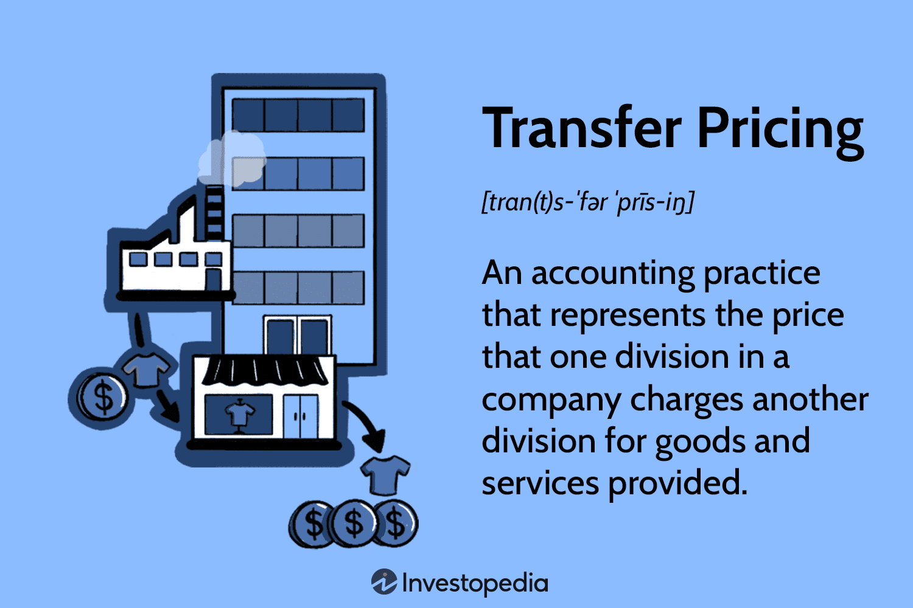

## Table of Contents

## What is transfer pricing?

Transfer pricing is the price that one part of a company charges another part of the same company for goods or services. Imagine a big company that has different sections or branches. If one branch makes a product and sells it to another branch, the price they set for this internal sale is called transfer pricing.

This is important for big companies because it affects their taxes and profits. If a company has branches in different countries, they might set the transfer price to move money around and pay less tax. Governments have rules to make sure companies set fair transfer prices, so they don't avoid taxes. It's a way to keep things fair and transparent in how big companies manage their money across different parts of the world.

## Why is transfer pricing important for multinational companies?

Transfer pricing is really important for big companies that work in many countries. It helps them decide how much money to move between their different parts around the world. When one part of the company sells something to another part, they need to set a price for it. This price can affect how much tax the company has to pay in different countries. If they set the price too high or too low, it might look like they're trying to pay less tax, which can get them in trouble with the law.

Also, transfer pricing helps companies keep track of how each part is doing. By setting fair prices for goods or services moved between different parts of the company, they can see which parts are making money and which ones are not. This helps them make better decisions about where to invest more money or where to cut costs. It's like a big puzzle, and transfer pricing is one of the pieces that helps the whole picture make sense.

## What are the basic principles of transfer pricing?

The basic idea behind transfer pricing is to make sure that the prices set for goods or services moved between different parts of a company are fair. This means the price should be similar to what the company would charge if it were selling to another company outside its own group. This is called the "arm's length principle." It's important because it helps stop companies from moving money around just to pay less tax or to make one part of the company look more profitable than it really is.

Another key principle is transparency. Companies need to keep good records and be able to explain why they chose the prices they did. This helps tax authorities check that the prices are fair and that the company isn't trying to avoid taxes. It's also important for the company itself because it helps them understand how each part is doing and make better business decisions. By following these principles, companies can make sure they are playing by the rules and managing their money in a way that makes sense for everyone involved.

## How does transfer pricing affect tax liabilities?

Transfer pricing can change how much tax a company has to pay. When a company has branches in different countries, the price they set for goods or services moved between these branches can affect where the company makes its profit. If they set a high price for something sold from a branch in a country with low taxes to a branch in a country with high taxes, more profit will show up in the low-tax country. This means the company might pay less tax overall.

But, governments have rules to stop companies from using transfer pricing to avoid taxes. They want to make sure the prices are fair and follow the "arm's length principle," which means the price should be the same as if the company was selling to another company outside its group. If a company doesn't follow these rules, they might have to pay more taxes, plus fines and penalties. So, it's important for companies to set fair transfer prices to avoid problems with tax authorities.

## What are the common methods used to determine transfer prices?

There are several common methods companies use to figure out transfer prices. One method is the Comparable Uncontrolled Price (CUP) method. This method looks at the price of the same or similar goods or services sold between unrelated companies. If a company can find a similar deal outside its group, they use that price as a guide for their internal price. Another method is the Resale Price Method, where a company looks at the price at which a product is sold to an unrelated customer and then works backward to figure out a fair transfer price, taking into account a normal profit margin.

The Cost Plus Method is another popular approach. Here, a company adds a standard markup to the cost of producing the goods or services. This markup should be similar to what other companies in the same industry would use. The Transactional Net Margin Method (TNMM) looks at the net profit margin of similar transactions between unrelated companies. It compares the profit margins of the company's internal transactions to those of external ones to set a fair transfer price. Each method has its own way of making sure the transfer price is fair and follows the arm's length principle.

## Can you explain the Comparable Uncontrolled Price (CUP) method?

The Comparable Uncontrolled Price (CUP) method is a way to figure out a fair transfer price by looking at similar deals between companies that aren't related. Imagine two friends, one who makes toys and another who sells them. If the toy maker sells toys to the seller for $10 each, and they're not related, that's an uncontrolled price. If a big company wants to set a transfer price for toys moved between its own branches, they can use this $10 price as a guide. The idea is to make sure the price they set inside the company is the same as what they would charge outside.

This method is really useful because it's pretty straightforward. If a company can find a similar deal outside its group, they just use that price. But it can be hard to find exact matches, especially for unique products or services. So, companies need to be careful and make sure the deals they compare are really similar. If they can do that, the CUP method helps them set a fair transfer price that follows the arm's length principle, which is important for staying on the right side of tax laws.

## What is the Cost Plus method and when is it used?

The Cost Plus method is a way to set a transfer price by adding a standard markup to the cost of making a product or providing a service. Imagine a company that makes parts for cars. If it costs them $50 to make each part, they might add a 20% markup, making the transfer price $60. This markup should be similar to what other companies in the same industry would use when selling to unrelated customers.

This method is often used when it's hard to find similar deals outside the company to compare with. For example, if a company makes a unique product that isn't sold by others, they can't use the Comparable Uncontrolled Price method. Instead, they use the Cost Plus method to make sure the price they set is fair and follows the arm's length principle. This helps them avoid problems with tax authorities and keeps their internal pricing transparent and reasonable.

## How does the Transactional Net Margin Method (TNMM) work?

The Transactional Net Margin Method (TNMM) is a way to set a fair transfer price by looking at the profit margins of similar deals between unrelated companies. Imagine a big company that wants to set a price for goods moved between its branches. They would look at how much profit other companies make when they sell similar goods to customers outside their group. If those companies usually make a 10% profit, the big company would try to set its transfer price so that its branches also make around a 10% profit. This helps make sure the price is fair and follows the arm's length principle.

This method is useful when it's hard to find exact matches for products or services sold outside the company. Instead of comparing the price of the product itself, TNMM looks at the overall profit the company makes from selling it. This can be easier because it focuses on the end result - the profit - rather than the specific details of each deal. By using TNMM, companies can set transfer prices that are fair and transparent, which helps them avoid trouble with tax authorities and manage their money better across different parts of the world.

## What are the challenges faced by companies in implementing transfer pricing?

Companies face several challenges when they try to set transfer prices. One big challenge is finding good comparisons. They need to find deals outside their company that are very similar to their internal deals. But this can be hard, especially if they make unique products or services. If they can't find a good match, it's tough to set a fair price that follows the rules. Another challenge is keeping up with different tax laws in different countries. Each country might have its own rules about transfer pricing, and they can change often. This means companies have to spend a lot of time and money making sure they're following all the rules everywhere they do business.

Another difficulty is making sure everyone in the company understands and follows the transfer pricing policy. This can be tricky because it involves different parts of the company working together. If one part doesn't understand or agree with the prices set, it can cause arguments and slow down the company's work. Also, keeping good records is important but can be a lot of work. Companies need to document why they chose certain prices, and this can take a lot of time and effort. If they don't do it well, they might get in trouble with tax authorities and have to pay fines.

## How do different countries' tax laws impact transfer pricing strategies?

Different countries have their own tax laws, and these laws can really affect how companies set their transfer prices. When a company has branches in different countries, they need to think about the tax rates in each place. If one country has a high tax rate and another has a low tax rate, the company might want to set the transfer price so that more profit shows up in the country with the lower tax rate. This can help them pay less tax overall. But, each country wants to make sure companies are playing fair and not just moving money around to avoid taxes. So, they have rules to check that the transfer prices are set in a way that follows the arm's length principle, which means the price should be the same as if the company was selling to another company outside its group.

Keeping up with all these different tax laws can be a big challenge for companies. They need to know the rules in every country they do business in, and these rules can change often. If a company doesn't follow the rules in one country, they might have to pay more taxes, plus fines and penalties. This means companies have to spend a lot of time and money making sure their transfer pricing strategies are in line with the laws of each country. It's like a big puzzle, and they need to make sure all the pieces fit together correctly to avoid problems with tax authorities.

## What are the potential penalties for non-compliance with transfer pricing regulations?

If a company doesn't follow the rules about transfer pricing, they can get into big trouble. They might have to pay more taxes than they planned. This is because if the tax authorities think the company set the prices wrong to avoid taxes, they can change the prices and make the company pay the difference in taxes. On top of that, the company might have to pay fines. These fines can be a lot of money, and they can really hurt the company's profits.

Also, if a company keeps breaking the rules, they might face even worse penalties. They could get in trouble with the law, which might mean they have to go to court. This can be very expensive and take a lot of time. It can also make it hard for the company to do business in the future because other companies and countries might not want to work with them if they have a bad reputation for not following the rules.

## How can advanced analytics and technology be used to optimize transfer pricing strategies?

Advanced analytics and technology can really help companies set better transfer prices. They can use special computer programs to look at a lot of data from their own company and from other companies too. This helps them find good comparisons for their products or services, which is important for setting fair prices. These programs can also help them see how different prices might affect their taxes and profits in different countries. By using this information, companies can make smarter choices about their transfer prices and make sure they're following the rules.

Technology also makes it easier for companies to keep track of all their transfer pricing information. They can use software to keep good records and make reports that show why they chose certain prices. This is important because it helps them prove to tax authorities that they're following the rules. Plus, technology can help different parts of the company work together better. They can share information quickly and make sure everyone understands and agrees with the transfer pricing strategy. This can save time and help avoid mistakes that could cause problems later.

## References & Further Reading

[1]: Eden, L. (1998). ["Taxing Multinationals: Transfer Pricing and Corporate Income Taxation in North America."](https://archive.org/details/trent_0116405393079) University of Toronto Press.

[2]: OECD. (2022). ["Transfer Pricing Guidelines for Multinational Enterprises and Tax Administrations."](https://www.oecd.org/en/publications/oecd-transfer-pricing-guidelines-for-multinational-enterprises-and-tax-administrations-2022_0e655865-en.html)

[3]: Holtzman, Y., & Nagel, P. (2014). ["Transfer Pricing Strategies: Exploring the Viability of Advanced Pricing Agreements."](https://www.semanticscholar.org/paper/An-introduction-to-transfer-pricing-Holtzman-Nagel/2f7db4668d9ac8b742debb0e3a32155a246d0410) IUP Journal of International Business.

[4]: Libby, R., & Frederick, D. (1990). ["Experiments in the Testing of Transfer Pricing Models."](https://www.jstor.org/stable/2491154?read-now=1) The Accounting Review.

[5]: Genschel, P., & Schwarz, P. (2011). ["Tax Competition: A Literature Review."](https://academic.oup.com/ser/article-abstract/9/2/339/1739582) Socio-Economic Review.

[6]: Rassier, D. G. (2014). ["The Role of Transfer Pricing in Base Erosion and Profit Shifting."](https://en.wikipedia.org/wiki/Base_erosion_and_profit_shifting) International Tax and Public Finance.

[7]: Ponomareva, M. (2010). ["Transfer Pricing in Russia and Beyond."](https://www.oecd.org/en/publications/oecd-transfer-pricing-guidelines-for-multinational-enterprises-and-tax-administrations-2010_tpg-2010-en.html) Management International Review.

[8]: Avi-Yonah, R. S., & Clausing, K. A. (2007). ["Reforming Corporate Taxation in a Global Economy: A Proposal to Adopt Formulary Apportionment."](https://www.brookings.edu/articles/reforming-corporate-taxation-in-a-global-economy-a-proposal-to-adopt-formulary-apportionment/) Brookings Institution.