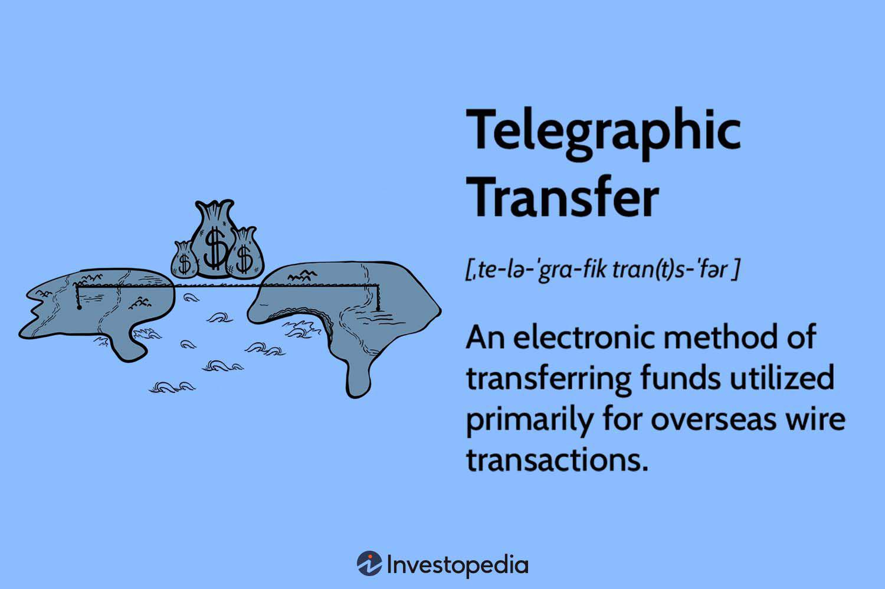

Algorithmic trading, a rapidly advancing innovation in the financial markets, has revolutionized how trades are executed by implementing automation to manage trading activities. This method leverages computer algorithms to conduct trades at unprecedented speed, precision, and efficiency, drastically reducing human error and increasing market accessibility. Traders can now respond to market changes instantly, capitalize on fleeting opportunities, and manage large volumes of trades simultaneously, all of which were nearly impossible in traditional trading settings.

The core of algorithmic trading lies in the cohesive integration of processes, mechanisms, and transfer procedures. Processes such as data analysis and order execution are automated to eliminate delays and inaccuracies inherent in manual trading. Mechanisms involve the use of sophisticated mathematical models and machine learning algorithms to analyze data and predict market trends. This computational approach allows traders to craft strategies based on quantitative analysis rather than gut feelings.



Equally significant are the transfer procedures, which facilitate the swift and secure movement of securities and funds between trading entities. These procedures ensure that trades are settled efficiently, maintaining the integrity of transactions. By automating these transfers, algorithmic trading systems minimize the risk of errors and delays, which can be costly in a high-frequency trading environment.

This article will discuss how these components work in harmony to optimize algorithmic trading. It will also address the challenges that arise from this integration and highlight why understanding these complexities is crucial for developing effective trading strategies. As the financial landscape evolves, staying at the forefront of technological advancements in algorithmic trading is imperative for maintaining competitiveness.

## Table of Contents

## Understanding Algorithmic Trading Processes

Algorithmic trading processes form the backbone of automated trading strategies by incorporating a myriad of sophisticated techniques that aim to minimize human intervention and biases. At its core, the process comprises data analysis, market monitoring, signal generation, and order execution, each playing a critical role in enabling traders to make high-speed, efficient trades.

**Data Analysis**: This is the foundational step in algorithmic trading, where vast amounts of market data are collected and processed to extract meaningful insights. Through techniques such as statistical analysis and machine learning, traders can identify patterns and correlations within the market. Tools like pandas and numpy in Python allow traders to manipulate large datasets efficiently. For instance, a Python snippet for calculating moving averages might use:

```python
import pandas as pd

# Assuming 'data' is a DataFrame containing stock prices
data['Moving_Average'] = data['Price'].rolling(window=20).mean()
```

**Market Monitoring**: Continuous monitoring of the market is essential for capturing real-time data and ensuring that trading opportunities are not missed. Algorithmic systems are programmed to surveil multiple markets and instruments simultaneously, providing traders with up-to-the-second information.

**Signal Generation**: After data analysis and market monitoring, the next step involves generating signals based on predefined trading criteria. Signals indicate potential buy or sell opportunities. These criteria often include technical indicators such as moving averages, relative strength index (RSI), or more complex models like neural networks. Python code for generating buy/sell signals based on moving averages might look like this:

```python
data['Signal'] = 0
data.loc[data['Moving_Average'] > data['Price'], 'Signal'] = 1  # Buy signal
data.loc[data['Moving_Average'] < data['Price'], 'Signal'] = -1  # Sell signal
```

**Order Execution**: This process is responsible for placing buy or sell orders in the market based on generated signals. High-frequency trading systems can execute hundreds or thousands of trades per second, taking advantage of small price changes in the market. The efficiency and speed of these executions are crucial to ensuring that trades are executed at the best possible prices, minimizing slippage and maximizing profits.

These processes together ensure that [algorithmic trading](/wiki/algorithmic-trading) systems can function at a scale and pace unattainable through manual trading. As technology continues to evolve, the integration of advanced data analytics and real-time processing will further enhance the capability of algorithmic trading systems, leading to more sophisticated and adaptive strategies.

## Mechanisms Behind Algorithmic Trading

Algorithmic trading has revolutionized financial markets by employing advanced mechanisms to accurately analyze market data and execute trades. Central to these mechanisms are technical indicators, statistical analysis, and [machine learning](/wiki/machine-learning) models, which collectively predict market trends and automate trading decisions, thereby minimizing human error.

Technical indicators are crucial tools in algorithmic trading, providing quantitative information that helps in making informed decisions. Indicators such as moving averages, relative strength index (RSI), and Bollinger Bands are commonly used to identify trends, reversals, and price [volatility](/wiki/volatility-trading-strategies). For example, moving averages smooth out price data to identify trends by calculating the average price over a specific number of periods. If the short-term moving average surpasses the long-term moving average, it may signal a bullish trend, thereby prompting trading algorithms to execute buy orders.

Statistical analysis forms another pillar of algorithmic trading mechanisms. It involves the application of statistical tools and models to understand market behavior and to develop predictive models. A key statistical concept used is regression analysis, which can establish relationships between variables and forecast future market movements. Time series analysis, a subset of statistical analysis, is particularly relevant as it deals with data points indexed in time order, allowing traders to model and predict temporal dependencies in price movements.

Machine learning models have brought a transformative edge to algorithmic trading by enabling systems to learn from historical data to identify patterns and make predictions. Supervised learning algorithms like linear regression, decision trees, and random forests are employed to predict asset prices based on historical data. Unsupervised learning, including clustering techniques, helps in recognizing unknown patterns in data by grouping informed data points based on similarities. Reinforcement learning algorithms further enhance trading strategies by optimizing decisions through a reward-based system, adapting over time to maximize returns.

The consistent application of trading strategies utilizing these mechanisms is facilitated by automated systems, which are essential in reducing human errors. Automation ensures that strategies are executed precisely as coded, without emotional bias or hesitation, enabling traders to react swiftly to market conditions and capitalize on opportunities. For instance, an algorithm designed to exploit price discrepancies between exchanges—[arbitrage](/wiki/arbitrage)—can execute trades across multiple platforms within milliseconds, a feat impossible for human traders to achieve manually.

In summary, the mechanisms that underpin algorithmic trading—technical indicators, statistical analysis, and machine learning models—collectively enable precise and efficient trade execution. Automated systems integrate these elements to consistently apply trading strategies, reducing human error and enhancing overall trading performance. As these technologies continue to evolve, they hold the potential to further refine algorithmic trading strategies, ensuring sustained competitiveness and profitability in financial markets.

## Role of Transfer Procedures in Algo Trading

Transfer procedures are a critical component of algorithmic trading, ensuring the seamless movement of securities between trading entities. The automation of these processes enhances the efficiency and reliability of trading operations. Among the most notable advancements in this area is the Automated Customer Account Transfer Service (ACATS), a system designed to facilitate the quick and secure transfer of assets across broker-dealers.

ACATS streamlines the transfer of securities by reducing the need for manual intervention and minimizing the potential for human error. This automated process ensures that asset transfers adhere to regulatory standards while maintaining the integrity and security of transactions. By automating the verification and authentication of transfer orders, ACATS significantly enhances the reliability and efficiency of the securities movement.

Efficient transfer procedures play a pivotal role in reducing settlement times, which are crucial for maintaining [liquidity](/wiki/liquidity-risk-premium) in the trading environment. Quick settlement of trades is essential for traders to leverage market opportunities without delay. Automated transfer systems, like ACATS, contribute to shorter settlement cycles by ensuring that all necessary documentation and approvals are processed promptly.

Moreover, the streamlined transfer process enhances the overall trading experience by providing traders with better transparency and control over their assets. The ability to track the status of transfers in real-time allows traders to make informed decisions and adjust their strategies accordingly. This increased visibility into the transfer process helps in optimizing asset allocation and risk management.

In conclusion, the role of transfer procedures in algorithmic trading is indispensable for facilitating the smooth and secure movement of securities. Automated systems such as ACATS exemplify the advancements in this domain, offering traders enhanced efficiency, reduced settlement times, and improved trading experiences. As technology continues to evolve, the development and integration of advanced transfer systems will remain a priority for maintaining the competitiveness and reliability of algorithmic trading strategies.

## Integration of Algorithmic Mechanisms and Transfer Procedures

Successful algorithmic trading depends on effectively integrating sophisticated trading mechanisms with efficient asset transfer procedures. This amalgamation ensures not only the execution of trades with automation but also the secure and quick transfer of assets, thereby enhancing both transaction speed and reliability.

Automation plays a pivotal role in modern algorithmic trading systems. By employing automated procedures, traders can execute trades with precision based on pre-defined criteria set within trading algorithms. This eliminates delays associated with human intervention and allows for quicker response to market changes. The automated systems analyze large volumes of market data to determine the optimal conditions for trade execution. Simultaneously, these systems rely on robust mechanisms that ensure the fulfillment of orders at the best available prices, driven by algorithmic trading strategies that harness technical indicators and predictive analytics.

The synergy between trading mechanisms and transfer procedures becomes evident during the settlement of trades. Upon execution, the seamless transfer of assets is crucial to complete the transaction lifecycle. This involves systems like the Automated Customer Account Transfer Service (ACATS), which facilitate the electronic transfer of securities between trading entities. Such automation ensures trades are settled in record time, reducing the risk of discrepancies and enhancing overall market efficiency.

Moreover, this integration is indispensable for market participants aiming to capitalize on fleeting opportunities and adhere to regulatory standards. By ensuring that processes are automated and well-integrated, trading firms not only augment their execution capabilities but also ensure that the transfer of assets complies with stringent regulatory requirements, thereby maintaining market integrity.

In conclusion, the cohesive integration of algorithmic mechanisms and transfer procedures forms the backbone of successful algorithmic trading operations. It elevates the trading process by leveraging technology to achieve superior execution speeds, reliability in asset transfers, and adherence to regulatory compliance, making it a vital aspect of modern financial markets.

## Challenges and Risks in Algorithmic Trading

Algorithmic trading, while offering significant advantages, is not without its challenges and risks. One of the primary issues faced by traders is the potential for technical failures. These can arise from software bugs, hardware malfunctions, or network connectivity problems. Such failures can lead to incorrect trade executions or missed trading opportunities. To mitigate these risks, it is essential to ensure the reliability of both the algorithms used and the underlying infrastructure. Regular testing and validation of algorithms can help identify potential issues before they impact trading operations.

Execution errors are another significant concern in algorithmic trading. These errors occur when trades are not executed as intended due to discrepancies between the algorithm's logic and market conditions. Factors such as unforeseen market volatility or liquidity constraints can lead to incorrect order placements. Implementing real-time monitoring systems that track execution performance and deviations can help in early detection of such errors, allowing traders to take corrective actions.

Market risks are inherent in any trading activity, and algorithmic trading is no exception. Sudden market movements, driven by geopolitical events or unexpected economic data releases, can result in significant financial losses. To minimize exposure to such risks, traders must employ robust risk management strategies. One effective approach is to use stop-loss orders, which automatically sell a security when its price falls below a set level, thereby limiting potential losses.

Moreover, diversification of trading strategies and portfolios can also help mitigate risks. By spreading investments across different asset classes and trading models, traders can reduce their reliance on a single strategy or market condition, thereby enhancing stability and resilience.

In summary, while algorithmic trading provides a technological edge in the financial markets, it is crucial to address its associated challenges and risks through reliable infrastructure, meticulous algorithm validation, and comprehensive risk management practices. The continued development of these strategies will be vital as algorithmic trading evolves with technological advancements.

## Conclusion

Algorithmic trading, through its integrated processes and mechanisms, has proven instrumental in advancing the efficiency and effectiveness of trading activities. The use of algorithms allows traders to execute transactions at unprecedented speed with a high degree of accuracy, tapping into vast pools of market data to make informed decisions. Such precision not only streamlines the trading process but also enhances market access, providing opportunities that manual trading processes cannot match.

A critical aspect of maximizing these advantages is understanding and managing the complexities associated with transfer procedures. Efficient transfer mechanisms are integral for optimizing trading strategies, allowing for seamless asset movement between entities, which minimizes the risks associated with delayed or erroneous transactions. Tools such as the Automated Customer Account Transfer Service (ACATS) exemplify these processes, simplifying asset transfers while ensuring the integrity and security of trades.

As technology continues to evolve, staying competitive in algorithmic trading necessitates not only embracing these sophisticated systems but also continually adapting to new tools and methodologies. The rapid development in fields such as [artificial intelligence](/wiki/ai-artificial-intelligence) and machine learning presents further opportunities to enhance trading algorithms, allowing them to process information more intelligently and respond to market dynamics in real-time. This ongoing adaptation is crucial for traders who seek to maintain a competitive edge in an ever-changing financial landscape.

Future developments in algorithmic trading will likely incorporate deeper integration of cutting-edge technologies, fostering even more cohesive trading systems. Traders and technologists alike must remain vigilant, ensuring that their systems are robust, resilient, and capable of adjusting to new market conditions and regulatory requirements. As such, the continuous study and improvement of both algorithmic processes and transfer procedures will remain at the heart of successful trading strategies.

## References & Further Reading

[1]: Bergstra, J., Bardenet, R., Bengio, Y., & Kégl, B. (2011). ["Algorithms for Hyper-Parameter Optimization."](https://papers.nips.cc/paper/4443-algorithms-for-hyper-parameter-optimization) Advances in Neural Information Processing Systems 24.

[2]: ["Advances in Financial Machine Learning"](https://www.amazon.com/Advances-Financial-Machine-Learning-Marcos/dp/1119482089) by Marcos Lopez de Prado

[3]: ["Evidence-Based Technical Analysis: Applying the Scientific Method and Statistical Inference to Trading Signals"](https://www.amazon.com/Evidence-Based-Technical-Analysis-Scientific-Statistical/dp/0470008741) by David Aronson

[4]: ["Machine Learning for Algorithmic Trading: Predictive Models to Extract Signals from Market and Alternative Data for Systematic Trading Strategies with Python"](https://github.com/stefan-jansen/machine-learning-for-trading) by Stefan Jansen

[5]: ["Quantitative Trading: How to Build Your Own Algorithmic Trading Business"](https://www.amazon.com/Quantitative-Trading-Build-Algorithmic-Business/dp/1119800064) by Ernest P. Chan