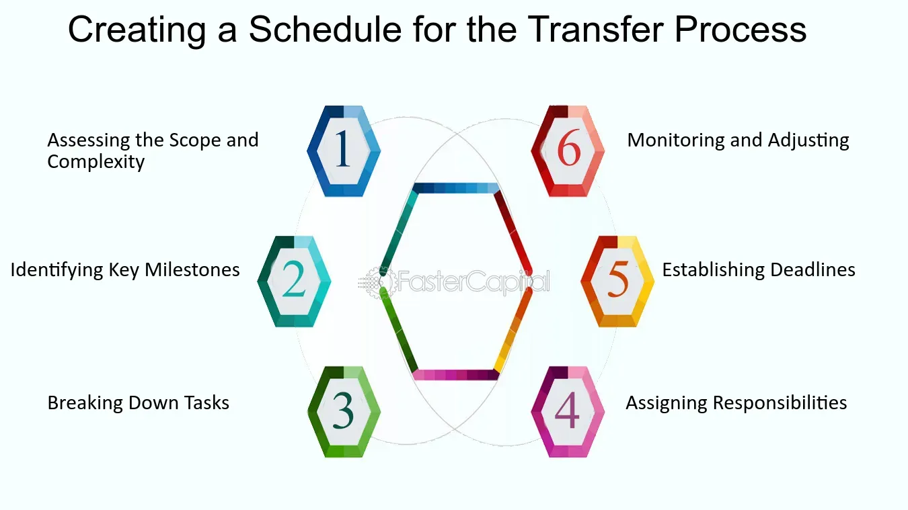

## Table of Contents

## What is a transfer procedure?

A transfer procedure is a set of steps that people follow to move something from one place to another. This can be used in many different situations, like moving money between bank accounts, transferring files on a computer, or even moving a patient from one hospital to another. The main goal is to make sure the transfer happens smoothly and safely, without any problems or mistakes.

In a transfer procedure, it's important to have clear instructions and to follow them carefully. For example, when transferring money, you need to know the right account numbers and how much money to move. If you're moving a patient, you need to make sure they are safe and comfortable during the move. By following the steps correctly, you can avoid mistakes and make sure everything goes as planned.

## Why are transfer procedures important in various industries?

Transfer procedures are important in various industries because they help make sure things move from one place to another safely and correctly. In businesses, like banks, transfer procedures are used to move money between accounts. If the steps are not followed right, money could go to the wrong place, which can cause big problems. In hospitals, transfer procedures help move patients safely. If the steps are not followed, patients could get hurt or feel uncomfortable during the move.

In other industries, like technology, transfer procedures are used to move data or files between computers or systems. If the steps are not followed correctly, important information could be lost or damaged. This can slow down work and cause big problems for the company. By having clear transfer procedures, industries can make sure that everything moves smoothly and safely, which helps keep things running well and avoids mistakes.

## What are the basic steps involved in a typical transfer procedure?

In a typical transfer procedure, the first step is to identify what needs to be moved and where it needs to go. This could be money, a patient, or a file on a computer. Once you know what and where, you need to gather all the information you need to make the transfer happen. For example, if you're moving money, you need the account numbers and the amount of money. If you're moving a patient, you need to know their medical needs and the destination.

The next step is to follow the specific steps for the transfer. This means doing things in the right order and making sure everything is done correctly. For example, when transferring money, you enter the account details and the amount into the system and then confirm the transfer. When moving a patient, you prepare them for the move, make sure they are comfortable, and then transport them to the new location. The last step is to check that the transfer was successful. This means making sure the money reached the right account, the patient arrived safely, or the file was moved correctly. If there are any problems, you need to fix them right away.

## How do transfer procedures differ across different sectors, such as banking and healthcare?

In banking, transfer procedures are all about moving money safely and correctly. When you want to move money from one account to another, you need to know the account numbers and the amount of money. You enter this information into the bank's system and then confirm the transfer. The bank's system checks everything to make sure the money goes to the right place. If there's a mistake, the bank has to fix it quickly to avoid problems. The main goal is to make sure the money gets where it needs to go without any errors.

In healthcare, transfer procedures focus on moving patients safely and comfortably. When a patient needs to be moved from one place to another, like from a hospital to a nursing home, the healthcare team needs to know the patient's medical needs and the destination. They prepare the patient for the move, making sure they are comfortable and safe during the transfer. The team also needs to communicate with the new facility to make sure everything is ready for the patient. The main goal is to keep the patient safe and comfortable throughout the entire process.

## What are the key legal and regulatory considerations when implementing transfer procedures?

When implementing transfer procedures, it's important to follow the rules and laws that apply to the industry. In banking, there are strict rules about moving money to make sure it's done safely and correctly. Banks have to follow laws like the Bank Secrecy Act, which helps prevent money laundering and fraud. They also need to protect customer information under laws like the Gramm-Leach-Bliley Act. If banks don't follow these rules, they can get in big trouble and face fines or other penalties.

In healthcare, transfer procedures also have to follow specific laws to protect patients. The Health Insurance Portability and Accountability Act (HIPAA) is a big one, which makes sure patient information stays private during transfers. Healthcare providers also need to follow rules about patient safety and care, like making sure patients are moved safely and with the right medical attention. If healthcare providers don't follow these rules, they can face legal problems and harm patients, which is something they want to avoid at all costs.

## How can technology enhance the efficiency of transfer procedures?

Technology can make transfer procedures much easier and faster. For example, in banking, using online banking and mobile apps lets people move money from one account to another with just a few clicks. These systems use special codes like IBAN or SWIFT to make sure the money goes to the right place quickly. They also have safety checks to stop mistakes and fraud, making the whole process smoother and more secure.

In healthcare, technology helps too. Electronic health records (EHRs) let doctors and nurses share patient information easily when moving a patient from one place to another. This means everyone knows the patient's medical needs and can plan the move better. Also, telemedicine lets doctors check on patients during the transfer without being there in person, which can make the move safer and more comfortable for the patient.

## What are common challenges faced during the implementation of transfer procedures?

One common challenge when implementing transfer procedures is making sure everyone knows and follows the steps correctly. If people don't understand the procedure or if they make mistakes, things can go wrong. For example, in a bank, if someone enters the wrong account number, the money might go to the wrong person. In a hospital, if the staff doesn't know how to move a patient safely, the patient could get hurt. Training everyone well and making sure they follow the rules is really important to avoid these problems.

Another challenge is keeping everything secure during the transfer. In banking, there's a big risk of fraud or cyber attacks when moving money. Banks need strong security systems to protect customer information and stop hackers. In healthcare, keeping patient information private is a big deal. If someone's medical records get lost or stolen during a transfer, it can cause serious problems. Using good technology and following strict rules can help make transfers safer and more secure.

## How do organizations train their staff on transfer procedures?

Organizations train their staff on transfer procedures by giving them clear instructions and making sure they understand them. They often start with classroom training where staff learn about the steps they need to follow. Trainers use examples and practice sessions to show how to do the transfers correctly. This helps staff see what they need to do and how to avoid mistakes. After the classroom training, staff might also get hands-on practice, where they do the transfers themselves under supervision. This way, they can get used to the process and ask questions if they're not sure about anything.

To make sure staff keep following the transfer procedures correctly, organizations also do regular check-ins and refresher training. They might have quizzes or tests to see if staff remember the steps and can do them right. Sometimes, they use technology like online training modules or videos to help staff learn and review the procedures anytime they need to. By keeping training up-to-date and making sure everyone knows the rules, organizations can help their staff do transfers safely and correctly.

## What are the best practices for documenting transfer procedures?

When documenting transfer procedures, it's important to write everything down clearly and simply. Start by explaining what the transfer is about and why it's important. Include all the steps needed to do the transfer correctly, in the order they should be done. Use simple words and short sentences so everyone can understand. Also, add examples or pictures if they help make things clearer. Make sure to mention any special rules or safety tips that need to be followed. This way, anyone reading the document will know exactly what to do.

Keep the document up to date and easy to find. Whenever there are changes to the transfer procedure, update the document right away. Make sure it's stored where everyone can access it, like on a shared computer system or in a special binder. It's also a good idea to have a way for people to ask questions or give feedback about the procedure. By keeping the document clear, up-to-date, and accessible, you help make sure that everyone follows the transfer procedure correctly and safely.

## How can transfer procedures be audited and improved over time?

To audit transfer procedures, organizations need to check if everyone is following the steps correctly. They can do this by watching staff do the transfers and seeing if they do everything right. They can also look at records to see if there have been any mistakes or problems. If they find issues, they need to figure out why they happened and how to fix them. This might mean changing the procedure or giving more training to staff. By doing regular audits, organizations can make sure their transfer procedures are working well and keep improving them.

To improve transfer procedures over time, organizations should listen to feedback from staff and customers. If people say the procedure is hard to follow or takes too long, the organization can make changes to make it easier and faster. They can also use new technology to help make transfers smoother and safer. For example, using better computer systems can help stop mistakes and speed up the process. By always looking for ways to make things better and being open to change, organizations can keep their transfer procedures up to date and working well.

## What role do risk management strategies play in transfer procedures?

Risk management strategies are really important when it comes to transfer procedures. They help make sure that things go smoothly and safely. In banking, for example, risk management means checking and double-checking that money goes to the right place. Banks use special systems to watch for fraud and mistakes. If something looks wrong, they stop the transfer and fix it before it causes problems. This helps keep customers' money safe and stops the bank from losing money too.

In healthcare, risk management is all about keeping patients safe during transfers. Doctors and nurses need to make sure patients are comfortable and that their medical needs are met. They use checklists and safety protocols to make sure nothing goes wrong. If there's a risk, like a patient needing special care during the move, they plan ahead to handle it. By managing risks well, healthcare providers can make sure patients get the care they need without any harm.

## How do international standards and protocols affect transfer procedures in global operations?

International standards and protocols are really important for transfer procedures in global operations. They help make sure that everyone does things the same way, no matter where they are in the world. For example, in banking, there are rules like SWIFT codes that help move money between countries safely and correctly. If everyone follows these rules, it's easier to do business with people from other countries and avoid mistakes. These standards also help keep things secure, so money doesn't get stolen or lost during transfers.

In healthcare, international standards help too. When moving patients across borders, doctors and nurses need to follow rules like those set by the World Health Organization (WHO). These rules make sure that patients get the same level of care everywhere and that their information stays private. By following these standards, healthcare providers can work together better and make sure patients are safe and comfortable during international transfers.

## References & Further Reading

[1]: Bergstra, J., Bardenet, R., Bengio, Y., & Kégl, B. (2011). ["Algorithms for Hyper-Parameter Optimization."](https://papers.nips.cc/paper/4443-algorithms-for-hyper-parameter-optimization) Advances in Neural Information Processing Systems 24.

[2]: ["Advances in Financial Machine Learning"](https://www.amazon.com/Advances-Financial-Machine-Learning-Marcos/dp/1119482089) by Marcos Lopez de Prado

[3]: ["Evidence-Based Technical Analysis: Applying the Scientific Method and Statistical Inference to Trading Signals"](https://www.amazon.com/Evidence-Based-Technical-Analysis-Scientific-Statistical/dp/0470008741) by David Aronson

[4]: ["Machine Learning for Algorithmic Trading: Predictive Models to Extract Signals from Market and Alternative Data for Systematic Trading Strategies with Python"](https://github.com/stefan-jansen/machine-learning-for-trading) by Stefan Jansen

[5]: ["Quantitative Trading: How to Build Your Own Algorithmic Trading Business"](https://www.amazon.com/Quantitative-Trading-Build-Algorithmic-Business/dp/1119800064) by Ernest P. Chan