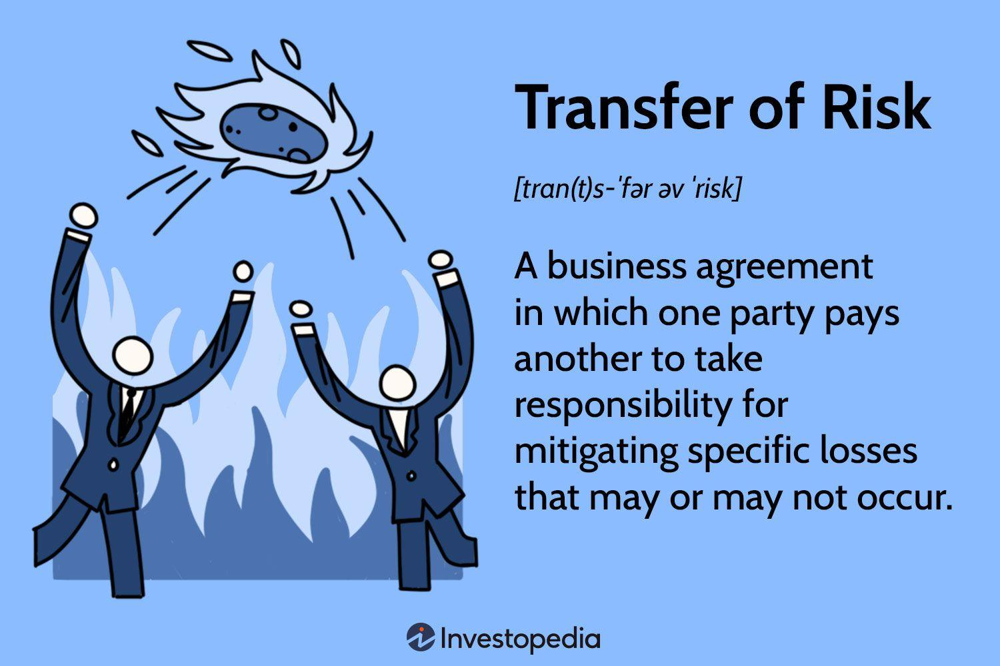

## Table of Contents

## What is transfer risk in finance?

Transfer risk in finance refers to the possibility that a borrower in one country might not be able to convert their local currency into the currency needed to repay a loan to a lender in another country. This risk arises because of changes in government policies, economic conditions, or restrictions on currency exchange that can make it difficult or impossible to move money across borders.

For example, if a company in Country A borrows money from a bank in Country B, and Country A's government suddenly puts strict controls on how much of its currency can be converted into foreign currency, the company might struggle to get the money needed to pay back the loan. This situation can lead to defaults and financial losses for the lender, making transfer risk an important consideration in international finance.

## How does transfer risk differ from other types of financial risks?

Transfer risk is different from other financial risks because it focuses on the problem of moving money from one country to another. It happens when a borrower can't change their local money into the money needed to pay back a loan from another country. This can be because of new rules from the government or changes in the economy that make it hard to exchange money. Other risks, like credit risk or market risk, don't deal with this specific problem of moving money across borders.

Credit risk is about the chance that a borrower won't pay back a loan at all, no matter where the money is. It's about the trustworthiness of the borrower. Market risk, on the other hand, is about how changes in the market, like stock prices or interest rates, can affect the value of investments. These risks are more about the overall financial health and market conditions, not about the specific issue of converting and transferring money between countries.

So, while transfer risk is about the ability to move money internationally, credit risk and market risk are more about the borrower's ability to pay and the general ups and downs of the market. Understanding these differences helps in managing and planning for different kinds of financial risks.

## What are the common causes of transfer risk?

Transfer risk often happens because of changes in a country's rules about money. Governments might suddenly decide to control how much of their money can be changed into other countries' money. This can make it hard for someone who borrowed money from another country to pay it back. For example, if a government puts new limits on how much money can leave the country, a company might not be able to get the foreign money needed to pay back a loan.

Another common cause of transfer risk is when a country's economy gets into trouble. If a country's money loses value quickly, it becomes harder to change it into the money needed to pay back loans. Economic problems can also lead to new rules or restrictions on money movement, making it even harder to transfer funds. Both government actions and economic troubles can create big problems for people and businesses trying to move money across borders.

## Can you explain how transfer risk impacts international trade?

Transfer risk can make international trade harder. When a country has rules that make it tough to change its money into other countries' money, businesses might struggle to pay for things they buy from other countries. For example, if a company in one country wants to buy goods from a company in another country, but can't easily change its money into the seller's money, the deal might not happen. This can slow down trade and make it more expensive because businesses might need to find other ways to pay, like using a different currency or paying more to change their money.

Economic problems can also cause transfer risk, which affects international trade. If a country's money loses value quickly, it becomes harder for businesses in that country to buy things from other countries. They might need more of their own money to get the same amount of foreign money, which can make imports more expensive. This can lead to less trade because businesses might decide it's too costly to buy from other countries. Overall, transfer risk can make international trade more complicated and expensive, which can slow down the global economy.

## What are some examples of transfer risk in real-world scenarios?

Imagine a company in Argentina that borrowed money from a bank in the United States. Suddenly, the Argentine government decides to put strict controls on how much of their money, the peso, can be changed into dollars. This makes it hard for the company to get the dollars needed to pay back the loan. They might have to wait a long time or pay more to change their pesos into dollars, which can cause big problems for the company and the bank.

Another example happened in Venezuela a few years ago. The country's economy was in bad shape, and the value of their money, the bolivar, was falling fast. A Venezuelan company that needed to buy parts from Germany couldn't easily change their bolivars into euros. The economic problems made it almost impossible to do business with other countries, which hurt the company and slowed down trade. These examples show how transfer risk can create big challenges for businesses trying to work across borders.

## How can businesses assess their exposure to transfer risk?

Businesses can assess their exposure to transfer risk by looking at the rules and economic conditions in the countries they work with. They need to check if the countries have strict rules about changing money into other currencies. If a country often changes its rules or has a history of making it hard to move money out, that's a sign of high transfer risk. Businesses should also keep an eye on the value of the local currency. If it's going down fast, it might be harder to change it into the money needed for international deals.

Another way to assess transfer risk is by talking to experts and using financial tools. Businesses can hire people who know a lot about the countries they work with to get advice on the risks. They can also use financial tools like currency swaps or forward contracts to protect themselves. These tools can help make sure they have the right money at the right time, even if the rules or the economy change. By doing these things, businesses can better understand and manage their exposure to transfer risk.

## What strategies can companies use to mitigate transfer risk?

Companies can use different strategies to lower their transfer risk. One way is to use financial tools like currency swaps or forward contracts. These tools help companies lock in the exchange rate for their money ahead of time. This means they can be sure they will have the right amount of foreign money to pay back loans or buy things from other countries, even if the rules or the economy change.

Another strategy is to spread out their business across different countries. If a company works in many places, it's less likely that problems in one country will hurt them a lot. They can also keep some of their money in different currencies. This way, if one currency loses value, they can use another currency to pay for things. By doing these things, companies can better handle the risks of moving money across borders.

## How do financial instruments like derivatives help in managing transfer risk?

Financial instruments like derivatives can help companies manage transfer risk by allowing them to lock in exchange rates for the future. For example, a company might use a forward contract to agree on a rate to change their money into another currency at a later date. This means they know exactly how much foreign money they will get, even if the rules or the economy change. By using these tools, companies can avoid surprises and make sure they have the money they need to pay back loans or buy things from other countries.

Derivatives like currency swaps can also be useful. In a currency swap, two parties agree to exchange money in different currencies for a set time. This can help a company if they need to make payments in a foreign currency but are worried about transfer risk. By swapping their money, they can get the foreign currency they need without having to worry about sudden changes in exchange rates or government rules. These financial tools give companies more control over their money and help them plan better for the future.

## What role do government policies play in influencing transfer risk?

Government policies can have a big impact on transfer risk. When a country's government decides to put new rules on how much of its money can be changed into other currencies, it can make it hard for businesses to move money across borders. For example, if a government suddenly says that only a little bit of the local money can be turned into foreign money, a company might not be able to get the money they need to pay back a loan from another country. These kinds of rules can cause big problems for businesses and increase the risk that they won't be able to move money when they need to.

Economic problems can also lead to changes in government policies that affect transfer risk. If a country's economy is in trouble, the government might try to stop money from leaving the country to protect its value. This can make it even harder for companies to change their money into the currency needed for international deals. When governments change their rules suddenly or put strict limits on money movement, it can create a lot of uncertainty and make it difficult for businesses to plan and manage their finances.

## How has the global economic environment changed the dynamics of transfer risk?

The global economic environment has made transfer risk more complicated. In the past, countries might have had more stable rules about money, but now things can change quickly. Big events like economic crises or changes in government can lead to new rules that make it hard to move money across borders. For example, during the 2008 financial crisis, many countries put new limits on how much money could leave their country. This made it harder for businesses to pay back loans or buy things from other countries, increasing transfer risk.

Also, the way countries work together has changed. More trade and investment happen across borders now, which means more chances for transfer risk. If one country's economy has problems, it can affect businesses in other countries too. For example, if a country's money loses value fast, businesses in that country might struggle to buy things from other places. This can slow down trade and make it harder for companies to plan. So, the global economic environment has made transfer risk a bigger challenge for businesses to manage.

## What advanced models are used to predict and manage transfer risk?

Advanced models help businesses predict and manage transfer risk by looking at lots of information about countries and their economies. These models use things like past data on how often a country changes its money rules, how stable its economy is, and how its money's value changes over time. By putting all this information together, the models can guess how likely it is that a country will make it hard to move money out. This helps businesses see which countries might be risky and plan better for the future.

One type of model that's often used is called a risk assessment model. This model looks at different signs, like changes in government rules or big drops in a country's money value, to figure out the risk level. Another type is a scenario analysis model, which tries to predict what might happen if certain things change, like if a country puts new limits on money movement. By using these models, businesses can make smarter choices about where to invest and how to protect themselves from transfer risk.

## How do multinational corporations integrate transfer risk management into their overall risk management framework?

Multinational corporations include transfer risk management in their overall risk management by looking at the risks in each country they work in. They use special models and tools to check how likely it is that a country will make it hard to move money out. They also keep an eye on government rules and the economy to see if things might change. By doing this, they can plan better and make sure they have the right money at the right time, even if things change suddenly.

These companies also use different strategies to lower their transfer risk. They might use financial tools like forward contracts to lock in exchange rates for the future. They can also spread their business across different countries so that problems in one place don't hurt them too much. By putting all these things together, multinational corporations can handle transfer risk better and keep their business running smoothly, no matter what happens in the global economy.

## References & Further Reading

[1]: John Rolwes and Stephen Satchell. (2019). ["Risk-Based and Factor Investing."](https://www.sciencedirect.com/book/9781785480089/risk-based-and-factor-investing) Academic Press.

[2]: Lopez de Prado, M. (2018). ["Advances in Financial Machine Learning."](https://www.amazon.com/Advances-Financial-Machine-Learning-Marcos/dp/1119482089) Wiley.

[3]: Aronson, D. R. (2006). ["Evidence-Based Technical Analysis: Applying the Scientific Method and Statistical Inference to Trading Signals."](https://www.amazon.com/Evidence-Based-Technical-Analysis-Scientific-Statistical/dp/0470008741) Wiley.

[4]: Chan, E. P. (2009). ["Quantitative Trading: How to Build Your Own Algorithmic Trading Business."](https://github.com/ftvision/quant_trading_echan_book) Wiley.

[5]: Jansen, S. (2020). ["Machine Learning for Algorithmic Trading."](https://github.com/stefan-jansen/machine-learning-for-trading) Packt Publishing.

[6]: Hull, J. C. (2018). ["Options, Futures, and Other Derivatives."](https://www.semanticscholar.org/paper/Options%2C-Futures%2C-and-Other-Derivatives-Hull/89bdee500c8623864fc9eb7a471546aa713acc44) Pearson.