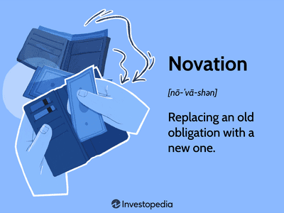

The financial world is undergoing significant changes due to the integration of advanced technologies. Among these changes, algorithmic trading, or algo trading, has emerged as a transformative force, leveraging sophisticated algorithms and automation to enhance trading operations. This development represents a significant shift from traditional trading methods, relying on human intuition and manual execution. 

Algo trading utilizes computer programs to execute a series of trades based on pre-set rules, algorithms, and market data analysis. This approach allows traders to respond rapidly to market conditions, maintaining a competitive edge in capturing fleeting opportunities. The combination of speed, accuracy, and efficiency offered by algorithmic trading systems is changing the landscape of financial markets, challenging conventional trading strategies.



In addition to improving efficiency, technology has also impacted the roles and responsibilities within financial transactions. The role of the transferor, an entity responsible for the conveyance of assets or property in the market, is influenced by advancements that streamline asset transfer processes, ensuring liquidity and compliance. An exploration of these roles reveals how technological innovation affects the broader market mechanics.

Furthermore, technological advancements drive significant changes in trading efficiency and market dynamics. The advent of technologies such as big data analytics, artificial intelligence, and blockchain has improved the ability to analyze large datasets rapidly, providing deep insights that can inform trading strategies. These advancements foster a market environment that values transparency and demands adherence to rigorous standards, favoring traders proficient in utilizing technology to optimize their strategies.

Understanding the impact of technology and transferor roles is essential for investors and market participants. Adapting to these changes is critical for navigating the increasingly complex landscape of modern financial markets effectively. Investors equipped with this knowledge can better position themselves to take advantage of new opportunities presented by the ongoing evolution of technology in the financial sector.

## Table of Contents

## Understanding the Transferor Role

A transferor is a crucial entity in the financial market, tasked with the legal transfer of property or services. Their role is integral to asset transfer processes, which are pivotal for maintaining market liquidity. Market liquidity refers to the ease with which an asset can be bought or sold in the market without affecting its price. This liquidity is vital for both investors and the broader financial system, as it fosters an environment where assets can be traded efficiently and cost-effectively.

In the context of financial transactions, transferors are responsible for ensuring that the conditions and obligations stipulated in agreements are fulfilled. This responsibility involves meticulous verification and validation of transaction details, thereby upholding the integrity of the transfer process. For example, in the transfer of securities, the transferor must ensure that both the buyer’s and seller’s obligations are met — including the delivery of the asset and the payment of the agreed amount.

Understanding the role of transferors is essential for comprehending broader market mechanics. They are not merely passive participants; their actions directly impact the fluidity and reliability of financial markets. A well-functioning market relies on seamless asset transfers, making the transferor an indispensable component of the financial ecosystem. Their role can be compared to that of a facilitator, ensuring transactions are executed efficiently and securely.

Furthermore, technological innovations, such as digital contracts and automated clearing houses, have begun to influence how transferors operate. These technologies streamline the responsibilities of transferors, minimizing delays and reducing errors in the transfer process. By enhancing the efficiency of the transfer of assets, these advancements contribute to a more dynamic and responsive market, where [liquidity](/wiki/liquidity-risk-premium) is assured, and trading costs are minimized.

In conclusion, the role of a transferor is fundamental to maintaining market liquidity and ensuring the smooth execution of transactions. Their responsibilities in verifying and validating the conditions of exchanges underpin the trust and reliability essential for stable and efficient market operations. Through understanding the intricacies of the transferor's duties, we gain insights into the broader mechanics that drive financial markets.

## Technology's Influence on Transfer Processes

Technological advancements have profoundly reshaped asset transfer processes, making them more secure, efficient, and transparent. Foremost among these innovations are services like mobile banking and blockchain technology, which have become pivotal in transforming the financial landscape.

Mobile banking allows users to conduct financial transactions remotely through their mobile devices, offering unparalleled convenience and accessibility. This service reduces the need for physical bank visits, lowering the barriers to financial interactions and supporting increased market participation. Mobile banking systems are designed with advanced security features, such as biometric authentication and encryption, which significantly enhance the security of transactions.

Blockchain technology has further revolutionized asset transfers by providing a decentralized and immutable ledger system. Blockchain's inherent transparency and security reduce the risks of fraud and error. The technology operates on a peer-to-peer network, which eliminates the need for intermediaries, thus streamlining the transaction process. This decentralization fosters a more efficient handling of asset transfers, as transactions are verified by network participants, enhancing both speed and reliability.

A key feature of blockchain technology is its ability to offer smart contracts—self-executing contracts with the terms of the agreement directly written into code. These contracts automatically enforce and verify agreements, reducing the need for manual oversight and minimizing the potential for human error. Smart contracts ensure that asset transfers only occur when predefined conditions are met, promoting transparency and accountability in transactions.

These technological innovations collectively contribute to a more vibrant and liquid market, essential for supporting healthy economies. By reducing manual labor and minimizing errors, they enhance transaction transparency and reliability. This increased efficiency in asset transfers not only supports existing financial systems but also stimulates new economic opportunities by facilitating greater participation from diverse market actors. 

In summary, technology's role in refining transfer processes is significant and continues to evolve. As these technologies advance, they promise to further improve market efficiency and liquidity, underscoring the importance of staying abreast of technological developments in the financial sector.

## The Rise of Algorithmic Trading

Algorithmic trading, commonly known as algo trading, is a method of executing trades using pre-programmed instructions. These instructions, or algorithms, can consider various factors like timing, price, or quantity, enabling trades to occur with minimal human intervention. This technique allows traders to act swiftly on fleeting market opportunities that might be unavailable through traditional trading methods. Traditionally, rapid trade execution is crucial in financial markets where prices can shift within milliseconds, allowing algorithms to capitalize on tiny price discrepancies that exist for mere moments.

One of the key advantages of algo trading is its democratizing effect on financial markets. By leveraging advanced computational algorithms, traders of all sizes—from hedge funds and institutional investment firms to individual retail traders—can participate in, and benefit from, the same market opportunities. This democratization is made possible by technological advances that provide widespread access to high-speed trading tools and platforms previously exclusive to large financial entities.

The integration of algo trading processes with the role of transferors introduces a new dimension to asset management and trading strategies. A transferor in financial transactions is responsible for the accurate and legal transfer of assets, a role that must adapt as trading processes become more automated through algorithms. The intersection of algo trading and the transferor role involves ensuring that algorithms not only execute trades accurately but also handle the complex logistics of asset transfer in compliance with regulatory standards.

In a typical algo trading scenario, the algorithm automatically executes a buy or sell order based on predefined criteria. For example, an algorithm might be programmed to execute a trade if a stock's price crosses a certain threshold or if a particular market indicator conveys a signal. Once the decision to execute the trade is made, the transferor's role comes into play by facilitating the legal transfer of ownership from seller to buyer, confirming all obligations and conditions are met.

To illustrate how these systems work, consider a simple Python script using a trading library like Alpaca or [Interactive Brokers](/wiki/interactive-brokers-api) Client Portal API to monitor stock prices and execute trades. Here is a basic conceptual example:

```python
import alpaca_trade_api as tradeapi

# Connect to Alpaca API
api = tradeapi.REST('APCA-API-KEY-ID', 'APCA-API-SECRET-KEY', 'https://paper-api.alpaca.markets')

symbol = 'AAPL'  # Stock Symbol
buy_threshold = 150.00  # Example threshold price

# Fetch current price data
barset = api.get_barset(symbol, 'minute', 1)
current_price = barset[symbol][0].c

# Trade decision based on pre-set criteria
if current_price < buy_threshold:
    # Execute buy order
    api.submit_order(
        symbol=symbol,
        qty=1,
        side='buy',
        type='market',
        time_in_force='gtc'
    )
    print(f"Bought 1 share of {symbol} at {current_price}")

# Note: Error handling, authentication checks, and more advanced logic are necessary for real-world trading.
```

In such automated processes, the complexity for the transferor increases because trades are executed at a much faster pace and in larger volumes. Ensuring each transaction smoothly transitions from algorithmic execution to formalized asset transfer without error or legal issue requires robust coordination between technological systems and human oversight.

This intersection of technology and transferor roles in algo trading, therefore, is pivotal. It ensures that while algorithms maximize trading potential through efficiency and speed, the essential oversight and verification provided by transferors maintain market integrity and investor confidence. It highlights the necessity for transferors to not only be knowledgeable in legal and market regulations but also to stay informed on technological trends impacting the trading landscape.

## Technological Tools Empowering Algo Trading

Algorithmic trading, a significant aspect of modern financial markets, benefits considerably from the advanced technological tools of big data analytics and [artificial intelligence](/wiki/ai-artificial-intelligence) (AI). These technologies have revolutionized how traders process information and execute transactions.

### Big Data Analytics

Big data analytics refers to the process of examining large and varied data sets to uncover hidden patterns, unknown correlations, market trends, customer preferences, and other useful information. In the context of [algorithmic trading](/wiki/algorithmic-trading), it enables the rapid processing of vast amounts of market data, which is essential given the high-speed nature of financial markets.

For traders, the ability to analyze big data means they can detect subtle market movements and trends that would otherwise remain hidden. This capability allows traders to develop strategies based on solid empirical data rather than intuition or historical patterns alone. For instance, predictive analytics can be used to forecast price movements or [volatility](/wiki/volatility-trading-strategies), providing traders with actionable insights.

Python is often used for such tasks, thanks to powerful libraries such as Pandas and NumPy for data manipulation, and Scikit-learn for [machine learning](/wiki/machine-learning). An example of a Python snippet analyzing stock prices might involve using the Pandas data reader to obtain stock market data, like this:

```python
import pandas as pd
import pandas_datareader as pdr
import datetime

start_date = datetime.datetime(2023, 1, 1)
end_date = datetime.datetime(2023, 10, 31)

# Fetching data for a given stock
data = pdr.get_data_yahoo('AAPL', start=start_date, end=end_date)

# Calculating moving average
data['Moving Average'] = data['Close'].rolling(window=20).mean()
```

### Artificial Intelligence

AI enhances algorithmic trading by allowing computers to make decisions that typically require human intelligence. Machine learning, a subset of AI, involves creating algorithms that improve from experience. In trading, machine learning algorithms can calibrate their strategies based on new data, making AI crucial for adapting to market changes.

Deep learning, another AI subset, is instrumental in identifying complex patterns through neural networks. These networks can process vast amounts of unlabeled data, making them ideal for devising new trading strategies based on historical and real-time data.

Consider a simple machine learning model using Scikit-learn:

```python
from sklearn.model_selection import train_test_split
from sklearn.linear_model import LinearRegression
import numpy as np

# Assume X and y are features and target variable already defined
X_train, X_test, y_train, y_test = train_test_split(X, y, test_size=0.2, random_state=42)

model = LinearRegression()
model.fit(X_train, y_train)

predictions = model.predict(X_test)
```

### Impact on Algo Trading

The incorporation of big data analytics and AI into trading methodologies dramatically enhances the ability of algorithms to make informed decisions. Algorithms can now instantaneously analyze large-scale datasets, interpret complex patterns, and make predictions with a higher degree of accuracy, ultimately leading to better-informed trading decisions and risk management.

These technological tools have not only increased efficiency but also democratized trading by providing individual traders with access to high-level analytical tools that were once the domain of large financial institutions. Consequently, the competitive landscape of financial markets continues to evolve, with technology playing a central role in shaping its future dynamics. These advances mark a pivotal opportunity for traders to leverage technology for optimized performance and strategic advantage.

## Challenges and Considerations

Algorithmic trading, while beneficial, presents various challenges that can impact market stability and operational integrity. One of the primary concerns associated with algorithmic trading is market volatility. The ability of algorithms to execute large volumes of trades in milliseconds can lead to sudden and drastic price movements, a phenomenon observed in instances like the Flash Crash of 2010. This volatility poses a risk for investors and can destabilize markets if not properly managed.

Effective risk management is crucial in minimizing these risks. Algorithms must be designed to incorporate risk mitigation strategies, such as stop-loss orders and volatility-based adjustments, to protect investments from adverse price swings. Traders and developers need to ensure that their algorithms function efficiently under different market conditions, which requires a deep understanding of market mechanics and robust testing.

The role of transferors becomes vital in maintaining the seamless operation of transactions. Transferors, responsible for the legal conveyance of assets, must ensure all transaction conditions are met, mitigating potential legal and financial pitfalls. In an environment characterized by rapid transactions, maintaining compliance and enforcement standards is imperative. Transferors must adapt to the fast-paced nature of algorithmic trading, ensuring that all parties fulfill their obligations accurately and timely.

Security concerns also loom large in algorithmic trading, particularly with regards to data breaches and hacking. Trading platforms and algorithms are attractive targets for cyber-attacks, as they handle substantial volumes of sensitive data and financial resources. To protect against these threats, robust technological safeguards are necessary, including advanced encryption protocols, real-time monitoring, and comprehensive cybersecurity strategies. Implementing these measures helps protect not just the systems in operation but also the integrity of the market itself.

For both traders and transferors, comprehending these challenges is essential. Traders need to develop sophisticated algorithms with embedded risk management features and remain vigilant about potential security vulnerabilities. Transferors must adapt to the technological advancements that facilitate faster and more complex trading activities while ensuring the legal and ethical integrity of transactions. The dynamic nature of algorithmic trading necessitates ongoing education and adaptation, as technological and market developments continuously reshape the landscape.

## Future Trends and Conclusion

Looking ahead, the future of algorithmic trading and asset transfers is set to be shaped significantly by advancements in artificial intelligence (AI) and blockchain technology. These technologies are expected to enhance efficiencies by automating processes that were previously manual, thus reducing the possibility of human error and increasing transaction speeds. AI algorithms are becoming more sophisticated, enabling traders to analyze large datasets quickly, uncover patterns, and predict market movements with greater accuracy. This predictive capability can optimize trading strategies and bolster decision-making processes.

Blockchain technology, with its decentralized and secure nature, is another major trend poised to impact trading and asset transfers. Its core features—transparency, immutability, and traceability—promise increased transparency in transactions. Smart contracts, a product of blockchain innovation, could automate the transferor role by automatically ensuring conditions and obligations are met, reducing the need for intermediaries and thereby lowering costs.

For transferors and traders, staying informed about evolving technologies is crucial. The ability to adapt to rapid changes in the financial landscape is essential for maintaining competitiveness. As the industry embraces AI and blockchain, professionals must prioritize continuous learning and skill development. Familiarity with programming languages such as Python, used frequently in AI and data analysis, is becoming increasingly valuable.

In conclusion, the integration of AI and blockchain into trading and asset transfer processes heralds a transformative era for financial markets. Participants in these markets must be proactive in embracing technological advancements and upskilling to thrive in an environment characterized by continuous innovation. Maintaining adaptability will be key to leveraging the opportunities and navigating the challenges presented by this dynamic ecosystem.

## References & Further Reading

[1]: Bergstra, J., Bardenet, R., Bengio, Y., & Kégl, B. (2011). ["Algorithms for Hyper-Parameter Optimization."](https://papers.nips.cc/paper/4443-algorithms-for-hyper-parameter-optimization) Advances in Neural Information Processing Systems 24.

[2]: ["Advances in Financial Machine Learning"](https://www.amazon.com/Advances-Financial-Machine-Learning-Marcos/dp/1119482089) by Marcos Lopez de Prado

[3]: ["Evidence-Based Technical Analysis: Applying the Scientific Method and Statistical Inference to Trading Signals"](https://www.amazon.com/Evidence-Based-Technical-Analysis-Scientific-Statistical/dp/0470008741) by David Aronson

[4]: ["Machine Learning for Algorithmic Trading"](https://github.com/stefan-jansen/machine-learning-for-trading) by Stefan Jansen

[5]: ["Quantitative Trading: How to Build Your Own Algorithmic Trading Business"](https://www.amazon.com/Quantitative-Trading-Build-Algorithmic-Business/dp/1119800064) by Ernest P. Chan