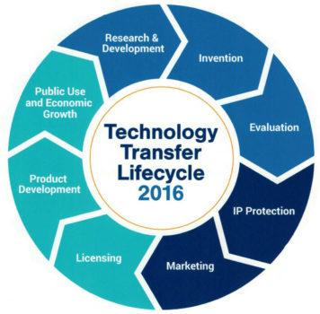

## Table of Contents

## What is a transferor in simple terms?

A transferor is simply someone who gives or moves something to someone else. This could be anything from money, property, or even a responsibility. For example, if you give your friend a book, you are the transferor because you are transferring the book to your friend.

In legal terms, a transferor often comes up when talking about contracts or property rights. If you sell your house, you are the transferor because you are transferring the ownership of the house to the buyer. It's a straightforward concept but important in many legal and everyday situations.

## What are the basic functions of a transferor?

The main job of a transferor is to give something to someone else. This can be anything like money, a house, or even a job responsibility. When a transferor gives something away, they need to make sure that what they are giving is clear and that the person getting it understands what they are receiving. For example, if you are selling your car, you need to make sure the buyer knows everything about the car, like its condition and any problems it might have.

Another important function of a transferor is to follow the rules and laws about transferring things. This means they need to do things the right way, like signing papers or getting the right permissions. If you are transferring ownership of a house, you need to sign the right documents and maybe even go to a lawyer to make sure everything is done correctly. This helps make sure the transfer is legal and that both the transferor and the person receiving the item are protected.

## How does technology influence the role of a transferor?

Technology makes it easier for a transferor to give things to others. For example, with online banking, you can transfer money to someone else with just a few clicks. You don't need to go to the bank or write a check. This makes the job of a transferor quicker and more convenient. Also, technology helps keep records of what has been transferred. If you sell something online, the website can keep a record of the sale, so both you and the buyer have proof of the transfer.

Technology also changes how transferors need to follow rules. When you transfer something online, you often need to agree to terms and conditions. These are the rules you have to follow when using the technology. For example, if you are selling something on an online marketplace, you need to follow their rules about how to list items and how to complete the sale. This means that as a transferor, you need to understand and follow these new rules that come with using technology.

## What are the key technologies used by transferors?

Transferors use many different technologies to make their job easier. One big technology is online banking and payment systems. These let transferors send money to others quickly and easily. They can use apps on their phones or websites to move money without needing to go to a bank. Another important technology is digital contracts and electronic signatures. These let transferors sign important papers online, so they don't need to meet in person to complete a transfer.

Another key technology is blockchain and cryptocurrencies. These let transferors send money or other digital assets securely and without a middleman like a bank. Blockchain keeps a record of every transfer, so it's easy to see where things went and who got them. Also, online marketplaces and platforms are important. These let transferors list and sell things to people all over the world. They make it easy to find buyers and complete sales without needing to meet face-to-face.

## How do transferors ensure the security of transactions?

Transferors use different ways to keep transactions safe. One way is by using secure websites and apps that have strong passwords and encryption. Encryption is like a secret code that keeps information safe while it travels from one place to another. Transferors also use two-[factor](/wiki/factor-investing) authentication, which means they need to enter a code sent to their phone or email to prove it's really them. This makes it harder for someone else to pretend to be the transferor and steal their information.

Another way transferors keep transactions secure is by using trusted payment methods. They might use well-known services like PayPal or credit cards that have their own security measures. These services can help stop fraud and give money back if something goes wrong. Transferors also keep an eye on their accounts and check for any strange activity. If they see something they don't recognize, they can act quickly to stop any problems before they get worse.

## What are the legal responsibilities of a transferor?

A transferor has to follow the law when they give something to someone else. They need to make sure they have the right to give away what they are transferring. For example, if they are selling a house, they need to prove they own it. They also need to tell the truth about what they are giving. If they are selling a car, they should say if it has any problems. If they don't tell the truth, they could get in trouble.

Transferors also need to follow the rules about how to transfer things. This means they need to sign the right papers and get any needed permissions. For example, if they are transferring money, they need to follow banking rules. If they don't follow these rules, the transfer might not be legal, and they could face legal problems. It's important for transferors to understand and follow these responsibilities to make sure everything goes smoothly and legally.

## How has the role of transferors evolved with digital transformation?

The role of transferors has changed a lot because of digital transformation. Before, transferors had to do things in person, like signing papers or handing over money. Now, they can do these things online. They can use apps and websites to send money or sign contracts without meeting anyone face-to-face. This makes being a transferor easier and faster. They can reach more people and do more transfers in less time.

Digital transformation also means transferors need to learn new rules and use new tools. They have to understand how to use online platforms and follow the rules of these platforms. For example, if they are selling something on an online marketplace, they need to know how to list items and complete sales the right way. They also need to use technology to keep transactions safe, like using strong passwords and secure payment methods. This helps them protect themselves and the people they are transferring things to.

## What are the challenges faced by transferors in implementing new technologies?

Transferors face some challenges when they start using new technologies. One big challenge is learning how to use these new tools. They need to understand how to use apps and websites to send money or sign contracts. This can be hard if they are not used to technology. They might need to spend time learning and practicing, which can slow them down at first. Another challenge is keeping up with new rules. When they use online platforms, they have to follow the rules of those platforms. These rules can change often, so transferors need to keep learning and adapting.

Another challenge is keeping transactions safe. With new technology, there are new risks like hacking and fraud. Transferors need to use strong passwords and secure payment methods to protect themselves and the people they are transferring things to. This can be tricky because they need to balance convenience with security. If they make things too secure, it might be hard for people to use their services. But if they make things too easy, they might be at risk of being hacked. It's a tough balance to get right.

## How do transferors integrate blockchain technology into their operations?

Transferors use blockchain technology to make their work easier and safer. Blockchain is like a digital record book that keeps track of every transfer. When a transferor sends money or something else using blockchain, it gets written down in this record book. This makes it easy to see where things went and who got them. It's also very hard for someone to change or cheat the records because many computers around the world keep a copy of the book. This means transferors can trust that their transfers are safe and correct.

To use blockchain, transferors need to learn how it works and how to use it. They might use special apps or websites that work with blockchain. For example, if they want to send money, they can use a [cryptocurrency](/wiki/cryptocurrency) like Bitcoin. They need to set up a digital wallet to hold their money and learn how to send and receive it. This can be a bit tricky at first, but once they get the hang of it, it can make their job a lot easier. They also need to follow the rules of the blockchain they are using, like paying small fees for each transfer. By using blockchain, transferors can make their work more secure and reach more people around the world.

## What advanced data analytics tools are used by transferors to optimize their processes?

Transferors use advanced data analytics tools to make their work better and faster. One tool they use is called predictive analytics. This tool helps them guess what might happen next based on past data. For example, if a transferor is selling things online, they can use predictive analytics to figure out what items people might want to buy in the future. This helps them get ready and make sure they have the right things to sell. Another tool is called customer analytics. This tool helps transferors understand who their customers are and what they like. By knowing this, transferors can make their services better and make their customers happier.

Another important tool is called process mining. This tool helps transferors see how they are doing their work and find ways to do it better. It looks at all the steps they take to complete a transfer and points out where they can save time or money. For example, if a transferor is sending money, process mining can show them if there are any steps that are taking too long or costing too much. By using these tools, transferors can make their work smoother and more efficient. They can also use these tools to keep track of their performance and make sure they are always getting better.

## How do transferors adapt to regulatory changes influenced by technological advancements?

Transferors have to keep up with new rules that come from using new technology. When they use apps and websites to send money or sign contracts, they need to follow the rules of those platforms. These rules can change a lot because technology is always changing. Transferors need to stay updated and learn the new rules quickly. They might need to read about the changes or go to training to understand them. If they don't follow the new rules, they could get in trouble or their transfers might not be legal.

To adapt to these changes, transferors use tools and resources to help them. They might use software that keeps track of the rules and tells them when something changes. They can also join groups or networks where other transferors share information about new rules. By staying connected and using these tools, transferors can make sure they are always following the law. This helps them keep their transfers safe and legal, even as technology and rules keep changing.

## What future trends are expected to impact the functions of transferors?

In the future, transferors will see big changes because of new technology. One big trend is the use of [artificial intelligence](/wiki/ai-artificial-intelligence) (AI). AI can help transferors do their job better by making smart guesses about what people want to buy or how to make transfers faster. For example, AI can look at past data to predict what items will be popular next. This helps transferors get ready and have the right things to sell. Another trend is the growth of the Internet of Things (IoT). With IoT, everyday things like cars or home devices can connect to the internet. This means transferors can use these devices to make transfers easier and more automatic. For example, a smart lock on a house can be used to transfer ownership without needing to meet in person.

Another important trend is the use of more secure and private ways to transfer things. As more transfers happen online, keeping them safe is very important. New technologies like quantum encryption will make transfers even safer. Quantum encryption uses special math to keep information secret, so it's very hard for hackers to steal it. Transferors will need to learn how to use these new security tools to protect themselves and their customers. Also, as more people use cryptocurrencies and blockchain, transferors will need to understand and use these technologies more. This will help them reach more people around the world and make their transfers faster and cheaper.

## References & Further Reading

[1]: Bergstra, J., Bardenet, R., Bengio, Y., & Kégl, B. (2011). ["Algorithms for Hyper-Parameter Optimization."](https://papers.nips.cc/paper/4443-algorithms-for-hyper-parameter-optimization) Advances in Neural Information Processing Systems 24.

[2]: ["Advances in Financial Machine Learning"](https://www.amazon.com/Advances-Financial-Machine-Learning-Marcos/dp/1119482089) by Marcos Lopez de Prado

[3]: ["Evidence-Based Technical Analysis: Applying the Scientific Method and Statistical Inference to Trading Signals"](https://www.amazon.com/Evidence-Based-Technical-Analysis-Scientific-Statistical/dp/0470008741) by David Aronson

[4]: ["Machine Learning for Algorithmic Trading"](https://github.com/stefan-jansen/machine-learning-for-trading) by Stefan Jansen

[5]: ["Quantitative Trading: How to Build Your Own Algorithmic Trading Business"](https://www.amazon.com/Quantitative-Trading-Build-Algorithmic-Business/dp/1119800064) by Ernest P. Chan