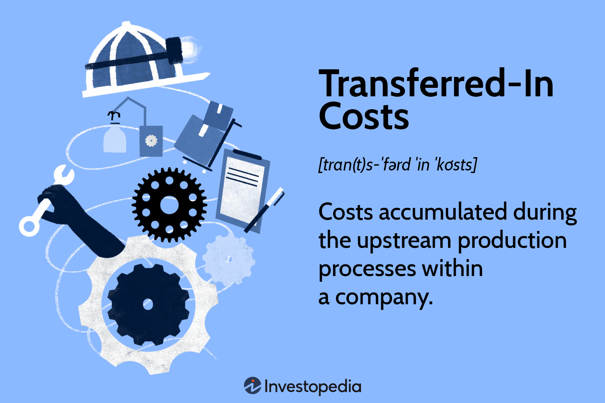

Understanding manufacturing costs is critical for businesses aiming to optimize profitability and operational efficiency. Manufacturing costs refer to expenses associated with producing goods, including direct materials, direct labor, and manufacturing overhead. By identifying and analyzing these costs, companies can improve their budget planning, pricing strategies, and overall financial performance. 

Transferred-in costs are a specific type of manufacturing cost incurred during upstream production processes. These costs are transferred to subsequent departments responsible for finalizing a product, making them particularly vital for businesses with continuous production activities, such as textile, chemical, and food processing industries.



Moreover, the integration of algorithmic trading has introduced innovative approaches to managing these expenses effectively. As a technology-driven method, algorithmic trading allows real-time automation of cost monitoring and control, providing businesses a data-driven method of optimizing their strategies. By leveraging algorithmic models, companies can predict cost patterns, automate reduction strategies, and, consequently, enhance their operational efficiency.

This article aims to provide a comprehensive understanding of manufacturing costs, highlighting the significance of transferred-in costs and the vital role of cost accounting. It also explores how algorithmic trading can be instrumental in developing efficient cost management strategies.

## Table of Contents

## Understanding Transferred-In Costs

Transferred-in costs are integral to comprehensive cost accounting in manufacturing industries. These costs are defined as the expenses incurred in upstream production processes that are subsequently transferred to subsequent departments responsible for finalizing the product. In essence, transferred-in costs represent the cumulative costs that a product accrues as it progresses through various stages of production.

The significance of transferred-in costs is pronounced in industries involved in continuous production processes. For example, in the textile industry, as raw fibers undergo spinning, weaving, and dyeing, costs from each stage are transferred to the next. Similarly, in the chemical industry, costs incurred during initial distillation processes are passed on to subsequent processes like cracking or polymerization. Such cost transference ensures that every department or phase within the production process accounts for its specific expenses while inheriting those that have accumulated in previous stages.

Let's consider a simplified example: 

Assume a manufacturing system with three departments—A, B, and C. Department A initiates the production process, incurring a direct cost of $10,000. As the product moves to Department B, an additional $5,000 is spent. In this scenario, the transferred-in cost for Department B would be the $10,000 from Department A. Consequently, the total cost associated with Department B's activities is $15,000 ($10,000 transferred-in cost + $5,000 newly incurred cost). This process repeats as the product moves forward to Department C.

Mathematically, the total transferred-in cost for any given department can be expressed as:

$$
\text{Total Cost}_{\text{Dept}} = \text{Transferred-In Cost}_{\text{Prev Dept}} + \text{Current Costs}_{\text{Dept}}
$$

 such a formula helps in calculating how costs evolve and accumulate across departments, ensuring precise financial analysis and transparency in cost management.

Industries involved in continuous production processes, such as food processing, also benefit significantly from tracking transferred-in costs. In food production, initial stages such as raw ingredient preparation incur costs that are then transferred to cooking, packaging, and distribution phases. Proper attribution of these costs is essential for effective budgeting, pricing, and cost reduction strategies.

Transferred-in costs, therefore, play a pivotal role in manufacturing by ensuring that every stage of production is accurately accounted for in terms of expenses. This approach not only enhances operational efficiency but also provides valuable insights for strategic decision-making.

## The Role of Manufacturing Costs

Manufacturing costs are multifaceted and comprise three primary components: direct labor, direct materials, and manufacturing overhead. Direct labor costs are the wages and salaries of workers directly involved in the production of goods. Direct materials refer to the raw materials that are an integral part of the finished products. Manufacturing overhead includes all other costs associated with the production process, such as utilities, maintenance, and depreciation of equipment and facilities.

Thorough understanding of manufacturing costs is instrumental for businesses in crafting efficient budgeting and pricing strategies. By accurately calculating these costs, companies can set competitive pricing that maximizes profit margins while ensuring affordability for consumers. Manufacturing costs also determine a product's unit cost, which plays a crucial role in various decision-making processes, such as determining break-even points, assessing profitability, and making strategic investment decisions.

For instance, the formula to calculate the total manufacturing cost is:

$$
\text{Total Manufacturing Cost} = \text{Direct Labor} + \text{Direct Materials} + \text{Manufacturing Overhead}
$$

This computation provides a foundation for deeper analysis, such as calculating the unit cost:

$$
\text{Unit Cost} = \frac{\text{Total Manufacturing Cost}}{\text{Total Units Produced}}
$$

These calculations are essential for making informed decisions regarding production levels, pricing strategies, and operational improvements. Companies can employ cost allocation methods to assign indirect costs more accurately, further refining their cost analysis and financial decision-making processes.

Advanced techniques, such as activity-based costing (ABC), allow for more precise allocation of overhead costs by identifying cost drivers, enabling businesses to identify inefficiencies and areas for cost reduction. By understanding and managing manufacturing costs effectively, companies can enhance their competitive position in the market, optimize resource utilization, and achieve financial sustainability.

## Cost Accounting Overview

Cost accounting provides a structured approach for tracking, analyzing, and managing costs related to production, playing a crucial role in understanding and optimizing financial performance within a company. It serves as a comprehensive tool that aids businesses in making informed financial decisions and enhancing cost efficiency. By systematically recording and examining costs, organizations can pinpoint areas of inefficiency and devise strategies to reduce unnecessary expenses.

A fundamental component of cost accounting is its ability to include and handle transferred-in costs, which are essential for calculating a product’s total production cost accurately. Transferred-in costs are those associated with previous stages of production, brought forward as part of the cost in the next phase of manufacturing. This integration ensures that all incurred expenses are correctly allocated, thereby providing a transparent and complete view of the production cycle's cost structure.

The primary objective of cost accounting is to derive the total cost by considering direct materials, direct labor, and manufacturing overhead. The formula for calculating the total cost can be expressed as:

$$
\text{Total Cost} = \text{Direct Materials} + \text{Direct Labor} + \text{Manufacturing Overhead} + \text{Transferred-In Costs}
$$

This comprehensive approach facilitates better budget planning, cost control, and pricing strategies, enabling companies to maintain competitive pricing while securing desired profit margins. By implementing cost accounting, businesses can project future expenses and revenues, enabling strategic planning and operational adjustments that improve overall financial health. 

Furthermore, for organizations heavily reliant on complex production processes, such as those in chemical or textile industries, cost accounting provides a detailed understanding of each production stage's contribution to the final product cost. This allows for precise financial planning and operational adjustments, enhancing a company's ability to respond dynamically to market changes and internal operational shifts.

## Algorithmic Trading in Cost Management

Algorithmic trading facilitates the efficient management of costs by using automated technology and complex algorithms to analyze and execute trading strategies based on predefined rules. This approach enhances cost management by enabling real-time monitoring and control of expenditure, ensuring that businesses can respond swiftly to market changes and operational needs.

The primary advantage of incorporating [algorithmic trading](/wiki/algorithmic-trading) in cost management is its ability to process vast amounts of data quickly and accurately. By employing sophisticated algorithms, companies can analyze various cost factors, such as production expenses, material costs, and labor charges, to identify patterns and optimize operational efficiency. This data-driven approach allows for the strategic allocation of resources and adjustment of pricing strategies.

Automating the monitoring process through algorithmic trading enables companies to track financial performance continuously and make data-backed decisions to control costs. In practical terms, algorithms can be coded to trigger automated actions when certain thresholds are reached, such as reallocating resources or adjusting production levels. For example, consider a Python script that can be used to automate decision-making based on real-time cost data:

```python
import pandas as pd

# Load cost data
cost_data = pd.read_csv('cost_data.csv')

# Define a cost threshold
cost_threshold = 10000

# Check for costs exceeding the threshold
excess_costs = cost_data[cost_data['total_cost'] > cost_threshold]

# Perform automatic adjustments
def adjust_production(excess_cost_items):
    for item in excess_cost_items:
        print(f"Adjusting production for item: {item}")

adjust_production(excess_costs['item_id'])
```

Moreover, integrating algorithmic trading with cost accounting allows businesses to enhance their financial strategies. This combination facilitates a comprehensive overview of a company's financial health by correlating operational data with cost data. As a result, businesses can better forecast financial outcomes, manage risks, and improve profitability.

In summary, the technological leverage provided by algorithmic trading in cost management streamlines operational efficiencies by promoting an environment where strategic decisions can be made quickly and effectively through automation and data analysis. This methodology not only aids in controlling costs but also in optimizing overall financial performance.

## Examples and Applications

An example of transferred-in costs can be observed in oil refining, where production costs move from one processing stage to another—for instance, from distillation to cracking. In this process, costs associated with distilling [crude oil](/wiki/crude-oil) are "transferred-in" to the subsequent cracking phase, thereby ensuring that the expenses incurred in each stage are accounted for in the overall production cost of refined products.

Industries such as textiles and food processing implement transferred-in costs extensively to enhance cost tracking and optimization. In textile production, for example, the costs associated with spinning fibers may be transferred to the weaving department, facilitating a comprehensive view of accumulated production expenses. Similarly, in food processing, costs related to raw material preparation might be transferred to processing and packaging stages, ensuring seamless integration of cost data across different phases of production.

Algorithmic trading contributes significantly to optimizing financial outcomes by predicting cost patterns and automating strategies for cost reduction. These automated systems analyze vast amounts of data in real-time, allowing organizations to anticipate cost fluctuations and respond proactively. Python, a versatile programming language, can be leveraged to build algorithmic trading models that predict future costs based on historical data trends. For instance:

```python
import pandas as pd
from sklearn.ensemble import RandomForestRegressor

# Sample data frame with production cost details
data = pd.DataFrame({
    'time': ['2023-01-01', '2023-02-01', '2023-03-01'],
    'cost': [15000, 16000, 15500]
})

# Feature extraction
data['month'] = pd.to_datetime(data['time']).dt.month

# Model training
X = data[['month']]
y = data['cost']
model = RandomForestRegressor()
model.fit(X, y)

# Predicting future production costs
future_date = pd.DataFrame({'month': [4]})
predicted_cost = model.predict(future_date)
print(f"Predicted Cost for April: {predicted_cost[0]}")
```

This code snippet demonstrates how historical cost data can be used to predict future costs using a [machine learning](/wiki/machine-learning) model. With these insights, businesses can implement automated decisions for cost control, aligning resource allocation with predicted demand and price movements, thereby achieving enhanced profitability.

## Conclusion

Transferred-in costs and a thorough understanding of manufacturing costs form the backbone of optimized production efficiency. These elements enable businesses to identify areas where cost reductions can be implemented without sacrificing quality or output. By tracking expenses incurred at various stages of production, especially those transferred from one department to another, organizations can maintain a clear and accurate picture of their cost structure.

Cost accounting serves as the framework for managing and analyzing these expenses systematically. It facilitates the detailed tracking and assessment of both direct and indirect costs, ensuring that financial resources are utilized effectively. Through meticulous cost accounting, businesses can align their budgeting and pricing strategies with actual production costs, thus minimizing financial discrepancies.

The incorporation of algorithmic trading into cost management processes further enhances operational efficiency. By employing algorithms to automate the real-time monitoring and controlling of costs, companies can leverage data-driven insights for strategic decision-making. Algorithmic trading methods can predict cost patterns, optimize financial outcomes, and automate cost reduction strategies, ensuring that organizations remain competitive in a rapidly changing market environment.

In summary, the integration of transferred-in costs with comprehensive cost accounting and innovative algorithmic trading represents a holistic approach to modern cost management. This synergy not only boosts financial performance but also significantly enhances operational efficiency, enabling businesses to thrive in a competitive marketplace.

## References & Further Reading

[1]: [Brealey, R. A., Myers, S. C., & Allen, F. (2022). "Principles of Corporate Finance"](https://www.mheducation.com/highered/product/Principles-of-Corporate-Finance-Brealey.html) McGraw-Hill Education.

[2]: ["Cost Accounting: A Managerial Emphasis"](https://www.amazon.com/Cost-Accounting-Managerial-Charles-Horngren/dp/0131495380) by Charles T. Horngren, Srikant M. Datar, and Madhav V. Rajan.

[3]: ["Manufacturing Processes for Design Professionals"](https://www.amazon.com/Manufacturing-Processes-Design-Professionals-Thompson/dp/0500513759) by Rob Thompson.

[4]: D'Hondt, C., & Giraud, J.-R. (2018). ["Introduction to Algorithmic Trading Strategies."](https://www.semanticscholar.org/paper/Transaction-Cost-Analysis-A-Z%3A-A-Step-towards-Best-D%E2%80%99Hondt-Giraud/071ee559748dd6b551a9ef37ecfd23501918430c) Risk Books.

[5]: ["Algorithmic Trading: Winning Strategies and Their Rationale"](https://www.amazon.com/Algorithmic-Trading-Winning-Strategies-Rationale-ebook/dp/B00CY5HC0U) by Ernest P. Chan.