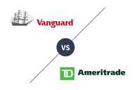

In today’s rapidly evolving financial landscape, understanding investment strategies has never been more crucial. Each year, advancements in technology and shifts in global markets create new opportunities and challenges for investors. To effectively navigate this dynamic environment, it is essential to adopt a comprehensive approach that includes smart money investment strategies, financial literacy, and algorithmic trading.

Smart money investment strategies involve leveraging the expertise of institutional investors, who are often equipped with extensive research capabilities and market insights. These investors use sophisticated approaches to manage their assets and mitigate risks, which can provide valuable lessons for individual investors seeking to enhance their portfolios. By understanding and adopting these strategies, one can potentially achieve better outcomes in the marketplace.



Financial literacy, on the other hand, serves as the foundation for making informed investment decisions. It encompasses a broad understanding of financial principles, including the ability to analyze balance sheets, comprehend market trends, and evaluate economic forecasts. A well-rounded financial literacy enables investors to make calculated decisions and minimizes the likelihood of falling prey to unfavorable market conditions.

Algorithmic trading represents another critical component of modern investment strategies. By utilizing computer algorithms to execute trades, investors can achieve greater accuracy, efficiency, and speed. These algorithms are capable of processing vast amounts of data at high frequencies, allowing for timely responses to market movements and reducing manual errors. As such, algorithmic trading has become an integral tool for those aiming to stay ahead in the fast-paced world of finance.

This article will explore the ways in which these concepts interlink and how they can be utilized to enhance your financial portfolio. Whether you are a seasoned investor or just beginning your journey, this guide aims to provide valuable insights into making informed investment decisions. By embracing smart money strategies, improving financial literacy, and harnessing the power of algorithmic trading, investors are better equipped to navigate the complexities and opportunities presented by modern financial markets.

## Table of Contents

## Understanding Smart Money and Dumb Money

The terms "smart money" and "dumb money" are frequently used to distinguish between different types of investors based on their level of expertise, access to information, and capability to influence market movements. Smart money primarily refers to institutional investors, such as hedge funds, mutual funds, and other financial institutions. These investors often possess significant research capabilities, advanced analytical tools, and insider knowledge of market trends, which allows them to make more informed investment decisions.

Institutional investors have the advantage of dedicated research teams and sophisticated data analysis systems that enable them to predict and react to market fluctuations more accurately. Their investment strategies may involve complex financial instruments and diverse asset allocations, allowing them to potentially maximize returns while minimizing risk. Furthermore, the sheer [volume](/wiki/volume-trading-strategy) of their trades can influence market prices, adding an additional layer of strategic advantage.

In contrast, dumb money generally describes individual or retail investors. These investors typically have limited access to detailed market analytics, financial data, and expert analysis. Retail investors often rely on publicly available information, media reports, and personal intuition when making investment decisions. Due to these constraints, they may be more susceptible to market noise and psychological biases, such as herd behavior, which can lead to suboptimal investment outcomes.

While the term "dumb money" might suggest incompetence, it primarily reflects the disparity in access to information and market leverage between retail and institutional investors. However, retail investors are increasingly gaining access to improved financial literacy resources and sophisticated trading platforms, somewhat leveling the playing field. Nevertheless, the distinction between smart and dumb money remains relevant, highlighting the importance of access to information and strategic expertise in successful investing.

## Key Investment Strategies Used by Smart Money

Smart money investors utilize a range of sophisticated investment strategies to maximize returns while managing risk effectively. Fundamental analysis is traditionally at the forefront, involving the thorough evaluation of financial statements, market conditions, and economic indicators to assess the intrinsic value of an asset. By examining a company’s earnings, revenue, profit margins, and other key financial metrics, investors can determine whether a stock is undervalued or overvalued.

In addition to [fundamental analysis](/wiki/fundamental-analysis), smart money often employs [quantitative trading](/wiki/quantitative-trading) models that leverage vast datasets and advanced algorithms to identify trading opportunities. These models incorporate statistical and mathematical analyses to predict asset price movements and optimize portfolio performance. Quantitative strategies may include factors such as [momentum](/wiki/momentum), value, and growth metrics, often employing [backtesting](/wiki/backtesting) to refine their predictive accuracy.

Understanding market trends is another crucial component for smart money investors. They utilize data analytics to monitor and predict shifts in market conditions, economic cycles, and investor sentiment. This involves analyzing historical data, market indicators, and geopolitical events to forecast their potential impact on asset prices. Sophisticated investors leverage financial tools such as Bloomberg Terminal or Reuters Eikon, which provide real-time analytics and news, enabling timely and informed decision-making.

A key approach employed by smart money is strategic asset allocation. This tactic involves diversifying investments across various asset classes, such as equities, bonds, and commodities, to optimize the risk-reward ratio. The rationale is to balance risk and reward by adjusting the portfolio's composition according to market conditions and individual risk tolerance. The strategic allocation is often based on modern portfolio theory, which suggests that diversification can reduce portfolio risk without sacrificing return.

Rigorous risk management is pivotal in safeguarding investment portfolios. Smart money investors employ risk management strategies, such as stop-loss orders and options hedging, to mitigate potential losses. Techniques like Value at Risk (VaR) and stress testing help in quantifying and managing risk under different market scenarios. By setting predefined risk thresholds and employing hedging strategies, investors protect their portfolios against significant downturns.

Diversification remains a cornerstone of smart money investment strategy. By spreading investments across uncorrelated assets, investors reduce idiosyncratic risk and enhance the stability of returns. Diversification can be achieved not only across asset classes but also geographically and by sector, reducing the impact of localized economic or political disruptions.

In summary, smart money investors apply a blend of fundamental analysis, quantitative models, market trend analysis, and strategic asset allocation, augmented by rigorous risk management and diversification. These approaches, supported by sophisticated financial tools and data analytics, enable smart money to navigate complex financial markets effectively.

## Financial Literacy: An Essential Component

Financial literacy is crucial for individuals aiming to enhance their investment strategies, providing a critical foundation for making informed financial decisions. It encompasses a broad understanding of various financial concepts, including budgeting, investing, and managing personal finances, that directly affect one's ability to invest wisely. A strong grasp of financial principles enables investors to interpret market signals, assess economic indicators, and evaluate financial instruments effectively.

The importance of financial literacy begins with basic components such as understanding balance sheets and financial statements. Balance sheets provide a snapshot of a company's financial position, dividing assets, liabilities, and shareholders' equity. By analyzing these statements, investors can assess a company's profitability and financial health, which are fundamental for making sound investment choices. Key metrics often evaluated include current ratio, debt-to-equity ratio, and return on equity (ROE).

Continuing education and the use of resources are necessary for enhancing financial literacy. Numerous online platforms and courses offer foundational finance knowledge, ranging from basic concepts to complex investment strategies. Websites like Investopedia and Khan Academy provide free resources tailored to different skill levels, while MOOCs (Massive Open Online Courses) offered by institutions such as Coursera and edX allow for more structured learning experiences.

Developing financial literacy also involves understanding market economics and macroeconomic factors. These include studying interest rates, inflation, and GDP growth, which influence market movements and investment opportunities. Grasping these economic indicators helps individuals anticipate market trends and make more strategic investment decisions.

Practical techniques to build financial literacy include maintaining a diversified investment portfolio and practicing risk management. Diversification involves spreading investments across various asset classes to reduce risk, while risk management focuses on understanding and mitigating potential losses. Both are integral components of sound investment practice.

For those looking to advance their understanding further, obtaining credentials such as the Chartered Financial Analyst (CFA) designation can be beneficial. This credential provides comprehensive coverage of investment analysis and portfolio management, equipping individuals with the skills to handle complex financial challenges.

In summary, financial literacy serves as an essential pillar for improving investment strategies. By utilizing available resources and continuously building on financial knowledge, individuals can better navigate the complexities of the financial markets, ultimately achieving greater investment success.

## The Emergence of Algorithmic Trading

Algorithmic trading has revolutionized the financial markets by automating the process of trading securities through sophisticated programming. This method leverages computer algorithms to initiate trades at high speeds and frequencies, which is beyond the capacity of human traders. As technology evolves, [algorithmic trading](/wiki/algorithmic-trading) has gained prominence due to its numerous advantages, including enhanced accuracy and the efficient handling of trade volumes.

One of the pivotal advantages of algorithmic trading is its ability to execute trades with precision. By minimizing human intervention, algorithmic systems reduce the likelihood of errors caused by emotional decision-making. Computer algorithms can be coded to follow a set of predetermined instructions, such as timing, price, and quantity, which ensures that trades are executed optimally. The elimination of human biases and errors results in more consistent trading outcomes.

Furthermore, algorithmic trading is adept at handling large volumes of trades, which is crucial for maintaining [liquidity](/wiki/liquidity-risk-premium) in financial markets. High-frequency trading ([HFT](/wiki/high-frequency-trading-strategies)) is a subset of algorithmic trading characterized by the rapid buying and selling of securities. HFT firms make use of powerful computing resources to place thousands or millions of orders within short timeframes, profiting from even minute price movements. This capability contributes significantly to the liquidity and efficiency of the markets.

Algorithmic trading employs a variety of strategies to maximize returns, with three of the most prevalent being [trend following](/wiki/trend-following), mean reversion, and statistical [arbitrage](/wiki/arbitrage). 

1. **Trend Following:** This strategy capitalizes on the momentum of market trends. Algorithms identify and follow existing trends in market prices, based on the assumption that an asset's current market direction will continue. The strategy typically involves simple moving averages or exponential moving averages to generate trade signals.

2. **Mean Reversion:** Mean reversion strategies are predicated on the assumption that asset prices will revert to their historical means over time. Algorithms track the deviation of asset prices from their mean values, generating trade signals when prices are believed to deviate significantly from their expected levels. This strategy works well in markets where prices fluctitate but eventually return to a more average range.

3. **Statistical Arbitrage:** This involves using statistical and quantitative models to exploit price inefficiencies between related securities. Traders gain from temporary mispricings by concurrently buying and selling correlated assets. This strategy requires significant computational power and data to identify divergences and make prompt trade decisions.

As algorithmic trading continues to evolve, its adoption is expected to grow further, driven by advancements in technology and data analytics. Its capacity to execute trades with heightened efficiency and accuracy makes it an invaluable tool in modern portfolio management. However, it's essential for traders and investors to carefully construct and rigorously test their algorithms to ensure that they operate effectively amidst the complexities and dynamic nature of financial markets.

## Integrating Financial Literacy with Algorithmic Trading

Integrating financial literacy with algorithmic trading can significantly enhance investment strategies by improving decision-making and optimizing trade execution. Financial literacy provides a foundation for understanding market dynamics, which is essential for developing effective algorithmic trading systems. This section explores how knowledge in key areas such as market behaviors and risk management can improve the outcomes of algorithmic trading, along with practical tips for investors aiming to merge these concepts.

An investor with a strong grasp of market dynamics will better understand market trends, economic indicators, and factors that influence price movements. This understanding helps in designing algorithms that can react aptly to market changes, potentially leading to more profitable trading strategies. For example, an investor familiar with technical analysis can integrate indicators such as moving averages or Relative Strength Index (RSI) into trading algorithms to identify potential buy or sell signals.

Risk management is another crucial component where financial literacy plays a vital role in algorithmic trading. Effective risk management involves setting stop-loss orders and position sizing, which can prevent substantial losses. Investors can implement strategies that automatically adjust the capital allocated to trades based on risk assessments. Consider this simple example in Python:

```python
def position_size(account_balance, risk_per_trade, stop_loss):
    """
    Calculate the position size based on account balance, risk per trade, and stop loss level.
    """
    risk_amount = account_balance * risk_per_trade
    position_size = risk_amount / stop_loss
    return position_size

# Example usage
account_balance = 100000  # Total balance in dollars
risk_per_trade = 0.01  # Risking 1% of account per trade
stop_loss = 0.05  # 5% stop loss on the trade

size = position_size(account_balance, risk_per_trade, stop_loss)
print(f"Position size: {size} units")
```

In this code, the `position_size` function calculates the number of units to trade based on the account balance, risk per trade, and stop loss percentage, reflecting a key risk management principle of not risking more than a specific percentage of the total account balance on any single trade.

Practical tips for effectively merging financial literacy with algorithmic trading include:

1. **Continuous Education**: Keeping abreast of financial news, trends, and emerging technologies in algorithmic trading is crucial. Online courses, webinars, and financial news platforms can provide valuable insights.

2. **Backtesting and Simulation**: Before deploying any algorithm, thorough backtesting using historical data can help identify potential flaws or areas of improvement in the trading strategy. This process matches the theoretical workings of the algorithm with real-world dynamics.

3. **Utilizing Financial Ratios and Indicators**: Understanding financial ratios like the price-to-earnings (P/E) ratio or earnings per share (EPS) can inform algorithmic trading models, helping to select fundamentally strong assets.

4. **Technology investment**: Equip yourself with robust trading platforms that offer API access, enabling seamless integration of complex algorithms. Consider platforms that provide dummy accounts for testing without financial risk.

By leveraging financial literacy alongside algorithmic trading, investors can develop more nuanced, effective trading strategies. This synergy between human understanding and machine efficiency allows for smarter, data-driven decisions that align with personal risk and investment objectives.

## Challenges and Considerations

As investment strategies evolve, so do the challenges and considerations that accompany them. Smart money strategies, financial literacy, and algorithmic trading offer substantial benefits, but they are not without their hurdles. One significant challenge is technological risk. As algorithms become more complex, the potential for technical glitches or system failures increases. Such risks can lead to erroneous trades, potentially resulting in substantial financial losses.

Moreover, market unpredictability remains a constant challenge. While sophisticated algorithms can analyze vast datasets quickly, they are not immune to unpredictable market events, such as geopolitical upheavals or sudden economic shifts, which can cause abrupt market movements. Algorithms rely on historical data and trends, making them vulnerable to unprecedented situations.

Compliance in algorithmic trading is another vital consideration. As regulatory bodies continue to scrutinize automated trading systems, ensuring compliance with relevant laws is critical. Traders must keep abreast of regulatory changes to avoid legal pitfalls. Compliance includes maintaining transparent records of algorithmic trades, ensuring strategies do not manipulate the market, and implementing real-time monitoring to detect and mitigate rogue algorithms.

Ongoing education and adaptation are imperative. The financial landscape is ever-changing, requiring investors to continuously update their knowledge and adapt strategies accordingly. This includes staying informed about new technologies, methodologies, and market conditions. Educational resources, such as online courses and financial news platforms, can prove invaluable in this regard.

Market accessibility remains a pertinent issue. The tools and data employed by institutional investors often remain out of reach for retail investors due to high costs. Additionally, accessing certain markets may require specific resources or networks that are not readily available to individual investors.

Finally, the evolving nature of financial markets entails constant vigilance and flexibility. As new financial instruments and technologies emerge, they can introduce both opportunities and complexities. Investors must evaluate how these developments affect their current strategies and be prepared to pivot when necessary.

In conclusion, while the integration of smart money strategies, financial literacy, and algorithmic trading holds great potential, investors must navigate these challenges thoughtfully to succeed in the complex world of modern finance.

## Conclusion

Smart money strategies, financial literacy, and algorithmic trading represent a powerful triad for potential success in the investment world. Each element contributes uniquely to an investor's ability to make informed decisions and optimize portfolio performance. Smart money strategies, characterized by sophisticated analysis and market acumen, provide a strategic framework for making well-informed investment choices. Institutional investors, often part of the smart money group, employ tools and insights that enable them to anticipate market trends and adjust their portfolios accordingly.

Financial literacy serves as the foundation upon which effective investment strategies are built. A deep understanding of financial concepts and principles empowers investors to interpret market signals and assess the value of investment opportunities. It equips them with the skills necessary to evaluate financial statements, understand market dynamics, and make decisions that align with their financial goals.

Algorithmic trading, with its reliance on computer algorithms to execute trades, offers investors the capability to manage large volumes of trades with precision and efficiency. This approach leverages data and technology to capitalize on market opportunities that might otherwise be inaccessible through traditional trading methods.

Integrating these elements into a cohesive strategy allows investors to navigate the complexities of modern financial markets more effectively. By combining the astute insights of smart money with financial literacy and the technological prowess of algorithmic trading, investors can enhance their ability to respond to market changes and capitalize on emerging trends.

Continuous learning and adaptation are critical components of this integrated approach. As financial markets evolve and new technologies emerge, investors must remain vigilant and open to acquiring new knowledge and skills. This adaptability ensures sustained success in an environment that is both dynamic and unpredictable. By embracing a commitment to ongoing education and strategic flexibility, investors can better position themselves to achieve their financial objectives in the ever-changing landscape of investment opportunities.

## References & Further Reading

[1]: Bergstra, J., Bardenet, R., Bengio, Y., & Kégl, B. (2011). ["Algorithms for Hyper-Parameter Optimization."](https://dl.acm.org/doi/10.5555/2986459.2986743) Advances in Neural Information Processing Systems 24.

[2]: ["Advances in Financial Machine Learning"](https://www.amazon.com/Advances-Financial-Machine-Learning-Marcos/dp/1119482089) by Marcos Lopez de Prado

[3]: ["Evidence-Based Technical Analysis: Applying the Scientific Method and Statistical Inference to Trading Signals"](https://www.amazon.com/Evidence-Based-Technical-Analysis-Scientific-Statistical/dp/0470008741) by David Aronson

[4]: ["Machine Learning for Algorithmic Trading"](https://github.com/stefan-jansen/machine-learning-for-trading) by Stefan Jansen

[5]: ["Quantitative Trading: How to Build Your Own Algorithmic Trading Business"](https://www.amazon.com/Quantitative-Trading-Build-Algorithmic-Business/dp/1119800064) by Ernest P. Chan