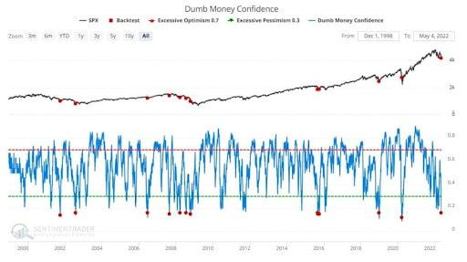

## Table of Contents

## What is considered 'dumb money' in investing?

'Dumb money' is a term used in investing to describe the money invested by people who are not professional investors. These are usually everyday people who might not know a lot about the stock market. They might make decisions based on what they hear from friends or see on social media, rather than doing a lot of research. Because of this, their investments are seen as less smart or less informed.

However, calling someone's money 'dumb' can be unfair. Everyone has to start somewhere, and even professional investors were beginners once. Also, sometimes 'dumb money' can move the market in big ways. For example, if a lot of everyday people start buying a certain stock, it can make the price go up, even if professionals think it's a bad investment. So, while the term 'dumb money' might sound negative, it's important to remember that everyone's investment journey is different.

## How can beginners start transforming their 'dumb money' into smarter investments?

Beginners can start turning their 'dumb money' into smarter investments by first learning the basics of investing. This means understanding what stocks, bonds, and mutual funds are, and how they work. They can do this by reading books, watching videos, or taking online courses about investing. It's also a good idea to start with small amounts of money. This way, if they make a mistake, they won't lose a lot. As they learn more, they can slowly start to invest more money.

Another important step is to do research before investing. Instead of just following what friends or social media say, beginners should look at a company's financial reports and news to see if it's a good investment. They can also use tools like stock screeners to find good investment opportunities. It's also helpful to set clear goals for their investments, like saving for a house or retirement, and to have a plan for how to reach those goals. By taking these steps, beginners can start making smarter investment choices and move away from being seen as 'dumb money'.

## What are the basic principles of smart investing for novices?

Smart investing for novices starts with understanding the basics. This means learning about different types of investments like stocks, bonds, and mutual funds. It's important to know how these work and what risks they [carry](/wiki/carry-trading). Novices should also learn about diversification, which means spreading their money across different types of investments to reduce risk. Another key principle is to start small. By investing small amounts at first, beginners can learn without risking a lot of money. As they gain more knowledge and confidence, they can gradually increase their investments.

Another important principle is to do your own research. Instead of just following tips from friends or social media, novices should look at a company's financial reports and news to see if it's a good investment. Setting clear goals is also crucial. Whether it's saving for a house, retirement, or something else, having a goal helps guide investment decisions. Finally, patience is key. Smart investing is not about getting rich quick; it's about making steady, informed decisions over time. By following these principles, novices can make smarter investment choices and build a solid financial future.

## What common mistakes should investors avoid when starting out?

One common mistake new investors make is putting all their money into one thing. This is called not diversifying. It's like putting all your eggs in one basket. If that one investment does badly, you could lose a lot of money. Instead, it's better to spread your money across different types of investments. This way, if one goes down, the others might still do well and help balance things out.

Another mistake is trying to get rich quick. Some people hear about others making a lot of money fast and think they can do the same. But investing is usually about making money slowly over time. Trying to make quick money can lead to risky decisions and big losses. It's better to have a long-term plan and be patient. Remember, slow and steady often wins the race in investing.

Lastly, many beginners don't do enough research before they invest. They might just follow what their friends say or what they see on social media. But it's important to look at a company's financial reports and news to see if it's a good investment. Not doing your homework can lead to bad choices. Always take the time to learn about an investment before you put your money into it.

## How can one assess their risk tolerance before investing?

To figure out your risk tolerance before investing, you need to think about how you feel about losing money. Ask yourself how you would feel if the value of your investments went down a lot. Would you be okay with it, or would it make you really worried and want to sell everything right away? Your answers to these questions can help you understand if you are okay with taking big risks or if you prefer to play it safe.

Another way to assess your risk tolerance is to look at your financial situation and goals. If you have a lot of money saved up and a steady job, you might be able to take more risks because you can afford to lose some money. But if you don't have much saved and you need the money soon, you might want to stick with safer investments. Also, think about what you are saving for. If it's something far in the future, like retirement, you might be able to take more risks because you have time to recover from any losses.

## What are some beginner-friendly investment options to consider?

For beginners, one good option to start with is a savings account. It's very safe and you won't lose your money. You can put your money in a savings account at a bank and earn a little bit of interest over time. It's a good place to start because it helps you get used to saving money and seeing it grow, even if it's just a little bit.

Another beginner-friendly option is to invest in a mutual fund. A mutual fund is like a basket of different investments, like stocks and bonds, all put together by a professional. When you buy into a mutual fund, you're buying a little bit of all those different investments. This is good for beginners because it helps spread out the risk. Instead of putting all your money into one company, you're spreading it across many, which can be safer.

Lastly, you might want to try a robo-advisor. A robo-advisor is a computer program that helps you invest your money. You tell it how much risk you're okay with and what you're saving for, and it picks investments for you. It's easy to use and can be a good way for beginners to start investing without having to do a lot of research themselves.

## How does diversification help in turning 'dumb money' into smart investments?

Diversification helps turn 'dumb money' into smart investments by spreading out the risk. When you put all your money into one thing, like one company's stock, it's like putting all your eggs in one basket. If that company does badly, you could lose a lot of money. But if you spread your money across different types of investments, like stocks, bonds, and mutual funds, you're not relying on just one thing to do well. This way, if one investment goes down, the others might still do well and help balance things out. It's like having many baskets for your eggs, so if one basket falls, you still have eggs in the other baskets.

By using diversification, beginners can make smarter choices with their money. Instead of just following what friends or social media say, they can learn to pick different kinds of investments. This helps them understand the market better and make more informed decisions. Over time, as they learn more and see how different investments work together, they can feel more confident about their choices. Diversification turns 'dumb money' into smart investments by teaching beginners how to manage risk and grow their money in a steady way.

## What role does financial education play in smart investing?

Financial education is really important for smart investing. It helps you understand how different investments work, like stocks, bonds, and mutual funds. When you know more about these things, you can make better choices about where to put your money. Financial education also teaches you about important ideas like diversification, which means spreading your money across different types of investments to reduce risk. By learning these things, you can avoid common mistakes that beginners often make, like putting all your money into one thing or trying to get rich quick.

Having a good financial education also helps you set clear goals for your investments. Whether you're saving for a house, retirement, or something else, knowing what you want to achieve can guide your decisions. It also teaches you to be patient and think long-term, instead of trying to make quick money. Over time, as you learn more and gain experience, you can feel more confident about your investment choices. This way, financial education turns 'dumb money' into smart investments by helping you make informed and steady decisions.

## How can intermediate investors refine their investment strategies?

Intermediate investors can refine their investment strategies by focusing on more detailed research and analysis. Instead of just looking at a company's financial reports, they can start using tools like technical analysis to predict how stock prices might move. They can also learn about different investment styles, like value investing or growth investing, and decide which one fits their goals best. By understanding these things, intermediate investors can make more precise choices about where to put their money. They can also start to look at more complex investments, like options or real estate investment trusts (REITs), which can offer new ways to grow their money.

Another way intermediate investors can improve their strategies is by regularly reviewing and adjusting their portfolio. This means checking how their investments are doing and making changes if needed. They might decide to sell some investments that aren't doing well and buy others that look more promising. It's also important to keep learning and staying up-to-date with market news and trends. By doing this, intermediate investors can adapt their strategies to new situations and keep their investments on track. Over time, this careful management and continuous learning can help them turn their investments into a more successful and well-rounded portfolio.

## What advanced tools and techniques can experts use to optimize their investment portfolios?

Experts can use advanced tools like [algorithmic trading](/wiki/algorithmic-trading) to optimize their investment portfolios. Algorithmic trading uses computer programs to buy and sell investments based on certain rules. These rules can be based on things like stock prices, market trends, or even news events. By using these programs, experts can make trades faster and more accurately than they could by themselves. They can also use tools like portfolio optimization software, which helps them figure out the best way to spread their money across different investments to get the highest return for the least amount of risk.

Another technique experts might use is called quantitative analysis. This means using math and [statistics](/wiki/bayesian-statistics) to find patterns in the market that can help them make better investment choices. For example, they might use something called regression analysis to see how different factors, like interest rates or company earnings, affect stock prices. Experts can also use risk management tools to protect their investments. These tools can help them set up things like stop-loss orders, which automatically sell an investment if it drops to a certain price, to limit their losses. By using these advanced tools and techniques, experts can make smarter decisions and improve their chances of success in the market.

## How can one evaluate the performance of their investments over time?

To evaluate the performance of your investments over time, you need to look at how much money you've made or lost. One way to do this is by calculating the return on your investments. This means figuring out the percentage increase or decrease in the value of your investments from when you first bought them. You can do this by comparing the current value of your investments to their original cost. If your investments have gone up in value, you've made a profit. If they've gone down, you've had a loss. It's also helpful to compare your returns to a benchmark, like a stock market index, to see if you're doing better or worse than the market as a whole.

Another important thing to look at is how much risk you took to get those returns. This is called risk-adjusted return. Some investments might give you high returns, but they could also be very risky. You can use tools like the Sharpe ratio to see if the extra risk you took was worth it. The Sharpe ratio compares the return of your investment to the risk-free rate of return, like what you'd get from a savings account, and then divides that by the amount of risk you took. A higher Sharpe ratio means you got more return for the risk you took. By looking at both your returns and the risk you took to get them, you can get a better idea of how well your investments are really doing over time.

## What are the latest trends and technologies impacting smart investment strategies for experts?

The latest trends and technologies impacting smart investment strategies for experts include the use of [artificial intelligence](/wiki/ai-artificial-intelligence) (AI) and [machine learning](/wiki/machine-learning). These technologies help experts analyze huge amounts of data quickly and find patterns that they might miss otherwise. For example, AI can look at news articles, social media posts, and financial reports to predict how stock prices might move. This can help experts make better decisions about when to buy or sell investments. Another trend is the rise of sustainable investing, where experts focus on companies that are good for the environment and society. This is becoming more popular because many people want their money to help make the world a better place.

Another important technology is blockchain, which is used for things like cryptocurrencies and smart contracts. Blockchain can make investing safer and more transparent because it keeps a record of all transactions that can't be changed. This can help experts trust the investments they're making more. Also, more experts are using robo-advisors, which are computer programs that help manage investments. These programs can give personalized advice based on an investor's goals and how much risk they're okay with. By using these new trends and technologies, experts can make smarter and more informed investment choices.

## References & Further Reading

[1]: Bergstra, J., Bardenet, R., Bengio, Y., & Kégl, B. (2011). ["Algorithms for Hyper-Parameter Optimization."](https://dl.acm.org/doi/10.5555/2986459.2986743) Advances in Neural Information Processing Systems 24.

[2]: ["Advances in Financial Machine Learning"](https://www.amazon.com/Advances-Financial-Machine-Learning-Marcos/dp/1119482089) by Marcos Lopez de Prado

[3]: ["Evidence-Based Technical Analysis: Applying the Scientific Method and Statistical Inference to Trading Signals"](https://www.amazon.com/Evidence-Based-Technical-Analysis-Scientific-Statistical/dp/0470008741) by David Aronson

[4]: ["Machine Learning for Algorithmic Trading"](https://github.com/stefan-jansen/machine-learning-for-trading) by Stefan Jansen

[5]: ["Quantitative Trading: How to Build Your Own Algorithmic Trading Business"](https://www.amazon.com/Quantitative-Trading-Build-Algorithmic-Business/dp/1119800064) by Ernest P. Chan