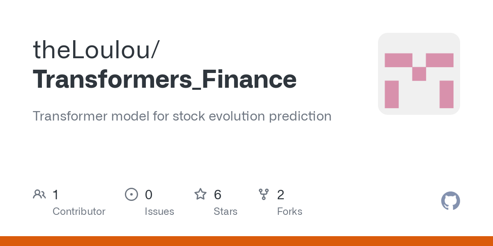

## Table of Contents

## What are transformers and how do they work in general?

Transformers are a type of electrical device that change the voltage of an alternating current (AC). They work by using two coils of wire, called the primary coil and the secondary coil, which are wrapped around a core made of a magnetic material, like iron. When an alternating current flows through the primary coil, it creates a changing magnetic field in the core. This changing magnetic field then induces a voltage in the secondary coil. By changing the number of turns in the coils, transformers can either step up the voltage (increase it) or step down the voltage (decrease it).

In simpler terms, think of transformers like a seesaw. If you have more turns on the secondary coil than the primary coil, the voltage goes up, just like one side of the seesaw going higher when the other side goes down. If you have fewer turns on the secondary coil, the voltage goes down. This ability to change voltage is very useful in many applications, like in power distribution systems where electricity needs to be sent over long distances at high voltages and then reduced to safer levels for use in homes and businesses.

## How are transformers applied in the field of finance?

In the field of finance, transformers refer to a type of machine learning model that is used to analyze and predict financial data. These models are good at understanding patterns in large amounts of data, like stock prices, trading volumes, and economic indicators. By using transformers, financial analysts can make better predictions about future market trends and make smarter investment choices. For example, transformers can look at past stock prices to guess what might happen next, helping investors decide when to buy or sell.

Transformers are also used in natural language processing, which is a way computers understand and generate human language. In finance, this means they can read and understand news articles, reports, and social media posts to see how people feel about the market or specific companies. This information can help predict how the market might react to certain news or events. By combining data analysis with understanding human language, transformers give a more complete picture of what's happening in the financial world, making them a powerful tool for anyone working in finance.

## What specific financial tasks can transformers be used for?

Transformers can be used in finance to predict stock prices. They look at a lot of past data, like how stock prices have changed before, how many stocks were bought and sold, and other numbers that can affect the market. By finding patterns in this data, transformers can guess what might happen to stock prices in the future. This helps investors decide if they should buy or sell stocks at certain times.

Transformers are also good at understanding what people are saying about the market. They can read news articles, reports, and even posts on social media to see if people feel good or bad about the market or specific companies. This information can help predict how the market might change because of news or events. By using both numbers and words, transformers give a fuller picture of what's happening in finance, helping people make better decisions.

## Can you explain the basic architecture of a transformer model used in finance?

A transformer model used in finance has a simple but powerful design. It's made up of two main parts: an encoder and a decoder. The encoder takes in data, like stock prices or news articles, and turns it into a special kind of information that the model can understand. This information is then passed to the decoder, which uses it to make predictions or understand the data better. Both the encoder and decoder are made up of layers, and each layer has parts that help the model pay attention to the most important bits of the data.

The key to a transformer's power is something called "attention mechanisms." These help the model focus on the parts of the data that matter most. For example, if the model is looking at stock prices, the attention mechanism might help it notice big changes in price or [volume](/wiki/volume-trading-strategy) that could be important for predicting the future. In finance, this means the model can better understand complex patterns in data, like how stock prices might change based on news or other events. By using attention, transformers can make more accurate predictions and help financial analysts make better decisions.

## What are the advantages of using transformers over traditional models in financial applications?

Transformers are better than traditional models in finance because they can handle a lot of data at once. They look at all the data together, not just one piece at a time. This means they can see how different things, like stock prices and news, affect each other. Traditional models might miss these connections because they look at data in smaller chunks. By understanding these connections, transformers can make more accurate predictions about what might happen in the market.

Another big advantage of transformers is that they can learn from both numbers and words. Traditional models are usually good at one or the other, but transformers can do both. This means they can read news articles, reports, and social media to see how people feel about the market. By combining this with data like stock prices, transformers get a fuller picture of what's happening. This helps financial analysts make better decisions because they have more information to work with.

## How do transformers handle time series data in finance?

Transformers handle time series data in finance by looking at all the data points at once, not just one after the other. They use something called "positional encoding" to keep track of when each data point happened. This helps them understand how things like stock prices change over time. By seeing the whole picture, transformers can find patterns and connections that other models might miss. This makes them really good at predicting what might happen next in the market.

Another way transformers handle time series data is by using attention mechanisms. These help the model focus on the most important parts of the data. For example, if there's a big change in stock prices, the transformer can pay more attention to that change and see how it affects future prices. By understanding these key moments, transformers can make better predictions about what might happen next. This is really helpful for financial analysts who need to make smart decisions based on how the market is moving.

## What are some common datasets used for training transformer models in finance?

Some common datasets used for training transformer models in finance include stock price data from places like Yahoo Finance or Bloomberg. These datasets have information about how stock prices change over time, how many stocks are bought and sold, and other numbers that can help predict future prices. By looking at this data, transformers can learn to see patterns and make guesses about what might happen next in the market.

Another type of dataset used is financial news and reports. These can come from sources like Reuters or the Wall Street Journal. Transformers can read these articles to understand how people feel about the market or specific companies. This helps the model predict how the market might react to certain news or events. By combining stock data with news, transformers get a fuller picture of what's happening in finance, which helps them make better predictions.

Social media data is also used sometimes. Platforms like Twitter can give a lot of information about what people are saying about the market. Transformers can analyze these posts to see if people are feeling good or bad about certain stocks or the market in general. This kind of data can be really helpful for understanding short-term changes in the market, making transformers even more useful for financial analysts.

## How can transformers be fine-tuned for specific financial forecasting tasks?

To fine-tune transformers for specific financial forecasting tasks, you start by taking a transformer model that has already been trained on a general dataset. This is called a pre-trained model. Then, you give it more data that is specific to the task you want it to do, like predicting stock prices or understanding financial news. By showing the model this new data, it learns to focus on the things that matter most for that task. This is like giving the model special training to make it better at one particular job.

For example, if you want the transformer to predict stock prices, you would give it a lot of data about past stock prices and other numbers that can affect the market. The model would then learn to see patterns in this data that are important for predicting future prices. If you want it to understand financial news, you would show it a lot of news articles and reports. The model would learn to pick out the key information from these texts that can help predict how the market might react. By fine-tuning the model this way, it becomes much better at the specific task you need it for.

## What are the challenges and limitations of using transformers in finance?

Using transformers in finance can be tricky because they need a lot of data to work well. If you don't have enough data, the model might not be able to find the patterns it needs to make good predictions. Also, transformers can be hard to understand because they are so complex. It's not always clear why they make certain predictions, which can be a problem when you need to explain your decisions to others. This is called the "black box" problem, and it can make people hesitant to trust the model's predictions.

Another challenge is that transformers need a lot of computer power to run. They have many layers and parts, which means they can take a long time to train and use. This can be expensive and slow, especially if you need to make quick decisions in the fast-moving world of finance. Also, transformers can sometimes focus too much on the recent data and not enough on older data, which might lead to mistakes if the market changes in unexpected ways. Despite these challenges, transformers are still very powerful tools that can help with many financial tasks if used carefully.

## Can you provide examples of successful implementations of transformers in financial institutions?

One example of a successful use of transformers in finance is at JPMorgan Chase. They use a transformer model to read and understand news articles and reports. This helps them see how people feel about the market and specific companies. By understanding this, they can make better guesses about how the market might change because of news or events. This has helped them make smarter investment choices and manage their risks better.

Another example is at Goldman Sachs. They use transformers to predict stock prices. They give the model a lot of data about past stock prices and other numbers that can affect the market. The model then finds patterns in this data to guess what might happen to stock prices in the future. This helps their traders decide when to buy or sell stocks, making their trading strategies more successful.

## How do transformers integrate with existing financial systems and workflows?

Transformers can be added to the systems that financial companies already use. They can take in data from different places, like stock prices and news articles, and then give their predictions or insights back to the system. For example, a transformer might look at stock prices and news to guess what will happen next in the market. This information can then be used by traders or analysts to make better decisions. The transformer works behind the scenes, so it fits into the existing system without causing too much change.

To make sure transformers work well with other systems, companies often use something called an API. An API is like a bridge that lets different parts of a system talk to each other. With an API, the transformer can easily share its predictions with other tools that traders or analysts use every day. This makes it easier for everyone to use the transformer's insights without having to learn a whole new system. By using APIs, transformers can become a helpful part of the daily work in finance, making things run smoother and helping people make better choices.

## What future developments can we expect in the use of transformers in the finance sector?

In the future, transformers in finance will get even better at understanding and predicting things. They will be able to handle even more data and find more complex patterns. This means they can help make more accurate predictions about stock prices and how the market might change. Companies might start using transformers to look at more kinds of data, like videos and pictures, to get a fuller picture of what's happening in the market. This could help them make even smarter investment choices.

Another big change we might see is transformers working more closely with other technologies, like blockchain and AI. This could make financial systems more secure and efficient. For example, transformers could help with real-time fraud detection by quickly analyzing lots of data. They could also work with AI to make better trading strategies that adapt to the market as it changes. As transformers get better and easier to use, more financial institutions will start using them, making the whole industry smarter and more connected.

## What is the Genesis of Transformers in Finance?

Transformers were initially designed for natural language processing (NLP) and have since proven to outperform traditional models such as recurrent neural networks (RNNs) and [long short](/wiki/equity-long-short)-term memory networks (LSTMs). Their innovation lies in the self-attention mechanism, a pivotal feature that permits the processing of input sequences simultaneously rather than sequentially. This parallel processing capability significantly boosts computational efficiency and enables the handling of longer sequences, making transformers particularly appealing for applications that require rapid data processing.

In finance, transformers have been adapted to analyze complex dependencies inherent in market data. Financial markets are characterized by a multitude of interconnected events and variables that traditional models struggle to capture simultaneously. Transformers, with their self-attention capacity, can identify and weigh relevant information from a broad set of data points, capturing intricate patterns across varied time scales. This ability to link disparate market events enables more insightful analysis and informed trading decisions.

Transformers also excel at capturing temporal and spatial relationships within data, which is crucial for financial forecasting. By identifying how different financial instruments interact and influence one another, transformers can provide a more holistic view of market dynamics. For example, they can associate an [interest rate](/wiki/interest-rate-trading-strategies) change in one region with currency fluctuations in another, offering traders a comprehensive perspective for decision-making.

The self-attention mechanism is mathematically expressed as:

$$
\text{Attention}(Q, K, V) = \text{softmax}\left(\frac{QK^T}{\sqrt{d_k}}\right)V
$$

where $Q$, $K$, and $V$ are the query, key, and value matrices derived from the input data. The dot product of queries and keys ($QK^T$) is scaled by the square root of the dimension of $K$ ($d_k$), followed by a softmax operation to generate attention weights. These weights determine the influence of each element in the input on the overall representation.

This sophisticated mechanism allows traders to develop models that not only predict price movements with greater accuracy but also identify underlying causes and associative patterns. By processing extensive data sets with high-dimensional relationships, transformers are reshaping the traditional approaches to financial market analysis and trading strategy development.

## What is a Technical Overview of Transformer Architecture?

The transformer architecture is a cornerstone in modern AI applications, fundamentally altering how data is processed and interpreted. At its core, the transformer consists of two main components: the Encoder and the Decoder. 

The Encoder is tasked with processing input sequences in parallel, effectively transforming them into continuous, high-dimensional representations. This is achieved through multiple layers of self-attention and feed-forward neural networks. Unlike traditional sequential models, such as Recurrent Neural Networks (RNNs), the parallel processing ability of transformers allows for the handling of entire sequences at once. This drastically reduces the training time and enables the efficient management of long sequences, a significant advantage in computationally intensive tasks. Mathematically, given an input sequence $X$, the Encoder initially applies a self-attention mechanism which can be represented as:

$$
\text{Attention}(Q, K, V) = \text{softmax}\left(\frac{QK^T}{\sqrt{d_k}}\right)V
$$

where $Q$, $K$, and $V$ are the query, key, and value matrices derived from the input sequence and $d_k$ is the dimension of the keys. Self-attention computes attention scores that determine the importance of each element in the input sequence relative to others, allowing the model to focus on relevant features.

The Decoder, on the other hand, generates output sequences. It achieves this by attending to both the outputs from the Encoder and its self-attention layers, ensuring that the generated output is contextually aligned with the input sequence. During each step, the Decoder predicts the next token in the sequence until the end is reached. The combination of encoder outputs and self-attention results in a contextual understanding of both input and previously generated outputs, enhancing the model's output quality.

Self-attention layers are pivotal in prioritizing crucial inputs, enhancing the efficiency and effectiveness of the model. These layers enable the transformer to weigh the significance of different parts of the sequence, thus enhancing its predictive power, particularly in tasks involving complex dependencies such as those found in language and financial data.

The parallel processing capability also enables transformers to manage large-scale datasets efficiently, a critical feature when dealing with high-frequency trading data or extensive historical market analyses. By reducing the dependency on previous state sequences, transformers offer unparalleled performance in training and inferencing, thereby making them a powerful tool in data-intensive applications.

In summary, the transformer’s use of encoders and decoders, combined with self-attention and parallel processing abilities, makes it exceptionally well-suited for complex data processing tasks. This architecture not only optimizes computational efficiency but also enhances the model’s capability to discern intricate patterns, enabling the transformation of raw input into meaningful insights.

## Can Stochastic Price Prediction be achieved using Transformers?

Stochastic price prediction using transformers leverages their capacity to analyze large sets of financial data, drawing from the robust mechanisms of self-attention. The process begins with the preparation of stochastic price model data, which involves gathering historical price information and organizing it into a format suitable for model ingestion. This preparation stage is critical, as it sets the groundwork for effective analysis by ensuring the data’s integrity and relevance.

The core functionality of transformers lies in their self-attention mechanisms, which enable the model to capture complex patterns within historical price data. Unlike traditional models that may struggle with long-term dependencies, transformers can weigh the importance of different input elements, thereby recognizing intricate patterns and relationships. Mathematically, this is achieved through the computation of attention scores that determine the contribution of each data point to the prediction task. 

To illustrate, consider a simplified version of the self-attention mechanism which calculates the attention weights $\alpha_{ij}$ using the formula:

$$
\alpha_{ij} = \frac{\exp(e_{ij})}{\sum_{k} \exp(e_{ik})}
$$

where $e_{ij} = \text{score}(q_i, k_j)$, and $q_i$ represents the query from the ith element, while $k_j$ denotes the key of the jth element. This mechanism allows transformers to prioritize relevant historical data points when computing potential future prices.

In the context of price movement analysis, transformers are adept at identifying market trends and computing weights indicative of potential shifts. These trends are discerned through the model's ability to link varying degrees of historical data to current market conditions, enabling a nuanced interpretation of data that more elementary models might overlook.

Upon identifying these patterns, forecasts are generated based on the current market dynamics. The prediction involves an intricate balance of weighing historical trends against real-time market shifts, thereby allowing for forecasts that reflect both historical knowledge and present context. Additionally, the transformer model incorporates mechanisms for managing risk, crucial for financial applications where uncertainty and [volatility](/wiki/volatility-trading-strategies) are inherent. This risk management is accentuated by evaluating potential forecast deviations and implementing strategies such as portfolio diversification or hedging.

In conclusion, stochastic price prediction with transformers epitomizes the synergy between advanced [neural network](/wiki/neural-network) architectures and the stochastic nature of financial markets. By harnessing self-attention mechanisms, these models not only enhance the precision of price predictions but also offer a robust framework for understanding market dynamics and managing financial risk effectively.

## References & Further Reading

[1]: Vaswani, A., Shazeer, N., Parmar, N., Uszkoreit, J., Jones, L., Gomez, A. N., ... & Polosukhin, I. (2017). ["Attention is All You Need."](https://arxiv.org/abs/1706.03762) Advances in Neural Information Processing Systems.

[2]: Lopez de Prado, M. (2018). ["Advances in Financial Machine Learning."](https://www.amazon.com/Advances-Financial-Machine-Learning-Marcos/dp/1119482089) Wiley.

[3]: Zhang, Y., & Qin, W. (2019). ["Stock Market Prediction Based on Generative Adversarial Network."](https://www.sciencedirect.com/science/article/pii/S1877050919302789) IEEE Communications Surveys & Tutorials.

[4]: Jansen, S. (2018). ["Machine Learning for Algorithmic Trading."](https://github.com/stefan-jansen/machine-learning-for-trading) Packt Publishing.

[5]: Chan, E. P. (2008). ["Quantitative Trading: How to Build Your Own Algorithmic Trading Business."](https://github.com/justinchou/books-quantitative-trading) Wiley Trading. 

[6]: Kingma, D. P., & Ba, J. (2015). ["Adam: A Method for Stochastic Optimization."](https://arxiv.org/abs/1412.6980) International Conference on Learning Representations.

[7]: Choromanska, A., Henaff, M., Mathieu, M., Arous, G. B., & LeCun, Y. (2015). ["The Loss Surfaces of Multilayer Networks."](https://arxiv.org/abs/1412.0233) Proceedings of the 18th International Conference on Artificial Intelligence and Statistics.

