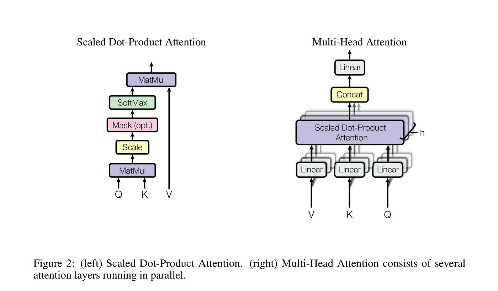

## Table of Contents

## What are Transformers in the context of machine learning?

Transformers are a type of machine learning model that have become very popular, especially in areas like understanding and generating language. They were first introduced in a paper called "Attention Is All You Need" in 2017. Unlike older models that process data step by step, transformers look at all the data at once. This makes them really good at understanding the context and relationships in data, like how words relate to each other in a sentence.

The key to transformers is something called "attention." Attention helps the model focus on different parts of the input data when it's processing it. For example, if you're translating a sentence, the model can pay more attention to the words that are most important for the translation. This is done using a formula called the attention mechanism, which can be written as $$ \text{Attention}(Q, K, V) = \text{softmax}\left(\frac{QK^T}{\sqrt{d_k}}\right)V $$. This formula helps the model weigh different parts of the input data differently, which makes it more accurate.

Transformers have been used to create big models like BERT and GPT, which can do things like answer questions, write stories, and even create images. These models have many layers, and each layer has many parts that work together to understand and generate data. Because of their power and flexibility, transformers are now used in many different areas of machine learning, from language to vision to even playing games.

## How do Transformers differ from traditional neural networks like RNNs and CNNs?

Transformers are different from traditional neural networks like Recurrent Neural Networks (RNNs) and Convolutional Neural Networks (CNNs) in how they process data. RNNs process data sequentially, which means they go through the data one step at a time, like reading a sentence word by word. This can make them slow and less good at understanding long sequences. CNNs, on the other hand, are good at processing grid-like data, like images, by applying filters to small parts of the data at a time. Transformers, however, process all the data at once, which is called parallel processing. This makes them faster and better at understanding the relationships between different parts of the data, like how words relate to each other in a sentence.

The key feature that sets transformers apart is the attention mechanism. While RNNs and CNNs have their own ways of understanding data, transformers use attention to focus on different parts of the input data. The attention mechanism can be described by the formula $$ \text{Attention}(Q, K, V) = \text{softmax}\left(\frac{QK^T}{\sqrt{d_k}}\right)V $$. This formula helps the model weigh different parts of the input data differently, allowing it to pay more attention to the most important parts. For example, when translating a sentence, a transformer can focus more on the words that are most important for the translation. This makes transformers very good at tasks like language understanding and generation, where understanding context is crucial.

## What is the attention mechanism in Transformers and why is it important?

The attention mechanism in Transformers is like a superpower that helps the model focus on the most important parts of the input data. Imagine you're reading a book and you need to understand a sentence. You might pay more attention to some words that are key to understanding the sentence's meaning. That's what the attention mechanism does, but for the model. It uses a special formula to decide which parts of the data to focus on more. The formula is $$ \text{Attention}(Q, K, V) = \text{softmax}\left(\frac{QK^T}{\sqrt{d_k}}\right)V $$. This formula helps the model weigh different parts of the input data differently, making it better at understanding context and relationships.

The attention mechanism is really important because it makes Transformers much better at tasks like understanding and generating language. Before Transformers, models like RNNs had to process data one step at a time, which could be slow and less accurate for long sequences. With attention, Transformers can look at all the data at once and focus on the most important parts. This makes them faster and more accurate, especially for tasks where understanding the relationships between different parts of the data is key. That's why Transformers have become so popular in areas like natural language processing and even beyond, like image and music generation.

## Can you explain the architecture of a basic Transformer model?

A basic Transformer model has two main parts: the encoder and the decoder. The encoder takes in the input data, like a sentence, and turns it into a format that the model can understand. It does this by breaking the sentence into pieces, like words or even parts of words, and then using something called "self-attention" to look at how these pieces relate to each other. The self-attention mechanism helps the encoder figure out which parts of the sentence are important and how they connect. This is done using the formula $$ \text{Attention}(Q, K, V) = \text{softmax}\left(\frac{QK^T}{\sqrt{d_k}}\right)V $$. After self-attention, the encoder uses a few more steps to make sure the data is ready for the decoder.

The decoder then takes the output from the encoder and uses it to create a new output, like a translated sentence. The decoder also uses self-attention, but it looks at the output it's creating to make sure it's making sense. It also uses something called "cross-attention" to look at the encoder's output and make sure the new output matches the input. Just like the encoder, the decoder uses the attention formula $$ \text{Attention}(Q, K, V) = \text{softmax}\left(\frac{QK^T}{\sqrt{d_k}}\right)V $$ to focus on the important parts. Both the encoder and decoder have multiple layers, and each layer has many smaller parts that work together to understand and generate the data. This whole process helps the Transformer model be really good at tasks like translating languages or answering questions.

## What is BERT and how does it use the Transformer architecture?

BERT, which stands for Bidirectional Encoder Representations from Transformers, is a special kind of language model that uses the Transformer architecture. It's called "bidirectional" because it looks at all the words in a sentence at the same time, not just from left to right or right to left. This helps BERT understand the context of words better. BERT uses only the encoder part of the Transformer, which means it's really good at understanding and processing text. It does this by using something called "self-attention," which helps it focus on different parts of the sentence. The self-attention mechanism is done using the formula $$ \text{Attention}(Q, K, V) = \text{softmax}\left(\frac{QK^T}{\sqrt{d_k}}\right)V $$. This formula helps BERT weigh different parts of the input text differently, making it better at understanding context.

BERT is trained on a huge amount of text data, and it can do many different language tasks, like answering questions or filling in missing words. When you want to use BERT for a specific task, you can take the model and fine-tune it, which means you train it a little more with data that's specific to your task. This makes BERT very flexible and useful for many different kinds of language understanding jobs. Because it uses the Transformer architecture, BERT can process all the words in a sentence at once, which makes it faster and more accurate than older models that process words one at a time.

## How does GPT-3 utilize the Transformer model and what makes it unique?

GPT-3, which stands for Generative Pre-trained Transformer 3, is a big language model that uses the Transformer architecture. It's made up of many layers of Transformers, and each layer uses something called "self-attention" to understand how different parts of the text are connected. The self-attention mechanism helps GPT-3 focus on the important parts of the text, and it uses the formula $$ \text{Attention}(Q, K, V) = \text{softmax}\left(\frac{QK^T}{\sqrt{d_k}}\right)V $$ to do this. GPT-3 is trained on a huge amount of text data, which helps it learn how to understand and generate human-like text.

What makes GPT-3 unique is that it's much bigger and more powerful than other language models. It has 175 billion parameters, which are like the knobs and dials that the model uses to understand and generate text. This makes GPT-3 very good at many different language tasks, like answering questions, writing stories, and even translating languages. Because it's so big and powerful, GPT-3 can do things that other models can't, like generating long pieces of text that sound like they were written by a human.

## What are some of the key applications of Transformer models in natural language processing?

Transformer models have become really important in natural language processing (NLP) because they're good at understanding and generating text. One big use of Transformers is in machine translation. Models like Google's Transformer help translate text from one language to another by looking at all the words in a sentence at the same time. They use something called "attention" to focus on the important words, which helps them make better translations. The attention mechanism can be described by the formula $$ \text{Attention}(Q, K, V) = \text{softmax}\left(\frac{QK^T}{\sqrt{d_k}}\right)V $$. This formula helps the model weigh different parts of the input text differently, making the translations more accurate.

Another key application of Transformers is in text generation. Models like GPT-3 can create new text that sounds like it was written by a human. They do this by learning from a huge amount of text data and then using the Transformer's attention mechanism to generate new sentences or even whole stories. This can be used for things like writing news articles, creating chatbots that can talk to people, or even helping writers come up with new ideas. Transformers are also used in tasks like sentiment analysis, where they can figure out if a piece of text is positive, negative, or neutral, and in question-answering systems, where they can understand a question and find the right answer from a big set of information.

## How do models like T5 and BART use Transformers for sequence-to-sequence tasks?

T5 and BART are two models that use Transformers to do sequence-to-sequence tasks, like translating text from one language to another or summarizing long pieces of text. They both use the Transformer's attention mechanism, which helps them focus on the important parts of the input text. The attention mechanism can be described by the formula $$ \text{Attention}(Q, K, V) = \text{softmax}\left(\frac{QK^T}{\sqrt{d_k}}\right)V $$. This formula helps the model weigh different parts of the input text differently, making the output more accurate. T5 and BART are trained on a lot of text data, which helps them learn how to understand and generate text well.

T5, which stands for Text-to-Text Transfer Transformer, treats every task as a text-to-text problem. This means it can take in text and output text, no matter what the task is. For example, if you want to translate a sentence, you give T5 the sentence and tell it to translate, and it will give you the translated sentence. BART, which stands for Bidirectional and Auto-Regressive Transformers, is a bit different. It's good at tasks like text summarization because it can look at the whole input text at once and then generate a shorter version of it. Both models use the Transformer's ability to process all the text at once, which makes them faster and more accurate than older models that process text one word at a time.

## What advancements have been made in Transformer models for handling longer sequences, such as Longformer and Transformer-XL?

Longformer and Transformer-XL are two models that help Transformers handle longer sequences of text better. The main problem with regular Transformers is that they can only look at a certain amount of text at once. This makes it hard for them to understand long documents or conversations. Longformer solves this by using a special kind of attention called "sliding window attention." This lets the model focus on a small part of the text at a time while still being able to see the whole document. Transformer-XL uses a different trick called "recurrence." It remembers what it saw before and uses that information to understand the next part of the text. Both of these methods help the models handle longer sequences better.

Longformer's sliding window attention works by looking at a small part of the text, like a few words, and then moving the window to the next part of the text. This way, the model can see the whole document without using too much memory. The attention mechanism in Longformer can be described by the formula $$ \text{Attention}(Q, K, V) = \text{softmax}\left(\frac{QK^T}{\sqrt{d_k}}\right)V $$, but it applies it in a special way to handle longer sequences. Transformer-XL's recurrence helps it keep track of what it has seen before. It does this by using a special memory called a "hidden state" that carries information from one part of the text to the next. This makes it easier for the model to understand long sequences because it can remember what happened earlier in the text.

## How do multilingual Transformer models like mT5 and XLM handle multiple languages?

Multilingual Transformer models like mT5 and XLM are designed to understand and work with many different languages. They do this by being trained on a lot of text from many languages at the same time. This helps them learn how words and sentences work in different languages. For example, mT5, which stands for multilingual T5, uses the same idea as the regular T5 model but on a bigger scale with more languages. It treats every task as a text-to-text problem, so it can translate from one language to another, summarize text, and even answer questions in different languages. The attention mechanism, which helps the model focus on important parts of the text, is described by the formula $$ \text{Attention}(Q, K, V) = \text{softmax}\left(\frac{QK^T}{\sqrt{d_k}}\right)V $$. This formula helps the model understand the relationships between words in different languages.

XLM, which stands for Cross-lingual Language Model, also uses the Transformer's attention mechanism to handle multiple languages. It's trained to understand the connections between different languages by using a technique called "cross-lingual pretraining." This means it learns from text in different languages at the same time, which helps it figure out how to translate and understand text across languages. Both mT5 and XLM are good at tasks like machine translation because they can look at all the words in a sentence at once, no matter what language they're in. This makes them faster and more accurate than older models that had to process text one word at a time.

## What are some of the latest innovations in Transformer architectures, such as the Switch Transformer and the Reformer?

The Switch Transformer is a new kind of Transformer model that tries to make big models work faster and use less memory. It does this by using something called "mixture of experts." Instead of making every part of the model do the same thing, the Switch Transformer has different parts, called experts, that each do a different job. When it gets new data, the model decides which expert should work on it. This means the model can be bigger and more powerful without getting too slow. The attention mechanism in the Switch Transformer still uses the formula $$ \text{Attention}(Q, K, V) = \text{softmax}\left(\frac{QK^T}{\sqrt{d_k}}\right)V $$, but it applies it in a special way to make the model work better.

The Reformer is another new Transformer model that tries to handle long sequences of text better. It does this by using a special kind of attention called "reversible layers" and "locality-sensitive hashing." Reversible layers help the model use less memory by letting it go back and forth between different parts of the text without saving everything. Locality-sensitive hashing helps the model focus on the important parts of the text without looking at everything at once. This makes the Reformer faster and able to handle longer sequences than regular Transformers. Both the Switch Transformer and the Reformer show how people are trying to make Transformer models better and more useful for different kinds of tasks.

## How can one fine-tune a pre-trained Transformer model for a specific task, and what are the best practices involved?

Fine-tuning a pre-trained Transformer model for a specific task means taking a model that's already been trained on a lot of data and teaching it a bit more to do something new. You start with a model like BERT or GPT-3, which knows a lot about language already. Then, you give it new data that's specific to your task, like translating sentences or answering questions. You train the model on this new data, but you don't start from scratch. Instead, you adjust the model's "parameters," which are like the knobs and dials that control how it works. This helps the model learn the new task faster and better than if you started from zero. The attention mechanism, which helps the model focus on important parts of the text, is still used during fine-tuning and can be described by the formula $$ \text{Attention}(Q, K, V) = \text{softmax}\left(\frac{QK^T}{\sqrt{d_k}}\right)V $$.

When fine-tuning a Transformer model, it's important to follow some best practices to make sure the model works well. First, you should use a small learning rate, which means you make small changes to the model's parameters at a time. This helps the model learn the new task without forgetting what it already knows. Second, you should use a good dataset for fine-tuning. The data should be similar to what the model will see when it's doing the new task. This helps the model learn the right things. Third, you should keep an eye on how the model is doing during fine-tuning. You can do this by checking its performance on a separate set of data that it hasn't seen before. This helps you know when to stop fine-tuning so the model doesn't start to do worse. By following these best practices, you can make sure your fine-tuned Transformer model works well for your specific task.