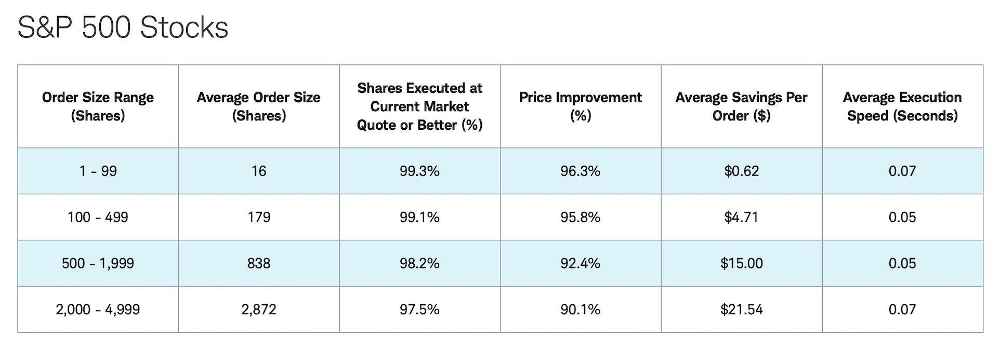

In today's fast-paced digital trading world, choosing the right online broker is more crucial than ever. Investors have shifted their focus from merely seeking brokers offering low-cost trades to scrutinizing the quality of trade execution. Execution quality is a critical aspect of trading, referring to the efficiency and precision with which trade orders are completed. This change in focus is largely driven by the rise of algorithmic trading, where trades are executed by automated computer algorithms that process market data at incredibly high speeds, fundamentally altering the landscape of trading strategies.

Algorithmic trading and complex broker strategies have redefined the metrics by which brokers are evaluated, placing a premium on factors such as order execution speed, price improvement, and minimal slippage. Execution quality has emerged as a vital consideration because high-frequency and algorithmic traders often depend on executing large volumes of trades in milliseconds to capitalize on market inefficiencies.



In this article, the nuances of execution quality in online brokers will be analyzed to understand how it impacts modern trading strategies, particularly in automated and algorithmic environments. By examining the components of execution quality and the role brokers play, investors can gain insight into optimizing their trading outcomes in today’s rapid trading ecosystem.

## Table of Contents

## Understanding Execution Quality

Execution quality is a critical metric in evaluating the effectiveness of online brokers. It is essentially determined by how swiftly and accurately trade orders are fulfilled, impacting overall trading performance. Key elements of execution quality include price improvement, which refers to obtaining a better price for a trade compared to the quoted market price, and order routing, which is the process of selecting pathways to execute trades. An efficient order routing strategy ensures that orders are executed at the best available prices across different market venues, thus enhancing overall execution quality.

Fill rates, another vital component, indicate the percentage of trades completed at the desired price or within an acceptable range. Higher fill rates contribute positively to execution quality as they reflect the broker's ability to meet trader expectations. Proper execution reduces slippage, where the final execution price is different from the intended price at the time the order was placed, and this is especially significant in fast-moving markets.

Execution quality is also governed by regulatory frameworks. Regulation National Market System (Regulation NMS), implemented by the U.S. Securities and Exchange Commission (SEC), is a pivotal standard that mandates fair and equitable access to quotations. It ensures that trading venues offer the best price for an order and impose strict rules on order-handling to avoid priority violations. Similarly, SEC Rule 606 requires brokers to disclose their order routing practices and the quality of executions in quarterly reports. These regulations provide transparency and protect investor interests by holding brokers accountable for their execution practices.

To further promote transparency, prominent brokers like Fidelity and Charles Schwab regularly publish detailed execution quality reports. These disclosures allow traders to assess the broker's performance in terms of speed, price improvement, and other execution metrics. By analyzing these reports, investors can make informed decisions when selecting a broker that aligns with their trading needs.

Ultimately, understanding execution quality and its components helps traders recognize the intricate processes that occur behind each trade. This understanding is particularly advantageous in algorithmic and automated trading strategies, where the speed and accuracy of executions can substantially influence profitability. As traders depend more on technological advancements, the pressure on brokers to provide superior execution quality continues to grow.

## The Role of Online Brokers

Online brokers function as pivotal intermediaries that facilitate the execution of trades between traders and financial markets. Their primary responsibility is to ensure that these trades occur at the optimal price and with minimal delay. This execution capability is crucial, especially in fast-paced markets where even minor timing differences can significantly impact trade outcomes.

Modern brokers are increasingly evaluated based on the robustness of their technological capabilities, the sophistication of their trading platforms, and the effectiveness of their execution strategies. Advanced technology allows brokers to process high volumes of trades swiftly and accurately, maintaining competitive advantage in an industry where speed and precision are paramount.

A critical component of a broker's operational model involves their approach to order execution, which can vary significantly. Some brokers engage in the practice of accepting payment for order flow, where they receive compensation from third parties to route orders through specific channels. This model can introduce potential conflicts of interest, as it may prioritize the broker's revenue over achieving the best possible execution for the client.

Alternatively, other brokers prioritize price improvement. This strategy focuses on executing trades at prices better than the current market quote, thereby enhancing the value received by the trader. Price improvement is a key metric for evaluating broker performance, as it directly contributes to the trader's bottom line.

For online brokers, maintaining transparency about their execution practices is essential to [earning](/wiki/earning-announcement) and keeping client trust. This transparency involves disclosing how trades are routed and executed, as well as any potential conflicts of interest that may arise from payment for order flow arrangements. By clearly communicating their strategies and continuously refining their technological infrastructures, brokers can deliver high-quality execution services that meet the diverse needs of modern traders.

## Algorithmic Trading and Broker Strategy

Algorithmic trading employs automated algorithms to execute trades at a speed and frequency that human traders cannot match. The effectiveness of these trading systems depends substantially on the quality of execution provided by brokers. A poorly executed trade could negate the strategic advantages of an algorithm, underscoring the importance of selecting brokers adept at handling such sophisticated operations.

The performance of trading algorithms is intricately linked to how brokers manage numerous aspects of trade execution. Key elements include latency, order execution speed, and the ability to process a large [volume](/wiki/volume-trading-strategy) of trades without significant delays or errors. A broker capable of minimizing latency and offering superior execution speed enables traders to capitalize on minimal price changes, essential for high-frequency trading ([HFT](/wiki/high-frequency-trading-strategies)) strategies.

Market-making and [arbitrage](/wiki/arbitrage) strategies, two common [algorithmic trading](/wiki/algorithmic-trading) methods, require exceptionally high execution quality. Market-making strategies involve the continuous submission of bid and offer quotes to capture the spread between them. Here, milliseconds can influence profitability, meaning trades must be executed with minimal delay. Efficient brokers provide the technical infrastructure necessary to maintain a presence on both sides of a market for prolonged periods, maximizing the difference between buying and selling prices.

Arbitrage strategies take advantage of price discrepancies across different markets or instruments. These strategies operate on very slim margins, capitalizing on short-lived opportunities before markets self-correct. Successful execution depends on rapid and precise order management, as even fractional delays may render the strategy inefficient due to the swift market price adjustments that can negate the anticipated gains.

Brokers who specialize in catering to algorithmic traders often offer advanced trading platforms with low latency connections and robust APIs (Application Programming Interfaces) that allow seamless integration with traders' systems. Such infrastructure supports immediate execution of algorithm-triggered orders, which is essential for maintaining the efficacy of [quantitative trading](/wiki/quantitative-trading) models. This capability can be partly quantified by metrics like average execution speed, extent of price slippage, and the frequency of price improvements upon execution, all critical parameters for traders focused on algorithmic strategies.

In conclusion, for algorithmic traders looking to maintain or enhance their competitive edge, the partnership with brokers offering top-tier execution quality is essential. The ability to conduct trades at optimal speeds with minimal latency empowers traders to unlock the full potential of their algorithmic strategies and can materially impact their trading outcomes.

## Impact of Execution Quality on Returns

Poor execution quality significantly impacts trading returns, primarily through increased costs and diminished profitability. Execution quality encompasses the speed and precision with which trades are finalized, and insufficient execution can lead to delays, slippage, and ultimately higher transaction costs. The repercussions of poor execution are particularly pronounced in large volume trades, where even minor delays or price slippage can accumulate into substantial financial losses. 

For instance, consider a scenario where a trader is executing a substantial volume of shares. If the broker's execution results in a price slippage of just $0.01 per share on 10,000 shares, the additional cost to the trader is $100. In high-frequency trading environments, where trades are executed rapidly and frequently, these small discrepancies can quickly erode profit margins.

Investors can optimize returns by thoroughly understanding and assessing the execution quality provided by their brokers. It is essential to examine execution metrics such as speed, average price improvement, and fill rates. Comparing these [statistics](/wiki/bayesian-statistics) can illuminate significant differences in potential savings across various brokers. For instance, a broker that consistently offers price improvement can result in tangible savings over time, directly benefiting an investor's bottom line.

Quantifying the impact of execution quality can also be approached with statistical analysis. By comparing execution statistics across different brokers, investors might assess potential savings using metrics like the mean price improvement per trade:

$$
\text{Mean Price Improvement} = \frac{\sum_{i=1}^{n} (\text{Price Before Execution} - \text{Price After Execution})}{n}
$$

Where $n$ represents the number of trades executed. A higher mean price improvement value indicates better execution quality, which can translate into significant savings, especially over a large volume of trades. 

Moreover, technologies like [machine learning](/wiki/machine-learning) can aid in predicting the impact of execution quality on returns by analyzing historical trade data to identify patterns and anomalies in trade execution. Below is a simple Python snippet that demonstrates how an investor might use historical trade data to ascertain the potential impact of execution quality:

```python
import numpy as np

# Historical trade prices before and after execution
price_before_execution = np.array([100.5, 101.0, 102.0, 100.8, 101.5])
price_after_execution = np.array([100.4, 100.9, 101.9, 100.7, 101.4])

# Calculating price improvement
price_improvement = price_before_execution - price_after_execution

# Calculating mean price improvement
mean_price_improvement = np.mean(price_improvement)

print(f"Mean Price Improvement: {mean_price_improvement:.2f}")
```

In conclusion, execution quality is a critical determinant of trading efficiency. High execution quality leads to more favorable trading conditions, thus enhancing return potential. Investors must evaluate and choose brokers offering superior execution capabilities to maximize the profitability of their trading strategies.

## Selecting a Broker for Algorithmic Trading

When choosing a broker for algorithmic trading, it is crucial to examine specific criteria beyond just trading costs and commissions to ensure the chosen broker aligns with the sophisticated needs of algorithmic trading strategies. One of the primary considerations should be the execution metrics offered by the broker. These metrics provide insights into the speed and quality of trade execution, including aspects like fill rates and slippage. Higher execution quality can lead to improved profitability, particularly important in algorithmic trading where speed and accuracy are paramount.

Platform capabilities also play a vital role. An effective trading platform should offer stability, speed, and comprehensive features such as [backtesting](/wiki/backtesting) and high-frequency trading capabilities. Additionally, the robustness of the broker’s technological infrastructure greatly impacts the efficiency of executing algorithmic trades. Brokers who invest in cutting-edge technology infrastructure typically offer reduced latency and increased reliability, which are critical factors for successful algorithmic trading.

Another essential aspect to evaluate is the broker’s order routing practices. These practices determine how trade orders are processed and can impact execution quality. Transparency in trades is also crucial, enabling traders to trust the broker and understand how orders are handled. Brokers that prioritize transparency typically publish detailed order execution statistics and follow regulatory standards like SEC Rule 606, which requires brokers to disclose their order routing practices.

For algorithmic traders, access to advanced technological tools is indispensable. Therefore, top brokers for algorithmic trading provide robust application programming interfaces (APIs) that support the seamless integration of automated trading systems. Additionally, these brokers offer high-quality data feeds that are essential for making informed trading decisions based on real-time market data. Fast execution times, facilitated by superior technological infrastructure, further enhance the potential for executing trades at optimal prices, thus offering a competitive advantage to algorithmic traders.

In summary, selecting a broker for algorithmic trading requires careful consideration of factors like execution metrics, platform capabilities, and technological infrastructure, alongside evaluating order routing practices and trade transparency. By focusing on these aspects, traders can identify brokers that support their algorithmic trading strategies through enhanced execution quality and technological support.

## Future Trends in Execution and Broker Services

The landscape of brokerage services is continually evolving with advancements in technology. A significant development is the growing demand for greater transparency in order execution and enhanced reporting standards. This movement is exemplified by the amended SEC Rule 606, which now requires brokers to provide detailed reports on the routing of customer orders and the execution quality. These reports allow institutional traders to better understand the practices of brokerage firms and ensure that trades are executed in a manner best suited to clients’ interests. Such transparency initiatives are likely to extend to retail traders, advocating for a more open and accountable trading environment.

Another transformative trend is the integration of [artificial intelligence](/wiki/ai-artificial-intelligence) (AI) and machine learning (ML) into trading platforms. These technologies are poised to significantly enhance execution quality by optimizing order routing, predicting market movements with greater accuracy, and reducing latency in trade execution. AI-driven analysis can process vast amounts of market data in real time, delivering actionable insights more swiftly than traditional methods. Brokers that leverage AI and ML technologies are anticipated to offer superior execution performance, giving them a competitive edge in catering to both retail and institutional clients.

Ongoing discussions in the regulatory sphere concern whether new mandates should enforce further disclosure and transparency regarding potential conflicts of interest within brokerage firms. Such measures could include stricter requirements for how firms manage payment for order flow (PFOF) arrangements and the influence these agreements have on order routing decisions. By addressing these issues, regulators aim to cultivate an environment where the interests of investors are consistently prioritized, thus fostering greater trust in the financial markets.

The continuous progression of technology in brokerage services is set to expand the capabilities and expectations of market participants. As transparency and reporting standards become more rigorous, and with AI and ML increasingly shaping trading strategies, the future of brokerage will likely center around creating systems that are both transparent and technologically superior. This evolution not only holds the promise of improved execution quality but also introduces new benchmarks for what investors and traders should expect from their brokerage services.

## Conclusion

Execution quality plays a critical role in today's trading landscape, especially for those utilizing algorithmic strategies. As algorithmic trading relies on rapid decision-making and execution, the precision and speed with which trades are completed can significantly influence trading outcomes and overall profitability. High execution quality minimizes the risks associated with slippage and delays, thereby optimizing returns for traders. 

Investors are encouraged to prioritize brokers based not only on cost considerations but also on the broker's ability to provide superior execution quality suited to their specific trading strategies. Brokers with advanced technological platforms and transparent execution practices offer a distinct advantage by providing reliable data, efficient order routing, and quick trade executions. An exemplary broker will not only facilitate cost-effective trades but also enhance the strategic effectiveness of algorithmic operations.

The continuous advancements in technology and transparency within the industry herald potential benefits for traders. Enhanced reporting standards and the integration of artificial intelligence and machine learning are fostering an environment where execution quality can be more accurately assessed and improved. As these innovations are implemented, traders can expect brokerage services to become increasingly sophisticated, offering even greater accuracy and speed in trade execution, thus furthering profitable trading endeavors.

## References & Further Reading

[1]: Comerton-Forde, C., & Rydge, J. (2006). ["The Influence of Market Structure on Trading Costs."](https://papers.ssrn.com/sol3/papers.cfm?abstract_id=603242) Journal of Empirical Finance, 13(2), 168-198.

[2]: Hasbrouck, J. (2009). ["Trading Costs and Returns for U.S. Equities: Estimating Effective Costs from Daily Data."](https://pages.stern.nyu.edu/~jhasbrou/Research/GibbsCurrent/HasbrouckJF.pdf) Review of Financial Studies, 22(3), 1273-1311.

[3]: Christiansen, C. (2016). ["Improving Transparency in Order Execution: Implementation of SEC Rule 606 Amendments."](https://www.sec.gov/newsroom/speeches-statements/crenshaw-statement-order-execution-quality-030624) U.S. Securities and Exchange Commission.

[4]: Aldridge, I. (2010). ["High-Frequency Trading: A Practical Guide to Algorithmic Strategies and Trading Systems."](https://onlinelibrary.wiley.com/doi/pdf/10.1002/9781119203803.fmatter) Wiley Finance.

[5]: Harris, L. (2003). ["Trading and Exchanges: Market Microstructure for Practitioners."](https://academic.oup.com/book/52292) Oxford University Press.

[6]: Gomber, P., Schweickert, U., & Theissen, E. (2015). ["Liquidity Dynamics in Fragmented Securities Markets: Evidence from the U.S. - Stock Market."](https://www.sciencedirect.com/science/article/abs/pii/S0927539815000081) European Journal of Finance, 21(7), 513-534.

[7]: Menkveld, A. J. (2013). ["Acceleration in Market Liquidity by High-Frequency Trading: Evidence from Market-Making in an ETF."](https://papers.ssrn.com/sol3/papers.cfm?abstract_id=1722924) Journal of Finance, 68(4), 1651-1690.