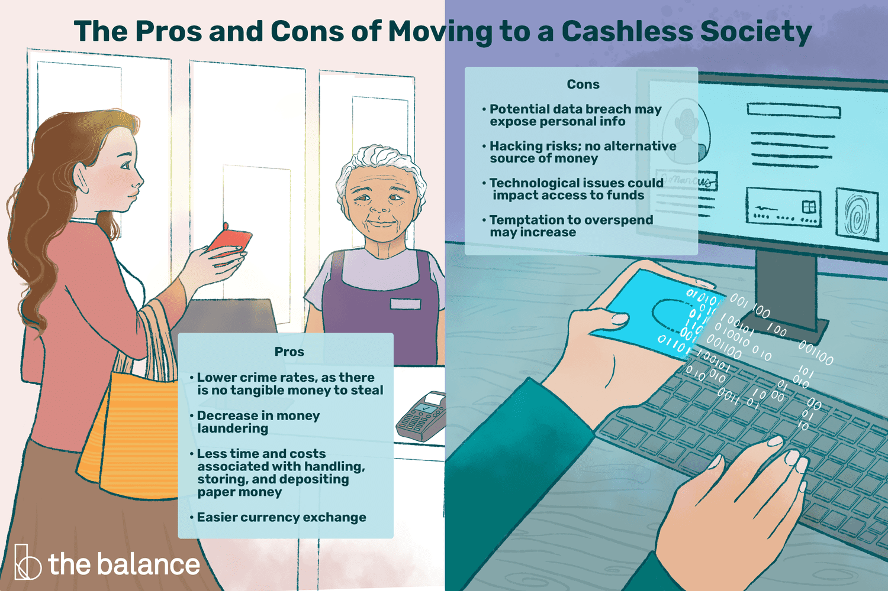

## Table of Contents

## What is a cashless society?

A cashless society is a place where people don't use physical money like coins and paper bills anymore. Instead, they use other ways to pay for things, like credit cards, debit cards, and apps on their phones. This means that all transactions, or exchanges of money, happen electronically.

In a cashless society, buying things can be easier and faster because you don't need to carry cash around. It can also be safer because there's less chance of losing money or getting robbed. But, there are some challenges too. Not everyone has access to the technology needed to make electronic payments, and some people might not trust banks or electronic systems. So, while a cashless society has many benefits, it also has some problems that need to be solved.

## What are the benefits of transitioning to a cashless society?

One big benefit of a cashless society is that it makes buying things easier and faster. You don't need to carry cash around, which means you don't have to worry about having the right amount of money when you want to buy something. Instead, you can just use your card or phone to pay. This can save time and make shopping more convenient. Also, it's easier to keep track of your spending because all your transactions are recorded electronically.

Another benefit is that a cashless society can be safer. When you don't [carry](/wiki/carry-trading) cash, you're less likely to be robbed or lose money. It's also harder for criminals to use stolen money because electronic payments can be traced. This can help reduce crime and make people feel safer. Plus, without cash, there's less need for banks to handle and store physical money, which can save them money and make their operations more efficient.

## What are the potential drawbacks of a cashless society?

One big problem with a cashless society is that not everyone has the technology to make electronic payments. Some people might not have a bank account, a credit card, or a smartphone. This can make it hard for them to buy things or get paid. It can also leave them out of the economy, which isn't fair. Plus, some people might not trust banks or electronic systems. They might worry about their personal information being stolen or their money being taken without their permission.

Another issue is that electronic payments can sometimes fail. If the internet goes down or there's a problem with the payment system, people might not be able to buy things they need. This can be a big problem in emergencies. Also, without cash, it can be harder to give money to people who need help, like homeless people or street performers. Cash is easy to give and receive, but electronic payments can be more complicated. So, while a cashless society has many benefits, it also has some big challenges that need to be thought about.

## How do digital payment systems work?

Digital payment systems let you pay for things without using cash. Instead of handing over money, you use a card or an app on your phone to send money electronically. When you want to buy something, you can tap, swipe, or scan your card or phone at a payment terminal. The money is then taken from your bank account or charged to your credit card and sent to the seller's account. This all happens quickly and securely over the internet or through a special network.

There are different types of digital payment systems. Some use cards, like debit or credit cards, which are linked to your bank account. Others use apps on your phone, like Apple Pay or PayPal, which let you send money to other people or businesses. These apps often use special codes or passwords to keep your money safe. When you use these systems, the payment information is encrypted, which means it's turned into a secret code that only the right people can read. This helps keep your money and personal information safe from thieves.

## What are some examples of countries that are moving towards a cashless society?

Sweden is one country that is moving towards a cashless society. Many people in Sweden use cards or apps on their phones to pay for things instead of cash. Stores, restaurants, and even some churches accept electronic payments. The government and banks are helping this change happen by making it easy to use digital payments. But, some people in Sweden worry about what will happen if the electronic systems stop working or if they can't use them.

Another country moving towards a cashless society is China. In China, many people use apps like WeChat Pay and Alipay to buy things. These apps let people pay for everything from groceries to taxi rides with just a few taps on their phones. The government supports this change and is working to make sure everyone can use these systems. However, like in Sweden, there are concerns about privacy and what happens if the technology fails.

## What role do cryptocurrencies play in a cashless society?

Cryptocurrencies like Bitcoin and Ethereum can play a big role in a cashless society. They are digital forms of money that people can use to buy things without needing a bank. You can send cryptocurrencies to anyone with an internet connection, which makes them very convenient. They work on a special system called blockchain, which keeps track of all transactions and makes them secure. This means that people who don't trust banks or traditional payment systems might prefer to use cryptocurrencies.

However, there are some challenges with using cryptocurrencies in a cashless society. They can be hard to understand and use, especially for people who are not used to technology. The value of cryptocurrencies can also go up and down a lot, which makes them risky. Plus, not many places accept cryptocurrencies as payment yet. So, while they offer a new way to pay without cash, they need to become easier to use and more widely accepted before they can be a big part of a cashless society.

## How can businesses prepare for a transition to a cashless society?

Businesses can prepare for a cashless society by making sure they have the right technology to accept electronic payments. This means getting card readers and setting up systems like Apple Pay or PayPal. They should also train their employees on how to use these systems so they can help customers who might be new to digital payments. It's important for businesses to make sure their payment systems are safe and secure, so customers feel comfortable using them. They can do this by using encryption and other security measures to protect customer information.

Another way businesses can prepare is by thinking about how a cashless society might affect their customers. Some people might not have the technology to make electronic payments, so businesses could offer other ways to pay, like vouchers or gift cards. They should also be ready to help customers who have questions or problems with digital payments. By being patient and understanding, businesses can make the transition to a cashless society easier for everyone. This way, they can keep their customers happy and make sure they don't lose business during the change.

## What are the security concerns associated with digital payments?

One big worry with digital payments is that someone might steal your information. When you pay with a card or an app, you share personal details like your name and card number. If hackers get this information, they could use it to take your money or even steal your identity. To stop this from happening, payment systems use special codes called encryption to keep your information safe. But even with these protections, there's always a small chance that something could go wrong.

Another concern is that digital payment systems can be hacked. Hackers might try to break into the system to steal money or cause problems. This could lead to money being taken from your account without your permission. To protect against this, companies that run payment systems use strong security measures like firewalls and regular checks for problems. But if a big hack happens, it could affect a lot of people and cause a lot of trouble. So, while digital payments are usually safe, it's important to stay alert and take steps to protect yourself.

## How does a cashless society impact financial inclusion?

A cashless society can help more people join the financial world. When everything is paid for with cards or phones, people who don't have bank accounts can still use digital payment systems. This can make it easier for them to save money, get loans, and do other things that need a bank account. For example, in some countries, people can use their phones to send and receive money, even if they don't have a bank. This can help them take part in the economy and improve their lives.

But a cashless society can also make it harder for some people to be included. Not everyone has the technology to make digital payments. Some people might not have a smartphone or a way to connect to the internet. This can leave them out of the economy because they can't buy things or get paid. Also, some people might not trust banks or digital systems, so they might not want to use them. So, while a cashless society can help with financial inclusion, it can also create new problems that need to be solved.

## What are the regulatory challenges in implementing a cashless society?

One big challenge in making a cashless society is figuring out the rules. Governments need to make sure that digital payment systems are safe and fair for everyone. They have to set up laws to stop fraud and protect people's money and information. But making these rules can be hard because technology changes fast. What works today might not work tomorrow, so the rules need to be flexible. Also, different countries might have different ideas about what's important, which can make it hard to agree on rules that work everywhere.

Another challenge is making sure that everyone can use digital payments. Some people might not have the technology or the knowledge to use these systems. Governments need to find ways to help these people so they're not left out. This might mean giving them free phones or teaching them how to use digital payments. But doing this can be expensive and take a lot of time. Plus, there's the problem of privacy. People might worry about their information being shared or used in ways they don't like. So, governments need to balance the need for safety and fairness with the need to protect people's privacy.

## How can the transition to a cashless society be managed to minimize disruption?

To make the switch to a cashless society easier and less disruptive, it's important to take things slowly and help everyone along the way. Businesses and governments can start by making sure that digital payment systems are easy to use and available to everyone. They can set up training programs to teach people how to use these systems, and offer support for those who might struggle with the technology. By doing this, they can make sure that no one is left behind as we move away from cash.

Another key part of managing the transition is to keep cash as an option for as long as possible. This way, people who are not ready to switch to digital payments can still buy things and get paid. Over time, as more people get used to digital payments, the use of cash can slowly decrease. By being patient and understanding, and by making sure that everyone's needs are met, the move to a cashless society can happen smoothly and with less disruption.

## What future trends can we expect in the evolution towards a cashless society?

In the future, we can expect more and more people to use digital payments instead of cash. This is because technology keeps getting better and easier to use. More businesses will start accepting payments through apps on phones and other digital ways. We might also see new kinds of digital money, like cryptocurrencies, become more popular. Governments and banks will work together to make sure these new systems are safe and easy for everyone to use.

Another trend we might see is more focus on making sure everyone can join in a cashless society. This means helping people who don't have the technology or knowledge to use digital payments. Governments might give out free phones or set up programs to teach people how to use these systems. They will also need to make rules to keep digital payments safe and fair. By doing these things, they can make sure that moving to a cashless society helps everyone and doesn't leave anyone behind.

## References & Further Reading

[1]: Arvidsson, N. (2019). ["The cashless society: Consumer acceptance of payments going digital."](https://openlibrary.org/books/OL31369729M/Building_a_Cashless_Society) Stockholm School of Economics.

[2]: KPMG (2017). ["The rise of digital banking in China: EFMA."](https://kpmg.com/kpmg-us/content/dam/kpmg/pdf/2024/digital-banking-navigating-the-unknown-unexpected-on-the-path-to-resilient-growth.pdf) Retrieved from KPMG.

[3]: Lopez de Prado, M. (2018). ["Advances in Financial Machine Learning."](https://www.amazon.com/Advances-Financial-Machine-Learning-Marcos/dp/1119482089) John Wiley & Sons.

[4]: Chan, E. P. (2008). ["Quantitative Trading: How to Build Your Own Algorithmic Trading Business."](https://github.com/egorpe/EPChan-QuantitativeTrading/blob/master/example7_6.m) John Wiley & Sons.

[5]: Jansen, S. (2020). ["Machine Learning for Algorithmic Trading: Predictive models to extract signals from market and alternative data for systematic trading strategies with Python."](https://www.amazon.com/Machine-Learning-Algorithmic-Trading-alternative/dp/1839217715) Packt Publishing.

[6]: Pew Research Center (2021). ["Internet/Broadband Fact Sheet."](https://www.pewresearch.org/internet/fact-sheet/internet-broadband/) 

[7]: Aronson, D. R. (2007). ["Evidence-Based Technical Analysis: Applying the Scientific Method and Statistical Inference to Trading Signals."](https://onlinelibrary.wiley.com/doi/book/10.1002/9781118268315) John Wiley & Sons.