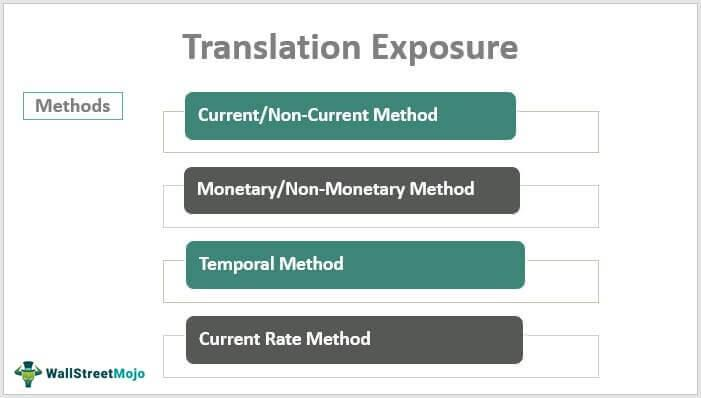

## Table of Contents

## What is translation exposure in finance?

Translation exposure in finance refers to the risk that a company's financial statements can be affected by changes in currency exchange rates. When a company operates in multiple countries, it must convert the financial results from foreign operations into its home currency for reporting purposes. If the exchange rates change, the value of the foreign earnings can increase or decrease, impacting the company's overall financial performance as reported in its home currency.

For example, if a U.S. company has a subsidiary in Europe, and the euro weakens against the dollar, the value of the subsidiary's earnings in dollars will decrease when translated back to the U.S. company's financial statements. This can make the company appear less profitable than it actually is in its local market. Managing translation exposure is important for multinational companies to provide a more accurate picture of their financial health and to minimize the impact of currency fluctuations on their reported earnings.

## How does translation exposure differ from transaction and economic exposure?

Translation exposure, transaction exposure, and economic exposure are three types of foreign exchange risks that companies face when they operate internationally. Translation exposure happens when a company needs to convert its foreign earnings into its home currency for financial reporting. This can make the company's profits look different because of changes in exchange rates, even though the actual business performance hasn't changed. It's all about how the numbers look on paper.

Transaction exposure is different because it deals with real money movements. It happens when a company buys or sells goods or services in a foreign currency. If the exchange rate changes between the time a deal is made and when the payment is settled, the company might end up paying more or receiving less money than expected. This can directly affect the company's cash flow and profits.

Economic exposure is the broadest type of foreign exchange risk. It looks at how changes in exchange rates can affect a company's overall market value and future earnings. This includes not just current transactions but also how competitive the company is in different markets, how much it costs to produce goods, and how much customers are willing to pay. Economic exposure can impact a company's long-term strategy and planning.

## What are the main causes of translation exposure?

Translation exposure happens because companies that work in different countries need to change their money from one currency to another to make their financial reports. When a company has businesses in other countries, it earns money in those countries' currencies. But to show how much money it made in its home country's financial reports, it has to convert that foreign money into its home currency. If the exchange rate between the two currencies changes, the amount of money shown in the financial reports can be different from what it was in the foreign country.

The main reason for translation exposure is that exchange rates keep changing. For example, if a U.S. company has a business in Japan, it earns money in yen. If the yen gets weaker compared to the dollar, the amount of dollars the company reports will be less, even though the amount of yen it earned didn't change. This can make the company look like it made less money than it actually did. Companies can't control exchange rates, so they have to find ways to deal with this kind of exposure to make their financial reports more accurate.

## Can you explain how translation exposure affects a company's financial statements?

Translation exposure affects a company's financial statements by changing the value of its foreign earnings when they are converted into the home currency. When a company has businesses in other countries, it earns money in those countries' currencies. To report these earnings in its home country's financial statements, the company has to convert the foreign money into its home currency. If the exchange rate between the two currencies changes, the amount of money shown in the financial statements can be different from what it was in the foreign country. For example, if a U.S. company has a business in Europe and the euro gets weaker compared to the dollar, the amount of dollars the company reports will be less, even though the amount of euros it earned didn't change. This can make the company look like it made less money than it actually did.

This change in reported earnings can affect how investors and analysts see the company's performance. If the home currency gets stronger, the foreign earnings will look smaller when converted, which might make the company's profits seem lower than they really are. On the other hand, if the home currency gets weaker, the foreign earnings will look bigger when converted, which might make the company's profits seem higher. This can lead to confusion and misinterpretation of the company's true financial health. Companies often use different methods and strategies to manage translation exposure and try to make their financial statements more accurate and reliable.

## What are some common methods used to measure translation exposure?

To measure translation exposure, companies often use a method called the current rate method. This method involves converting all foreign currency financial statement items into the home currency using the exchange rate that is current at the end of the reporting period. This means that if a U.S. company has a business in Japan, it would convert the yen earnings into dollars using the exchange rate on the last day of the reporting period. This method can show big changes in the company's financial statements if the exchange rate changes a lot, but it gives a clear picture of what the foreign earnings are worth in the home currency at that specific time.

Another common method is the temporal method, which is a bit more complicated. With this method, different items on the financial statements are converted using different exchange rates. For example, some items like inventory might be converted using the exchange rate from when they were bought, while other items like cash might be converted using the current exchange rate. This method can make the financial statements look more stable because it doesn't change as much with the current exchange rate, but it can also be harder to understand and explain to investors. Both methods help companies figure out how much translation exposure they have and plan how to manage it.

## How can a company manage or hedge against translation exposure?

A company can manage translation exposure by using different strategies to make its financial reports more stable. One way is to use something called a balance sheet hedge. This means the company tries to match its foreign assets with its foreign liabilities. For example, if a U.S. company has a business in Europe, it can borrow money in euros to match the value of its European assets. This way, if the euro gets weaker, the value of the assets and the liabilities will both go down by the same amount, so the company's financial reports won't change as much.

Another way to manage translation exposure is by using financial instruments like forward contracts or currency swaps. A forward contract lets a company agree to exchange money at a certain rate in the future, which can help protect against changes in the exchange rate. A currency swap is when two companies agree to exchange money in different currencies for a certain time, which can also help balance out the effects of changing exchange rates. By using these tools, a company can make its financial reports more predictable and easier for investors to understand.

## What role do foreign currency translation adjustments play in assessing translation exposure?

Foreign currency translation adjustments are important when a company tries to figure out how much translation exposure it has. When a company has businesses in other countries, it has to change the money it earns in those countries into its home currency to make its financial reports. If the exchange rate changes, the amount of money shown in the financial reports can be different from what it was in the foreign country. The difference between the original foreign currency amount and the amount after it's changed into the home currency is called a foreign currency translation adjustment. This adjustment shows how much the company's financial reports have changed because of the exchange rate.

These adjustments help the company understand how much its financial reports might change in the future because of translation exposure. By looking at these adjustments, the company can see if its profits look smaller or bigger just because of changes in the exchange rate, not because of how well its businesses are doing. This helps the company plan how to manage its translation exposure, like using balance sheet hedges or financial instruments like forward contracts or currency swaps. By doing this, the company can make its financial reports more stable and easier for investors to understand.

## How do different accounting standards (e.g., IFRS vs. GAAP) impact the treatment of translation exposure?

Different accounting standards like IFRS (International Financial Reporting Standards) and GAAP (Generally Accepted Accounting Principles) can affect how companies deal with translation exposure. IFRS uses the current rate method for translating foreign currency financial statements. This means all assets and liabilities are converted using the exchange rate at the end of the reporting period. Any gains or losses from these translations are shown in a separate part of the equity section of the balance sheet, called "other comprehensive income." This way, the changes in exchange rates don't directly affect the company's reported profit or loss, but they still show up in the financial statements.

On the other hand, GAAP allows for two methods: the current rate method and the temporal method. The current rate method works the same way as in IFRS, but the temporal method is different. With the temporal method, different items on the financial statements are converted using different exchange rates. For example, some items like inventory might be converted using the exchange rate from when they were bought, while other items like cash might be converted using the current exchange rate. The gains or losses from these translations can affect the company's reported profit or loss directly, which can make the financial statements look more volatile. Because of these differences, companies following GAAP might show more ups and downs in their financial reports due to translation exposure than companies following IFRS.

## What are the long-term strategic implications of translation exposure for multinational corporations?

Translation exposure can have big effects on how multinational corporations plan for the future. When a company has businesses in different countries, it has to change the money it earns in those countries into its home currency to make its financial reports. If the exchange rate changes a lot, the company's profits can look very different from one year to the next, even if the business is doing well. This can make it hard for the company to plan long-term projects or investments because the financial reports might not show a clear picture of how the company is really doing. The company might decide to be more careful with its money or change its plans based on what the financial reports show, even if the changes are just because of the exchange rate.

To deal with these long-term effects, companies might use different strategies to manage translation exposure. They might try to balance their foreign assets and liabilities so that changes in the exchange rate don't affect their financial reports as much. They might also use financial tools like forward contracts or currency swaps to protect against big changes in the exchange rate. By doing this, the company can make its financial reports more stable and easier to understand, which can help with long-term planning. This way, the company can focus on growing its business and making smart decisions without worrying too much about how exchange rates might change its financial reports.

## Can you discuss a real-world example where translation exposure significantly impacted a company's financial performance?

A good example of translation exposure affecting a company's financial performance is what happened to Coca-Cola in 2015. Coca-Cola earns a lot of its money from businesses all over the world, so it has to change the money it earns in other countries into dollars to make its financial reports. In 2015, the U.S. dollar got a lot stronger compared to other currencies. This meant that when Coca-Cola changed its foreign earnings into dollars, the amount of dollars it reported was a lot less than before, even though the company was still doing well in those other countries. Because of this, Coca-Cola's profits looked smaller than they really were, which worried some investors.

To deal with this, Coca-Cola used different strategies to manage its translation exposure. It tried to balance its foreign assets and liabilities so that changes in the exchange rate wouldn't affect its financial reports as much. It also used financial tools like forward contracts to protect against big changes in the exchange rate. By doing this, Coca-Cola was able to make its financial reports more stable and easier for investors to understand. This helped the company focus on growing its business and making smart decisions without worrying too much about how exchange rates might change its financial reports.

## How do fluctuations in exchange rates influence the decision-making process regarding translation exposure?

Fluctuations in exchange rates can really affect how a company makes decisions about translation exposure. When a company has businesses in different countries, it has to change the money it earns in those countries into its home currency to make its financial reports. If the exchange rate changes a lot, the company's profits can look very different from one year to the next. This can make it hard for the company to plan long-term projects or investments because the financial reports might not show a clear picture of how the company is really doing. The company might decide to be more careful with its money or change its plans based on what the financial reports show, even if the changes are just because of the exchange rate.

To deal with these fluctuations, companies might use different strategies to manage translation exposure. They might try to balance their foreign assets and liabilities so that changes in the exchange rate don't affect their financial reports as much. They might also use financial tools like forward contracts or currency swaps to protect against big changes in the exchange rate. By doing this, the company can make its financial reports more stable and easier to understand, which can help with long-term planning. This way, the company can focus on growing its business and making smart decisions without worrying too much about how exchange rates might change its financial reports.

## What advanced financial instruments or strategies can be employed to mitigate the risks associated with translation exposure?

To manage translation exposure, companies can use advanced financial instruments like currency options and currency futures. A currency option gives a company the right, but not the obligation, to exchange money at a certain rate in the future. This can help protect against big changes in the exchange rate because the company can choose to use the option if the rate gets worse, or not use it if the rate stays good. Currency futures are similar, but they are a promise to exchange money at a certain rate in the future. By using these tools, a company can make its financial reports more predictable and easier for investors to understand, even if the exchange rate changes a lot.

Another strategy is to use netting, which means the company tries to balance its foreign currency cash flows. For example, if a company has businesses in Europe and Asia, it can use the money it earns in Europe to pay for things it needs to buy in Asia. This way, the company doesn't have to change as much money into its home currency, so changes in the exchange rate won't affect its financial reports as much. By using netting and other advanced strategies, a company can manage translation exposure better and focus on growing its business without worrying too much about how exchange rates might change its financial reports.

## References & Further Reading

[1]: Doupnik, T., & Perera, H. (2014). ["International Accounting,"](https://books.google.com/books/about/Ebook_International_Accounting.html?id=F6RvEAAAQBAJ) McGraw-Hill Education.

[2]: Eun, C. S., Resnick, B. G., & Sabherwal, S. (2015). ["International Financial Management,"](https://www.mheducation.com/highered/product/international-financial-management-eun-resnick/M9781264413096.html) McGraw-Hill Education.

[3]: Hull, J. C. (2018). ["Options, Futures, and Other Derivatives,"](https://www.semanticscholar.org/paper/Options%2C-Futures%2C-and-Other-Derivatives-Hull/89bdee500c8623864fc9eb7a471546aa713acc44) Pearson.

[4]: Lopez de Prado, M. (2018). ["Advances in Financial Machine Learning,"](https://www.amazon.com/Advances-Financial-Machine-Learning-Marcos/dp/1119482089) John Wiley & Sons.

[5]: Durbin, M. (2010). ["All About High-Frequency Trading,"](https://www.amazon.com/All-About-High-Frequency-Trading/dp/0071743448) McGraw-Hill Education.

[6]: Madura, J. (2020). ["International Financial Management,"](https://books.google.com/books/about/International_Financial_Management.html?id=Z3TLDwAAQBAJ) Cengage Learning.

[7]: Walsh, J. E. (2018). ["The Truth About Algorithmic Trading,"](https://www.sec.gov/files/Algo_Trading_Report_2020.pdf) Independently Published.