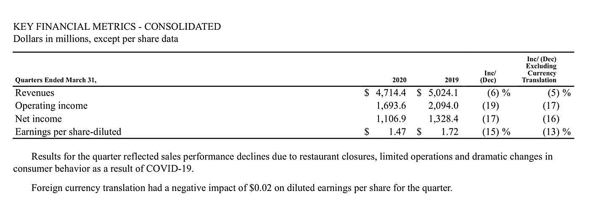

## Table of Contents

## What is translation risk?

Translation risk, also known as translation exposure, is the risk that a company's financial statements can be affected by changes in currency exchange rates. This happens when a company has operations in different countries and needs to convert the financial results from foreign currencies into its home currency for reporting purposes. If the exchange rates change, the value of the foreign earnings can increase or decrease, which impacts the overall financial performance shown in the company's reports.

For example, if a U.S. company has a subsidiary in Europe, it must convert the euros earned by the subsidiary into dollars. If the euro weakens against the dollar, the translated earnings in dollars will be lower, even if the actual earnings in euros remain the same. This can make the company's financial performance look worse than it really is. Translation risk is a concern for multinational companies because it can affect how investors and analysts view their financial health, even though it doesn't impact the actual cash flows of the business.

## How does translation risk differ from transaction risk?

Translation risk and transaction risk are two types of risks that companies face when dealing with foreign currencies, but they affect businesses in different ways. Translation risk happens when a company has to convert its financial statements from one currency to another for reporting purposes. This can change how the company's financial performance looks on paper, but it doesn't directly affect the company's cash flow. For example, if a U.S. company has a branch in Japan, it needs to convert the yen earnings into dollars. If the yen gets weaker, the dollar value of those earnings goes down, even though the company still has the same amount of yen.

On the other hand, transaction risk is about the actual money a company makes or spends in foreign currencies. It directly impacts a company's cash flow. When a company buys or sells goods and services in a foreign currency, any change in the exchange rate between the time the deal is made and when the money is actually paid or received can affect the final amount in the company's home currency. For instance, if a U.S. company agrees to buy goods from a supplier in Europe and pays in euros, a stronger euro by the time of payment means the company will have to spend more dollars than expected. This directly affects the company's cash flow and profitability.

## What are the common sources of translation risk for businesses?

Translation risk for businesses often comes from having operations in different countries. When a company has branches or subsidiaries in other countries, it has to report the earnings from those places in its home currency. For example, if a U.S. company has a factory in Mexico, it needs to change the pesos earned into dollars. If the peso gets weaker compared to the dollar, the dollar value of the earnings goes down, even though the company made the same amount of pesos. This can make the company's financial reports look different, even if nothing changed in the actual business.

Another common source of translation risk is when a company has assets or debts in foreign currencies. For instance, if a company in Japan owns property in the U.S., it has to report the value of that property in yen. If the dollar gets stronger against the yen, the value of the property in yen goes up. This can change the company's balance sheet. Also, if a company has loans in foreign currencies, changes in exchange rates can affect how much it owes in its home currency. These changes don't affect the company's day-to-day operations but can impact how its financial health looks on paper.

## Can you explain the basic mechanisms of translation risk?

Translation risk happens when a company that works in different countries has to change the money it makes from other countries into its home country's money for its financial reports. Imagine a company from the U.S. that has a store in Europe. The store makes money in euros, but the company needs to show how much it made in dollars. If the euro gets weaker compared to the dollar, the amount of dollars the company reports will be less, even though it made the same amount of euros. This can make the company's financial reports look different, but it doesn't change how much money the company actually has.

The main way translation risk affects a company is through its financial statements. When a company has things like buildings or machines in another country, it has to report the value of those things in its home currency. If the other country's money changes in value compared to the home currency, the value of those things on the financial statements changes too. For example, if a Japanese company owns a factory in the U.S., it has to report the factory's value in yen. If the dollar gets stronger, the factory's value in yen goes up. This doesn't change the factory itself, but it can make the company's financial reports look different.

## How do currency fluctuations impact translation risk?

Currency fluctuations can make translation risk bigger or smaller for companies. When a company works in different countries, it has to change the money it makes in those countries into its home country's money for its financial reports. If the money from another country gets weaker compared to the home currency, the amount of money the company reports will be less. For example, if a U.S. company has a store in Europe and the euro gets weaker compared to the dollar, the dollar amount the company reports will go down, even though it made the same amount of euros. This can make the company's financial reports look worse, even if nothing changed in the actual business.

On the other hand, if the money from another country gets stronger, it can make the company's financial reports look better. Using the same example, if the euro gets stronger compared to the dollar, the dollar amount the company reports will go up. This doesn't change how much money the company actually has, but it can change how investors and others see the company's financial health. So, currency fluctuations can make translation risk a big deal for companies because they can change how the company's financial performance looks on paper.

## What are the accounting standards related to translation risk?

The main accounting standards that deal with translation risk are the International Financial Reporting Standards (IFRS) and the Generally Accepted Accounting Principles (GAAP) used in the United States. IFRS uses a method called the "functional currency" approach. This means a company figures out the main currency it uses in its business and then translates everything else into that currency. If the company's main currency is different from its home currency, it has to use the exchange rate on the date of the transaction to translate the numbers. Any changes in the exchange rate after that can affect the financial statements, which is where translation risk comes in.

GAAP, on the other hand, uses a method called the "current rate" method. Under this method, a company translates all its foreign assets and liabilities into its home currency using the exchange rate at the end of the reporting period. This can make the numbers on the financial statements change a lot if the exchange rates move a lot. Both methods aim to show a fair view of the company's financial health, but the way they handle translation risk can be different. This can make a big difference in how a company's financial performance looks on paper, even though it doesn't change the actual money the company has.

## How can companies measure their exposure to translation risk?

Companies can measure their exposure to translation risk by looking at how much of their business is in other countries and how those countries' currencies change compared to their home currency. They need to know how much money they make or owe in other currencies and how those amounts change when turned into their home currency. For example, if a U.S. company has a factory in Europe, it needs to see how the euro changes against the dollar. If the euro gets weaker, the dollar value of the factory's earnings will go down, even if the factory made the same amount of euros. This can help the company understand how big the translation risk is and how it might affect their financial reports.

Another way companies can measure translation risk is by using financial tools like sensitivity analysis. This means they look at what would happen to their financial statements if exchange rates changed by a certain amount. For example, they might see what happens if the euro goes up or down by 10% against the dollar. This can give them a good idea of how much their financial reports could change because of translation risk. By doing this, companies can plan better and maybe find ways to reduce the risk, like using financial instruments to protect against big changes in exchange rates.

## What strategies can businesses use to manage translation risk?

Businesses can manage translation risk by using different strategies. One way is by using financial tools like forward contracts, which let a company lock in an exchange rate for future transactions. This can help them know exactly how much money they will get or spend in their home currency, even if the exchange rate changes. Another strategy is to match the currency of their assets and liabilities. For example, if a company has a loan in euros, it can try to have assets that also earn money in euros. This way, if the euro changes in value, the change will affect both the loan and the assets, balancing out the risk.

Another approach is to use natural hedging, which means setting up the business in a way that reduces the impact of currency changes. For example, a company might choose to produce goods in the same country where it sells them, so it earns and spends money in the same currency. This can help reduce translation risk because the company doesn't have to change as much money into its home currency. Companies can also use sensitivity analysis to see how changes in exchange rates might affect their financial statements. By understanding these impacts, they can plan better and maybe find more ways to manage the risk.

## Can you discuss the role of hedging in mitigating translation risk?

Hedging is a way for businesses to protect themselves from translation risk. It's like buying insurance for their money. When a company uses hedging, it can use financial tools like forward contracts to lock in an exchange rate for the future. This means the company knows exactly how much money it will get or have to spend in its home currency, even if the exchange rate changes later. For example, if a U.S. company expects to get money from its store in Europe in six months, it can use a forward contract to fix the euro to dollar exchange rate now. This way, if the euro gets weaker, the company won't lose money when it changes the euros into dollars.

Another way hedging helps is by balancing out the risk. Companies can match their assets and liabilities in the same currency. For instance, if a company has a loan in Japanese yen, it can try to have assets that also earn money in yen. This way, if the yen changes in value, it will affect both the loan and the assets, making the impact on the company's financial statements smaller. Hedging doesn't make translation risk go away completely, but it can make it easier for companies to handle and plan for the future.

## How does translation risk affect financial statements and reporting?

Translation risk can change how a company's financial statements look. When a company has stores or factories in other countries, it has to change the money it makes in those countries into its home country's money for its reports. If the money from another country gets weaker compared to the home currency, the amount of money the company reports will be less. For example, if a U.S. company has a store in Europe and the euro gets weaker compared to the dollar, the dollar amount the company reports will go down, even though it made the same amount of euros. This can make the company's financial reports look worse, even if nothing changed in the actual business.

On the other hand, if the money from another country gets stronger, it can make the company's financial reports look better. Using the same example, if the euro gets stronger compared to the dollar, the dollar amount the company reports will go up. This doesn't change how much money the company actually has, but it can change how investors and others see the company's financial health. So, translation risk can make a big difference in how a company's financial performance looks on paper, even though it doesn't affect the actual cash the company has.

## What are the long-term implications of translation risk for multinational corporations?

Translation risk can have big effects on multinational corporations over a long time. When a company works in different countries, it has to change the money it makes in those countries into its home country's money for its financial reports. If the money from another country gets weaker or stronger compared to the home currency, it can make the company's financial reports look different. This can change how investors and others see the company's financial health. For example, if a U.S. company has a factory in Europe and the euro gets weaker, the dollar amount the company reports will go down, even though it made the same amount of euros. This can make the company's financial performance look worse on paper, even if nothing changed in the actual business.

Over time, these changes can affect how the company plans for the future. If a company's financial reports keep changing because of translation risk, it might have a harder time making good decisions about where to spend money or how to grow. It can also make it harder to get loans or attract investors, because people might think the company is riskier than it really is. To handle this, companies might use strategies like hedging to try to reduce the impact of translation risk. But even with these strategies, translation risk can still make things more complicated for multinational corporations in the long run.

## How do advanced financial instruments help in managing translation risk at an expert level?

Advanced financial instruments can help companies manage translation risk better. One common tool is a forward contract, which lets a company lock in an exchange rate for the future. This means the company knows exactly how much money it will get or spend in its home currency, even if the exchange rate changes later. For example, if a U.S. company expects to get money from its store in Europe in six months, it can use a forward contract to fix the euro to dollar exchange rate now. This way, if the euro gets weaker, the company won't lose money when it changes the euros into dollars. Another tool is currency swaps, where two companies exchange cash flows in different currencies. This can help balance out the risk if a company has money coming in and going out in different currencies.

Options are another advanced financial instrument that can help manage translation risk. An option gives a company the right, but not the obligation, to exchange money at a certain rate in the future. This can be useful because it gives the company flexibility. If the exchange rate moves in a good way, the company doesn't have to use the option, but if it moves in a bad way, the company can use it to protect itself. For example, a company might buy an option to change euros to dollars at a certain rate. If the euro gets weaker, the company can use the option to get a better rate than the current one. These advanced tools can help companies plan better and reduce the impact of translation risk on their financial statements, even though they can't make the risk go away completely.

## How can Hedging Translation Risk be managed with Algorithmic Trading?

Algorithmic trading has emerged as a significant tool in hedging foreign exchange translation risk, allowing companies to manage and stabilize their financial reports against volatile exchange rate movements. By utilizing sophisticated algorithms, firms can engage in strategic financial contracts such as forward contracts, currency swaps, and futures contracts. These instruments play a crucial role in predicting and mitigating potential risks associated with currency fluctuations.

**Forward Contracts**  
A forward contract is an agreement between two parties to buy or sell a currency at a predetermined exchange rate on a specific future date. Algorithms enhance the precision and efficiency with which companies can enter these contracts, reducing the likelihood of unfavorable exchange rate movements affecting their consolidated financial statements. The formula for calculating the forward rate is given by:  

$$
F = S \times \left( \frac{1 + i_d}{1 + i_f} \right)
$$

where $F$ is the forward rate, $S$ is the spot rate, $i_d$ is the domestic interest rate, and $i_f$ is the foreign interest rate. By forecasting these variables, algorithms optimize forward contract positions to provide cost-effective hedging solutions.

**Currency Swaps**  
Currency swaps involve exchanging principal and interest payments in one currency for those in another. This financial instrument allows businesses to manage long-term currency exposure by swapping cash flows in different currencies, thus locking in favorable rates. Algorithmic trading systems evaluate market conditions and execute currency swaps swiftly to achieve optimal results. Python scripts can be employed to simulate various swap scenarios and ascertain the most beneficial outcomes under varying market conditions.

**Futures Contracts**  
Futures contracts require parties to exchange an asset at a predetermined future date and price, similar to forward contracts but typically traded on exchanges. Algorithmic trading platforms leverage predictive analytics to manage futures positions effectively, ensuring adequate hedging without incurring excessive costs. Machine learning models, such as time-series forecasting, can be implemented to evaluate historical data and predict future currency movements accurately. Here is a Python snippet to illustrate using an ARIMA model for forecasting:

```python
from statsmodels.tsa.arima.model import ARIMA
import pandas as pd

# Assuming `exchange_data` is a pandas dataframe with historical exchange rate data
model = ARIMA(exchange_data['rate'], order=(1, 1, 1))
model_fit = model.fit()

# Forecast future rates
forecast = model_fit.forecast(steps=10)
print(forecast)
```

**Machine Learning Enhancements**  
The incorporation of [machine learning](/wiki/machine-learning) further refines [algorithmic trading](/wiki/algorithmic-trading) strategies. By harnessing the power of data analytics, trading algorithms can identify patterns and predict currency market trends more accurately. These predictive capabilities enhance the effectiveness of the hedging process, allowing firms to reinforce their financial stability amid currency [volatility](/wiki/volatility-trading-strategies). Machine learning algorithms can optimize the timing and [volume](/wiki/volume-trading-strategy) of hedges, ensuring that cash flows remain predictable and aligned with financial objectives.

By integrating these advanced trading methodologies, companies can effectively mitigate translation risk, preserving the integrity of their financial statements and reinforcing their resilience in a dynamic global market.

## References & Further Reading

For those interested in gaining a deeper understanding of foreign exchange trading and risk management, several resources provide valuable insights.

1. **Industry Reports**:
   - The Bank for International Settlements (BIS) publishes detailed triennial surveys on the global foreign exchange market, which offer comprehensive data and trends.
   - Deloitte’s annual reports on risk management provide insights into how multinational corporations handle forex risk.

2. **Case Studies**:
   - Look into studies published by the Harvard Business Review and the Journal of Financial Economics that discuss real-world applications of currency risk management by multinational giants.
   - Specific case studies, such as those involving General Electric (GE) and International Business Machines Corporation (IBM), illustrate the use of algorithmic trading in mitigating exchange rate volatility.

3. **Expert Analyses and Scholarly Articles**:
   - Scholarly journals like the Journal of Finance and the Financial Analysts Journal often feature articles on advanced strategies for managing currency exposures.
   - Books such as "The Handbook of Exchange Rates" provide expansive coverage of foreign exchange dynamics, with contributions from industry experts and academics.

4. **Technical Guides and Algorithms**:
   - For those interested in the technical and algorithmic aspects, “Algorithmic Trading and DMA” by Barry Johnson is a recommended read, exploring the technical underpinnings of algorithmic trading.
   - Websites like QuantInsti provide resources and courses on developing trading algorithms in Python.

5. **Future Trends**:
   - Investigate emerging technologies in forex risk management through reports by McKinsey and Company, which cover the impact of artificial intelligence and machine learning on financial markets.
   - For blockchain-related developments in forex, the Blockchain Council and CoinDesk offer updates and analyses on how these technologies are revolutionizing transactional security.

These resources will not only improve your understanding of current practices in [forex](/wiki/forex-system) trading but also offer guidance on emerging trends and technologies shaping this dynamic field.

