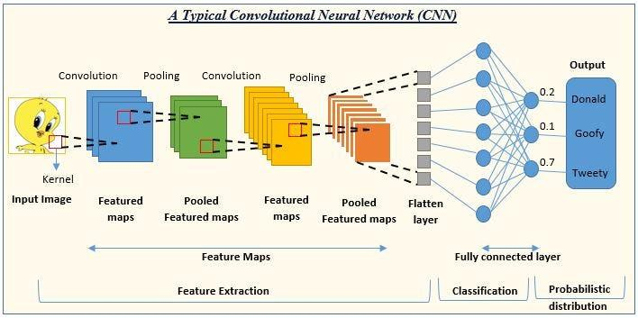

## Table of Contents

## What is translational invariance in the context of machine learning?

Translational invariance in machine learning refers to a property of some models where the output does not change when the input is shifted or translated. This is particularly important in fields like image recognition, where the position of an object in an image should not affect the model's ability to identify it. For example, a cat in the top left corner of an image should be recognized just as well as a cat in the bottom right corner. This property helps the model to be more robust and generalizable, as it can handle variations in the position of the features it is trying to detect.

In convolutional neural networks (CNNs), translational invariance is achieved through the use of convolutional layers. These layers apply the same set of filters across the entire input, regardless of where the features are located. This means that the network can detect features like edges or shapes no matter where they appear in the image. Mathematically, if $$ f(x) $$ represents the input and $$ T $$ is a translation operator, a model with translational invariance will produce the same output for $$ f(x) $$ and $$ T(f(x)) $$. This invariance to translation is what allows CNNs to effectively recognize patterns in images even when those patterns are shifted around.

## Why is translational invariance important in image recognition tasks?

Translational invariance is important in image recognition because it helps the model recognize objects no matter where they are in the picture. Imagine you are trying to find a dog in a photo. If the dog is in the corner or the middle, you should still be able to spot it. A model with translational invariance can do this because it looks for the same features of the dog everywhere in the image. This makes the model more reliable and useful because it can handle different positions of objects.

In practical terms, this property is achieved in convolutional neural networks (CNNs). These networks use special layers called convolutional layers that apply the same set of filters across the whole image. This means the network can find edges, shapes, or other important features no matter where they are. Mathematically, if $$ f(x) $$ is the image and $$ T $$ is a translation, a model with translational invariance will give the same result for $$ f(x) $$ and $$ T(f(x)) $$. This ability to recognize patterns regardless of their position makes CNNs very powerful for tasks like identifying objects in photos or videos.

## How does convolutional neural networks (CNNs) achieve translational invariance?

Convolutional neural networks (CNNs) achieve translational invariance through the use of convolutional layers. These layers apply the same set of filters across the entire image, no matter where the features are located. Imagine you are looking for a specific shape in a picture. The convolutional layer will look for that shape everywhere in the image using the same filter. This means that if the shape is in the top left corner or the bottom right corner, the CNN will still be able to find it.

This process is mathematically represented as applying a filter to the input image. If $$ f(x) $$ is the input image and $$ T $$ is a translation operator, a CNN with translational invariance will produce the same output for $$ f(x) $$ and $$ T(f(x)) $$. This invariance to translation makes the CNN robust to changes in the position of objects within the image, allowing it to recognize the same object no matter where it appears. This is why CNNs are so effective at tasks like image recognition, where the location of an object should not affect its identification.

## Can you explain the concept of pooling in relation to translational invariance?

Pooling in convolutional neural networks (CNNs) helps make them even better at recognizing objects no matter where they are in an image. Pooling layers take small areas of the image and reduce them to a single value, often by taking the maximum or average value in that area. This process is called max pooling or average pooling. When you do this, you make the network less sensitive to small changes in the position of the features it's looking for. For example, if a CNN sees a cat's eye in one spot, and then the cat moves a little bit, the pooling layer helps the network still recognize that it's a cat's eye, even if it's shifted slightly.

This increased robustness to small shifts comes from the fact that pooling reduces the spatial dimensions of the data. If $$ f(x) $$ is the input to a pooling layer and $$ T $$ is a small translation, the output of the pooling layer will be similar for both $$ f(x) $$ and $$ T(f(x)) $$. This means the network can still find important features even if they move around a bit. By combining convolutional layers, which look for features everywhere, with pooling layers, which make the network less sensitive to small shifts, CNNs become very good at recognizing objects no matter where they are in an image.

## What are the differences between translational invariance and rotational invariance?

Translational invariance means a model can recognize an object even if it moves to a different spot in the image. Imagine you're looking for a cat in a picture. If the cat moves from the left side to the right side, you should still be able to find it. In machine learning, especially in convolutional neural networks (CNNs), this is done by using the same filters across the whole image. This way, the network can find the cat's features, like its ears or eyes, no matter where they are. Mathematically, if $$ f(x) $$ is the image and $$ T $$ is a translation, a model with translational invariance will give the same result for $$ f(x) $$ and $$ T(f(x)) $$.

Rotational invariance, on the other hand, means a model can recognize an object even if it's turned or rotated. If you see a picture of a car and then the car is turned sideways, you should still know it's a car. In machine learning, achieving rotational invariance can be trickier. Some methods include training the model with images rotated in different ways or using special layers that can handle rotations. This helps the network recognize features like the shape of the car even if it's not in the same orientation. So, while translational invariance deals with moving objects around, rotational invariance deals with turning them.

## How does the choice of kernel size in CNNs affect translational invariance?

The size of the kernel, or filter, in a convolutional neural network (CNN) can affect how well the network can recognize objects no matter where they are in the picture. A bigger kernel can see more of the picture at once, so it can find bigger features. But it also means the network might miss smaller details. A smaller kernel focuses on smaller parts of the image, so it can catch finer details but might not see the bigger picture as well. The choice of kernel size is a balance between seeing the big picture and catching the small details, which can affect how well the network can recognize objects in different spots.

When we talk about translational invariance, we mean the network can find the same object even if it moves around in the image. If $$ f(x) $$ is the image and $$ T $$ is a translation, a CNN with good translational invariance will give the same result for $$ f(x) $$ and $$ T(f(x)) $$. The size of the kernel can help with this. A larger kernel might help the network see the same features even if they move a bit because it's looking at a bigger area. But if the kernel is too big, it might miss small shifts. A smaller kernel can be more sensitive to small changes but might struggle if the object moves too far. So, choosing the right kernel size is important for making sure the network can recognize objects no matter where they are in the image.

## What are the limitations of translational invariance in deep learning models?

Translational invariance in deep learning models, like convolutional neural networks (CNNs), helps the model recognize objects no matter where they are in an image. But it has some limitations. One big problem is that it might not work well if objects are very close together or overlapping. Imagine you have a picture with two cats, one right next to the other. The model might get confused and think there's only one cat because it's looking for the same features everywhere. This can make it hard for the model to tell apart different objects that are close together.

Another limitation is that translational invariance might not be enough if the object changes a lot. For example, if a dog is lying down in one picture and standing up in another, the model might not recognize it as the same dog because it's used to seeing the dog's features in certain positions. Even though the model can handle the dog moving around the image, it might struggle if the dog's shape changes a lot. This means that while translational invariance is helpful, it's just one part of making a model work well in real life, where objects can change in many ways.

To sum up, while translational invariance helps models like CNNs recognize objects in different spots, it has its limits. It can struggle with objects that are close together or when objects change their shape a lot. These limitations show that while translational invariance is important, it's not the only thing a model needs to be good at recognizing things in the real world.

## How can data augmentation techniques enhance translational invariance in training models?

Data augmentation techniques can help make a model better at recognizing objects no matter where they are in an image. By using data augmentation, you can create more training examples by moving the objects around in different spots. This means the model sees the same object in many different places during training. For example, if you have a picture of a cat, you can move the cat to different parts of the image and use these new pictures to train the model. This helps the model learn that a cat is a cat no matter where it is in the picture. If $$ f(x) $$ is the original image and $$ T $$ is a translation, data augmentation helps the model give the same result for $$ f(x) $$ and $$ T(f(x)) $$ by exposing it to many different translations of the same object.

Another way data augmentation helps is by making the model more robust to small changes. When you move objects around, you also create small shifts and variations that the model needs to handle. This can help the model learn to ignore small differences and focus on the important features of the object. By training with these varied examples, the model becomes better at recognizing objects even if they are not in the exact same spot as in the training data. This makes the model more useful in real life, where objects can be in any position in an image.

## What is the impact of translational invariance on model generalization?

Translational invariance helps models, like convolutional neural networks (CNNs), to recognize objects no matter where they are in an image. This makes the model better at generalizing because it can handle different positions of the same object. Imagine you're trying to find a cat in a picture. If the cat moves from the left side to the right side, you should still be able to find it. A model with good translational invariance can do this because it looks for the same features of the cat everywhere in the image. This ability to recognize objects in different spots helps the model work well with new images it hasn't seen before, which is what generalization is all about.

When a model has good translational invariance, it can be more reliable and useful in real-life situations. For example, if $$ f(x) $$ is the image of a car and $$ T $$ is a translation, a model with translational invariance will give the same result for $$ f(x) $$ and $$ T(f(x)) $$. This means the model can still find the car even if it's parked in a different spot in the picture. By being able to handle these changes, the model can work better with new, unseen data. This makes the model more robust and able to perform well even when things are not exactly the same as in the training data.

## How do modern architectures like Transformers handle translational invariance compared to CNNs?

Modern architectures like Transformers handle translational invariance differently from Convolutional Neural Networks (CNNs). While CNNs use convolutional layers to apply the same filters across the entire image, which helps them recognize objects no matter where they are, Transformers use a different approach. Transformers rely on self-attention mechanisms to understand the relationships between different parts of the input. This means they can look at the whole image at once and figure out how different parts relate to each other, without needing to use specific filters that slide over the image. However, this also means that Transformers might not naturally have the same level of translational invariance as CNNs because they don't use the same kind of sliding window approach.

To help Transformers achieve better translational invariance, researchers often use data augmentation techniques. These techniques involve moving objects around in different spots in the training images so the model sees the same object in many different places. For example, if you have a picture of a dog, you can move the dog to different parts of the image and use these new pictures to train the Transformer. This helps the model learn that a dog is a dog no matter where it is in the picture. If $$ f(x) $$ is the original image and $$ T $$ is a translation, data augmentation helps the Transformer give the same result for $$ f(x) $$ and $$ T(f(x)) $$ by exposing it to many different translations of the same object. This way, even though Transformers work differently from CNNs, they can still learn to handle objects in different positions well.

## What advanced techniques can be used to improve translational invariance in neural networks?

One advanced technique to improve translational invariance in neural networks is to use data augmentation. This means creating more training examples by moving objects around in different spots in the images. For example, if you have a picture of a cat, you can move the cat to different parts of the image and use these new pictures to train the model. This helps the model learn that a cat is a cat no matter where it is in the picture. If $$ f(x) $$ is the original image and $$ T $$ is a translation, data augmentation helps the model give the same result for $$ f(x) $$ and $$ T(f(x)) $$ by exposing it to many different translations of the same object. This way, the model becomes better at recognizing objects in different positions.

Another technique is to use special layers like spatial transformer networks. These layers can learn to transform the input image in ways that help the model recognize objects no matter where they are. They do this by applying transformations like shifting or scaling the image. This helps the model focus on the important parts of the image, no matter where they are located. By using these layers, the model can become more robust to changes in the position of objects, improving its translational invariance.

Lastly, some researchers use techniques like group equivariant networks. These networks are designed to be invariant to certain transformations, including translations. They work by applying the same operations across the entire input, similar to how CNNs use convolutional layers, but in a way that can handle more complex transformations. This can make the model even better at recognizing objects no matter where they are in the image, improving its ability to generalize to new data.

## Can you discuss any recent research or developments focused on improving translational invariance in machine learning?

Recent research has been exploring new ways to make machine learning models better at recognizing objects no matter where they are in an image. One interesting approach is called "equivariant neural networks." These networks are designed to handle not just translations but also other transformations like rotations and scaling. By building the network to be equivariant to these transformations, it can learn to recognize objects more effectively, even if they move or change shape. For example, if $$ f(x) $$ is an image and $$ T $$ is a transformation, an equivariant network will give a predictable change in output for $$ T(f(x)) $$. This helps the model understand the object's features in a way that's not affected by where it is in the image.

Another development is the use of advanced data augmentation techniques. Researchers are using more complex methods to move objects around in training images, like using generative models to create new images with the same object in different positions. This helps the model see the object in many different spots during training, improving its ability to recognize it no matter where it is. For example, you could use a generative adversarial network (GAN) to create new images of a cat in different parts of the image. By training on these varied images, the model learns to focus on the cat's features, not its position. This makes the model more robust and better at generalizing to new images.