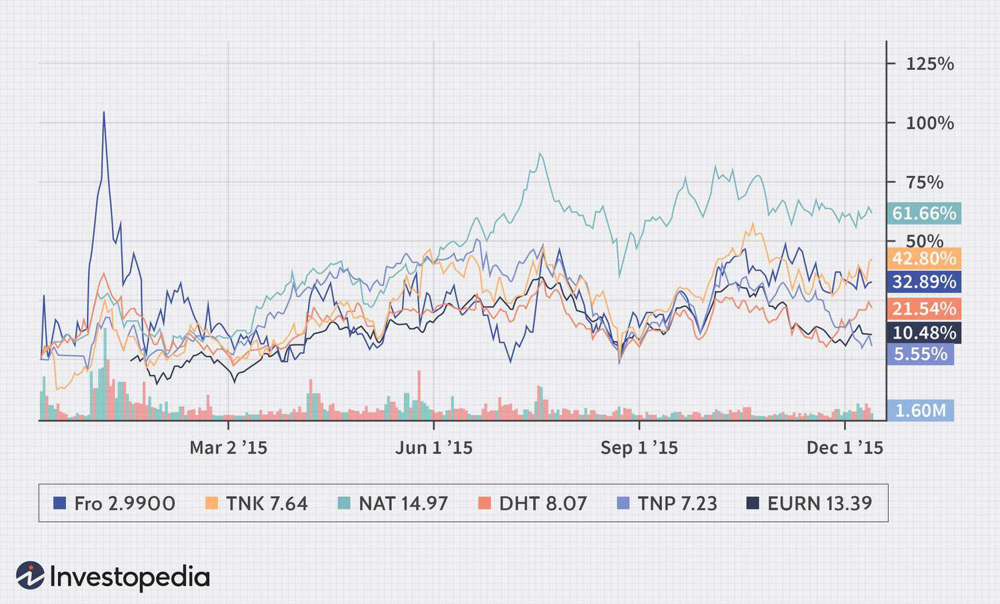

## Table of Contents

## What is crude oil and why is it transported by tankers?

Crude oil is a thick, dark liquid that comes from deep under the ground. It is made up of many different substances, like gasoline and diesel, which we use to power cars and machines. People find crude oil in places called oil fields, and they drill into the ground to get it out. Crude oil is very important because it helps make many things we use every day, like plastics and medicines.

Crude oil is transported by tankers because it needs to be moved from the oil fields where it is found to places where it can be used or turned into other products. Tankers are big ships that can carry a lot of oil across oceans. Using tankers is a good way to move large amounts of oil safely and quickly. This helps make sure that people all over the world can get the oil they need.

## What are the different types of oil tankers used for crude oil transport?

There are several types of oil tankers used for transporting crude oil. The main types are ULCCs (Ultra Large Crude Carriers), VLCCs (Very Large Crude Carriers), Suezmax, Aframax, and Panamax. Each type is named based on its size and the routes it can take. ULCCs and VLCCs are the biggest and can carry a lot of oil, but they can only use certain deep-water routes. Suezmax tankers are smaller and can pass through the Suez Canal, which is important for moving oil between different parts of the world.

Aframax and Panamax tankers are even smaller. Aframax tankers are often used for shorter trips and can go into ports that bigger tankers can't reach. Panamax tankers are designed to fit through the Panama Canal, which helps move oil between the Atlantic and Pacific Oceans. Each type of tanker has its own job, depending on how much oil needs to be moved and where it needs to go. This variety helps make sure that crude oil can be transported efficiently and safely to where it is needed.

## How does the process of loading crude oil onto tankers work?

Loading crude oil onto tankers starts at the oil terminal or port. First, the tanker comes to the loading area and gets ready. Big pipes called loading arms connect to the tanker. These arms are like hoses that can move and bend to reach the tanker's openings. Once everything is set up, the oil starts to flow from the storage tanks on land or from offshore platforms through the pipes and into the tanker. People watch the whole process carefully to make sure it goes smoothly and safely.

Once the oil is flowing, it takes a few hours to fill up the tanker. The crew on the tanker and the workers at the terminal keep an eye on the oil level and the pressure in the pipes. They use special tools to check everything. When the tanker is full, they slowly stop the flow of oil and disconnect the loading arms. After that, the tanker is ready to leave the port and take the oil to where it needs to go. The whole process needs to be done carefully to avoid any spills or accidents.

## What are the main routes used for transporting crude oil by tankers?

The main routes for transporting crude oil by tankers are very important for moving oil around the world. One big route is from the Middle East to places like Europe, Asia, and North America. Countries like Saudi Arabia and Iraq have a lot of oil, and they send it to countries that need it. The tankers go through the Persian Gulf, then into the Arabian Sea, and sometimes through the Suez Canal to get to Europe faster. If they are going to Asia, they might go through the Strait of Malacca.

Another important route is from the Americas. Oil from the United States, Canada, and countries in South America like Venezuela and Brazil is sent to different parts of the world. Tankers from the Gulf of Mexico can go to Europe or Asia. Some tankers also use the Panama Canal to move oil between the Atlantic and Pacific Oceans. This helps get oil to places like China and Japan more quickly.

There are also routes from West Africa, where countries like Nigeria and Angola send their oil to Europe and Asia. The tankers leave from ports along the coast of West Africa and cross the Atlantic Ocean to reach Europe. For Asia, they go around the southern tip of Africa, through the Cape of Good Hope, and then across the Indian Ocean. These routes help make sure that oil can get to where it is needed all over the world.

## What safety measures are in place during the transport of crude oil by tankers?

Safety is very important when moving crude oil by tankers. The tankers have strong double hulls to help prevent oil spills if there is an accident. They also have special systems to keep the oil at the right temperature and pressure. The crew on the tanker is trained to handle emergencies and they practice what to do if something goes wrong. They use tools to watch the oil and the ship all the time, so they can fix problems quickly.

There are also rules that everyone has to follow to keep things safe. These rules come from groups like the International Maritime Organization (IMO). They say how tankers should be built, how they should be loaded and unloaded, and how they should sail. Ships have to pass checks to make sure they are safe. When tankers are near land or in busy areas, they have to be extra careful and follow special paths to avoid accidents. All these measures help make sure that crude oil can be moved safely from one place to another.

## How does the transport of crude oil by tankers impact the environment?

Transporting crude oil by tankers can harm the environment. If there is an accident and oil spills into the ocean, it can hurt sea animals and birds. The oil can cover their feathers and fur, making it hard for them to stay warm or swim. It can also get into the water and harm fish and other sea life. Cleaning up oil spills is very hard and can take a long time, and sometimes the damage to the environment can last for many years.

Tankers also use a lot of fuel to move the oil, and this adds to air pollution. When the fuel burns, it puts out gases that can make the air dirty and contribute to climate change. The gases can also make it harder for people to breathe and can harm plants and animals on land. Even though there are rules to make tankers safer and cleaner, moving oil by tankers still has an impact on the environment.

## What are the economic implications of transporting crude oil by tankers?

Transporting crude oil by tankers is very important for the world's economy. It helps move oil from places where it is found to places where it is needed. This means countries that have a lot of oil, like those in the Middle East, can sell it to other countries that need it, like those in Europe and Asia. This trade helps these countries make money and grow their economies. It also helps keep the price of oil steady, which is good for everyone because oil is used to make many things we use every day.

However, there are also costs and risks involved. Building and running tankers is expensive, and if there is an accident, like an oil spill, it can cost a lot of money to clean up. These accidents can also hurt the economy of the areas where they happen because they can harm fishing and tourism. The price of oil can also go up and down, which can make it hard for countries to plan their budgets. Even with these challenges, moving oil by tankers is still a key part of the world's economy.

## How do weather conditions affect the transport of crude oil by tankers?

Weather conditions can make it harder and more dangerous to move crude oil by tankers. Big storms like hurricanes can make the sea very rough. This can make it hard for tankers to sail safely. If the waves are too big, the tanker might move around a lot, which can cause problems with the oil inside. Sometimes, tankers have to wait for the weather to get better before they can leave the port or keep sailing. This can slow down the delivery of oil and make it more expensive.

Cold weather can also be a problem. In very cold places, the oil can get thick and hard to move. Tankers might need special equipment to keep the oil warm enough to flow. Ice can also block the way, especially in places like the Arctic. This can stop tankers from getting through or make them take longer routes. All these weather issues mean that moving oil by tankers needs careful planning and can sometimes be risky and costly.

## What technologies are used to monitor and ensure the safety of crude oil tankers?

To keep crude oil tankers safe, people use different kinds of technology. One important tool is the Automatic Identification System (AIS). This system helps ships know where other ships are, so they can avoid crashing into each other. Tankers also have radar and GPS to help them see where they are going and stay on the right path, even when it's dark or foggy. Another important technology is the Inert Gas System (IGS), which puts safe gas into the empty spaces on the tanker to stop fires from starting.

There are also tools to watch the oil inside the tanker. Sensors and monitoring systems check the oil's temperature and pressure all the time. If something goes wrong, these tools can warn the crew so they can fix it quickly. Computers on the tanker can also help control the ship and make sure everything is working right. All these technologies help make sure that moving oil by tankers is as safe as possible.

## How has the regulation of crude oil tanker transport evolved over time?

The rules for moving crude oil by tankers have changed a lot over time to make it safer. A long time ago, there were not many rules, and accidents like oil spills happened more often. But after some big spills, like the one from the Exxon Valdez in 1989, people started to make stricter rules. One big change was making tankers have double hulls. This means the tanker has two layers of steel to help stop oil from leaking if the ship gets damaged. Groups like the International Maritime Organization (IMO) made these rules, and countries all over the world started to follow them.

Over the years, the rules have kept getting better. Now, tankers have to pass regular checks to make sure they are safe. They also have to follow special paths in busy areas to avoid accidents. There are rules about how to load and unload oil, and how to handle emergencies. These rules help make sure that moving oil by tankers is safer for the environment and for the people who work on the ships. Even though accidents can still happen, the rules have helped a lot to make things better.

## What are the challenges faced in the transport of crude oil by tankers and how are they addressed?

Moving crude oil by tankers comes with many challenges. One big problem is the risk of oil spills. If a tanker crashes or gets damaged, oil can leak into the ocean and hurt sea animals and the environment. Another challenge is the cost. Building and running tankers is expensive, and if there's an accident, the cleanup can cost a lot of money too. Weather can also make things harder. Storms and cold weather can make it tough for tankers to sail safely, and sometimes they have to wait for better weather, which can slow down the delivery of oil.

To deal with these challenges, people use different methods. To stop oil spills, tankers now have double hulls, which are like two layers of protection. There are also strict rules that everyone has to follow to make sure tankers are safe and well-maintained. Special paths in busy areas help tankers avoid crashing into each other. To handle the costs, companies plan carefully and have insurance to help pay for any accidents. For weather problems, tankers use technology like radar and GPS to help them sail safely, and they might wait for the weather to get better before they start their journey. All these ways help make moving oil by tankers safer and more reliable.

## What future trends and innovations are expected in the transport of crude oil by tankers?

In the future, people expect to see new ways to make moving crude oil by tankers safer and better for the environment. One big idea is using smarter technology. This means using computers and sensors to watch the tanker and the oil all the time. These tools can help find problems early and stop accidents before they happen. Another idea is making tankers that use less fuel or even run on cleaner energy like electricity or natural gas. This can help lower the amount of dirty air that tankers make. People are also looking at ways to make the loading and unloading of oil faster and safer, like using robots and better pipes.

Another trend is making better rules and using more data to plan trips. With more information, people can find the best and safest routes for tankers. They can also use this data to predict when and where bad weather might happen, so tankers can avoid it. There are also ideas about making tankers that can carry different kinds of oil or even other things like gas. This can help companies use their tankers in more ways and make more money. All these new ideas and technologies are working to make moving oil by tankers safer, faster, and better for the planet.

## References & Further Reading

[1]: Stopford, M. (2009). ["Maritime Economics"](https://www.taylorfrancis.com/books/mono/10.4324/9780203891742/maritime-economics-3e-martin-stopford). Routledge.

[2]: Alizadeh, A., & Nomikos, N. (2009). ["Shipping Derivatives and Risk Management"](https://www.semanticscholar.org/paper/Shipping-derivatives-and-risk-management-Alizadeh-Nomikos/9c8b134112e48b678e450e43149e555327a3b1a9). Palgrave Macmillan.

[3]: Mehrotra, N., et al. (2020). ["An Integrated Modeling Approach for Assessing the Electric Power Demand and Supply in Future Smart Cities in India."](https://journals.sagepub.com/doi/10.1177/09596836241307299) Sustainable Cities and Society.

[4]: Adland, R., & Jia, H. (2017). ["The Dimensionality and Dynamics of the Shipping Market."](https://www.researchgate.net/profile/Haiying-Jia/publication/315918103_Are_AIS-based_trade_volume_estimates_reliable_The_case_of_crude_oil_exports/links/5a1bdab14585155c26ae08ae/Are-AIS-based-trade-volume-estimates-reliable-The-case-of-crude-oil-exports.pdf) Maritime Policy & Management.

[5]: Rystad Energy. (2019). ["Oil Market Trends and Key Drivers."](https://www.rystadenergy.com/news/recoverable-oil-reserves-billion-barrels-warming-planet?trk=public_post_comment-text) Rystad Energy UCube.

[6]: Robbins, L. W. (2014). ["The Global Oil & Gas Industry: Management, Strategy & Finance"](https://www.amazon.com/Global-Oil-Gas-Industry-Management/dp/1593702396). PennWell Books.