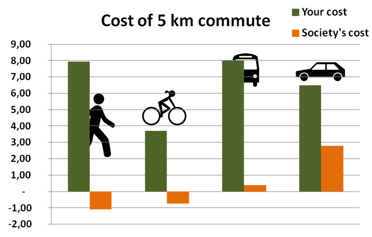

## Table of Contents

## What is transportation alternative data?

Transportation alternative data refers to information collected from sources other than traditional transportation data like traffic counts or public transit ridership. This can include data from mobile apps, social media, GPS devices, and other digital platforms that track how people move around. By using this data, researchers and planners can get a better understanding of travel patterns and behaviors that might not be captured by traditional methods.

This type of data is useful because it can provide real-time insights and cover a wider range of transportation modes, such as biking, walking, or using ridesharing services. For example, data from a fitness app might show how many people are choosing to walk or bike to work, which can help city planners design better bike lanes or pedestrian paths. Overall, transportation alternative data helps create a more complete picture of how people travel, leading to better planning and policy decisions.

## Why is transportation alternative data important?

Transportation alternative data is important because it helps us understand how people move around in ways that traditional data might miss. Traditional data like traffic counts or bus ridership numbers only tell part of the story. They don't always show if people are walking, biking, or using ridesharing apps. By using data from mobile apps, social media, and GPS devices, we can see a fuller picture of how people get from place to place.

This kind of data is also useful because it gives us real-time information. For example, if a lot of people are using a fitness app to track their bike rides, city planners can see where bike lanes are needed most. This helps make better decisions about where to build new roads, bike paths, or sidewalks. In the end, transportation [alternative data](/wiki/best-alternative-data) helps make cities and towns better places to live by understanding and meeting the needs of everyone who travels through them.

## What are the common sources of transportation alternative data?

Common sources of transportation alternative data include mobile apps, social media, and GPS devices. Mobile apps like fitness trackers or ride-sharing services collect data on how people move. For example, a fitness app might track how many people are walking or biking in a certain area. Social media can also provide useful information. People often share posts or photos about their travels, which can show where and how they are moving. GPS devices in cars or smartphones track location and movement, giving detailed data on travel routes and times.

Another source is data from public transit apps and smart cards. These can show how many people are using buses, trains, or subways and where they are going. Companies and researchers can also use data from traffic cameras and sensors on roads to understand traffic flow and congestion. All these sources together help create a complete picture of how people travel, which is important for planning better transportation systems.

## How can transportation alternative data be collected?

Transportation alternative data can be collected from many places. One common way is through mobile apps. For example, fitness apps like Strava or MapMyRide track where people walk, run, or bike. Ride-sharing apps like Uber or Lyft also collect data on where people are going and how they are getting there. Another source is social media. People often post about their trips on platforms like X (formerly Twitter) or Instagram, sharing details about their travel. GPS devices in phones and cars also help. They track where people are and where they go, giving detailed information on travel routes and times.

Another way to collect this data is through public transit apps and smart cards. These systems record when and where people use buses, trains, or subways. Traffic cameras and sensors on roads are also useful. They can show how many cars are on the road and where traffic is heavy. By putting all this information together, researchers and planners can see a full picture of how people move around. This helps them make better decisions about transportation in cities and towns.

## What are the basic methods for analyzing transportation alternative data?

Analyzing transportation alternative data involves looking at the information collected from different sources like mobile apps, social media, and GPS devices. One basic method is to use mapping tools to see where people are going and how they are getting there. For example, by plotting the data on a map, you can see if a lot of people are biking along a certain route or if there are busy spots where traffic is heavy. This helps planners understand travel patterns and decide where to build new bike lanes or improve roads.

Another method is to use [statistics](/wiki/bayesian-statistics) to find trends and patterns in the data. This can involve counting how many people are using different types of transportation, like walking, biking, or using ride-sharing services. By looking at these numbers over time, planners can see if more people are choosing to walk or bike instead of driving. This kind of analysis helps make decisions about where to put more resources, like building more sidewalks or adding bike racks.

Sometimes, researchers also use computer programs to analyze big sets of data. These programs can find connections between different pieces of information, like how weather affects how people travel. By understanding these connections, planners can make better plans for transportation that work well in different conditions. This helps make cities and towns better places to live by meeting the needs of everyone who travels through them.

## How does transportation alternative data differ from traditional transportation data?

Transportation alternative data is different from traditional transportation data because it comes from different places. Traditional data usually comes from things like traffic counts, which count how many cars go by a certain spot, or from how many people ride buses and trains. This kind of data is good for understanding how many cars or buses are on the road, but it might not show everything. For example, it might not show how many people are walking or biking. On the other hand, transportation alternative data comes from things like mobile apps, social media, and GPS devices. These sources can tell us about all kinds of travel, not just cars and buses.

Another big difference is that transportation alternative data often gives us information in real time. This means we can see what's happening right now, not just what happened in the past. For example, if a lot of people are using a fitness app to track their bike rides today, we can see that right away. Traditional data, like monthly bus ridership numbers, might take a while to collect and analyze. So, transportation alternative data helps us understand current travel patterns and make quick decisions, while traditional data is better for looking at long-term trends.

## What are the challenges in using transportation alternative data?

Using transportation alternative data can be hard because it comes from many different places, like mobile apps and social media. This means the data can be messy and not always organized in the same way. It takes a lot of work to put it all together and make sense of it. Also, not everyone uses these apps or shares their travel on social media, so the data might not show what everyone is doing. This can make it hard to get a full picture of how people are moving around.

Another challenge is keeping people's information private. When using data from apps and GPS devices, it's important to make sure no one's personal details are shared without permission. This can make collecting and using the data more complicated. Plus, the data can change quickly because it's often collected in real time. This means planners need to keep updating their information and be ready to change their plans if the data shows new trends.

## Can you provide examples of how transportation alternative data has been used in urban planning?

In cities like New York, transportation alternative data has helped planners see where people are biking. They used data from apps like Strava to find out which streets have a lot of bike traffic. This helped them decide where to put new bike lanes. For example, they found out that a lot of people were biking on a busy street without a bike lane. So, they added a new bike lane there to make it safer for everyone.

In another example, the city of San Francisco used data from ride-sharing apps like Uber and Lyft. They wanted to know where people were getting picked up and dropped off. This helped them see that a lot of people were using these services to get to and from certain neighborhoods. So, they made changes to the roads and added more pick-up and drop-off spots in those areas. This made it easier for people to use ride-sharing services and helped reduce traffic in other parts of the city.

## What advanced technologies are used to enhance the collection and analysis of transportation alternative data?

Advanced technologies like [machine learning](/wiki/machine-learning) and [artificial intelligence](/wiki/ai-artificial-intelligence) help make collecting and analyzing transportation alternative data easier and more accurate. Machine learning can look at big sets of data from mobile apps, social media, and GPS devices to find patterns and trends. For example, it can figure out if more people are biking on certain days or if traffic gets worse at certain times. This helps planners make better decisions about where to build new bike lanes or how to manage traffic.

Another technology that helps is big data analytics. This technology can handle huge amounts of information from different sources all at once. It can put together data from fitness apps, ride-sharing services, and traffic cameras to give a full picture of how people move around. By using big data analytics, planners can see real-time changes in travel patterns and make quick decisions to improve transportation in cities.

## How can transportation alternative data improve transportation efficiency and sustainability?

Transportation alternative data helps make transportation more efficient by showing planners exactly how people are moving around. This data comes from apps, social media, and GPS devices, so it can tell us if more people are walking, biking, or using ride-sharing services. By understanding these patterns, city planners can make better decisions about where to put new bike lanes, sidewalks, or pick-up spots for ride-sharing. This can reduce traffic and make it easier for everyone to get where they need to go. For example, if data shows a lot of people biking on a busy street, planners can add a bike lane to make it safer and reduce car traffic.

Using transportation alternative data also helps make transportation more sustainable. This data can show how many people are choosing greener ways to travel, like walking or biking instead of driving. When planners see more people using these eco-friendly options, they can focus on building more bike paths and pedestrian-friendly areas. This not only helps the environment by reducing car emissions but also makes cities nicer places to live. By using this data, cities can encourage more sustainable travel and help protect the planet.

## What are the ethical considerations when using transportation alternative data?

When using transportation alternative data, it's important to think about people's privacy. This data often comes from apps and GPS devices that track where people go. If this information is not kept private, it could be used in ways that people don't like or agree with. Planners and researchers need to make sure they have permission to use this data and that they keep personal details safe. This means they should remove any information that could identify someone and only use the data in ways that were agreed upon.

Another big issue is making sure the data is fair and represents everyone. Not everyone uses apps or social media to track their travel, so the data might miss out on some people's journeys. This can lead to decisions that don't help everyone equally. It's important to try to include as many different kinds of data as possible to get a full picture of how people move. This way, planners can make choices that are good for the whole community, not just the people who use certain apps or services.

## What future trends are expected in the field of transportation alternative data?

In the future, we will see more use of smart technology to collect transportation alternative data. Things like smart cars and connected devices will give us even more information about how people move around. This will help planners make better decisions about where to build new roads, bike lanes, and sidewalks. Also, as more people use apps and wearables, like fitness trackers, we will have more data to work with. This means we can understand travel patterns better and make cities more efficient and friendly for everyone.

Another trend will be the use of artificial intelligence and machine learning to analyze this data. These technologies can look at huge amounts of information quickly and find patterns that humans might miss. This will help us predict traffic problems before they happen and plan for the future. As we get better at using this data, we will also focus more on keeping people's information private and making sure the data represents everyone, not just people who use certain apps. This will help make transportation planning fair and good for the whole community.

## References & Further Reading

[1]: ["Advances in Financial Machine Learning"](https://www.amazon.com/Advances-Financial-Machine-Learning-Marcos/dp/1119482089) by Marcos Lopez de Prado

[2]: ["Alternative Data in Finance"](https://www.investopedia.com/what-is-alternative-data-6889002) by Alexander Denev and Saeed Amen

[3]: ["Machine Learning for Asset Managers"](https://www.cambridge.org/core/elements/machine-learning-for-asset-managers/6D9211305EA2E425D33A9F38D0AE3545) by Marcos Lopez de Prado

[4]: Donoho, D. (2000). ["High-Dimensional Data Analysis: The Curses and Blessings of Dimensionality."](https://www.researchgate.net/publication/220049061_High-Dimensional_Data_Analysis_The_Curses_and_Blessings_of_Dimensionality) AMS Conference on Math Challenges of the 21st Century.

[5]: ["Big Data in Practice: How 45 Successful Companies Used Big Data Analytics to Deliver Extraordinary Results"](https://bernardmarr.com/wp-content/uploads/2022/05/Big-Data-Esampler-1.pdf) by Bernard Marr