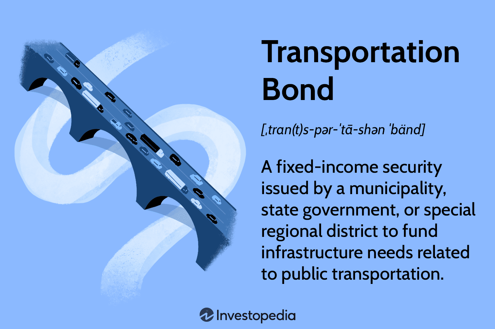

## Table of Contents

## What is a transportation bond?

A transportation bond is a type of bond that governments or public agencies issue to raise money for building or improving transportation systems. This can include roads, bridges, highways, public transit systems like buses and trains, and even airports. When people or institutions buy these bonds, they are lending money to the government or agency. In return, they get paid back with interest over time.

The money raised from transportation bonds helps pay for big projects that might be too expensive to fund all at once from regular budgets. For example, building a new highway or expanding a subway system can cost billions of dollars. By issuing bonds, the government can spread out the cost over many years. This way, they can start and complete important transportation projects without having to save up all the money first.

## How does a transportation bond work?

A transportation bond works like a loan that people or organizations give to the government or a public agency. When you buy a transportation bond, you are lending money to help build or fix things like roads, bridges, or public transit systems. In return, the government promises to pay you back the money you lent, plus some extra money called interest, over a certain period of time. This period can be many years, like 10, 20, or even 30 years.

The government uses the money from selling these bonds to pay for big transportation projects that are too expensive to cover with their regular budget. For example, if a city wants to build a new subway line, it might cost billions of dollars. Instead of trying to save up all that money, the city can issue transportation bonds. People buy the bonds, the city gets the money right away to start building, and then the city pays back the bond buyers over time. This way, important projects can get started and finished without waiting to gather all the funds upfront.

## What are the main purposes of issuing a transportation bond?

The main purpose of issuing a transportation bond is to raise money for big transportation projects. These projects can be things like building new roads, bridges, highways, or public transit systems like buses and trains. Governments and public agencies use these bonds because the projects are very expensive and they need a lot of money to get started and finished.

Another purpose is to spread out the cost of these big projects over many years. Instead of trying to pay for everything at once, which can be hard, the government can sell bonds to people and organizations. The money from the bonds helps pay for the projects right away, and then the government pays back the bond buyers slowly over time, with interest. This way, important transportation improvements can happen without the government having to save up all the money first.

## Who typically issues transportation bonds?

Transportation bonds are usually issued by governments or public agencies. This can include city governments, state governments, or even federal governments. They use these bonds to get money for big projects like building new roads, bridges, or public transit systems.

These organizations issue bonds because the projects they want to do are very expensive. Instead of trying to pay for everything at once, they can sell bonds to people and organizations. The money from the bonds helps start the projects right away, and then the government pays back the bond buyers over time, with interest.

## What are the benefits of investing in transportation bonds?

Investing in transportation bonds can be a good choice for people who want a steady and safe way to grow their money. When you buy a transportation bond, you are lending money to the government or a public agency. They use this money to build or fix things like roads, bridges, and public transit systems. In return, they promise to pay you back the money you lent, plus some extra money called interest, over a certain period of time. This means you can count on getting regular payments, which can help you plan your finances.

Another benefit is that transportation bonds are usually seen as very safe investments. This is because they are backed by the government or a public agency. Even though the projects they fund can be very expensive, the government has the power to collect taxes and other money to pay back the bonds. This makes it less likely that you will lose your money. So, if you want a safe place to put your money and get a steady return, transportation bonds can be a good option.

## What are the risks associated with transportation bonds?

One risk of investing in transportation bonds is that the government or public agency might not be able to pay back the money they borrowed. This can happen if the project they are working on costs more than they expected or if they don't get enough money from taxes or other sources. If this happens, you might not get all your money back, or you might get it back later than planned.

Another risk is that interest rates might go up after you buy the bond. If this happens, new bonds that are issued later might offer higher interest rates than the one you bought. This means you could have made more money if you had waited to invest. Also, if you need to sell your bond before it matures, you might have to sell it for less than you paid for it, especially if interest rates have gone up.

Even though these risks exist, transportation bonds are still seen as pretty safe because they are backed by the government or a public agency. But it's good to know about these risks so you can make a smart choice about whether to invest in them.

## How are transportation bonds funded?

Transportation bonds are funded by people and organizations who buy the bonds. When you buy a transportation bond, you are giving money to the government or a public agency. They use this money to pay for big projects like building new roads, bridges, or public transit systems. The government or agency promises to pay you back the money you gave them, plus some extra money called interest, over a certain number of years.

The money to pay back the bonds comes from different places. The government can use money from taxes, like sales taxes or gas taxes, to make the payments. Sometimes, they might also use money from fees, like tolls on highways or fares from public transit. By spreading out the cost of the big projects over many years, the government can start and finish important transportation work without needing all the money upfront.

## What is the difference between a general obligation bond and a revenue bond in the context of transportation?

In the context of transportation, a general obligation bond is a type of bond that the government issues to pay for big projects like roads or bridges. When you buy a general obligation bond, the government promises to pay you back using money from taxes, like sales taxes or property taxes. This means the bond is backed by the full faith and credit of the government, which makes it a very safe investment. If the project costs more than expected, the government can still use other tax money to make sure they pay you back.

A revenue bond, on the other hand, is a bond that the government or a public agency issues to pay for transportation projects, but the money to pay you back comes from the project itself. For example, if the bond is used to build a new toll road, the money to pay back the bond comes from the tolls people pay to use the road. This makes revenue bonds a bit riskier than general obligation bonds because if the project doesn't make enough money, the government might not be able to pay you back as promised. But if the project does well, it can be a good investment.

## How do transportation bonds impact the economy?

Transportation bonds help the economy by funding big projects like roads, bridges, and public transit systems. When the government uses these bonds to build new transportation, it creates jobs for construction workers, engineers, and other people involved in the projects. This means more people have money to spend, which can help businesses and make the economy grow. Also, better transportation can make it easier for people to get to work, which can help businesses run more smoothly and attract new companies to the area.

Once the projects are finished, they can keep helping the economy. Good transportation systems make it easier for goods to be moved around, which can help businesses save money and grow. For example, a new highway can make it faster to ship products, and a new subway line can help more people get to jobs in the city. This can make the area more attractive to businesses and people, leading to more economic growth over time.

## What are some examples of projects funded by transportation bonds?

Transportation bonds help pay for big projects like building new roads. For example, a city might use transportation bonds to build a new highway that connects different parts of the city. This new road can help people get to work faster and make it easier for businesses to move their goods around. Another example is fixing old bridges. If a bridge is old and unsafe, the government can use money from transportation bonds to repair it or build a new one. This keeps people safe and helps keep traffic moving smoothly.

Another type of project that transportation bonds can fund is public transit systems. For example, a city might use these bonds to build a new subway line. This can help more people get around the city without needing a car, which can reduce traffic and pollution. Also, transportation bonds can be used to buy new buses or trains. This means the public transit system can serve more people and run more often, making it easier for everyone to get where they need to go.

Sometimes, transportation bonds are used for projects like building new airports or improving existing ones. For example, a state might use these bonds to build a new runway at an airport. This can help the airport handle more flights and bring more people and goods into the area. Another example is building new train stations. If a city uses transportation bonds to build a new train station, it can make it easier for people to travel between cities, which can help businesses and tourism.

## How is the performance of transportation bonds evaluated?

The performance of transportation bonds is evaluated by looking at how well the projects they fund are doing and if the government or agency can pay back the money they borrowed. If the projects, like new roads or bridges, are finished on time and within budget, it's a good sign. Also, if the projects are helping the economy by creating jobs and making it easier for people to get around, that's another positive point. People who buy the bonds want to see that the money is being used well and that the projects are successful.

Another way to evaluate transportation bonds is by looking at the interest payments and the risk of not getting paid back. If the government or agency is making all the interest payments on time, it shows they are managing their money well. But if they are having trouble paying back the bonds, it could mean the projects are not doing well or that they don't have enough money from taxes or other sources. Investors also look at the credit rating of the bonds, which tells them how safe their investment is. A high credit rating means the bond is seen as a safe investment, while a low rating means it's riskier.

## What future trends might affect the use and effectiveness of transportation bonds?

In the future, new technology might change how transportation bonds are used. For example, if more people start using electric cars or self-driving cars, the government might need to build different kinds of roads or charging stations. This could mean transportation bonds will be used to fund these new projects. Also, if more people start working from home, there might be less need for big highways and more need for better public transit. This could change what kinds of projects transportation bonds pay for.

Another trend that might affect transportation bonds is climate change. Governments might need to use these bonds to build things that can handle more storms or floods, like stronger bridges or better drainage systems. This could make transportation bonds more important for keeping people safe. Also, if people start caring more about the environment, they might want transportation bonds to be used for green projects, like bike lanes or electric buses. This could make transportation bonds a way to help the planet, not just build roads and bridges.

## References & Further Reading

[1]: Poole, W. (2007). ["Understanding the Risks of Municipal Bonds."](https://www.merrilledge.com/article/understanding-bonds-and-their-risks) Federal Reserve Bank of St. Louis Review.

[2]: Fabozzi, F. J., & Peterson, P. P. (2003). ["Municipal Bond Markets"](https://books.google.com/books/about/Financial_Management_and_Analysis.html?id=NBeyfpHg1boC) in "The Handbook of Financial Instruments." John Wiley & Sons.

[3]: Aldridge, I. (2013). ["High-Frequency Trading: A Practical Guide to Algorithmic Strategies and Trading Systems."](https://www.ahmetbeyefendi.com/wp-content/uploads/2020/07/High-Frequency-Trading-Irene-Aldridge.pdf) John Wiley & Sons.

[4]: Angel, J. J., Harris, L. E., & Spatt, C. S. (2015). ["Equity Trading in the 21st Century: An Update."](https://papers.ssrn.com/sol3/papers.cfm?abstract_id=1584026) The Quarterly Journal of Finance.

[5]: Gomber, P., Arndt, B., Lutat, M., & Uhle, T. (2011). ["High-Frequency Trading."](https://papers.ssrn.com/sol3/papers.cfm?abstract_id=1858626) Journal of Information Technology, Theory and Application.

[6]: Gaikwad, S. H., Binode, M. R., & Hasan, S. (2021). ["Data-Driven Models and Algorithms for Automated Algorithmic Trading."](https://scholar.google.com/citations?user=M8Kyw9oAAAAJ&hl=en) Springer, Cham.