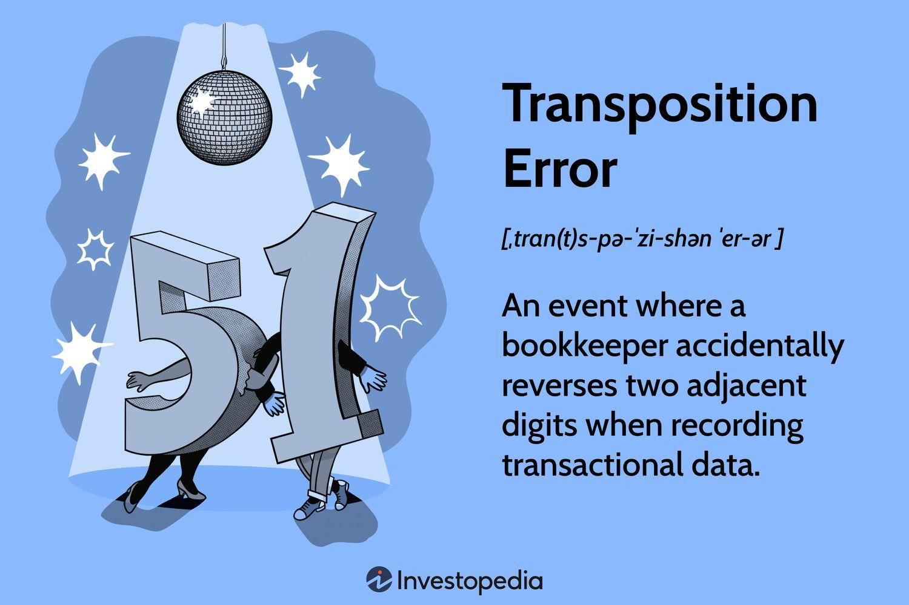

## Table of Contents

## What is a transposition error?

A transposition error happens when two numbers or letters are switched around by mistake. For example, if you meant to write "24" but wrote "42" instead, that's a transposition error. These mistakes often happen when people are writing down numbers quickly or not paying close attention.

Transposition errors can cause big problems, especially in important places like banks or when doing math. If someone at a bank switches two numbers in an account number, the money might go to the wrong person. It's important to double-check numbers and letters to avoid these errors.

## Can you give an example of a transposition error?

A transposition error is when you mix up the order of two numbers or letters by mistake. For example, if you meant to write the number "1234" but you wrote "1324" instead, that's a transposition error. You switched the second and third numbers around.

These errors can happen easily, especially when you're writing quickly or not paying close attention. They can cause big problems, like if a bank worker makes a transposition error in an account number, the money could go to the wrong person. That's why it's important to always double-check your work to catch these mistakes.

## What are the common causes of transposition errors?

Transposition errors often happen when people are in a hurry or not paying close attention. When you're writing numbers or letters quickly, it's easy to mix them up by mistake. For example, if you're copying a long number like a phone number or an account number, you might switch two digits without noticing.

Another common cause is being tired or distracted. When your mind is not fully focused on the task, you're more likely to make mistakes like transposing numbers or letters. This can happen a lot when you're working late or trying to do too many things at once.

It's also important to consider that some people might have trouble with numbers or letters due to learning difficulties like dyslexia. These conditions can make it harder to keep numbers or letters in the right order, leading to more transposition errors.

## How do transposition errors affect financial records?

Transposition errors can cause big problems in financial records. If someone switches two numbers in an account number or a transaction amount, it can lead to money going to the wrong place. For example, if a bank worker writes "5432" instead of "4532" for an account number, the money might end up in someone else's account. This can be very hard to fix and can cause a lot of trouble for both the bank and the people involved.

These errors can also mess up a company's financial reports. If a number is transposed in a financial statement, it can make the company look like it has more or less money than it really does. This can lead to wrong decisions being made about the company's finances. It's important for people working with financial records to double-check their work to avoid these mistakes and keep the records accurate.

## What are the psychological factors that contribute to transposition errors?

Transposition errors can happen because of how our brains work. When we're doing a task that involves numbers or letters, our brain can get tired or distracted. This makes it hard to keep everything in the right order. For example, if you're writing down a long number while someone is talking to you, your brain might switch two numbers by mistake because it's trying to focus on too many things at once.

Another reason for transposition errors is stress or being in a hurry. When we feel rushed, our brain doesn't have time to double-check our work. This can lead to mistakes like switching numbers or letters. Also, if someone is feeling anxious or stressed, their mind might not be as sharp, making it easier to make these kinds of errors. It's important to take breaks and stay calm to help avoid these mistakes.

## How can technology help in detecting transposition errors?

Technology can help catch transposition errors by using special programs that check numbers and letters for mistakes. These programs look at the data and can spot when two numbers or letters have been switched around. For example, if you type in a long number like a bank account, the program can check it against the correct number and tell you if there's a transposition error. This is really helpful because it can save a lot of time and stop mistakes before they cause big problems.

Some software can also learn from past mistakes to get better at finding transposition errors. Over time, these programs can figure out where people often make mistakes and focus on those parts more carefully. This makes them even better at catching errors. By using technology, people can feel more confident that their numbers and letters are correct, which is important in places like banks or when doing important math.

## What are the best practices to prevent transposition errors in data entry?

To prevent transposition errors in data entry, it's important to take your time and not rush. When you're entering numbers or letters, go slowly and focus on each one. If you can, read the numbers or letters out loud as you type them. This helps your brain pay closer attention and catch mistakes right away. Another good practice is to double-check your work. After you finish entering the data, go back and look at it again to make sure everything is in the right order.

Using technology can also help prevent transposition errors. Many software programs can check your data entry for mistakes, including transpositions. These programs can compare what you entered with the correct information and alert you if there's an error. It's a good idea to use these tools, especially when you're working with important numbers like bank accounts or financial records. By combining careful work with the help of technology, you can reduce the chances of making transposition errors and keep your data accurate.

## How do transposition errors impact inventory management?

Transposition errors can cause big problems in inventory management. When someone enters the wrong number because they switched two digits, it can mess up the count of how many items are in stock. For example, if a worker writes "1234" instead of "1324" for the quantity of a product, the system might think there are more or fewer items than there really are. This can lead to mistakes like ordering too much or too little of a product, which can cost money and time to fix.

To avoid these problems, it's important for people working with inventory to be careful when entering numbers. They should take their time and double-check their work to make sure the numbers are correct. Using technology can also help. There are special programs that can check the numbers and spot transposition errors before they cause trouble. By being careful and using these tools, businesses can keep their inventory records accurate and avoid the headaches that come with transposition errors.

## What is the difference between a transposition error and a substitution error?

A transposition error happens when two numbers or letters get switched around by mistake. For example, if you meant to write "24" but wrote "42" instead, that's a transposition error. These errors often happen when people are writing quickly or not paying close attention. They can cause big problems, like if a bank worker switches two numbers in an account number, the money might go to the wrong person.

A substitution error is different. It happens when one number or letter gets replaced with another one by mistake. For example, if you meant to write "24" but wrote "25" instead, that's a substitution error. You replaced the "4" with a "5". These errors can also cause problems, but they are different from transposition errors because they involve replacing one character with another, not just switching their positions.

## How do transposition errors affect the accuracy of statistical data?

Transposition errors can make statistical data less accurate. When someone switches two numbers by mistake, it changes the data. For example, if a researcher writes "1234" instead of "1324" for a data point, the whole set of data can be wrong. This can lead to wrong conclusions because the numbers are not correct. Inaccurate data can make it hard to make good decisions based on the [statistics](/wiki/bayesian-statistics).

To avoid these problems, it's important to be careful when entering data and to double-check the numbers. Using technology can help too. There are special programs that can check for transposition errors and fix them before they cause big problems. By being careful and using these tools, people can make sure their statistical data is accurate and reliable.

## What advanced methods are used to identify and correct transposition errors in large datasets?

Advanced methods to find and fix transposition errors in big sets of data often use computers and special programs. These programs can look at a lot of numbers quickly and find mistakes like switched numbers. They use something called algorithms, which are like sets of rules, to check the data. For example, a program might compare the data to a correct list of numbers and point out any differences. This helps people find and fix transposition errors faster and easier than doing it by hand.

Another way to catch transposition errors in big datasets is by using [machine learning](/wiki/machine-learning). This is when computers learn from past mistakes to get better at finding errors. Over time, the machine learning program can figure out where people often make transposition errors and focus on those parts more carefully. This makes the program even better at spotting and fixing mistakes. By using these advanced methods, people can keep their big sets of data accurate and reliable, which is important for making good decisions based on the data.

## How can machine learning be applied to predict and prevent transposition errors?

Machine learning can be used to predict and prevent transposition errors by learning from past mistakes. When people enter data, machine learning programs can look at the numbers and see where errors often happen. Over time, these programs get better at figuring out where someone might switch two numbers by mistake. They can then warn the person entering the data before the error is made, helping to prevent it. This is really helpful in places like banks or when dealing with big sets of numbers, where mistakes can cause big problems.

To make this work, machine learning programs use special math rules called algorithms. These algorithms look at lots of data and find patterns in where transposition errors happen. Once the program knows these patterns, it can watch out for them and stop them from happening. By using machine learning, people can feel more confident that their data is correct, which is important for making good decisions and keeping records accurate.

## What are the consequences of transposition errors in algorithmic trading?

In [algorithmic trading](/wiki/algorithmic-trading), precise data is essential to avoid triggering undesirable trades. Transposition errors, where digits or characters are inadvertently swapped during data entry, can lead to significant consequences. For instance, a swap in number sequences could result in executing a buy order instead of a sell order, culminating in substantial financial losses. 

Consider an algorithm set to buy 1,000 shares mistakenly transposed to sell 1,000 shares due to a simple error. This incorrect trade affects an individual's portfolio and may impact the market if the error involves significant volumes.

Moreover, these inaccuracies disrupt the decision-making processes of trading software. Algorithms rely on exact data inputs to function correctly. Erroneous data may cause the algorithm to behave unpredictably, undermining its intended strategy. Such disruptions can cause ripple effects, affecting automated trading sequences dependent on precise data flows.

Historical data is another critical component affected by transposition errors. Algorithmic strategies are often built on past market behaviors, and inaccuracies can lead to misinformed strategies. For example, if historical prices or volumes are recorded incorrectly, the resultant trading strategy will be based on false assumptions, potentially leading to unfavorable outcomes. 

Over time, the accumulation of small transposition errors skews performance metrics and predictions. In a quantitative strategy relying on accuracy across thousands of data points, consistent errors—even if minor—can distort performance analysis. Importantly, algorithmic adjustments based on skewed metrics might cause deviation from the intended performance targets, affecting long-term success.

To illustrate, consider the cumulative effect of sequential trading errors:
1. Assume an initial loss $L_0 = 1000$ due to a transposition error.
2. Each subsequent trade decision increases the loss by 5% due to error propagation.
3. The total loss after $n$ trades can be expressed as a geometric progression:

$$
L_n = L_0 \times (1 + \frac{5}{100})^n
$$

This formula highlights how a series of minor inaccuracies exponentially increases trading losses, emphasizing the necessity of identifying and correcting such errors promptly.

Ultimately, preventing transposition errors and correcting them when they occur is paramount to maintaining the accuracy, reliability, and efficacy of algorithmic trading systems.

## References & Further Reading

[1]: Pradeepkumar, E. D., & Ravi, V. (2018). ["Statistical Methods and Machine Learning Algorithms for Algorithmic Trading: A Survey."](https://www.sciencedirect.com/science/article/abs/pii/S0957417422016888) Expert Systems with Applications, 99, 272-299.

[2]: Lopez de Prado, M. (2018). ["Advances in Financial Machine Learning."](https://www.amazon.com/Advances-Financial-Machine-Learning-Marcos/dp/1119482089) John Wiley & Sons.

[3]: Chan, E. P. (2008). ["Quantitative Trading: How to Build Your Own Algorithmic Trading Business."](https://github.com/ftvision/quant_trading_echan_book) John Wiley & Sons.

[4]: Thorp, E. O. (1969). ["Beat the Market: A Scientific Stock Market System."](https://www.amazon.com/Beat-Market-Scientific-Stock-System/dp/0394424395) Random House.

[5]: Jansen, S. (2020). ["Machine Learning for Algorithmic Trading: Predictive models to extract signals from market and alternative data for systematic trading strategies with Python, 2nd Edition."](https://www.amazon.com/Machine-Learning-Algorithmic-Trading-alternative/dp/1839217715) Packt Publishing.

[6]: Aronson, D. R. (2006). ["Evidence-Based Technical Analysis: Applying the Scientific Method and Statistical Inference to Trading Signals."](https://www.amazon.com/Evidence-Based-Technical-Analysis-Scientific-Statistical/dp/0470008741) John Wiley & Sons.