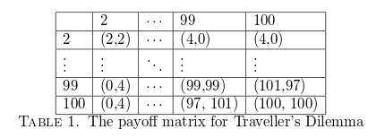

## Table of Contents

## What is the Traveler's Dilemma?

The Traveler's Dilemma is a game theory problem where two players have to independently choose a number between two set values, usually between 2 and 100. Imagine you and a friend are travelers who each bought the same item, but it got damaged. You both need to tell the airline how much the item is worth, and the airline will pay you based on what you say. If you both say the same number, you both get that amount. But if you say different numbers, the person who said the lower number gets the lower number plus a bonus, and the person who said the higher number gets the lower number minus a penalty.

The tricky part is figuring out what number to choose. If you think your friend will say a high number, you might want to say a number just a bit lower to get the bonus. But if you think your friend will say a low number, you might want to say an even lower number to avoid the penalty. This back-and-forth thinking can lead to both players choosing very low numbers, even though they could have gotten more money by choosing higher numbers. It shows how trying to outsmart each other can lead to worse outcomes for everyone.

## Who first proposed the Traveler's Dilemma?

The Traveler's Dilemma was first proposed by an economist named Kaushik Basu. He came up with this idea in the 1990s. Basu wanted to show how people make decisions when they don't know what others will do, and how trying to outthink each other can lead to strange results.

Basu used this game to challenge some common ideas in game theory. He showed that people often don't act the way traditional game theory predicts they should. Instead of choosing the lowest number like the theory suggests, many people choose higher numbers because they think about fairness and what the other person might do. This makes the Traveler's Dilemma a good example of how real people make choices in tricky situations.

## How does the Traveler's Dilemma game work?

The Traveler's Dilemma game is about two people who need to choose a number between two set values, like between 2 and 100. Imagine you and a friend bought the same thing, but it got damaged. You both have to tell the airline how much it's worth. If you both say the same number, you both get that amount of money. But if you say different numbers, things change. The person who said the lower number gets that lower number plus a little extra, called a bonus. The person who said the higher number gets the lower number but loses a little, called a penalty.

The tricky part is figuring out what number to pick. You might think your friend will pick a high number, so you could pick a number just a bit lower to get the bonus. But then you might worry your friend will pick a low number, so you might pick an even lower number to avoid the penalty. This back-and-forth thinking can make both of you pick very low numbers, even though you could have gotten more money by picking higher numbers. It shows how trying to outsmart each other can lead to worse results for everyone.

## What are the basic rules of the Traveler's Dilemma?

In the Traveler's Dilemma game, two people need to pick a number between two set values, like between 2 and 100. Imagine you and a friend bought the same thing, but it got damaged. You both have to tell the airline how much it's worth. If you both say the same number, you both get that amount of money. 

But if you say different numbers, the rules change. The person who said the lower number gets that lower number plus a little extra, called a bonus. The person who said the higher number gets the lower number but loses a little, called a penalty. This game is tricky because you have to guess what the other person will pick, and trying to outsmart each other can lead to both of you picking very low numbers, even though you could have gotten more money by picking higher numbers.

## What is the Nash equilibrium in the Traveler's Dilemma?

The Nash equilibrium in the Traveler's Dilemma is the lowest possible number that players can choose, which is usually 2 if the range is between 2 and 100. This happens because each player thinks about what the other player might do. If one player thinks the other will pick a high number, they might pick a number just a bit lower to get the bonus. But then they worry the other player might pick an even lower number, so they pick an even lower number to avoid the penalty. This thinking goes on and on until both players end up picking the lowest number, like 2.

But in real life, people often don't end up at this Nash equilibrium. They pick higher numbers because they think about fairness and what the other person might do. They might pick a number in the middle, like 50 or 60, hoping the other person does the same. This shows that real people don't always follow the strict rules of game theory, and they care about more than just winning the most money.

## Why does the Nash equilibrium in the Traveler's Dilemma seem counterintuitive?

The Nash equilibrium in the Traveler's Dilemma seems counterintuitive because it suggests that both players should pick the lowest possible number, like 2, to get the best outcome. But in real life, this doesn't make sense. If you and your friend both bought something worth a lot, like $100, why would you both say it's worth only $2? It feels wrong because you could both get more money if you picked a higher number, like $50 or $60, and agreed on it.

This happens because the game's rules make you think about what the other person might do. You might think your friend will pick a high number, so you pick a number just a bit lower to get a bonus. But then you worry your friend might pick a lower number, so you pick an even lower number to avoid a penalty. This back-and-forth thinking leads you both to the lowest number, even though it's not what you'd do in real life. People often pick higher numbers because they think about fairness and what's reasonable, not just about winning the most money.

## How do real players typically behave in the Traveler's Dilemma?

In the Traveler's Dilemma, real players often don't pick the lowest number like the Nash equilibrium says they should. Instead, they pick numbers that seem fair and reasonable. If the range is between 2 and 100, many players might choose numbers around 50 or 60. They do this because they think the other player might pick a similar number, and they want to avoid getting a much lower payout. People care about fairness and what feels right, not just about trying to outsmart the other player.

This behavior shows that real people don't always follow the strict rules of game theory. They think about what the other person might do and try to find a middle ground. Picking a high number like 99 or 100 is risky because if the other player picks a lower number, you could end up with a much smaller amount of money. So, players often go for a number that feels like a safe bet, hoping the other player does the same. This makes the game more about understanding each other than just trying to win the most money.

## What are the psychological factors influencing decisions in the Traveler's Dilemma?

In the Traveler's Dilemma, people's decisions are influenced by many psychological factors. One big factor is fairness. People don't want to feel like they are being unfair to the other player, so they often pick a number that seems reasonable and fair. They might think the other player will do the same, so they choose a middle number like 50 or 60, hoping to get a good amount of money without risking too much. This shows that people care about more than just winning; they want to feel good about their choices.

Another factor is trust. Players might trust that the other person will pick a number close to what they think is fair, so they pick a similar number. If they don't trust the other player, they might pick a lower number to be safe. Also, people can feel regret if they pick a number that's too high and end up with less money than they could have. This fear of regret can make them pick lower numbers to avoid feeling bad later. These psychological factors show that real people don't always follow the strict rules of game theory; they are influenced by their feelings and thoughts about fairness, trust, and regret.

## How does the Traveler's Dilemma relate to other economic theories or games?

The Traveler's Dilemma is closely related to other economic theories and games, especially those in game theory. One similar game is the Prisoner's Dilemma, where two people have to decide whether to cooperate or betray each other. In both games, players need to think about what the other person might do and how their choices will affect the outcome. But while the Prisoner's Dilemma often leads to both players betraying each other, the Traveler's Dilemma can lead to players picking very low numbers even though they could do better by picking higher ones. This shows how different rules can lead to different behaviors, but the basic idea of trying to guess what the other person will do is the same.

Another connection is to theories about how people make decisions. The Traveler's Dilemma shows that people don't always act the way traditional economic theories predict. Instead of picking the lowest number, people often pick numbers that seem fair and reasonable. This behavior is similar to what happens in other economic theories like behavioral economics, which looks at how real people make choices based on feelings like fairness, trust, and regret. These theories help explain why people might not always pick the "best" choice according to strict economic rules, but instead choose what feels right to them.

## What are the practical implications of the Traveler's Dilemma in real-world scenarios?

The Traveler's Dilemma shows us how people make choices when they don't know what others will do. In real life, this can happen in many situations, like when businesses have to decide on prices without knowing what their competitors will do. If a business thinks its competitor will set a high price, it might set a slightly lower price to get more customers. But if it thinks the competitor will set a low price, it might set an even lower price to stay in the game. This back-and-forth thinking can lead to very low prices, which can hurt all the businesses involved, just like in the Traveler's Dilemma where both players end up picking low numbers.

Another practical example is in negotiations, like when two people are trying to agree on a price for something. If one person thinks the other will ask for a high price, they might offer a bit less to start the bargaining. But if they think the other will ask for a low price, they might offer an even lower price to get a better deal. This can lead to both people ending up with a lower price than they might have if they had started with higher numbers. The Traveler's Dilemma helps us see how trying to outthink each other can lead to outcomes that aren't the best for anyone involved.

## How have experimental results on the Traveler's Dilemma varied across different cultures?

Experimental results on the Traveler's Dilemma have shown that people from different cultures can behave differently when playing the game. In some cultures, like in Western countries, players often pick numbers that are higher and more in the middle of the range, like 50 or 60. This might be because people in these cultures value fairness and think about what the other person might do. They want to avoid getting a much lower payout, so they try to find a middle ground that feels fair to both players.

In other cultures, like in some Asian countries, players might pick lower numbers more often. This could be because these cultures might focus more on avoiding risk and not wanting to feel regret if they pick a number that's too high. People in these cultures might be more cautious and think about the worst-case scenario, so they pick lower numbers to be safe. These differences show that cultural values and ways of thinking can affect how people make decisions in games like the Traveler's Dilemma.

## What modifications have been suggested to the Traveler's Dilemma to better reflect real-world decision-making?

Some people have suggested changing the Traveler's Dilemma to make it more like real life. One idea is to let players talk to each other before they pick their numbers. This way, they can try to agree on a fair number and avoid picking very low numbers. Another change could be to make the bonus and penalty smaller. If the bonus and penalty are too big, players might pick low numbers to be safe. But if they are smaller, players might feel more okay with picking higher numbers because the risk isn't as big.

These changes can help the game show how people really make choices. In real life, people often talk things out and try to find a middle ground. They also think about what's fair and what the other person might do. By making the game more like this, we can see how people's decisions might be different when they can talk and when the risks are not so big. This can help us understand how to make better decisions in real life, like when we are negotiating or setting prices.

## What is the Traveler's Dilemma in Game Theory?

Traveler's Dilemma, conceptualized by economist Kaushik Basu, serves as an intriguing example within game theory, representing a non-zero-sum game characterized by strategic decision-making and uncertainty. The dilemma involves two players, typically depicted as travelers, whose objective is to maximize their individual payoffs. This situation introduces the 'paradox of rationality', where decisions that deviate from strict rationality or self-interest can potentially lead to superior outcomes.

The setup of Traveler’s Dilemma is as follows: each player independently decides on a numerical value within a given range, commonly $2 to $100. Both players declare their value simultaneously without prior knowledge of the other’s choice. The general rule dictates that if both players choose the same number, they each receive that amount in payoffs. However, if the numbers differ, the player who selected the lower value receives an additional monetary reward (say $2), while the other player with the higher value incurs a penalty, receiving the lower chosen amount minus the same reward.

Mathematically, let $x_1$ and $x_2$ represent the chosen values by player 1 and player 2, respectively. The payoff function for player 1, denoted as $\pi_1$, is:

$$
\pi_1 = 
\begin{cases} 
x_1 + 2 & \text{if } x_1 < x_2 \\
x_1 & \text{if } x_1 = x_2 \\
x_2 - 2 & \text{if } x_1 > x_2 
\end{cases}
$$

Similarly, the payoff function for player 2, $\pi_2$, is defined analogously.

The intriguing element of this game is the identification of the Nash Equilibrium, where players are compelled to choose the smallest possible amount, which is often counterintuitive. In classical game theory analysis, strictly rational players will consecutively underbid each other, reasoning that choosing a value just below the opponent might yield a better payoff. This recursive logic ultimately leads both players to select the minimum boundary value as the Nash Equilibrium, despite the potential for higher payoffs through different choices. However, this Nash Equilibrium does not necessarily align with the maximum joint payoff potential, underscoring the dilemma's embodiment of the 'paradox of rationality'.

Traveler’s Dilemma contributes significantly to our understanding of human behavior in economic contexts by illustrating that decision-making is nuanced and complex. It shows that strict adherence to rational choice can sometimes lead to suboptimal results, particularly when the assumptions of rational behavior conflict with broader economic incentives. Behavioral game theory, which takes into account more than just classical rational strategies, often observes participants adopting cooperative strategies that push them away from Nash Equilibrium in favor of higher joint payoffs.

Overall, examining Traveler's Dilemma provides essential insights into human behavior and aids in understanding how strategic decisions are formulated in various economic scenarios.

## References & Further Reading

[1]: Basu, K. (1994). "The Traveler's Dilemma: Paradoxes of Rationality in Economics." American Economic Review, 84(3), 391-398.

[2]: Dixit, A. K., & Nalebuff, B. J. (2008). ["The Art of Strategy: A Game Theorist's Guide to Success in Business and Life."](https://www.amazon.com/Art-Strategy-Theorists-Success-Business/dp/0393337170) W.W. Norton & Company.

[3]: Osborne, M. J., & Rubinstein, A. (1994). ["A Course in Game Theory."](https://www.semanticscholar.org/paper/A-Course-in-Game-Theory-Osborne-Rubinstein/ef336fe9c04559654936413f4910a54b7ae5028c) MIT Press.

[4]: Camerer, C. F. (2003). ["Behavioral Game Theory: Experiments in Strategic Interaction."](https://psycnet.apa.org/record/2003-06054-000) Princeton University Press.

[5]: Shapiro, C., & Varian, H. R. (1998). ["Information Rules: A Strategic Guide to the Network Economy."](https://link.springer.com/article/10.1023/A:1007897212472) Harvard Business Press.

[6]: Whitford, J. (2018). ["Game Theory and the Transformation of Family Law."](https://onlinelibrary.wiley.com/doi/pdf/10.1111/fcre.12233) Harvard University Press.