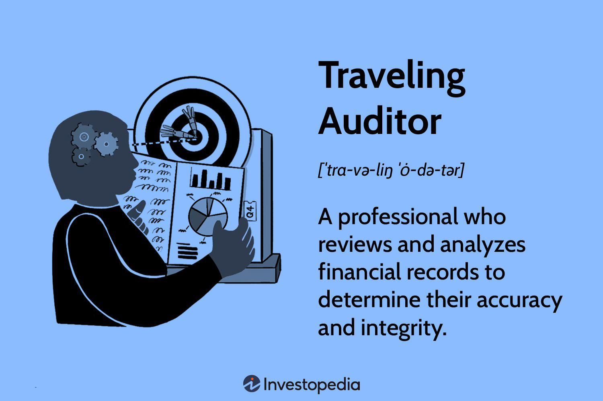

In the modern financial landscape, the roles of a traveling accounting auditor and algorithmic trading are interconnected yet distinct. This article explores these vital areas, their intersection, and the implications for businesses and investors. First, we will define what a traveling accounting auditor entails and then turn to the world of algorithmic trading. Understanding these concepts is crucial for financial professionals who aim to leverage opportunities across diverse markets. Traveling accounting auditors play a pivotal role in ensuring the accuracy, compliance, and reliability of financial records across multiple locations. Their work contributes significantly to transparency and the integrity of financial reporting, offering insights that are essential for maintaining trust in financial statements.

Algorithmic trading, on the other hand, involves using advanced algorithms to execute trades swiftly and efficiently on financial markets. This practice has gained enormous traction due to its potential to minimize human error and exploit market opportunities in real-time. The automation in trading processes presents opportunities for speed and efficiency but also introduces risks that require careful oversight and robust risk management frameworks.



While traveling accounting auditors focus on accuracy and compliance, algorithmic trading emphasizes speed and strategic execution. These differing priorities highlight a unique interconnection where the insights from auditors can enhance the oversight and compliance of algorithmic trading systems, ensuring that trading practices are not only profitable but also ethical and compliant with regulations. This synergy between auditing and algorithmic trading underscores the need for collaboration and mutual understanding in an ever-evolving financial landscape. Such a relationship ensures that professionals in both fields can adequately prepare to navigate the complexities of global financial markets. By understanding these dynamics, businesses and investors can better anticipate changes in the financial sector, ensuring resilience and adaptability in their strategic approaches.

## Table of Contents

## Understanding Traveling Accounting Auditors

A traveling accounting auditor is a professional tasked with performing audits across various locations of a company, ensuring that financial statements and records are accurate and compliant with applicable laws and regulations. These auditors play a pivotal role in maintaining the transparency and integrity of a company’s financial reporting.

The key responsibilities of a traveling accounting auditor include examining financial records and supporting documents to ensure that transactions are accurately recorded and reported. This involves verifying the correctness of financial statements, assessing the internal control systems, and checking compliance with relevant accounting standards and statutory requirements. For example, in the United States, auditors ensure compliance with Generally Accepted Accounting Principles (GAAP) and regulations set forth by the Securities and Exchange Commission (SEC) for publicly traded companies.

Traveling auditors must possess strong analytical skills, enabling them to identify discrepancies and inefficiencies within financial systems. Analytical prowess is essential for effectively scrutinizing complex financial data, pinpointing irregularities, and evaluating the effectiveness of current financial controls. These professionals often work independently, which necessitates a high degree of self-motivation and discipline, as they must frequently travel to different branches or subsidiaries to conduct audits.

Their work is integral to ensuring that organizations present an accurate financial picture, which is crucial for stakeholder trust and decision-making. By analyzing and interpreting financial data, auditors also offer valuable insights and recommendations. These suggestions may include implementing stricter internal controls, optimizing financial procedures, and adopting best practices for financial management. The goal is to enhance the reliability and efficiency of the company’s financial operations, ultimately contributing to better financial oversight and governance.

In summary, traveling accounting auditors are indispensable in reinforcing the credibility of financial information across distributed business locations. Their expertise not only helps in upholding financial transparency but also in identifying opportunities to bolster financial stability and operational performance.

## Exploring Algorithmic Trading

Algorithmic trading involves the use of automated systems powered by intricate algorithms to execute trades with remarkable speed and precision. This form of trading primarily capitalizes on high-frequency trading strategies, allowing large volumes of orders to be placed in milliseconds based on computational analysis of market trends. 

By leveraging sophisticated algorithms, traders can analyze vast datasets to identify market conditions conducive to making profitable trades. Factors such as price movements, [volume](/wiki/volume-trading-strategy), timing, and historical patterns play a critical role, allowing the software to make swift and informed trading decisions. The process can be exemplified by the use of moving averages, where buy or sell signals are generated when shorter-period moving averages cross through longer-period ones.

The primary advantage of [algorithmic trading](/wiki/algorithmic-trading) lies in its ability to minimize human error and implement trades at speeds unattainable by manual execution. This automation reduces the potential for emotional decision-making that can affect trading outcomes, optimizing the execution strategy through precise timing and size of trades.

However, algorithmic trading is not without its challenges. The inherent risks include potential market manipulation, where traders with sophisticated algorithms can influence market conditions. Moreover, there is a critical need for robust risk management systems to mitigate the adverse effects of unforeseen algorithmic errors that might result in significant financial losses. This risk is highlighted in events such as the "Flash Crash" of 2010, where millions were wiped from the market within minutes due to errant trading algorithms.

Understanding the mechanics and the balance of these advantages and challenges is crucial for investors who wish to automate trading practices. It necessitates a comprehensive grasp of both the technology and the underlying principles driving market operations. As a result, financial professionals increasingly rely on computer programming languages like Python to design and optimize trading algorithms, given its robust libraries for data analysis and [machine learning](/wiki/machine-learning).

```python
# Simple example of an algorithmic trading strategy using moving averages
import pandas as pd

def moving_average_trading(data, short_window=40, long_window=100):
    signals = pd.DataFrame(index=data.index)
    signals['price'] = data['price']

    # Compute the short and long moving averages
    signals['short_ma'] = data['price'].rolling(window=short_window, min_periods=1, center=False).mean()
    signals['long_ma'] = data['price'].rolling(window=long_window, min_periods=1, center=False).mean()

    # Create buy/sell signals
    signals['signal'] = 0.0
    signals['signal'][short_window:] = np.where(signals['short_ma'][short_window:] > signals['long_ma'][short_window:], 1.0, 0.0)   
    signals['positions'] = signals['signal'].diff()

    return signals

# Example usage
data = pd.DataFrame({'price': [100, 102, 101, 105, 108, 109, 110, 108, 112, 115]})
signals = moving_average_trading(data)
```

This simplistic approach to algorithmic trading provides a framework that can be expanded with machine learning models for more advanced predictive analysis, further integrating algorithmic efficiency with financial market operations.

## Interconnection and Implications

At the intersection of traveling accounting auditors and algorithmic trading, a nuanced perspective on financial integrity and trading strategy emerges. Auditors who are knowledgeable about algorithmic trading can better identify potential risks and compliance issues inherent to financial institutions. Algorithmic trading, given its reliance on complex algorithms, presents unique challenges that demand a thorough understanding of the software's underlying mechanisms. Auditors equipped with this knowledge can effectively assess whether these algorithms comply with financial regulations, thereby safeguarding against possible illegal practices such as market manipulation.

For traders, incorporating insights from auditors into the trading process enhances the oversight of trading algorithms and improves compliance structures. Auditors' impartial analysis can help identify gaps or vulnerabilities in trading systems, prompting more robust risk management measures. This can result in strategies that are not only effective but also resilient against unforeseen market shifts or regulatory changes.

The rapid evolution of technology necessitates that both fields remain agile in adapting to innovations to maintain their effectiveness and security. As algorithmic trading becomes more sophisticated, auditors must advance their technological proficiency to understand and evaluate the complexities of trading systems accurately. Similarly, traders must recognize the value of incorporating audit findings into their operations to enhance their security measures and ensure regulatory compliance.

The symbiotic relationship between traveling accounting auditors and algorithmic trading emphasizes the need for collaboration to achieve optimal results. By working together, these sectors can enhance financial transparency and integrity, ultimately leading to a more secure and efficient financial ecosystem. It is through such collaboration that businesses and investors can better prepare to navigate the evolving landscape of finance.

## Benefits and Challenges

Traveling accounting auditors are crucial for maintaining financial integrity across multiple company locations. Their independent assessments and impartial analyses enhance the scrutiny of financial statements, ensuring accurate and transparent reporting. This role is pivotal for multi-location enterprises as it fosters consistency and compliance with relevant laws and regulations throughout the organization. However, these auditors face significant challenges, such as the demanding nature of extensive travel to various locations, which can lead to personal and professional fatigue. Moreover, they must continuously learn and adapt to different regulatory environments, which vary widely across jurisdictions. This continuous learning curve necessitates staying informed about local laws, accounting standards, and best practices to maintain effectiveness in their role.

Algorithmic trading, on the other hand, offers substantial benefits in the realm of speed and efficiency. By using pre-programmed algorithms, traders can execute trades at high speed, enabling them to capitalize on minute market opportunities that may be inaccessible to human traders. This automation minimizes human error and enhances the precision of trading strategies, potentially leading to higher profitability. Nevertheless, algorithmic trading is not without its challenges. One primary concern is the risk of algorithmic errors, such as coding mistakes or unexpected interactions between automated systems, which can lead to significant financial losses. Furthermore, the potential for market abuse, such as 'quote stuffing' or other manipulative practices, necessitates the implementation of robust monitoring and risk management systems to ensure fair trading practices and maintain market integrity.

Both traveling accounting auditors and algorithmic trading are indispensable in today's fast-paced financial ecosystem. Auditors provide the necessary checks and balances to ensure financial transparency and accountability, while algorithmic trading offers traders the tools needed to achieve optimal market positioning. Each role brings its unique advantages and hurdles, emphasizing the need for both positions to adapt continually to technological advancements and changing market conditions. This adaptability is essential for maintaining their respective contributions to the broader financial industry.

## Conclusion

The roles of traveling accounting auditors and algorithmic trading represent pivotal elements within the financial industry. In an era characterized by rapid technological advancement and evolving market dynamics, these roles are anticipated to become increasingly complex and interdependent.

Traveling accounting auditors, with their vital function in validating financial transparency and compliance, are subject to changes driven by global economic integration and technological innovations. The ability to adapt to diverse regulatory environments and emerging auditing technologies will be crucial for these professionals. Their work ensures that financial records accurately reflect a company's operations, bolstering investor confidence and organizational credibility.

Meanwhile, algorithmic trading continues to revolutionize the way trades are executed, offering unprecedented speed and accuracy. However, as these systems grow more intricate, safeguarding against potential errors and misuse becomes paramount. Traders deploying algorithmic techniques must constantly refine their algorithms to manage risks effectively and comply with regulatory standards, necessitating a robust understanding of both trading strategies and compliance measures.

The interplay between these two sectors enhances financial operations' transparency, security, and efficiency. Auditors can leverage their knowledge to assess and improve algorithmic trading systems, while traders can benefit from auditors' insights to ensure precise and compliant trading activities. Through collaboration, professionals from both fields can drive innovation while mitigating risks.

Staying informed of industry developments and fostering effective communication between auditors and traders are essential steps forward. This approach not only ensures the integrity and reliability of financial systems but also prepares businesses and investors to adeptly navigate the future financial landscape, characterized by increased complexity and integration.

## References & Further Reading

[1]: Griffiths, I. (2016). ["Financial Reporting and Regulation"](https://onlinelibrary.wiley.com/doi/abs/10.1111/1475-679X.12115) by Richard Lewis and Iain Griffiths.

[2]: Lopez de Prado, M. (2018). ["Advances in Financial Machine Learning"](https://www.amazon.com/Advances-Financial-Machine-Learning-Marcos/dp/1119482089) by Marcos Lopez de Prado.

[3]: Aronson, D. R. (2007). ["Evidence-Based Technical Analysis: Applying the Scientific Method and Statistical Inference to Trading Signals"](https://www.amazon.com/Evidence-Based-Technical-Analysis-Scientific-Statistical/dp/0470008741) by David R. Aronson.

[4]: Jansen, S. (2020). ["Machine Learning for Algorithmic Trading"](https://github.com/stefan-jansen/machine-learning-for-trading) by Stefan Jansen.

[5]: Chan, E. P. (2008). ["Quantitative Trading: How to Build Your Own Algorithmic Trading Business"](https://github.com/ftvision/quant_trading_echan_book) by Ernest P. Chan.

[6]: U.S. Securities and Exchange Commission. ["Beginners' Guide to Financial Statements"](https://www.sec.gov/about/reports-publications/investorpubsbegfinstmtguide). 

[7]: Carpenter, S., & Petersen, M. (2002). ["Capital Risk, Liquidation Threat, and Financing Banks: A Study of Banking Deregulation."](https://direct.mit.edu/rest/article/84/2/298/57331/Is-the-Growth-of-Small-Firms-Constrained-by) National Bureau of Economic Research Working Paper No. 8124.