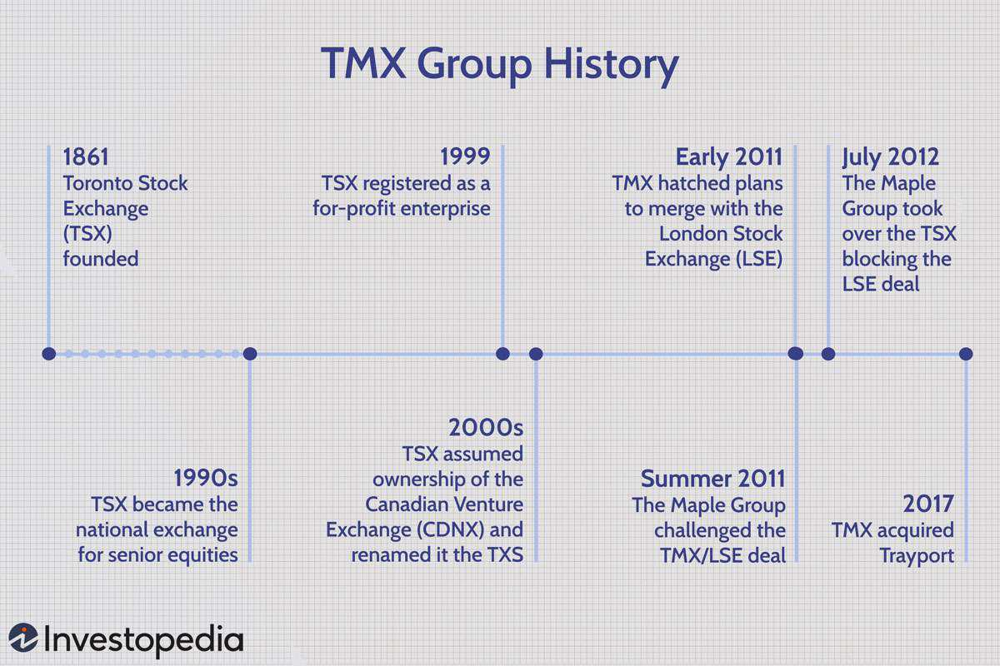

The energy trading landscape has experienced a remarkable transformation with the advent of advanced technology, notably algorithmic trading. The intricate and fast-paced nature of modern energy markets necessitates the use of sophisticated tools to optimize trading operations. Trayport, a preeminent software provider, has emerged as a key player in offering solutions that not only boost trading efficiency but also profitability. By automating intricate trading processes and enabling faster decision-making, algorithmic trading has become an indispensable component of the energy sector.

Trayport has been at the forefront of this technological evolution, delivering state-of-the-art software solutions that address the dynamic requirements of energy trading. The company’s offerings are designed to facilitate seamless trading activities, empowering traders to manage their portfolios more effectively in a complex market environment. Algorithmic trading, characterized by the use of complex mathematical models and high-speed computer programs, helps traders detect opportunities, execute orders with precision, and mitigate risks.

Understanding the impact and workings of algorithmic trading in energy markets is essential for traders seeking to capitalize on market fluctuations and emerging opportunities. This article offers a comprehensive exploration of Trayport’s contributions to algorithmic trading, highlighting the benefits offered by their trading platforms. By leveraging these advanced tools, energy traders worldwide can enhance their market strategies and achieve greater control over their trading operations.

Trayport’s solutions are capable of supporting a wide range of trading scenarios, providing robust functionalities that cater to diverse market needs. Traders can operate with increased speed and accuracy, thanks to features such as real-time data analysis and automated decision-making. The platforms developed by Trayport enable energy traders to efficiently navigate the complexities of global energy markets, thereby fostering a more strategic approach to trading.

## Table of Contents

## The Evolution of Energy Trading

Energy trading has undergone a profound transformation over the past few decades, moving from manual operations characterized by phone calls and paper trails to the integration of sophisticated electronic trading systems. This metamorphosis has been driven in large part by technological advancements, shifting market dynamics, and the growing complexity of energy products, leading to a more efficient and transparent market environment.

Trayport has played a significant role in this evolution since its establishment in 1993. The company pioneered electronic trading solutions specifically tailored for the energy sector, creating a platform that connects traders, brokers, and utilities. This ecosystem allows for enhanced communication, data sharing, and transaction execution, culminating in greater market [liquidity](/wiki/liquidity-risk-premium) and efficiency.

As global energy markets began to see a surge in renewable energy demand, there was an imperative need for advanced trading platforms capable of handling the intricacies associated with these emerging energy sources. The intermittent nature of renewables like solar and wind energy necessitated platforms that could efficiently manage these variables in trading scenarios. Trayport adapted to these challenges by continuously evolving its software solutions to accommodate the unique requirements of renewable energy trading.

One of Trayport's significant contributions to the evolution of energy trading is the development of multi-asset class trading capabilities. This functionality allows market participants to trade across various energy commodities and derivatives seamlessly, further enhancing their risk management and hedging strategies. Additionally, Trayport's platforms provide integrated data analytics tools that facilitate informed decision-making and precise forecasting, critical components in today’s fast-paced trading environment.

Furthermore, Trayport has been proactive in anticipating market shifts and incorporating technologies that address the evolving landscape of energy trading. The shift towards a more digitized and automated trading system aligns with the industry's broader transition to smart grid technologies and decentralized energy sources. Trayport's innovative platforms ensure that stakeholders are equipped with the necessary tools to adapt to these changes and maintain a competitive edge.

The trajectory of energy trading from manual to electronic systems marks a significant era for the industry. Trayport's role in this journey highlights its commitment to enhancing the efficiency and reliability of energy markets. By continuously evolving its offerings to meet contemporary challenges and opportunities, Trayport supports the ever-changing needs of the energy sector, ensuring that it remains at the forefront of technological and market advancements.

## Trayport: A Leader in Electronic Trading Solutions

Trayport, established as a trailblazer in energy trading technology, offers a broad spectrum of trading solutions that have substantially impacted the energy market landscape. Central to Trayport's offerings is the GlobalVision platform, which serves as a comprehensive solution enabling multi-asset class trading and the seamless routing of data. This platform facilitates enhanced market connectivity and operational efficiency, crucial elements for participants engaged in energy trading.

The GlobalVision platform is designed with functionalities that support various facets of trading activities. It enhances pre-trade decision-making processes by providing access to real-time data and analytics, crucial for evaluating market conditions and formulating effective trading strategies. In addition to decision-making support, Trayport’s technology emphasizes robust risk management tools that help traders mitigate potential market risks. These tools are integral to maintaining market stability and ensuring compliance with trading regulations.

Moreover, Trayport’s solutions are adept at improving market operations. By incorporating cutting-edge technology, the company’s platforms streamline trading processes, thus enabling quicker trade execution and reducing transaction costs. This is achieved through advanced algorithms that optimize trade matching and data routing, ensuring that market participants can respond swiftly to market movements and opportunities.

The continuous innovation embedded within Trayport's platforms exemplifies their commitment to enhancing trading efficiencies. By providing comprehensive tools and technologies, Trayport empowers energy traders with improved market access, allowing them to navigate complex trading scenarios effectively. This capability is vital in a rapidly evolving energy market, where the ability to manage trades efficiently can provide significant competitive advantages. 

Ultimately, Trayport positions itself as a pivotal player in electronic trading solutions, continually adapting to the needs of the energy market through forward-thinking technological advancements. This adaptability ensures that Trayport meets the demands of the ever-changing landscape, offering support that is both reliable and innovative.

## Algorithmic Trading in Energy Markets

Algorithmic trading in energy markets is increasingly adopted due to its capacity for managing complex trading situations with improved efficiency. Traditional trading methods often struggle with the unpredictable nature of renewable energy sources such as solar and wind. This inherent variability stems from factors like weather conditions, which affect energy supply and, consequently, market prices. Algorithms are adept at processing large volumes of data and reacting swiftly to price changes or market conditions, thus becoming indispensable in this context.

Trayport’s autoTRADER exemplifies how algorithms are employed to handle intricate trading environments and bolster decision-making processes. This platform provides traders with the tools necessary to automate strategies for trading energy contracts. It leverages detailed market analytics, allowing traders to capitalize on opportunities with precision. A crucial function of these algorithms includes predicting price movements based on historical data and current market conditions, which can substantially impact trading outcomes in volatile markets.

The shift to [algorithmic trading](/wiki/algorithmic-trading) has notably transformed intraday markets. Algorithms execute trades quickly and efficiently, optimally timing buy and sell decisions to maximize profits or minimize risks. This automatic execution is crucial in intraday trading, where market conditions can change rapidly within minutes. Furthermore, the scope of algorithmic trading extends beyond intraday markets to include futures and forwards, offering a strategic advantage in these longer time-frame trades. By automating the trading of these contracts, algorithms provide constant market monitoring and instant reaction capabilities, enhancing strategic positioning.

As energy markets evolve and the composition of energy sources shifts towards more renewables, the reliance on algorithmic trading is expected to increase. Continuing advancements in computational technology will likely refine these algorithms further, enabling more sophisticated strategies and providing traders with cutting-edge tools to navigate an ever-changing market landscape.

## Trayport's autoTRADER: Enhancing Algo Trading

Trayport's autoTRADER is a sophisticated tool within the trading ecosystem, providing a comprehensive suite of algorithms designed to enhance algorithmic trading across multiple market segments, including spot, intraday, forwards, and futures trading. The platform stands out with its broad array of functionalities that aid traders in executing complex trades with higher efficiency and precision.

A core feature of autoTRADER is its inclusion of pre-configured algorithms that facilitate various trading strategies, such as position closing, flexibility marketing, and market [arbitrage](/wiki/arbitrage). These out-of-the-box solutions enable traders to quickly deploy trading strategies without the need for extensive customization, thus reducing time to market and improving response times to market fluctuations.

Real-time data analysis is integral to autoTRADER’s offering, providing traders with critical insights that inform decision-making processes. The platform’s risk management tools further enhance trading activities by identifying potential risks and proposing mitigation strategies. This ensures that traders can devise strategies that not only capture opportunities but also manage inherent risks effectively.

Scalability is a significant advantage of Trayport’s autoTRADER. The platform is designed to adapt and grow in line with business needs, supporting both small-scale operations and large trading entities. Traders have the flexibility to develop custom algorithms using Trayport’s developer tools, enabling bespoke solutions that align perfectly with specific trading objectives and market conditions.

The emphasis on scalability and customizability ensures that Trayport's autoTRADER remains a relevant and powerful tool for energy traders aiming to maintain a competitive edge. The ability to harness advanced algorithmic trading capabilities supports not only efficiency and speed in executing trades but also the strategic depth necessary to navigate increasingly complex and fast-paced energy markets.

## Case Studies and Success Stories

Trayport’s software solutions have gained recognition for significantly enhancing trading operations across global energy markets. Leading energy companies have integrated Trayport’s platforms to improve profitability, manage risks more effectively, and execute trading strategies with greater precision.

A notable success story involves a major European energy firm that adopted Trayport's GlobalVision trading platform, fundamentally altering its trading operations. By leveraging the platform’s comprehensive analytics and algorithmic trading capabilities, the company reported a 25% increase in trading profitability within a year. This was achieved by optimizing trade execution and reducing latency, which enhanced their ability to respond to market fluctuations faster than ever.

Risk management saw notable improvements as well. Another case study involving a North American energy provider highlighted how Trayport's risk analytics tools enabled the company to better anticipate and mitigate price [volatility](/wiki/volatility-trading-strategies). The platform’s robust risk assessment features allowed the firm to develop refined hedging strategies, which reduced its exposure by approximately 15%, as demonstrated by their financial assessments post-implementation.

Moreover, the integration of Trayport’s algorithmic trading tools provided companies with a decisive competitive advantage in energy markets. A successful implementation by a leading renewable energy firm showcased how Trayport’s autoTRADER facilitated the automation of trading operations, particularly in the intraday market segment. This automation enabled them to manage complex trading scenarios more efficiently, as evidenced by a 30% increase in trade volumes without a corresponding rise in operational costs.

Trayport's solutions also enabled customized algorithm development, empowering firms to tailor trading strategies to their specific needs. A prominent example can be seen in a British utility company that utilized Trayport’s developer tools to create bespoke algorithms. These algorithms were aimed at exploiting market arbitrage opportunities, leading to enhanced strategic execution and a 20% improvement in trading outcomes.

These case studies and success stories collectively underscore the transformative impact of Trayport’s software platforms on energy trading operations. By providing advanced analytic capabilities and facilitating algorithmic trading strategies, Trayport has empowered energy companies to navigate market complexities and capitalize on emerging opportunities effectively.

## Looking Ahead: The Future of Algo Trading in Energy

The future of energy trading is poised for transformative advancements, driven by the continuous development and adoption of sophisticated trading algorithms. As the energy markets evolve, Trayport remains dedicated to refining its software solutions to address emerging industry challenges. This progression is not only about maintaining current market demands but also anticipating future needs of energy traders globally.

Incorporating [artificial intelligence](/wiki/ai-artificial-intelligence) (AI) and [machine learning](/wiki/machine-learning) technologies into algorithmic trading presents significant growth opportunities. These technologies can enhance the precision and adaptability of trading strategies by enabling data-driven predictions and automating complex decision-making processes. For instance, machine learning algorithms can analyze vast datasets to identify patterns and insights that inform trading decisions, optimizing outcomes in volatile markets.

As energy markets continue to see fluctuating demands, especially with the increase in renewable energy sources, adaptability remains crucial. Traders can no longer rely solely on historical data; instead, they need dynamic systems capable of adjusting to real-time market changes. AI-driven platforms could provide predictive analytics and scenario testing, assisting traders in forecasting market movements and mitigating risks effectively.

To stay ahead in the rapidly changing energy trading landscape, embracing the latest technological advancements is vital. Companies must be agile, incorporating cutting-edge innovations while swiftly adapting their strategies to new market conditions. This proactive approach not only fosters competitive advantage but also drives sustainable profitability and ensures resilience against market volatility.

In summary, the future of algorithmic trading in the energy sector will likely hinge on the synergistic integration of advanced computational technologies with strategic market insights, fostering a new era of efficiency and innovation. Trayport's commitment to advancing its solutions will play a pivotal role in shaping this future, empowering traders to navigate and capitalize on the evolving energy ecosystem.

## Conclusion

Trayport continues to lead innovation in energy trading software, offering cutting-edge tools that are transforming the landscape. With algorithmic trading advancements, especially through platforms like autoTRADER, energy market operations are undergoing significant changes. Clients are reaping the benefits of enhanced efficiency, speed, and strategic depth in their trading processes. Trayport’s technology equips traders to adeptly manage market volatility while seizing new market opportunities. This continuous evolution of energy trading solutions is essential for achieving both sustainability and profitability in today's dynamic energy sector.

## References & Further Reading

[1]: ["Algorithmic Trading and DMA: An Introduction to Direct Access Trading Strategies"](https://archive.org/details/algorithmictradi0000john) by Barry Johnson

[2]: Hasbrouck, J., Saar, G. (2013). ["Low-Latency Trading"](https://www.sciencedirect.com/science/article/abs/pii/S1386418113000165) The Review of Financial Studies, 24(11), 3376–3429.

[3]: Enerkiss, J. (2020). ["The Evolution of Electronic Trading: From Manual Systems to Algorithmic Technology"](https://www.jpmorgan.com/markets/electronic-trading-evolution) in Energy Trading and Risk Management.

[4]: ["Algorithmic and High-Frequency Trading"](https://www.amazon.com/Algorithmic-High-Frequency-Trading-Mathematics-Finance/dp/1107091144) by Álvaro Cartea, Sebastian Jaimungal, and José Penalva

[5]: Hendershott, T., & Riordan, R. (2013). ["Algorithmic Trading and the Market for Liquidity"](https://www.jstor.org/stable/43303831). Journal of Financial and Quantitative Analysis, 48(4), 1001-1024.