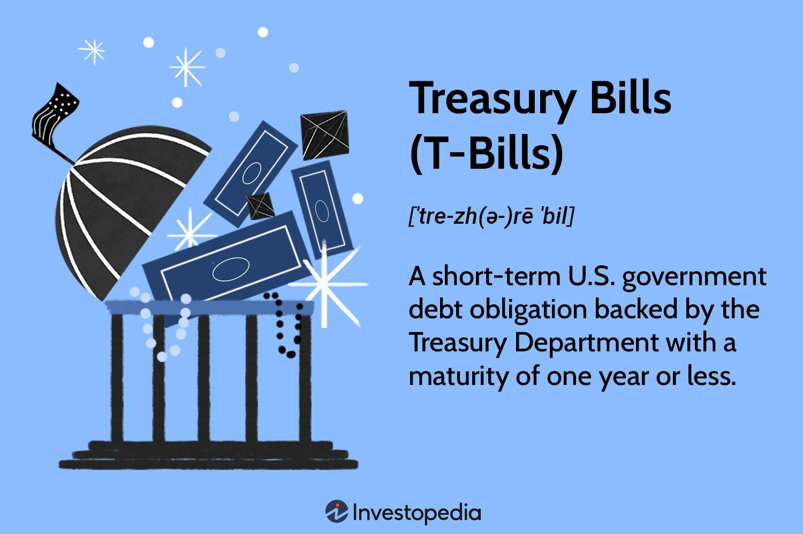

Treasury Bills (T-Bills) represent a critical component of government securities, offering investors a secure, short-term investment option with minimal risk. Issued by the U.S. Department of the Treasury, T-Bills are essential for the government's short-term funding needs and provide a reliable investment instrument that supports the financial markets' stability. In today's dynamic financial landscape, where market volatility and uncertainty are prevalent, T-Bills serve as a foundational element for portfolios seeking preservation of capital and liquidity.

T-Bills' relevance in the financial markets is underscored by their widespread use as a benchmark for risk-free rates, influencing a wide array of financial derivatives and market instruments. Institutional and individual investors utilize T-Bills to manage cash flow, diversify investment holdings, and hedge against inflation. T-Bills are particularly attractive given their exemptions from state and local taxes, making them a viable option for those looking to optimize their after-tax returns.



The financial markets continue to evolve, driven by technological advancements and increasing reliance on data-driven analysis. One such evolution is the rise of algorithmic trading, which has transformed the landscape by optimizing trading strategies through programmed instructions and sophisticated algorithms. Algorithmic trading in T-Bills markets harnesses computational power to execute trades at speeds and efficiencies unachievable by human traders alone. This application aligns well with the objectives of traders and investors who seek to exploit minute price discrepancies and react to interest rate movements in real-time.

By employing algorithms, investors can better analyze interest rate trends, economic indicators, and market conditions, thereby enhancing the decision-making process in T-Bill investments. As a result, algorithmic trading is not only a powerful tool for maximizing returns but also for mitigating risks and maintaining the security and stability that T-Bills inherently provide.

In conclusion, Treasury Bills remain a cornerstone of government security investments, providing investors with a low-risk instrument for short-term capital needs. The integration of algorithmic trading into T-Bill markets has the potential to increase trading efficiency and exploit opportunities, underscoring the continuing relevance of T-Bills in modern financial markets.

## Table of Contents

## What Are Treasury Bills?

Treasury Bills (T-Bills) are short-term government debt obligations issued by the U.S. Department of the Treasury. Designed to assist the government in managing its short-term financing needs, these financial instruments are a pivotal component of the nation's economic framework. Unlike other forms of government securities, T-Bills do not pay periodic interest. Instead, they are issued at a discount to their face value, with the investor receiving the full face value upon maturity. This difference between the purchase price and the face value represents the interest income to the holder.

Typically, T-Bills are issued with maturities ranging from four to 52 weeks. Common durations include four, eight, 13, 26, and 52 weeks, making them highly flexible instruments for managing [liquidity](/wiki/liquidity-risk-premium) and short-term investment horizons. Investors can choose from these varying maturities based on their cash flow needs or economic outlook.

The process of purchasing T-Bills involves participating in an auction typically held weekly. In these auctions, T-Bills are sold directly to the public, including individuals, corporations, financial institutions, and foreign governments. The Treasury Department issues T-Bills in two distinct bidding formats: competitive and non-competitive. Non-competitive bidders agree to accept the discount rate determined at auction, ensuring they receive the desired quantity of T-Bills. Conversely, competitive bidders specify the discount rate they are willing to accept, with allocations awarded starting from the lowest accepted bids until the Treasury's borrowing needs are met.

The rationale for purchasing T-Bills at a discount can be understood through the following example: Suppose an investor buys a $10,000 T-Bill for $9,800 at a one-year maturity. Upon maturity, the investor receives the face value of $10,000. The interest income, or yield, is calculated as the difference between $10,000 and $9,800, amounting to $200. The yield can be further expressed as a percentage through the formula:

$$
\text{Yield} = \left( \frac{\text{Face Value} - \text{Purchase Price}}{\text{Purchase Price}} \right) \times 100
$$

Applying this formula, the yield is:

$$
\text{Yield} = \left( \frac{10,000 - 9,800}{9,800} \right) \times 100 \approx 2.04\%
$$

This zero-coupon nature of T-Bills, where interest is effectively built into the purchase process, minimizes complications associated with reinvestment risk and [interest rate](/wiki/interest-rate-trading-strategies) fluctuations. Consequently, T-Bills are considered low-risk assets, attractive to risk-averse investors seeking a secure parking spot for their funds. Their historical performance as safe, low-yield investments continues to sustain their relevance in today's volatile markets.

## How to Invest in T-Bills

Investing in Treasury Bills (T-Bills) can be an appealing option for individuals seeking a low-risk, short-term investment backed by the U.S. government. To participate, investors typically use TreasuryDirect or brokerage firms.

### Purchasing T-Bills through TreasuryDirect

TreasuryDirect is an online platform operated by the U.S. Department of the Treasury. It allows individuals to purchase T-Bills and other Treasury securities directly from the government, eliminating the need for intermediaries. Here's how to set up an account and purchase T-Bills:

1. **Visit the TreasuryDirect Website**: Navigate to [TreasuryDirect](https://www.treasurydirect.gov/) and select "Open an Account."

2. **Complete the Application**: Fill in personal information, including your Social Security Number or Taxpayer Identification Number, email address, and bank account information for funding and receiving proceeds.

3. **Select a Password and Security Image**: Choose a secure password and a security image to enhance account security.

4. **Validation and Account Activation**: After submission, TreasuryDirect will validate your information. Once approved, you'll receive an email with instructions to activate your account.

5. **Log In and Purchase T-Bills**: After activating your account, log in and navigate to the "Buy Direct" tab. Choose the type and amount of T-Bill you wish to purchase and specify the term (from 4 to 52 weeks).

6. **Fund the Purchase**: TreasuryDirect will withdraw the funds from your designated bank account on the purchase date. The purchased T-Bills will be credited to your TreasuryDirect account.

### Buying T-Bills through Brokerage Firms

Alternatively, investors may use brokerage firms to buy T-Bills. Most full-service and discount brokers provide access to Treasury auctions and secondary markets. This method might be more convenient but could incur additional fees. The process typically involves:

1. **Opening a Brokerage Account**: If you do not already have a brokerage account, select a broker that offers government securities and complete the registration process.

2. **Fund Your Account**: Deposit sufficient funds to cover the T-Bill purchase and any associated fees.

3. **Place an Order**: Use the broker's platform to select T-Bills and specify the investment amount. Brokers often provide access to both current auctions and the secondary market.

4. **Confirm and Monitor Your Investment**: Review the trade details and confirm the purchase. Brokerage accounts allow monitoring of your investments and provide insights into market trends and performance.

### Competitive vs. Non-Competitive Bidding

Understanding the auction process is pivotal when purchasing T-Bills. Investors can participate through competitive or non-competitive bidding:

- **Non-Competitive Bidding**: This approach guarantees the purchase of T-Bills at the accepted yield determined during the auction. It's ideal for individual investors who prioritize convenience and assurance of acquisition over yield precision. The maximum purchase limit is generally $10 million per auction.

- **Competitive Bidding**: This method allows bidding at a specified yield. Competitive bidders risk not securing any T-Bills if their bid is not among the winning yields. This strategy suits institutional investors with access to market forecasts and analytics. These bids are typically capped at 35% of the total offering to ensure broad distribution.

Choosing between these methods depends on the investor's objectives and risk tolerance. Non-competitive bidding offers simplicity and a guarantee of purchase, whereas competitive bidding can potentially secure T-Bills at a better yield but carries inherent risks.

## The Role of Algorithmic Trading in T-Bills

Algorithmic trading represents a significant evolution in financial markets, where complex algorithms are used to execute trading orders with speed and precision. Particularly in the government securities markets, [algorithmic trading](/wiki/algorithmic-trading) has found a notable application in the trading of Treasury Bills (T-Bills). This section explores the impact of these algorithms on T-Bill trading, emphasizing their capability to enhance the efficiency of transactions and investment strategies.

**Algorithmic Trading in Government Securities**

Algorithmic trading involves using computer programs to trade financial securities at high speeds. These programs are created to operate without the need for human intervention, relying instead on pre-defined conditions that trigger operations. In the context of government securities, such as T-Bills, algorithmic trading has become an essential tool for investors and markets looking to handle large volumes of transactions efficiently.

**Benefits of Algorithms in T-Bill Trading**

The primary advantage of algorithmic trading in T-Bills is the substantial increase in transaction speed and execution precision. Algorithms can process a vast amount of data in seconds, thereby enabling the execution of trades at favorable prices and before the market conditions change. This speed mitigates the risks associated with manual trading, where delays can lead to missed opportunities or less favorable trade executions.

Furthermore, algorithmic trading reduces the cost of operations. By automating processes, traders can minimize the expenses associated with manual analysis and decision-making. The efficiency gained through algorithms translates into lower transaction costs, contributing to enhanced profitability for investors.

**Interest Rate Trends and Economic Indicators**

Algorithms can analyze diverse financial indicators that influence T-Bill prices and yields. Interest rates are pivotal in this analysis because they determine the returns on T-Bills. Algorithms are programmed to track interest rate announcements from central banks, alongside shifts in economic indicators such as inflation rates, unemployment data, and GDP growth figures.

For instance, Python can be used to create an algorithm that pulls data from financial news APIs or databases, processes it, and makes real-time trading decisions. Below is a simplified example of how Python might be used to create a basic algorithmic trading strategy:

```python
import requests

# Fetch interest rate data
def get_interest_rates(api_url):
    response = requests.get(api_url)
    data = response.json()
    return data['interest_rate']

# Trading decision based on interest rate changes
def trading_strategy(interest_rate):
    if interest_rate < 1.5:
        return "Buy"
    elif interest_rate > 3.0:
        return "Sell"
    else:
        return "Hold"

# Example usage
interest_rate = get_interest_rates("https://api.example.com/interest-rates")
action = trading_strategy(interest_rate)
print(f"The trading action is: {action}")
```

**Enhancing T-Bill Investment Strategies**

By leveraging algorithmic trading, investors can devise more informed T-Bill investment strategies. Algorithms can offer insights based on historical data patterns and predictive analytics, aiding in the anticipation of market trends and the formulation of investment plans that optimize returns. The use of algorithms in risk management also ensures that investment portfolios are less susceptible to volatile market movements.

In summary, algorithmic trading has a transformative impact on T-Bill markets by increasing transaction speed, reducing costs, and providing data-driven investment insights. This technology continues to evolve, presenting new opportunities for investors to maximize returns while managing risks effectively.

## Pros and Cons of Investing in T-Bills

Treasury Bills (T-Bills) offer a blend of low risk and liquidity, making them an attractive option for conservative investors. As short-term government securities, T-Bills are backed by the U.S. Treasury, which provides a strong guarantee of repayment at maturity, thus minimizing default risk. Additionally, the interest earnings from T-Bills are exempt from state and local taxes, providing a tax advantage to investors, particularly those living in states with high income tax rates.

Despite these benefits, investing in T-Bills comes with certain drawbacks. One of the primary disadvantages is the relatively low return compared to other investment vehicles. T-Bills are typically considered a safe haven, hence they offer lower yields in exchange for lower risk. This can be problematic for investors seeking high growth potential, especially during periods of low interest rates when the yields on T-Bills may not keep up with inflation, leading to a decrease in real purchasing power.

Interest rate risk is another consideration. If an investor purchases a T-Bill and interest rates subsequently rise, newer issues of T-Bills will offer higher yields, diminishing the appeal and potential resale value of the existing, lower-yielding T-Bill before it matures. This risk is particularly relevant in volatile economic environments where the Federal Reserve might alter interest rates frequently.

T-Bills are ideally suited for risk-averse individuals, such as retirees or those near retirement, who prioritize capital preservation over high returns. They are also beneficial for investors seeking a low-risk way to temporarily park cash or those looking to maintain liquidity within their investment portfolio. Institutions and individuals anticipating future expenses might also use T-Bills due to their short maturity durations, which can match their cash flow needs. Overall, while T-Bills may not be suitable for those seeking substantial returns over the long term, they serve as a reliable component in a diversified investment strategy focused on security and liquidity.

## Comparison with Other Treasury Securities

Treasury securities, issued by the U.S. Department of the Treasury, are a cornerstone of government debt markets and are categorized into Treasury Bills (T-Bills), Treasury Notes (T-Notes), and Treasury Bonds (T-Bonds). Each type of security differs in terms of duration, returns, and risk factors, which determine their attractiveness to investors.

**Duration and Returns**

- **Treasury Bills**: T-Bills are short-term securities with maturities ranging from four to 52 weeks. They are sold at a discount and do not pay periodic interest, instead maturing at face value. The investor's return is the difference between the purchase price and the face value. The short duration of T-Bills makes them an attractive option for investors seeking liquidity and minimal exposure to interest rate fluctuations.

- **Treasury Notes**: T-Notes have medium-term maturities, typically from two to ten years. They pay semi-annual interest at a fixed rate and are less liquid than T-Bills but generally offer higher returns to compensate for the longer duration and increased exposure to interest rate changes.

- **Treasury Bonds**: T-Bonds are long-term investments with maturities of 20 to 30 years. Like T-Notes, they pay semi-annual interest. The extended duration means T-Bonds typically offer higher yields, reflecting greater exposure to interest rate volatility and inflation risks.

**Risk Factors**

- **Interest Rate Risk**: Longer-duration securities, such as T-Notes and T-Bonds, are more sensitive to interest rate changes. When rates rise, the market value of these securities generally falls. T-Bills, with their short duration, are less exposed to this risk, providing a stable, albeit lower, yield.

- **Reinvestment Risk**: T-Bills expose investors to reinvestment risk due to their short maturities. Upon maturity, investors may need to reinvest in new securities at potentially lower yields. T-Notes and T-Bonds, with longer maturities, reduce the frequency of reinvestment but introduce the risk of fluctuating interest rates over time.

- **Inflation Risk**: T-Bonds are particularly sensitive to inflation over their long durations. In contrast, T-Bills have limited inflation risk exposure due to their immediate maturities.

**Investment Choice Considerations**

Investors might select T-Bills over T-Notes and T-Bonds in certain market conditions where:

- **Interest Rates are Volatile**: Short-term securities like T-Bills offer protection from interest rate fluctuations. For risk-averse investors or those anticipating rate hikes, T-Bills provide a stable, secure option.

- **Liquidity Needs are Paramount**: Due to their short duration, T-Bills provide liquidity, allowing investors to access their capital quickly without the price volatility associated with longer-term securities.

- **Market Uncertainty**: In uncertain economic climates, investors may favor the security and predictability of T-Bills, using them as a temporary safe-haven while assessing longer-term investment strategies.

In conclusion, T-Bills, T-Notes, and T-Bonds each cater to different investor priorities. T-Bills offer liquidity and reduced risk at the cost of lower yields, while T-Notes and T-Bonds, with higher potential returns, come with increased sensitivity to interest rate and inflation risks. Investors often choose between these options based on their risk tolerance, investment horizon, and prevailing economic conditions.

## Using Algorithmic Strategies for Better Returns

Algorithmic trading has become an essential tool in optimizing returns and managing risk in Treasury Bill (T-Bill) trading. By leveraging automated systems, investors can execute trades with precision and speed, capturing opportunities that might be missed in traditional trading methods.

### Examples of Algorithmic Strategies

1. **Mean Reversion**: This strategy is based on the premise that prices will revert to their historical mean over time. In the context of T-Bills, an algorithm might monitor historical yield data to identify deviations from the norm. If yields increase significantly beyond their average, the system might buy expecting a reversion, and vice-versa.

    ```python
    import numpy as np
    import pandas as pd

    def mean_reversion_strategy(data):
        mean = data['yield'].mean()
        deviation = data['yield'] - mean
        signals = np.where(deviation > threshold, 'buy', 'sell')
        return signals

    # Example usage
    data = pd.DataFrame({'yield': [0.03, 0.031, 0.029, 0.032]})
    print(mean_reversion_strategy(data))
    ```

2. **Statistical Arbitrage**: Here, the algorithm identifies pricing inefficiencies between T-Bills and other closely related securities, such as Treasury Notes or Bonds. It exploits these mispricings through high-frequency trading before the market corrects itself.

3. **Momentum-Based Trading**: Algorithms detect trends in the movement of T-Bill yields, capturing upward trends by buying and exiting when the trend starts to reverse. Momentum algorithms might incorporate moving averages to determine trend strength and direction.

    ```python
    def moving_average(data, window):
        return data['yield'].rolling(window=window).mean()

    # Example usage
    data['MA10'] = moving_average(data, 10)
    ```

### Potential for Higher Returns

Automated trading systems can achieve higher returns by capitalizing on short-lived opportunities in the T-Bill market. Algorithms can process vast amounts of data in real-time, identifying patterns and trends that are imperceptible to human traders. They can respond instantaneously to market signals, ensuring optimal entry and [exit](/wiki/exit-strategy) points for trades, thereby maximizing profits.

### Risk Management and Portfolio Optimization

Algorithmic trading also enhances risk management and optimizes investment portfolios by:

- **Diversification**: Algorithms can manage a wider range of securities and strategies, spreading risk across several T-Bills with varied maturities and characteristics.

- **Volatility Monitoring**: Through constant monitoring, these systems adjust positions in response to changing volatility levels, protecting the portfolio from adverse market conditions.

- **Backtesting and Simulation**: Algorithms use historical data to simulate strategies, evaluating potential outcomes and minimizing risks before live deployment. This process ensures that the strategies employed have statistical backing and robust risk-adjusted returns.

In conclusion, algorithmic strategies present an efficient means of enhancing T-Bill trading by executing informed decisions rapidly, assuring regulatory compliance, and adjusting to dynamic market conditions. By integrating these systems, investors benefit from increased accuracy, minimized risks, and potentially superior returns.

## Conclusion

Investing in Treasury Bills (T-Bills) offers a range of benefits, particularly when combined with algorithmic trading strategies. T-Bills, as short-term government debt obligations, provide a secure investment option due to the backing of the U.S. government. This inherent security makes them an attractive choice for risk-averse investors who prioritize the safety of their capital over higher returns. Their short durations, typically ranging from four to 52 weeks, provide flexibility and ease of liquidity, enabling investors to manage their cash flow needs effectively.

The integration of algorithmic trading into T-Bill investments enhances these benefits by optimizing the trading process. Algorithms can swiftly analyze vast datasets, incorporating economic indicators and interest rate trends to make informed trading decisions. This speed and efficiency minimize the reaction time to market changes, potentially capturing better pricing opportunities. Additionally, algorithmic systems offer consistency and can manage repetitive tasks with precision, reducing human errors and biases.

For those interested in maximizing returns, exploring algorithmic trading strategies provides a pathway to potentially enhance outcomes without compromising on the security offered by T-Bills. By leveraging these automated systems, investors can optimize their investment portfolios, effectively balancing risk and return. The potential for advanced risk management and strategic asset allocation through algorithms makes them a valuable tool for both novice and experienced investors seeking to improve their investment strategies. Encouraging further exploration of these strategies not only broadens knowledge but also opens up new opportunities to capitalize on the benefits of combining cutting-edge technology with traditional financial securities.

## References & Further Reading

[1]: ["TreasuryDirect: A Program of the Bureau of the Public Debt."](https://www.treasurydirect.gov/) U.S. Department of the Treasury. 

[2]: Carver, R. (2015). ["Systematic Trading: A Unique New Method for Designing Trading and Investing Systems."](https://books.google.com/books/about/Systematic_Trading.html?id=y3dxCgAAQBAJ) Harriman House.

[3]: ["Advances in Financial Machine Learning"](https://www.amazon.com/Advances-Financial-Machine-Learning-Marcos/dp/1119482089) by Marcos Lopez de Prado.

[4]: Chan, E. P. (2013). ["Algorithmic Trading: Winning Strategies and Their Rationale."](https://github.com/ftvision/quant_trading_echan_book) Wiley Trading.

[5]: Uhl, D., & Gürtler, K. (2009). ["Real-Time Estimation of the Risk-Free Rate."](https://pages.stern.nyu.edu/~adamodar/pdfiles/papers/riskfree.pdf) The Journal of Financial Markets.