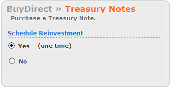

## Table of Contents

## What is the Treasury Direct Reinvestment Program?

The Treasury Direct Reinvestment Program is a way for people to automatically buy more savings bonds with the money they get when their old bonds mature. It's like a cycle where your money keeps working for you without you having to do anything extra. When your bond reaches its maturity date and you get your money back, the program takes that money and uses it to buy a new bond for you.

This program is useful because it saves you time and effort. You don't need to remember to buy new bonds every time your old ones mature. It's a simple way to keep your savings growing without much work on your part. Plus, it helps you keep your money in safe investments, like savings bonds, which are backed by the U.S. government.

## How does the Treasury Direct Reinvestment Program work?

The Treasury Direct Reinvestment Program is a way to keep your savings bonds working for you without much effort. When you have a savings bond that is about to mature, you can sign up for this program. Once your bond matures and you get your money back, the program automatically uses that money to buy a new savings bond for you. This means you don't have to remember to buy new bonds every time your old ones mature. It's a simple way to keep your money growing.

To get started with the program, you need to have a TreasuryDirect account. When you buy a new bond, you can choose to have it automatically reinvested when it matures. You can set this up for each bond you buy, so you decide which ones you want to keep rolling over into new bonds. This makes it easy to keep your savings growing over time without having to do anything extra.

## What are the benefits of participating in the Treasury Direct Reinvestment Program?

One big benefit of the Treasury Direct Reinvestment Program is that it saves you time and effort. When your savings bond matures, you don't have to remember to buy a new one. The program does it for you automatically. This means your money keeps working for you without you having to do anything extra. It's a simple way to keep your savings growing over time.

Another benefit is that it helps you keep your money in safe investments. Savings bonds are backed by the U.S. government, so they are very secure. By using the reinvestment program, you can keep your money in these safe investments without having to think about it. This can give you peace of mind knowing your savings are protected and growing steadily.

## Who is eligible to participate in the Treasury Direct Reinvestment Program?

Anyone who has a TreasuryDirect account can join the Treasury Direct Reinvestment Program. You need to be at least 18 years old to open a TreasuryDirect account on your own. If you're younger, you can still participate if an adult helps you set up an account.

Once you have a TreasuryDirect account, you can choose to have your savings bonds automatically reinvested when they mature. This means you can keep your money growing without having to do anything extra. It's a simple way to keep your savings safe and growing over time.

## How can someone enroll in the Treasury Direct Reinvestment Program?

To enroll in the Treasury Direct Reinvestment Program, you first need to have a TreasuryDirect account. If you don't have one, you can easily set it up on the TreasuryDirect website. You need to be at least 18 years old to open an account on your own. If you're younger, an adult can help you set up an account.

Once you have your TreasuryDirect account, you can start enrolling your savings bonds in the reinvestment program. When you buy a new bond, you can choose to have it automatically reinvested when it matures. You do this by selecting the reinvestment option during the purchase process. This way, when your bond reaches its maturity date, the money will be used to buy a new bond for you without you having to do anything extra.

## What types of securities can be reinvested through the program?

The Treasury Direct Reinvestment Program allows you to automatically reinvest certain types of securities. The main type of security you can reinvest through this program is U.S. Savings Bonds, specifically Series EE and Series I Savings Bonds. These bonds are safe investments backed by the U.S. government, and when they mature, the money can be used to buy new bonds without you having to do anything extra.

You can set up the reinvestment option when you buy these savings bonds through your TreasuryDirect account. This means that when your bond reaches its maturity date, the program will take the money you get back and use it to buy a new bond for you. This keeps your money growing over time without you having to remember to buy new bonds each time the old ones mature.

## What are the risks associated with the Treasury Direct Reinvestment Program?

The Treasury Direct Reinvestment Program is generally safe because it deals with U.S. Savings Bonds, which are backed by the U.S. government. This means there's very little risk that you'll lose your money. However, one risk you should be aware of is that the interest rates on new bonds might be lower than the rates on your old bonds. This means your savings might not grow as quickly as they did before.

Another thing to keep in mind is that the program is automatic. This is good because it saves you time, but it also means you need to keep an eye on it. If you forget about the reinvestment, you might end up with bonds that don't fit your current financial goals. So, it's a good idea to check your account now and then to make sure the reinvestment is still what you want.

## How does the program affect my tax situation?

The Treasury Direct Reinvestment Program can affect your taxes because the interest you earn on your savings bonds is usually taxable. When your bond matures and the money is automatically reinvested into a new bond, you still have to pay taxes on the interest you earned from the old bond. This means you need to keep track of the interest and report it on your tax return.

The good news is that you don't have to pay taxes on the interest until you actually get the money. If you use the reinvestment program, you might not get the money right away because it goes into a new bond. But when you finally cash in the bond, you'll need to pay taxes on all the interest you've earned over the years. It's a good idea to talk to a tax professional to make sure you're doing everything right.

## Can the reinvestment options be changed after enrollment, and if so, how?

Yes, you can change the reinvestment options for your savings bonds after you've enrolled in the Treasury Direct Reinvestment Program. If you decide you don't want a bond to be automatically reinvested anymore, you can go into your TreasuryDirect account and change the settings for that bond. You can do this at any time before the bond matures.

To make changes, log into your TreasuryDirect account, find the bond you want to change, and look for the option to edit or manage the bond's reinvestment settings. This way, you can decide if you want to get the money when the bond matures or if you want it to go into a new bond. It's easy to do and gives you control over your savings.

## How does the Treasury Direct Reinvestment Program compare to other investment options?

The Treasury Direct Reinvestment Program is a safe way to keep your savings growing without much work. It's different from other investment options like stocks or mutual funds because savings bonds are backed by the U.S. government, which means they're very secure. With this program, when your bond matures, the money automatically buys a new bond for you, so you don't have to remember to invest again. This makes it easier than other options where you might have to keep track of when to buy and sell investments.

However, the trade-off is that savings bonds usually offer lower interest rates compared to riskier investments like stocks. If you're looking for higher returns, you might want to consider other options, but you'll have to accept more risk. The reinvestment program is great for people who want a simple, safe way to save money over time without having to manage their investments actively.

## What historical performance data is available for the Treasury Direct Reinvestment Program?

The Treasury Direct Reinvestment Program itself doesn't have specific historical performance data because it's a way to automatically reinvest your savings bonds, not a separate investment. However, we can look at the historical performance of the savings bonds that are part of the program, like Series EE and Series I Savings Bonds. Over the years, Series EE bonds have offered fixed interest rates, which have varied from as low as 0.10% to as high as 5.5% depending on when the bond was issued. Series I bonds, on the other hand, have a combination of a fixed rate and an inflation-adjusted rate, which means their performance can change over time based on inflation.

For example, if you had a Series EE bond that was issued in May 2023, it would have a fixed rate of 2.5% for the first 20 years. If you used the reinvestment program, your money would keep [earning](/wiki/earning-announcement) at this rate until the bond matures, and then it would buy a new bond at the rate available at that time. Series I bonds have had rates that ranged from around 0% to over 9% in recent years, depending on inflation. So, if you reinvested your Series I bonds, your returns could go up or down based on changes in inflation. This gives you an idea of how your savings could grow over time with the reinvestment program, but remember, the actual performance depends on the rates at the time your bonds mature and are reinvested.

## What advanced strategies can be employed to maximize returns within the Treasury Direct Reinvestment Program?

One way to maximize returns within the Treasury Direct Reinvestment Program is to pay attention to the timing of when your savings bonds mature. Since interest rates can change over time, you might want to hold onto your bonds until they reach a point where the new bond's rate will be higher. For example, if you know that interest rates are expected to rise soon, you could choose not to reinvest right away and wait for a better rate. This way, when your bond matures, you can use the reinvestment program to buy a new bond at a higher rate, which means your savings will grow faster.

Another strategy is to mix different types of savings bonds in your portfolio. Series EE bonds have a fixed rate, while Series I bonds have a rate that changes with inflation. By having both types of bonds, you can balance the steady growth from Series EE bonds with the potential for higher returns from Series I bonds when inflation is high. This diversification can help you get the best possible returns over time. Plus, by using the reinvestment program for both types of bonds, you can keep your savings growing without having to remember to buy new bonds every time the old ones mature.

## What is Understanding Treasury DRIPs?

A Treasury Dividend Reinvestment Plan (DRIP) is a strategy that allows investors to automatically reinvest dividend payments into additional shares of a company's treasury stock. This process is designed to aid investors in gradually increasing their holdings without incurring substantial transaction fees, often offered at a discounted share price. This discount serves as an incentive for investors to take advantage of the compounding returns that reinvesting dividends naturally provides over time.

These plans work by using the dividends from a stock—not in cash payouts to the investor, but rather as a reinvestment into more shares. For example, if an investor holds a stock that issues a dividend, instead of receiving a cash payment, the dividend amount is used to purchase additional stock, usually at a reduced price. The resulting effect is the accumulation of a larger investment position, magnifying the effects of compounding interest over time.

Mathematically, the essence of this compounding can be expressed with the formula for compound interest: 

$$
A = P \left(1 + \frac{r}{n}\right)^{nt}
$$

where:
- $A$ is the amount of money accumulated after n years, including interest.
- $P$ is the principal amount (initial investment).
- $r$ is the annual interest rate (as a decimal).
- $n$ is the number of times that interest is compounded per year.
- $t$ is the time in years.

In the context of DRIPs, the principal amount $P$ grows with each dividend reinvestment, causing the value of the investor's position to increase exponentially over time. This automatic reinvestment massively simplifies the process for investors, eliminating the need for manual trading and associated fees. Furthermore, the reinvested dividends can grow additional capital through subsequent dividends, enhancing the power of compounding.

Investors often select DRIPs as a strategic long-term investment tool. By understanding the mechanics of these plans, investors can maximize returns by consistently growing their holdings and benefiting from price appreciation and dividend growth over an extended period. With the long-term focus, such strategies are favorable for investors aiming to enhance the value of their portfolios, particularly those with a preference for minimal intervention and optimized fee structures.

## What are the benefits of Treasury DRIPs?

Treasury Direct Reinvestment Plans (DRIPs) are financial arrangements allowing investors to reinvest dividends received from Treasury securities into additional securities, creating a cycle of growth within their investment portfolio. One key advantage is the potential for purchasing additional shares at discounted prices, an enticing offer for those looking to maximize their returns with minimal incremental investment.

Over time, the incremental reinvestment through DRIPs significantly leverages the power of compounding. As dividends generate additional shares, subsequent dividends increase due to the larger number of holdings, following the formula for compound interest:

$$
A = P \left(1 + \frac{r}{n}\right)^{nt}
$$

where $A$ represents the amount of money accumulated after n years, including interest. $P$ denotes the principal amount, $r$ the annual interest rate, $n$ the number of times that interest is compounded per year, and $t$ the time in years. This equation highlights how reinvestment under DRIPs can exponentially increase investment value over time.

For corporations, Treasury DRIPs foster a more stable shareholder base. Shareholders participating in DRIPs are generally looking at long-term growth, thereby reducing market [volatility](/wiki/volatility-trading-strategies) as there is less frequent buying and selling. This stability benefits companies by ensuring consistent capital flow and investor loyalty.

Moreover, DRIPs are widely offered by many established companies, spanning various industries, thereby providing diverse opportunities for investors. These plans align with both conservative and progressive investment strategies, accommodating different risk profiles while promising a potentially lucrative avenue for wealth accumulation.

## References & Further Reading

[1]: ["Advances in Financial Machine Learning"](https://www.amazon.com/Advances-Financial-Machine-Learning-Marcos/dp/1119482089) by Marcos Lopez de Prado

[2]: ["Evidence-Based Technical Analysis: Applying the Scientific Method and Statistical Inference to Trading Signals"](https://www.amazon.com/Evidence-Based-Technical-Analysis-Scientific-Statistical/dp/0470008741) by David Aronson

[3]: ["Machine Learning for Algorithmic Trading"](https://github.com/stefan-jansen/machine-learning-for-trading) by Stefan Jansen

[4]: ["Quantitative Trading: How to Build Your Own Algorithmic Trading Business"](https://www.amazon.com/Quantitative-Trading-Build-Algorithmic-Business/dp/1119800064) by Ernest P. Chan

[5]: Bergstra, J., Bardenet, R., Bengio, Y., & Kégl, B. (2011). ["Algorithms for Hyper-Parameter Optimization."](https://dl.acm.org/doi/10.5555/2986459.2986743) Advances in Neural Information Processing Systems 24.