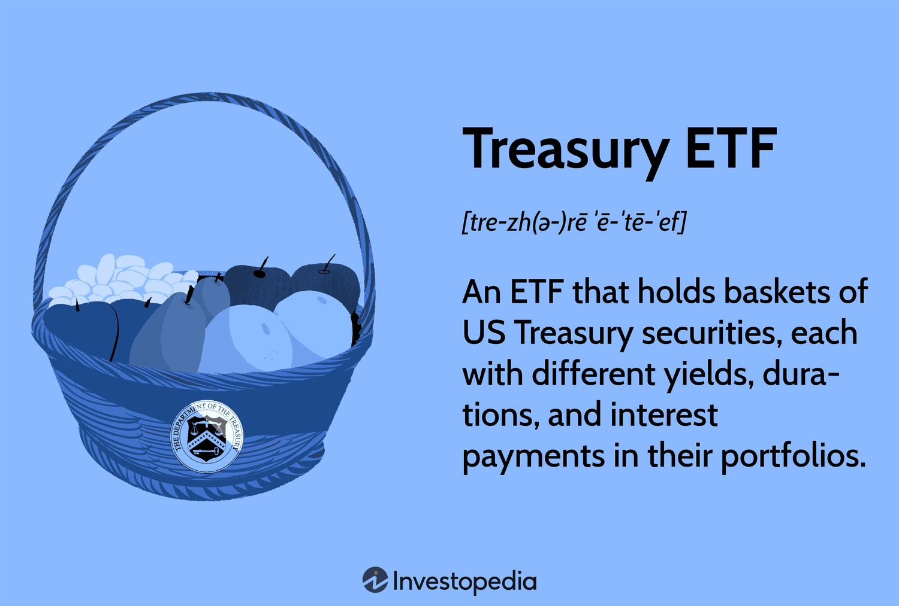

## Table of Contents

## What are Treasury ETFs?

Treasury ETFs, or Exchange-Traded Funds, are investment funds that hold U.S. Treasury securities. These securities are bonds issued by the U.S. government, which are considered very safe because they are backed by the full faith and credit of the U.S. government. Treasury ETFs make it easy for investors to buy and sell these securities on stock exchanges, just like they would with stocks. This means you don't have to buy the bonds directly, which can be more complicated and expensive.

These ETFs can focus on different types of Treasury securities, like short-term Treasury bills, medium-term Treasury notes, or long-term Treasury bonds. Each type has a different maturity date, which is when the bond pays back the money you invested. By investing in a Treasury ETF, you can spread your money across many different Treasury securities, which can help reduce risk. Plus, because ETFs are traded on stock exchanges, you can easily buy or sell them whenever the market is open, giving you more flexibility than buying individual bonds.

## How do Treasury ETFs work?

Treasury ETFs work by pooling money from many investors to buy a collection of U.S. Treasury securities. These securities can be short-term bills, medium-term notes, or long-term bonds. The ETF then divides this collection into shares, which investors can buy and sell on stock exchanges. When you buy a share of a Treasury ETF, you're essentially buying a small piece of all the Treasury securities the ETF holds. This makes it easier for you to invest in government bonds without having to buy them directly, which can be more complicated and costly.

The value of a Treasury ETF share goes up and down based on the value of the Treasury securities it holds. If interest rates go up, the value of the existing bonds in the ETF usually goes down, and vice versa. The ETF also earns interest from the Treasury securities, and this interest is typically paid out to shareholders as dividends. Because Treasury ETFs trade on stock exchanges, you can buy or sell them whenever the market is open, giving you more flexibility than if you were to buy individual bonds. This makes Treasury ETFs a convenient way to invest in safe government securities while still having the ability to easily adjust your investment.

## What are the benefits of investing in Treasury ETFs?

Investing in Treasury ETFs has several benefits. One big advantage is that they are very safe. Since they hold U.S. Treasury securities, which are backed by the U.S. government, they are considered low risk. This makes them a good choice if you want to keep your money safe while still earning some interest. Another benefit is that Treasury ETFs are easy to buy and sell. You can trade them on stock exchanges just like stocks, so you can quickly adjust your investments whenever you want.

Another advantage is that Treasury ETFs let you spread your money across many different Treasury securities. This diversification can help reduce risk because you're not putting all your money into one bond. Plus, you don't need a lot of money to start investing in Treasury ETFs. You can buy just one share, which is often cheaper than buying individual bonds. This makes it easier for more people to invest in government securities.

## What are the risks associated with Treasury ETFs?

Even though Treasury ETFs are considered safe, they still have some risks. One risk is that the value of the ETF can go up and down. This happens because the value of the Treasury securities inside the ETF changes when interest rates change. If interest rates go up, the value of the existing bonds in the ETF usually goes down. This means if you need to sell your ETF shares when the value is down, you might lose money.

Another risk is that Treasury ETFs might not pay as much interest as other investments. Since they are very safe, the interest they pay is usually lower than what you might get from riskier investments like stocks or corporate bonds. So, if you're looking to grow your money quickly, Treasury ETFs might not be the best choice. Also, while they are easy to buy and sell, the price can change throughout the day, which can be a risk if you're not watching the market closely.

## How do Treasury ETFs differ from individual Treasury securities?

Treasury ETFs and individual Treasury securities are both ways to invest in U.S. government bonds, but they work differently. When you buy an individual Treasury security, you are buying a single bond directly from the government. This bond has a set interest rate and a specific maturity date when you get your money back. Buying individual bonds can be more complicated and might require a larger amount of money to start.

On the other hand, Treasury ETFs are funds that hold a collection of different Treasury securities. When you buy shares of a Treasury ETF, you are investing in a small piece of all the bonds the ETF owns. This makes it easier and more flexible because you can buy and sell ETF shares on stock exchanges just like stocks. Plus, you can start with less money since you can buy just one share of the ETF. However, the value of the ETF can change throughout the day, and it might not pay as much interest as some individual bonds.

## What types of Treasury ETFs are available in the market?

There are different types of Treasury ETFs you can choose from, depending on what you want. Some Treasury ETFs focus on short-term Treasury bills, which are bonds that mature in a year or less. These are good if you want to keep your money safe for a short time and still earn some interest. Other Treasury ETFs invest in medium-term Treasury notes, which last from two to ten years. These can be a good choice if you want to invest for a bit longer but still want something safe. 

There are also Treasury ETFs that hold long-term Treasury bonds, which mature in more than ten years. These can be good if you're planning for the long term and want to earn more interest, but they can be riskier because their value can change a lot if interest rates go up or down. Some ETFs even mix different types of Treasury securities, so you get a bit of everything. This can help spread out your risk and give you a more balanced investment.

## How can one start investing in Treasury ETFs?

To start investing in Treasury ETFs, you first need to open a brokerage account. This is like a bank account but for buying and selling investments like ETFs. You can choose from many online brokers, and they usually let you open an account online. Once your account is set up, you'll need to add money to it. You can do this by transferring money from your bank account to your brokerage account.

After you have money in your brokerage account, you can start buying Treasury ETFs. You do this by searching for the specific ETF you want on your broker's website or app. Each ETF has a symbol, like a stock, so you'll need to know the symbol of the Treasury ETF you want to buy. Once you find it, you can place an order to buy shares. You can buy as many or as few shares as you want, depending on how much money you have and what you want to invest. After you buy the shares, you can keep them as long as you want or sell them whenever you need to.

## What are the key factors to consider when choosing a Treasury ETF?

When choosing a Treasury ETF, one important thing to think about is the type of Treasury securities it holds. Some ETFs focus on short-term Treasury bills, which are good if you want to keep your money safe for a short time. Others invest in medium-term Treasury notes or long-term Treasury bonds, which can be better if you're planning to invest for longer. Each type has different risks and rewards, so think about how long you want to keep your money invested and how much risk you're okay with.

Another key factor is the expense ratio of the ETF. This is a fee that the ETF charges you every year, and it's taken out of the ETF's returns. A lower expense ratio means you get to keep more of the interest the ETF earns. Also, consider how easy it is to buy and sell the ETF. Some ETFs are more popular and have more people trading them, which can make it easier to buy and sell without affecting the price too much. So, look at the expense ratio and how liquid the ETF is when making your choice.

## How do Treasury ETFs impact the broader financial market?

Treasury ETFs can have a big effect on the broader financial market. When a lot of people buy or sell Treasury ETFs, it can change the demand for U.S. Treasury securities. If more people want to buy Treasury ETFs, the price of the Treasury securities inside the ETFs can go up. This can make borrowing money cheaper for the government because they can sell their bonds for more money. On the other hand, if a lot of people sell their Treasury ETFs, it can push the price of Treasury securities down, making it more expensive for the government to borrow money.

These changes in Treasury prices can also affect other parts of the financial market. For example, when Treasury prices go up, interest rates usually go down. This can make it cheaper for people and businesses to borrow money, which can help the economy grow. But if Treasury prices go down and interest rates go up, borrowing money becomes more expensive, which can slow down the economy. So, Treasury ETFs can play a big role in how easy or hard it is for the government and others to borrow money, and this can have a ripple effect on the whole financial market.

## What are the tax implications of investing in Treasury ETFs?

When you invest in Treasury ETFs, you need to think about taxes. The interest you earn from the Treasury securities inside the ETF is usually not taxed by state or local governments. This is good because it means you get to keep more of the interest you earn. But, the interest is still taxed by the federal government, just like other types of interest income. So, you'll need to report this interest on your federal tax return.

Another thing to think about is if you sell your Treasury ETF shares for more money than you paid for them, you might have to pay capital gains tax. This tax is on the profit you made from selling the shares. How much tax you pay depends on how long you held the shares before selling them. If you held them for a year or less, it's a short-term capital gain, and you'll pay your regular income tax rate on it. If you held them for more than a year, it's a long-term capital gain, and the tax rate is usually lower. So, it's important to keep track of how long you own your shares and how much profit you make when you sell them.

## How do Treasury ETFs perform during different economic cycles?

Treasury ETFs can act differently during different economic times. When the economy is doing well, people might not want to put their money in safe investments like Treasury ETFs because they can make more money in riskier investments like stocks. So, the demand for Treasury ETFs might go down, and their prices might not go up as much. But, they still give you a safe place to keep your money and earn some interest.

When the economy is not doing well, like during a recession, people often want to keep their money safe. They might move their money from riskier investments to safer ones like Treasury ETFs. This can make the demand for Treasury ETFs go up, and their prices might go up too. So, Treasury ETFs can be a good choice during tough economic times because they help protect your money while still giving you some interest.

## What advanced strategies can be used with Treasury ETFs for portfolio management?

One advanced strategy for using Treasury ETFs in portfolio management is called laddering. This means you buy different Treasury ETFs that mature at different times. For example, you might buy some short-term, some medium-term, and some long-term Treasury ETFs. This way, you can spread out when you get your money back and reduce the risk of having to reinvest all your money at once when interest rates might be low. Laddering can help you keep a steady flow of income and manage interest rate risk better.

Another strategy is using Treasury ETFs for hedging. This means you use them to protect other parts of your portfolio. If you have a lot of money in stocks, which can be risky, you can buy Treasury ETFs to balance out that risk. When the stock market goes down, Treasury ETFs often go up because people want safe investments. So, if your stocks lose value, the Treasury ETFs might gain value, helping to protect your overall portfolio. This can be a smart way to manage risk and keep your investments more stable during uncertain times.

## References & Further Reading

[1]: ["Treasury ETFs: What You Need to Know"](https://money.usnews.com/investing/articles/whats-the-best-treasury-etf-to-buy) on ETF.com.

[2]: ["Algorithmic Trading: The Basics and the Best Practices"](https://www.investopedia.com/articles/active-trading/101014/basics-algorithmic-trading-concepts-and-examples.asp) on Investopedia.

[3]: ["The Technology Behind Algorithmic Trading"](https://type.earth/algorithmic-trading/) on Bloomberg.

[4]: ["Advances in Financial Machine Learning"](https://www.amazon.com/Advances-Financial-Machine-Learning-Marcos/dp/1119482089) by Marcos Lopez de Prado.

[5]: ["Machine Learning for Algorithmic Trading - Second Edition"](https://github.com/PacktPublishing/Machine-Learning-for-Algorithmic-Trading-Second-Edition) by Stefan Jansen.

[6]: Financial Industry Regulatory Authority (FINRA) resources on ETFs and investment market trends.

[7]: Coursera course on ["Python for Financial Analysis and Algorithmic Trading"](https://www.coursera.org/learn/python-statistics-financial-analysis).

[8]: Udemy course on ["Algorithmic Trading In Forex: Create Your First Forex Robot!"](https://www.udemy.com/course/learn-mql4/)