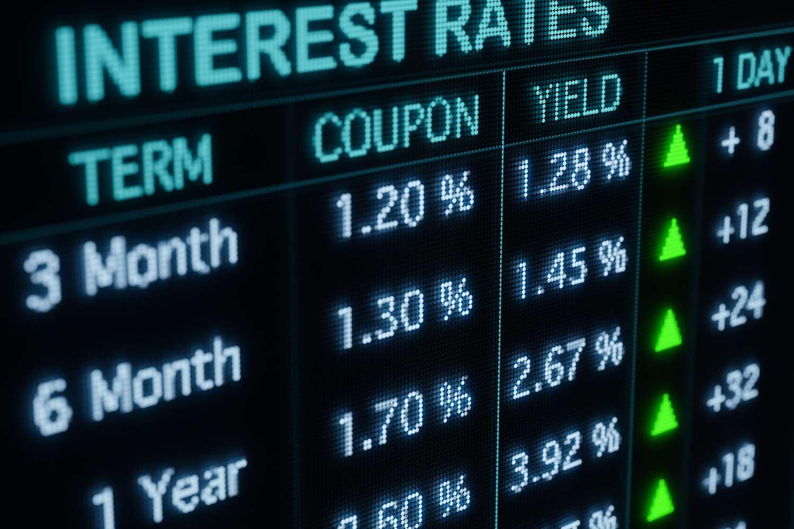

## Table of Contents

## What is a Treasury Index?

A Treasury Index is a type of benchmark used to measure the performance of U.S. government securities. These securities are issued by the U.S. Department of the Treasury and are considered very safe investments because they are backed by the full faith and credit of the U.S. government. The most common Treasury Indexes are based on the yields of Treasury bills, notes, and bonds, which have different maturities ranging from a few weeks to 30 years. Investors and financial analysts use these indexes to compare the returns of other investments against the safety and stability of government securities.

One well-known example of a Treasury Index is the 10-Year Treasury Note Index, which tracks the yield of 10-year Treasury notes. This index is often used as a reference point for mortgage rates and other long-term interest rates. When the yield on the 10-Year Treasury Note goes up, it usually means that interest rates are rising, which can affect borrowing costs for consumers and businesses. Conversely, when the yield goes down, it can signal lower interest rates and cheaper borrowing costs. By keeping an eye on these indexes, investors can make more informed decisions about where to put their money.

## How does a Treasury Index work?

A Treasury Index tracks the interest rates or yields of U.S. government securities, like Treasury bills, notes, and bonds. These securities are loans that people give to the government, and in return, the government pays them back with interest. The index shows how much interest these securities are earning at any given time. For example, if you look at the 10-Year Treasury Note Index, it tells you the average interest rate that investors are getting for lending money to the government for 10 years.

When the Treasury Index goes up, it means the interest rates on these government securities are going up too. This can happen because more people want to buy these safe investments, so the government has to offer higher interest rates to attract them. On the other hand, if the index goes down, it means interest rates are falling, which can happen when fewer people want to buy these securities or when the economy is doing well and people are looking for riskier investments. By watching the Treasury Index, people can get a sense of what's happening with interest rates and make better choices about saving and borrowing money.

## What are the different types of Treasury Indexes?

There are different kinds of Treasury Indexes, and each one looks at different types of U.S. government securities. One common type is the Treasury Bill Index, which tracks the interest rates on short-term securities that last for less than a year. Another type is the Treasury Note Index, which focuses on medium-term securities that last from two to ten years. The most well-known of these is the 10-Year Treasury Note Index, which many people watch closely because it affects things like mortgage rates.

There's also the Treasury Bond Index, which looks at long-term securities that last for 20 or 30 years. These bonds usually have higher interest rates because people are lending their money for a longer time. Each of these indexes helps people understand what's happening with interest rates for different lengths of time. By keeping an eye on these indexes, people can make smarter choices about where to put their money or whether to borrow money.

## Why are Treasury Indexes important for investors?

Treasury Indexes are important for investors because they show the interest rates on U.S. government securities. These rates can tell investors a lot about the economy and help them decide where to put their money. For example, if the 10-Year Treasury Note Index is going up, it means that interest rates are rising. This can make borrowing money more expensive, so investors might want to look for investments that do well when rates are high, like certain types of bonds.

On the other hand, if the Treasury Index is going down, it means interest rates are falling. This can make borrowing cheaper, which might be good for businesses and people who want to take out loans. Investors might then choose to put their money into things that do well when rates are low, like stocks or real estate. By watching these indexes, investors can get a better idea of what's happening in the economy and make smarter choices about their investments.

## How are Treasury Indexes calculated?

Treasury Indexes are calculated by looking at the interest rates or yields of U.S. government securities. For example, the 10-Year Treasury Note Index is calculated by finding the average interest rate that investors are getting for lending money to the government for 10 years. This average is based on the most recent prices and yields of these securities that are traded in the market. The calculation involves taking the yields from a bunch of these securities and then figuring out what the average yield is.

The exact way to calculate a Treasury Index can be a bit complicated, but it usually involves a few steps. First, they gather data on the yields of the specific type of Treasury security, like bills, notes, or bonds. Then, they use a formula to find the average yield of these securities. This average yield becomes the value of the index. Because these securities are traded all the time, the index is updated regularly to reflect the most current market conditions. This helps investors see how interest rates are changing and make better decisions about their money.

## What is the difference between a Treasury Index and a Treasury Bond?

A Treasury Index and a Treasury Bond are different things. A Treasury Bond is a type of loan that people give to the U.S. government. When you buy a Treasury Bond, you're lending money to the government for a long time, like 20 or 30 years. In return, the government pays you interest until the bond matures, and then they give you your money back.

A Treasury Index, on the other hand, is like a scoreboard that shows the average interest rates of different U.S. government securities, including Treasury Bonds. It helps people see what's happening with interest rates in the economy. For example, the 10-Year Treasury Note Index shows the average interest rate for lending money to the government for 10 years. By watching these indexes, people can understand if interest rates are going up or down and make better choices about saving or borrowing money.

## How do Treasury Indexes affect the economy?

Treasury Indexes are important because they show how much interest people get when they lend money to the U.S. government. When these indexes go up, it means interest rates are going up too. This can make borrowing money more expensive for everyone, from people buying houses to businesses taking out loans. When borrowing costs more, people and businesses might spend less, which can slow down the economy.

On the other hand, when Treasury Indexes go down, interest rates fall. This makes borrowing cheaper, so people might buy more houses or cars, and businesses might invest in new projects. When people and businesses spend more, it can help the economy grow. By watching these indexes, people in charge of the economy can make decisions about things like setting interest rates to keep the economy balanced.

## What role do Treasury Indexes play in monetary policy?

Treasury Indexes are important for people who make decisions about money in the economy. They help people who work at the Federal Reserve, which is like the boss of money in the U.S. When the Federal Reserve sees that Treasury Indexes are going up, it means interest rates are rising. They might decide to do things to slow down the economy a bit, like making it more expensive for banks to borrow money. This can help keep prices from going up too fast, which is called inflation.

On the other hand, if Treasury Indexes are going down, it means interest rates are falling. The Federal Reserve might then do things to help the economy grow faster, like making it cheaper for banks to borrow money. This can encourage people and businesses to borrow and spend more, which can help the economy. By watching these indexes, the Federal Reserve can make choices that help keep the economy stable and growing at a good pace.

## How can investors use Treasury Indexes to manage risk?

Investors can use Treasury Indexes to manage risk by keeping an eye on how interest rates are changing. If the Treasury Index is going up, it means interest rates are rising. This can be a sign that the economy might slow down because borrowing money becomes more expensive. So, investors might want to be more careful and put their money into safer investments, like short-term Treasury bills or money market funds, which are less affected by rising rates. By doing this, they can protect their money from losing value if the economy takes a turn for the worse.

On the other hand, if the Treasury Index is going down, it means interest rates are falling. This can be a good time for investors to take on a bit more risk because borrowing is cheaper, and the economy might be doing well. They might choose to invest in things like stocks or real estate, which can grow faster when interest rates are low. By watching the Treasury Indexes, investors can adjust their investments to match what's happening in the economy and manage their risk better.

## What are the historical trends of Treasury Indexes?

Over the years, Treasury Indexes have gone up and down, showing how interest rates have changed. For a long time, from the late 1970s to the early 1980s, the 10-Year Treasury Note Index was really high. Interest rates were around 15% because there was a lot of inflation, and the government had to offer high rates to get people to lend them money. But then, starting in the early 1980s, the Federal Reserve started to fight inflation, and the indexes began to fall. By the early 2000s, the 10-Year Treasury Note Index was much lower, around 5%, because the economy was more stable and inflation was under control.

Since the 2000s, the Treasury Indexes have had some big ups and downs. During the financial crisis in 2008, the indexes dropped a lot as people rushed to buy safe investments like Treasury securities. This made interest rates go down to very low levels, sometimes even below 2%. In the 2010s, the indexes stayed pretty low, but then they started to go up a bit as the economy got better. In 2020, when the COVID-19 pandemic hit, the indexes fell again as people looked for safety, but they started to rise again as the economy recovered. Watching these trends helps people understand how the economy has changed over time and what might happen next.

## How do global economic factors influence Treasury Indexes?

Global economic factors can have a big impact on Treasury Indexes. When other countries have problems with their economies, like high inflation or a financial crisis, investors might want to move their money to safer places. The U.S. is seen as a safe place, so more people might buy U.S. Treasury securities. This demand can push the Treasury Indexes down because the government doesn't need to offer high interest rates to attract buyers. On the other hand, if other countries are doing really well, investors might take their money out of U.S. Treasuries and invest it in those countries instead. This can make the Treasury Indexes go up because the government has to offer higher interest rates to keep people interested in buying their securities.

Another way global factors can affect Treasury Indexes is through changes in currency values. If the U.S. dollar gets stronger compared to other currencies, it can make U.S. Treasury securities more attractive to foreign investors. They can buy these securities with their weaker currencies and get a good return when they convert their money back. This can push the Treasury Indexes down. But if the U.S. dollar gets weaker, foreign investors might not want to buy as many U.S. Treasuries, which can make the indexes go up. So, things happening all over the world can change how people see U.S. Treasury securities and affect the indexes that show their interest rates.

## What advanced strategies can be employed using Treasury Indexes?

Investors can use Treasury Indexes to do something called "yield curve trading." This means they look at how the interest rates of different Treasury securities, like short-term bills and long-term bonds, compare to each other. If they think the difference between these rates will change, they can buy or sell securities to make money from that change. For example, if they think the gap between short-term and long-term rates will get bigger, they might buy long-term bonds and sell short-term bills. By doing this, they can make money if their guess about the future is right.

Another advanced strategy is using Treasury Indexes to hedge against interest rate risk. This means investors use these indexes to protect their other investments from losing value if interest rates go up or down. They can do this by buying or selling Treasury futures or options, which are like bets on what will happen to interest rates in the future. If they think rates will go up, they might sell Treasury futures to make money if the rates do rise. If they think rates will go down, they might buy Treasury futures to protect their other investments. By using these strategies, investors can manage their risks better and maybe even make more money.

## What is the relationship between Algorithmic Trading and Indexes?

Algorithmic trading leverages computer algorithms to automate trading decisions using index data. This approach significantly enhances trading efficiency and accuracy by minimizing human error and emotional biases often associated with traditional trading methods. By using pre-programmed instructions to conduct trading operations, [algorithmic trading](/wiki/algorithmic-trading) ensures rapid execution of trades, which is essential in a market environment where speed can dictate profitability.

Common strategies employed in algorithmic trading include trend-following and index [arbitrage](/wiki/arbitrage). Trend-following strategies exploit the [momentum](/wiki/momentum) of market trends. By analyzing historical index data and identifying patterns, these algorithms make buy or sell decisions based on the direction of trends. Suppose $P(t)$ represents the price of an asset at time $t$. A simple moving average (SMA) strategy might compute the mean of $P(t)$ over a period $N$ as:

$$
\text{SMA}_N(t) = \frac{1}{N} \sum_{i=0}^{N-1} P(t-i)
$$

A trading decision can be automated by setting conditions such as buying when the current price $P(t)$ is above the SMA and selling when it is below.

Index arbitrage capitalizes on the price discrepancies between an index and its constituent securities. For example, if an index like the S&P 500 is trading at a higher price compared to the collective price of its underlying stocks, arbitrageurs can sell futures on the index and buy the underlying stocks, profiting from the convergence of prices.

Algorithmic trading systems must be optimized for the best performance, frequently employing [backtesting](/wiki/backtesting) on historical index data to validate the effectiveness of the algorithms before deploying them in live markets. Here's a basic example of backtesting a moving average crossover strategy in Python:

```python
import numpy as np
import pandas as pd

# Sample price data
prices = pd.Series([100, 101, 102, 103, 102, 105, 107, 108, 110, 112])

# Calculate moving averages
short_window = 3
long_window = 5
signals = pd.DataFrame(index=prices.index)
signals['price'] = prices
signals['short_mavg'] = prices.rolling(window=short_window, min_periods=1).mean()
signals['long_mavg'] = prices.rolling(window=long_window, min_periods=1).mean()

# Create signals
signals['signal'] = 0.0
signals['signal'][short_window:] = np.where(signals['short_mavg'][short_window:] 
                                            > signals['long_mavg'][short_window:], 1.0, 0.0)
signals['positions'] = signals['signal'].diff()

# Output signals
print(signals)
```

Algorithmic trading also facilitates index rebalancing strategies, reacting to periodic changes in the composition or weighting of indexes to maintain desired portfolio characteristics. As the sophistication of algorithms continues to evolve, the integration of [machine learning](/wiki/machine-learning) and [artificial intelligence](/wiki/ai-artificial-intelligence) further enhances predictive modeling capabilities, enabling more nuanced trade execution strategies.

## References & Further Reading

[1]: ["Advances in Financial Machine Learning"](https://www.amazon.com/Advances-Financial-Machine-Learning-Marcos/dp/1119482089) by Marcos Lopez de Prado

[2]: ["Machine Learning for Algorithmic Trading"](https://github.com/stefan-jansen/machine-learning-for-trading) by Stefan Jansen

[3]: ["Quantitative Trading: How to Build Your Own Algorithmic Trading Business"](https://github.com/LucindaYa/quant-resources/blob/master/Quantitative%20Trading%20How%20to%20Build%20Your%20Own%20Algorithmic%20Trading%20Business.pdf) by Ernest P. Chan

[4]: ["Evidence-Based Technical Analysis: Applying the Scientific Method and Statistical Inference to Trading Signals"](https://www.amazon.com/Evidence-Based-Technical-Analysis-Scientific-Statistical/dp/0470008741) by David Aronson

[5]: Poterba, J. M., & Shoven, J. B. (2002). ["Exchange-Traded Funds: A New Investment Option for Taxable Investors."](https://economics.mit.edu/sites/default/files/publications/Exchange-Traded%20Funds%20A%20New%20Investment%20Option.pdf) National Bureau of Economic Research. 

[6]: Campbell, John Y., & Viceira, Luis M. (2002). ["Strategic Asset Allocation: Portfolio Choice for Long-Term Investors."](https://academic.oup.com/book/6093) Oxford University Press.

[7]: Carver, Robert. (2015). ["Systematic Trading: A Unique New Method for Designing Trading and Investing Systems."](https://www.amazon.com/Systematic-Trading-designing-trading-investing/dp/0857194453) Harriman House.