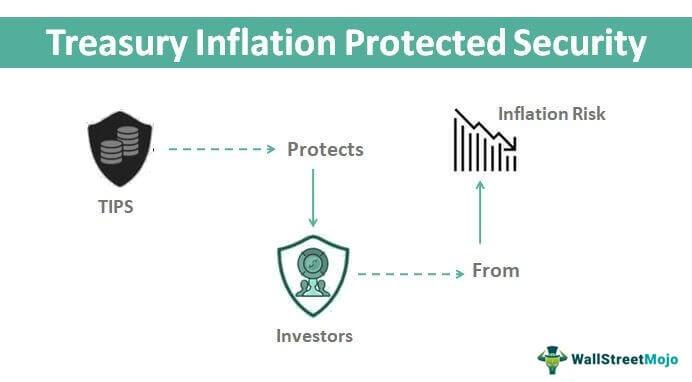

In today's dynamic financial markets, protecting investments from inflation is crucial for maintaining purchasing power and preserving the value of investment portfolios. Inflation-Protected Securities, or Treasury Inflation-Protected Securities (TIPS), are financial instruments specifically designed to safeguard investors against inflation by adjusting the principal value according to inflationary trends. These unique securities are issued by the U.S. Treasury and offer an important tool for investors seeking to mitigate the erosive effects of inflation on their wealth.

The principal value of TIPS is linked to the Consumer Price Index (CPI), a widely-used measure of inflation. As the CPI rises, indicating increased inflation, the principal value of TIPS adjusts upward, thereby protecting the investor's purchasing power. Conversely, in times of deflation, the principal value is protected from falling below its original face value. By these mechanisms, TIPS provide a stable investment option for those looking to safeguard against inflation—a critical consideration given recent fluctuations in global markets and economic climates.



This article explores the intricate workings of TIPS, their role in an investment portfolio, and how they compare to nominal Treasury bonds, which do not offer the same inflation protection. Additionally, algorithmic trading, a method that utilizes automated systems to execute trades based on pre-defined criteria and real-time market data, is integrated into managing TIPS investments. By understanding how these tools work together, investors can optimize their portfolios, using both TIPS and algorithmic trading to adapt more effectively to changing economic conditions. This integrated approach can be a powerful strategy for those aiming to strike a balance between risk and return in their investment decisions.

## Table of Contents

## Understanding Treasury Inflation-Protected Securities (TIPS)

Treasury Inflation-Protected Securities (TIPS) are U.S. government bonds designed to help investors safeguard their money from inflation. Unlike traditional bonds, whose real value can erode over time due to inflation, TIPS' principal value adjusts with changes in the Consumer Price Index (CPI). This ensures that the purchasing power of the investor's capital is maintained.

The principal of TIPS increases with inflation and decreases with deflation, ensuring that investors receive a return that keeps pace with inflationary trends. The semi-annual interest payments, known as coupon payments, are calculated on the adjusted principal, meaning that they too rise with inflation. The formula for the new principal value after an inflation adjustment is:

$$
P_{\text{adjusted}} = P_{\text{original}} \times \left(1 + \frac{\text{CPI}_{\text{new}} - \text{CPI}_{\text{base}}}{\text{CPI}_{\text{base}}}\right)
$$

At maturity, investors are paid either the adjusted principal or the original principal, whichever is greater, providing protection against deflation.

TIPS thus provide a way for investors to have confidence in the real value of their future payouts, independent of inflation fluctuations. They are particularly appealing during periods of economic uncertainty when inflation risks are perceived to be higher. This inflation adjustment mechanism ensures that TIPS remain a secure investment avenue, backed by the U.S. government, for those seeking to protect and preserve their purchasing power.

## The Role of TIPS in an Investment Portfolio

Treasury Inflation-Protected Securities (TIPS) are a critical component for investors aiming to mitigate the eroding effects of inflation on their financial assets. These securities offer a primary advantage that conventional bonds do not: an intrinsic structure that adjusts the principal according to inflationary movements as measured by the Consumer Price Index (CPI). Consequently, the interest payments, calculated as a fixed rate applied to the inflation-adjusted principal, offer both inflationary defense and a controlled risk environment.

TIPS are particularly appealing to conservative investors whose primary focus is the preservation of purchasing power and capital rather than maximizing returns. Given their nature as U.S. government-backed securities, TIPS [carry](/wiki/carry-trading) a high degree of credit safety, presenting an opportunity for risk-averse investors to guard their investment portfolios against the pitfalls of rising prices.

Investors who stand to benefit the most from integrating TIPS into their strategies include those with long-term retirement savings accounts, such as Individual Retirement Accounts (IRAs) or 401(k)s, where preserving future purchasing power is crucial. Furthermore, investors who have a considerable portion of their portfolio in fixed-income securities may use TIPS to balance the inflation risks inherent in nominal bonds, which typically do not offer any inflation adjustment features.

For investors with a low risk tolerance, TIPS can serve as a secure, diversified investment vehicle, capable of providing steady returns adjusted for inflation over time. By incorporating TIPS, such investors can optimize their portfolios to sustain value, particularly during times when the inflation rate exceeds the fixed returns of traditional bond instruments.

While TIPS are beneficial for various investment strategies, it is essential for investors to consider [liquidity](/wiki/liquidity-risk-premium) needs. TIPS can be traded in secondary markets; however, they may display less liquidity compared to other more conventional Treasury securities. Investors seeking to hedge against specific inflationary contexts over shorter periods might need to carefully evaluate the timing and structure of their TIPS investments to align with their strategic goals. 

Overall, TIPS serve a pivotal role in protecting investment portfolios against inflation, ensuring that even conservative financial strategies can endure economic fluctuations without sacrificing the essential value of accumulated wealth.

## Algorithmic Trading and TIPS

Algorithmic trading, or 'algo trading', employs automated systems to execute trades based on pre-defined criteria, enabling rapid responses to market conditions. This technology can significantly enhance the effectiveness of investing in Treasury Inflation-Protected Securities (TIPS). By integrating algorithmic strategies with TIPS, investors are able to leverage real-time market information and optimize their investment portfolios to better address inflationary pressures.

TIPS are unique financial instruments that adjust their principal value in line with inflation, as measured by the Consumer Price Index (CPI). This inflation-linked adjustment mechanism ensures that the investor's purchasing power is preserved. By combining this feature with algo trading, investors can exploit market inefficiencies and dynamic changes in inflation expectations.

A basic [algorithmic trading](/wiki/algorithmic-trading) strategy for TIPS might involve monitoring CPI data releases and automatically adjusting holdings based on anticipated inflation trends. For example, a Python-based algorithm could be developed to execute buy or sell orders for TIPS based on statistical models predicting CPI changes. The code snippet below illustrates a simplified version of this approach:

```python
import pandas as pd
from statsmodels.tsa.arima_model import ARIMA
import numpy as np

# Assume we have a DataFrame 'cpi_data' with CPI index values
cpi_data = pd.read_csv('cpi_data.csv')
cpi_data['Date'] = pd.to_datetime(cpi_data['Date'])
cpi_data.set_index('Date', inplace=True)

# Fit ARIMA model to CPI data
model = ARIMA(cpi_data['CPI'], order=(5, 1, 0))
model_fit = model.fit(disp=0)

# Forecast future CPI and simulate TIPS purchasing when a significant increase is forecasted
forecast, stderr, conf_int = model_fit.forecast(steps=12)

# Implement trading logic based on forecast
for idx, value in enumerate(forecast):
    if value > np.mean(cpi_data['CPI'].values) + 2 * np.std(cpi_data['CPI'].values):  # Threshold for buying
        print(f"Forecasted CPI increase significant on Month {idx+1}. Consider buying TIPS.")
    else:
        print(f"No significant change in CPI forecasted for Month {idx+1}. Maintain current TIPS position.")
```

Incorporating advanced [machine learning](/wiki/machine-learning) techniques can further refine these algorithms by identifying complex patterns in financial data that traditional models might miss. For instance, employing neural networks to analyze large datasets can help predict inflation trends with higher accuracy, thereby informing more effective TIPS trading strategies.

Algorithmic trading also facilitates risk management in TIPS investments. Automated stop-loss orders can be programmed to limit potential losses during periods of unexpected deflation, which could offset TIPS value despite their anti-inflationary design. These setups ensure that the investor's strategy remains aligned with their risk tolerance.

Overall, leveraging algorithmic trading alongside TIPS investments offers investors the ability to respond promptly to economic indicators, enhance portfolio diversification, and fortify their defenses against inflation [volatility](/wiki/volatility-trading-strategies). As financial markets become increasingly automated and data-driven, the integration of TIPS with algorithmic trading strategies will likely grow in significance.

## Comparing TIPS and Nominal Treasury Bonds

Both Treasury Inflation-Protected Securities (TIPS) and nominal Treasury bonds are financial instruments issued by the U.S. Treasury, yet they cater to different investor needs and bear distinct characteristics. Understanding these differences is essential for investors looking to diversify their bond portfolios effectively.

**Inflation Protection**: The most significant distinction between TIPS and nominal Treasury bonds stems from their treatment of inflation. TIPS are specifically designed to protect against inflation by adjusting their principal value in line with the Consumer Price Index (CPI). This means that as inflation rises, the principal value of TIPS increases, ensuring that the purchasing power of the investment is maintained. As a result, the interest payments, which are calculated as a percentage of the adjusted principal, also increase with inflation. Conversely, nominal Treasury bonds do not offer any inflation protection; their fixed interest payments and principal value remain constant regardless of inflation, potentially eroding purchasing power during periods of rising prices.

**Yield Differences**: Due to their inflation-protection feature, TIPS typically offer lower base yields compared to nominal Treasury bonds. This trade-off is accepted by investors who prioritize inflation protection over higher initial returns. In periods of low inflation, nominal Treasury bonds might provide better returns, but during high inflation periods, TIPS are likely to outperform by preserving real returns.

**Market Performance and Pricing**: The distinct characteristics of TIPS and nominal Treasury bonds influence their performance in different economic scenarios. TIPS tend to gain popularity and see price increases during times of anticipated high inflation, as investors seek to hedge against rising prices. On the other hand, nominal Treasury bonds are more attractive in stable inflation or deflationary environments due to their higher fixed yields.

**Tax Implications**: Both TIPS and nominal Treasury bonds' interest is subject to federal income tax. However, TIPS' increasing principal value due to inflation adjustments is also taxable annually, even though this adjustment is not realized as direct cash flow until the bond is sold or matures. This phenomenon, known as "phantom income," necessitates careful tax planning.

**Risk Considerations**: In terms of risk, TIPS offer an advantage by significantly reducing inflation risk. However, they still carry interest rate risk, market risk, and, to a lesser extent, liquidity risk, similar to nominal Treasury bonds. Investors should weigh these risks against their individual risk tolerance and investment objectives.

In summary, while both TIPS and nominal Treasury bonds are valuable components of an investment portfolio, their fundamental differences in structure and purpose cater to varying investor goals and economic conditions. Investors must assess their expectations of future inflation and personal financial goals to determine the appropriate allocation between the two within their bond holdings.

## Pros and Cons of Investing in TIPS

Treasury Inflation-Protected Securities (TIPS) present investors with a unique investment opportunity characterized by both benefits and limitations. The most prominent advantage of investing in TIPS is their ability to safeguard against inflation. TIPS achieve this by adjusting their principal value according to the Consumer Price Index (CPI), ensuring that the purchasing power of the investment does not erode over time. This adjustment mechanism ties returns directly to inflation rates, making TIPS a preferred choice for investors sensitive to inflationary pressures, particularly during periods of economic uncertainty.

Further enhancing their appeal, TIPS are backed by the U.S. government, which confers a high degree of safety and creditworthiness. This government backing significantly mitigates the risk of default, positioning TIPS as a dependable investment vehicle within a diversified portfolio. This reliability, coupled with inflation protection, makes TIPS attractive to conservative investors and those seeking a hedge against potential economic downturns.

Despite these advantages, TIPS also have notable disadvantages. One primary drawback is their typically lower yields compared to nominal Treasury bonds. In environments where inflation is stable or decreasing, the performance of TIPS might not keep pace with that of conventional bonds offering higher yields. Additionally, the tax treatment of TIPS can be a concern for investors. The inflation adjustment to the principal is taxed as income in the year it occurs, which can lead to a higher tax liability, even if the investor has not sold the TIPS. This phenomenon, known as "phantom income," can potentially diminish the post-tax returns for investors holding TIPS in taxable accounts.

Investors considering TIPS must also weigh the market liquidity of these securities. Although generally improved over the years, TIPS may occasionally experience lower liquidity compared to other government bonds, which can impact the ease with which investors can enter or [exit](/wiki/exit-strategy) their positions, especially in volatile markets.

The choice to invest in TIPS ultimately depends on individual financial goals, inflation expectations, and risk tolerance. While TIPS offer distinct inflation protection and safety, they must be carefully evaluated against potential disadvantages, such as lower yields and unfavorable tax implications, to determine their suitability within an investment strategy. Investors are advised to consider these factors in holistic financial planning to optimize portfolio resilience and performance.

## TIPS in Algorithmic Trading Strategies

Investors looking to incorporate Treasury Inflation-Protected Securities (TIPS) into their investment portfolios can leverage algorithmic trading strategies to enhance returns and manage risks. Algorithmic trading, which uses automated platforms to execute trades based on predetermined criteria, allows investors to react swiftly to market conditions and capitalize on specific economic indicators or trends. 

**Systematic Integration of TIPS**

Incorporating TIPS into a broader trading portfolio via algorithmic strategies often begins with establishing a quantitative model that defines the entry and exit points of trades. For instance, such a model might consider the inflation rate as a primary input. TIPS are uniquely sensitive to inflation; therefore, the predictive insights about future inflation derived from economic data can be used to adjust the portfolio's TIPS allocation dynamically.

**Economic Indicators and Market Conditions**

Economic indicators such as the Consumer Price Index (CPI), Producer Price Index (PPI), and employment data are commonly used signals in algorithmic strategies. These indicators help predict inflation trends, directly impacting the performance of TIPS. For example, an algorithm may increase TIPS holdings when CPI data shows rising inflation rates, thus aiming to maximize inflation-adjusted returns.

**Example Algorithm**

Below is a simplified Python example of how one might set up an algorithmic strategy to include TIPS based on inflation indicators:

```python
import numpy as np
import pandas as pd

# Hypothetical function to fetch CPI data
def get_cpi_data():
    # This would typically call an API or read from a database
    pass

# Simple moving average calculation
def moving_average(data, window):
    return data.rolling(window=window).mean()

# Trading strategy
def tips_trading_strategy(cpi_data):
    short_window = 3
    long_window = 12

    short_ma = moving_average(cpi_data, short_window)
    long_ma = moving_average(cpi_data, long_window)

    # Generate buy/sell signals
    signals = np.where(short_ma > long_ma, "Buy", "Sell")
    tips_allocation = pd.DataFrame(index=cpi_data.index)
    tips_allocation['Signal'] = signals
    return tips_allocation

# Example of generating trading signals
cpi_data = get_cpi_data()
signals = tips_trading_strategy(cpi_data)
print(signals)
```

In the example above, a simple moving average (SMA) crossover strategy is used. When the short-term SMA of the CPI data crosses above the long-term SMA, it generates a "Buy" signal, suggesting an increased allocation to TIPS. Conversely, a "Sell" signal suggests reducing TIPS allocation when the short-term SMA falls below the long-term SMA.

**Enhancing with Machine Learning**

Advanced algorithmic strategies may also incorporate machine learning models to predict inflation trends. Techniques such as regression analysis, time-series forecasting, or neural networks could offer more nuanced predictions, thereby improving the timing and size of TIPS allocation changes.

**Conclusion**

Utilizing algorithmic trading to manage TIPS can effectively optimize an investment portfolio by ensuring that it is aligned with real-time economic conditions, particularly inflation forecasts. By integrating these systematic strategies, investors can enhance both the responsiveness and the precision of their inflation-protection measures, potentially leading to more robust financial outcomes.

## Conclusion

Treasury Inflation-Protected Securities (TIPS) represent a strategic approach for investors aiming to shield their portfolios from the erosive effects of inflation. As instruments backed by the U.S. government, TIPS provide a reliable foundation for financial planning, particularly in volatile economic climates. These securities are uniquely designed to adjust their principal value in line with inflation, ensuring that the real purchasing power of the investment is maintained over time.

The inclusion of TIPS in investment portfolios is further enriched when combined with algorithmic trading strategies. Algorithmic trading provides sophisticated, automated mechanisms to react swiftly to dynamic market conditions, potentially enhancing the overall security and adaptability of an investment portfolio. By using pre-defined criteria and leveraging real-time data, investors can optimize their exposure to TIPS, making adjustments as necessary to align with shifts in both market trends and inflation indicators.

In deciding how to incorporate TIPS and algorithmic trading into their strategies, investors should carefully evaluate their financial objectives and risk tolerance. Understanding one's own goals is crucial for balancing the protective qualities of TIPS with the computational precision and speed of algorithmic trading. Each investor's unique circumstances will guide whether these instruments and strategies may drive towards achieving long-term financial security and growth.

Overall, the integration of TIPS into investment strategies provides a multifaceted opportunity for safeguarding wealth against inflation, while algorithmic trading offers the tools necessary for timely and efficient portfolio management. Together, they can serve as a robust framework for navigating the complexities of modern financial markets.

## References & Further Reading

[1]: Kamara, A., & Reilly, F. K. (2002). ["Treasury Inflation-Protected Securities: A Primer with Examples."](https://link.springer.com/referenceworkentry/10.1007/978-3-030-91231-4_8) The Journal of Investing.

[2]: [Board of Governors of the Federal Reserve System.](https://www.federalreserve.gov/aboutthefed/bios/board/default.htm) "Consumer Price Index (CPI)."

[3]: ["U.S. Department of the Treasury."](https://home.treasury.gov/) "Treasury Inflation-Protected Securities (TIPS)."

[4]: ["Advances in Financial Machine Learning"](https://www.amazon.com/Advances-Financial-Machine-Learning-Marcos/dp/1119482089) by Marcos Lopez de Prado

[5]: ["Quantitative Trading: How to Build Your Own Algorithmic Trading Business"](https://www.amazon.com/Quantitative-Trading-Build-Algorithmic-Business/dp/1119800064) by Ernest P. Chan

[6]: ["Introduction to Algorithmic Trading: How to Get Started in Algorithmic Trading"](https://www.investopedia.com/articles/active-trading/101014/basics-algorithmic-trading-concepts-and-examples.asp) by Moein Khakzad

[7]: ["U.S. Securities and Exchange Commission."](https://www.sec.gov/) "Risk Considerations for Inflation-Linked Bonds."