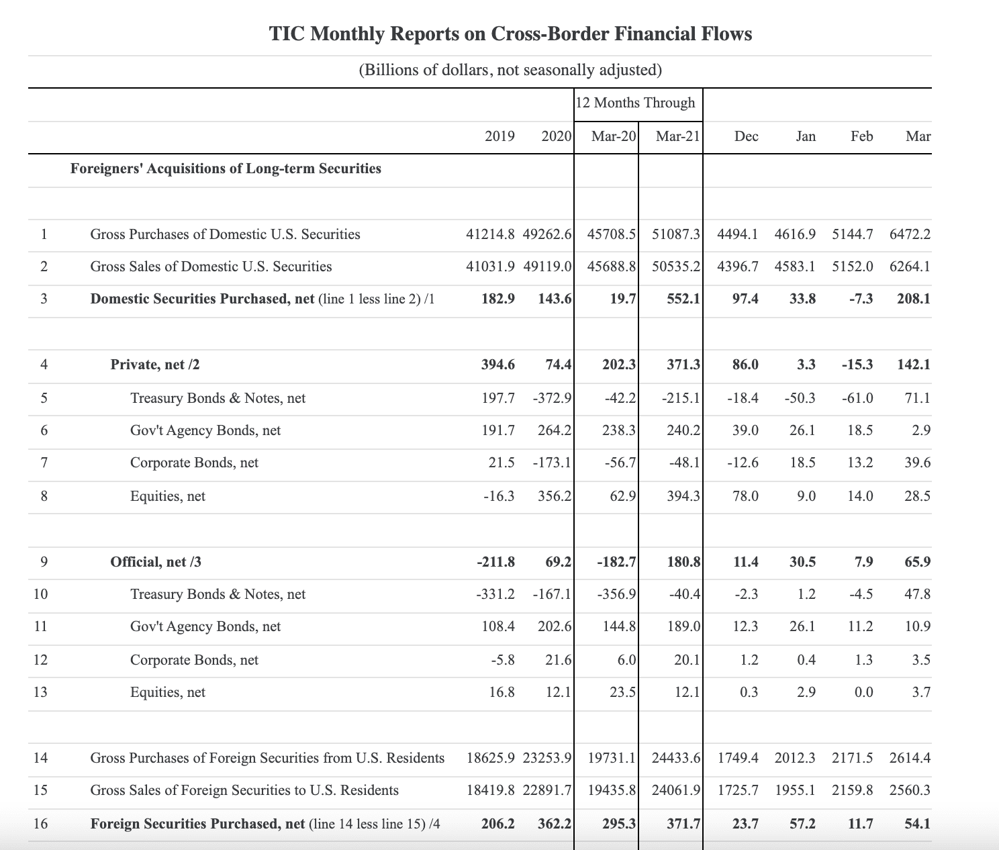

The global financial landscape is constantly evolving, driven by the complex interplay of various financial instruments and data sets. One such critical component is the Treasury International Capital (TIC) reporting system. Established to provide insights into the cross-border financial activities of the United States, the TIC system is a cornerstone for understanding the international flow of capital. It records and disseminates data on financial flows between the United States and foreign entities, offering vital information about the holdings and transactions involving U.S. and foreign securities.

TIC data is crucial for several stakeholders, including policymakers who rely on it to shape fiscal and monetary policies, economists who use it to assess the health of the U.S. economy, and investors who analyze it to make informed decisions. By reflecting the capital movements that contribute to the U.S. Balance of Payments, TIC reports provide a comprehensive view of the economic exchanges that affect the valuation of the U.S. dollar and interest rates.



Moreover, the TIC system's integration into algorithmic trading reflects its growing influence in modern finance. Algorithmic trading systems leverage this data to create sophisticated models that can predict market trends and guide trading decisions. As such, the importance of TIC data extends beyond traditional economic analysis and is increasingly significant in the context of automated trading strategies.

This article examines the complexities of the TIC system, highlights its role in international finance, and explores its connection with algorithmic trading, which is significantly transforming the operation of financial markets.

## Table of Contents

## Understanding Treasury International Capital (TIC)

Treasury International Capital (TIC) data provides a thorough overview of cross-border portfolio investment flows between the United States and foreign residents. The TIC reporting system collects and publishes data that helps in understanding the economic relationships and transactions involving U.S. and foreign securities. These reports are released on a monthly and quarterly basis, offering insights into the international financial activities influencing the U.S. economy.

The data collected through the TIC system significantly impact economic analysis, including assessing the U.S. Balance of Payments, which is a comprehensive record of all economic transactions between the residents of a country and the rest of the world. The Balance of Payments consists of the current account, the capital account, and the financial account. TIC data primarily contributes to the financial account by documenting inflows and outflows of capital in the form of securities transactions.

Moreover, TIC data aids in making predictions regarding the U.S. dollar's valuation and interest rates. By examining the data on foreign holdings and transactions of U.S. securities, economists and policymakers can assess the demand for dollar-denominated assets, which influences the currency's strength and market interest rates. For instance, an increase in foreign purchases of U.S. Treasury securities might reflect confidence in the U.S. economy, potentially leading to a stronger dollar and stabilized or lower interest rates.

The TIC system operates under the joint administration of the U.S. Department of the Treasury and the Bureau of Economic Analysis (BEA). These entities are responsible for compiling and publishing TIC data, employing rigorous data collection methods to ensure accuracy. The collection process involves mandatory reporting from large custodians and brokers in the U.S. financial markets, which provide detailed accounts of securities transactions and holdings. These reports are aggregated to present a comprehensive view of the international capital flows involving U.S. securities.

Key entities involved in the TIC data collection include banks, securities brokers, and other financial institutions, which submit detailed monthly and quarterly reports. Data is collected through various forms, such as the Foreign-Residents Holdings of U.S. Securities Report (TIC SLT) and the U.S. Portfolio Holdings of Foreign Securities Report (TIC SHC), each focusing on different aspects of securities transactions and holdings. This meticulous data collection process allows for the compilation of extensive datasets that are critical for evaluating international capital movements and their impacts on the U.S. economy.

Through the analysis of TIC data, stakeholders can better understand the economic indicators related to capital flows, informing policy decisions and investment strategies that rely on the dynamics of international finance.

## Recording and Analyzing TIC Data

Treasury International Capital (TIC) reports are foundational in tracking the cross-border investment flows associated with U.S. securities, providing detailed breakdowns of financial transactions. These reports are crucial for understanding both the gross purchases and sales of U.S. securities by foreign investors, and similarly, the U.S. acquisition and divestment of foreign securities. By analyzing TIC data, stakeholders are able to identify significant trends in foreign investment and gauge the demand for various types of U.S. securities, from Treasury bonds and notes to corporate equities.

### Methodologies Employed in Recording TIC Data

The recording of TIC data involves systematic data collection and verification processes, where multiple U.S. government entities play essential roles. The U.S. Treasury, in coordination with the Federal Reserve Bank of New York and the Bureau of Economic Analysis (BEA), compiles this data using reports submitted by U.S. financial entities. The datasets are categorized into different forms to capture a comprehensive spectrum of financial transactions. For instance:

- **Form S** captures the purchases and sales transactions in long-term securities.
- **Form SLT** collects information on long-term U.S. securities held by foreign entities and U.S. holdings of foreign long-term securities.
- **Form B** includes data related to the banking sector's cross-border claims and liabilities.

This structured approach ensures robustness and reliability in capturing vast amounts of data, which is instrumental in forming an accurate representation of international capital flows.

### Analyzing TIC Data

The analysis of TIC data extends beyond simple aggregation; it involves identifying patterns and employing statistical methods to forecast future trends. For example:

- **Trend Analysis**: By evaluating historical data, analysts can assess changes in the demand for U.S. securities, identifying periods of increased foreign investment interest or divestment.

- **Correlation Studies**: TIC data can be correlated with other economic indicators such as foreign exchange rates and interest rates. For instance, a significant influx of foreign capital into U.S. treasury securities might be correlated with a strengthening U.S. dollar or anticipations of rising interest rates.

- **Sectoral Analysis**: Analyzing TIC data by segmenting it into distinct security types aids in understanding specific market dynamics, such as the comparative attractiveness of corporate equities versus government securities.

Python is commonly used to analyze large datasets like TIC. Below is a simple example of Python code that might be used to load, process, and visualize TIC data:

```python
import pandas as pd
import matplotlib.pyplot as plt

# Load the TIC dataset from a CSV file
tic_data = pd.read_csv('tic_data.csv')

# Convert the date column to datetime
tic_data['Date'] = pd.to_datetime(tic_data['Date'])

# Plotting the time series data of foreign purchases of US Treasury securities
plt.figure(figsize=(12, 6))
plt.plot(tic_data['Date'], tic_data['ForeignPurchases'], label='Foreign Purchases of US Treasuries')
plt.xlabel('Date')
plt.ylabel('USD Billions')
plt.title('Foreign Purchases of US Treasury Securities Over Time')
plt.legend()
plt.grid(True)
plt.show()
```

### Examples and Applications

An example of TIC data's application is its use in determining the level of foreign engagement with U.S. monetary policy. Significant purchases of U.S. Treasury securities by foreign investors may reflect confidence in the U.S. economic policy, impacting how policy makers adjust interest rates and influence fiscal strategy.

Moreover, in the private sector, TIC data is crucial for large multinational corporations and investment firms. These entities use it to devise strategies that optimize the geographical allocation of assets and manage currency risk.

In conclusion, TIC data serves as a pivotal resource for assessing international financial dynamics. Understanding and analyzing this data allows investors, economists, and policymakers to make informed decisions, driving both national and international economic strategies.

## The Role of TIC in Algorithmic Trading

Algorithmic trading, often referred to as 'algo trading,' involves using complex algorithms to execute trades at speeds and frequencies that are impossible for human traders. Central to this process is the reliance on comprehensive data sets to develop algorithms that predict market trends and economic indicators. The Treasury International Capital (TIC) data is a fundamental resource in this regard, providing valuable insights into the international flow of capital, which in turn, influences both currency fluctuations and securities prices.

TIC reports, which offer detailed monthly and quarterly information about foreign portfolio investment into and out of the United States, are crucial for [algorithmic trading](/wiki/algorithmic-trading) strategies. Traders use this data to anticipate shifts in capital flows, making informed predictions about potential fluctuations in the value of the U.S. dollar and other major currencies. This anticipation is essential not only for currency trading but also for determining the optimal times to buy or sell a range of securities including U.S. Treasury bonds, corporate equities, and more.

The integration of TIC data into trading algorithms enhances their predictive capabilities. By analyzing patterns in historical TIC data, algorithms can be calibrated to detect trends in foreign investment behavior, allowing traders to position themselves advantageously ahead of market shifts. For instance, a consistent increase in foreign acquisition of U.S. securities might be interpreted as a bullish signal for the U.S. dollar, prompting algorithmic systems to adjust their trading strategies accordingly.

However, while TIC data provides these significant advantages, reliance on it is not without potential drawbacks. One challenge is the inherent delay in the reporting of TIC data, which may lead to decisions based on outdated information. Additionally, complex financial transactions that may not be fully captured in TIC reports could skew algorithmic predictions, resulting in suboptimal trading decisions. Algorithms must, therefore, account for these potential discrepancies and integrate additional data sources to refine their accuracy.

In conclusion, while TIC data significantly bolsters the capabilities of algorithmic trading systems by offering insights into market dynamics and capital flow trends, traders must be aware of its limitations. Balancing TIC data with real-time market intelligence and other economic indicators enhances the robustness of algorithmic trading strategies, ensuring they can deliver optimal performance in fast-paced financial markets.

## Interpreting TIC Data for Economic Indicators

Treasury International Capital (TIC) data is indispensable for economists and investors seeking to understand the health of the U.S. economy and its interactions with global financial markets. It offers insights into international investor sentiment and provides clues about potential shifts in interest rates. The interpretation of TIC data involves analyzing the patterns and trends in cross-border financial flows, which can be pivotal in predicting the direction of the U.S. dollar and assessing the sustainability of U.S. economic policies.

TIC reports detail the monthly and quarterly transactions and holdings of U.S. securities by foreign investors, as well as U.S. holdings of foreign securities. By evaluating these data sets, economists and investors can gauge the level of foreign demand for U.S. securities, which often correlates with investor confidence in the U.S. economy. A high level of foreign investment in U.S. securities indicates robust international confidence and can bolster the strength of the U.S. dollar. Conversely, a withdrawal of funds can signal decreased confidence and potential depreciation of the dollar.

For policymakers, TIC data is crucial for understanding the flow of portfolio investments, contributing to the broader analysis of the U.S. Balance of Payments—a summary of all economic transactions between residents of the U.S. and the rest of the world. Significant shifts in TIC data may prompt policymakers to adjust interest rates to attract or deter foreign investment, depending on the prevailing economic objectives.

One approach to interpreting TIC data is through econometric modeling, which can forecast future capital flows based on historical patterns. Regression analysis techniques can be applied to explore the relationship between TIC data and other economic indicators, such as interest rates, inflation, and GDP growth rates. For example, a simplified linear regression model might be constructed as follows:

$$
\text{Capital Flow} = \beta_0 + \beta_1 \times \text{Interest Rate} + \beta_2 \times \text{Exchange Rate} + \epsilon
$$

Where:
- $\text{Capital Flow}$ is the dependent variable representing the net capital inflow or outflow.
- $\beta_1$ and $\beta_2$ are coefficients indicating the sensitivity of capital flows to changes in interest and exchange rates, respectively.
- $\epsilon$ represents the error term.

Analyzing the coefficients can provide insights into how sensitive capital flows are to changes in interest and exchange rates, aiding economists and investors in making informed decisions.

Moreover, the geographical breakdown of TIC data assists in identifying which countries are increasing or decreasing their investments in U.S. securities. This provides strategic information about global economic alliances and potential geopolitical shifts that could affect future economic policies.

In conclusion, interpreting TIC data is a sophisticated process that integrates statistical analysis with economic theory to forecast currency movements and investor confidence. It supports economic policymaking by highlighting trends that influence economic stability and growth, helping both domestic and international stakeholders navigate complex financial landscapes.

## Challenges and Limitations of TIC Data

Treasury International Capital (TIC) data is a vital tool for understanding the movement of international capital; however, it is not without its limitations. A primary challenge associated with TIC data is the potential for gaps in coverage. The reporting system relies on data submitted by financial institutions, which might not completely capture all financial transactions involving U.S. securities. Complex financial instruments and derivative products, for instance, may not be fully identified in TIC reports, leading to discrepancies.

Reporting lags pose another significant limitation. While TIC data provides valuable insights into past transactions, there is a temporal gap between the occurrence of these transactions and their inclusion in TIC reports. This lag can hinder timely economic analysis, particularly during periods of rapid market changes.

Furthermore, discrepancies can arise from various factors. For example, financial transactions are often intricate and may involve multiple parties across different jurisdictions, complicating the reporting process. Variations in how transactions are classified by different entities can lead to inconsistencies in the data. These discrepancies can affect analyses of capital flow patterns and the accuracy of economic forecasts and policy decisions.

Efforts to enhance the precision of TIC data are ongoing. Improvements in data collection methodologies, such as leveraging big data analytics and [machine learning](/wiki/machine-learning), are being explored to address some of these challenges. By automating the classification and reporting process, it may be possible to reduce manual errors and discrepancies. Additionally, advancements in digital reporting systems could minimize reporting lags, providing more timely access to essential data.

For future improvements, enhancing collaboration between international financial regulatory bodies might provide a more harmonized approach to categorizing and tracking complex financial instruments. This cooperation could help mitigate discrepancies and improve the accuracy of the data.

In summary, while TIC data remains an essential resource for understanding international financial flows, addressing its limitations is crucial for maximizing its utility. Ongoing developments in data analytics and international regulatory cooperation hold promise for improving the system’s coverage and accuracy, making it a more robust tool for economic analysis and policy formulation.

## Conclusion

Treasury International Capital (TIC) data is indispensable for understanding the flow of international capital, playing a vital role in shaping the global economic landscape. By providing detailed insights into the movement of securities between U.S. and foreign entities, TIC data informs decision-making processes for a myriad of stakeholders, including policymakers, economists, and investors. Its analysis helps delineate the dynamics of the U.S. Balance of Payments, offering a clear picture of economic health and influencing strategies at both governmental and private levels.

The integration of TIC data into algorithmic trading underscores its growing significance in modern finance. Algo trading systems, which rely on comprehensive data sets to make informed decisions, utilize TIC data to predict market trends and capitalize on shifts in capital flows. The accuracy and timeliness of this data provide a competitive edge, allowing traders to anticipate fluctuations in currency and securities markets, thereby optimizing trading strategies.

As technological advances continue to reshape financial markets, the relevance of TIC data is set to increase. With enhanced computational capabilities and more sophisticated algorithmic models, the demand for precise and reliable data will heighten. TIC data, therefore, will be a cornerstone in ensuring economic stability and fostering growth, as it supports informed decision-making and strategic planning. Continuous improvements in data collection and reporting methods will enhance the utility of TIC data, reinforcing its critical role in global economic assessments and policy formulations.

## References & Further Reading

[1]: ["Official Treasury International Capital (TIC) Reports"](https://home.treasury.gov/data/treasury-international-capital-tic-system) - U.S. Department of the Treasury

[2]: Galati, G. & Heath, A. (2007). ["What Drives the Growth in FX Activity? Interbank vs. Customer Transactions."](https://papers.ssrn.com/sol3/papers.cfm?abstract_id=1967430) BIS Quarterly Review.

[3]: ["Algorithmic Trading: Winning Strategies and Their Rationale"](https://books.google.com/books/about/Algorithmic_Trading.html?id=WAlFDwAAQBAJ) by Ernest P. Chan

[4]: Warnock, F.E. & Warnock, V.C. (2005). ["International Capital Flows and U.S. Interest Rates."](https://www.nber.org/papers/w12560) National Bureau of Economic Research.

[5]: ["Handbook of Exchange Rates"](https://onlinelibrary.wiley.com/doi/book/10.1002/9781118445785) edited by Jessica James, Ian W. Marsh, and Lucio Sarno