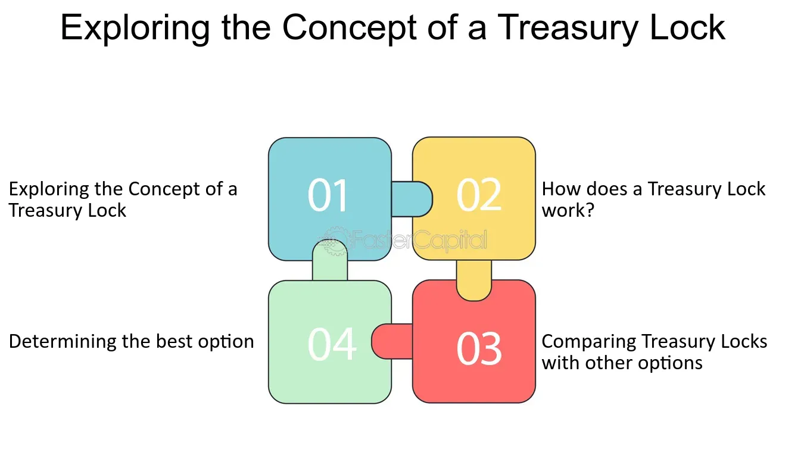

## Table of Contents

## What is a Treasury Lock in fixed income trading?

A Treasury Lock is a financial tool used in fixed income trading to manage interest rate risk. It allows investors to lock in the current yield of a Treasury security for a future date. This is helpful if someone thinks interest rates might change before they buy the Treasury. By using a Treasury Lock, they can make sure they get the yield they want, even if rates go up or down.

For example, if an investor plans to buy a Treasury bond in three months but is worried that interest rates might rise, they can use a Treasury Lock to secure today's yield. If rates do go up, they still get the lower yield they locked in. If rates go down, they can choose not to use the lock and get the new, lower yield instead. This gives investors more control over their investments and helps them plan better.

## How does a Treasury Lock work?

A Treasury Lock works like a promise between an investor and a financial institution. The investor pays a small fee to lock in the current yield of a Treasury security for a future date. This means if the investor decides to buy the Treasury at that future date, they will get the yield they locked in, no matter what happens to interest rates in the meantime.

For example, if an investor wants to buy a Treasury bond in three months but is worried that interest rates might go up, they can use a Treasury Lock. By locking in today's yield, the investor is protected if rates rise. If rates do go up, the investor can buy the bond at the locked-in yield, which will be better than the new, higher yield. If rates go down, the investor can choose not to use the lock and buy the bond at the new, lower yield. This flexibility helps investors manage their risk and plan their investments more confidently.

## What are the benefits of using a Treasury Lock?

Using a Treasury Lock helps investors feel more secure about their future investments. It lets them lock in the current yield of a Treasury security for a future date. This is great if they think interest rates might go up before they buy the Treasury. By locking in the yield, they don't have to worry about paying more if rates rise. This can save them money and give them peace of mind.

Treasury Locks also give investors flexibility. If interest rates go down after they lock in a yield, they don't have to use the lock. They can choose to buy the Treasury at the new, lower yield instead. This means they can take advantage of better rates if they happen. Overall, Treasury Locks help investors plan their investments better and manage their risk more effectively.

## What are the risks associated with Treasury Locks?

Using a Treasury Lock comes with some risks that investors should know about. One risk is that you have to pay a fee to use a Treasury Lock. If interest rates don't change much or go down, you might end up paying that fee for nothing. This means you could lose the money you paid for the lock without getting any benefit from it.

Another risk is that a Treasury Lock might make you miss out on better opportunities. If interest rates drop a lot after you lock in a yield, you might not want to use the lock. But if you decide not to use it, you still lose the fee you paid. So, you need to think carefully about whether the potential benefits of locking in a yield are worth the cost and the risk of missing out on lower rates.

## How does a Treasury Lock differ from other interest rate hedging tools?

A Treasury Lock is a specific tool used to lock in the yield of a Treasury security for a future date. It's different from other [interest rate](/wiki/interest-rate-trading-strategies) hedging tools because it focuses only on Treasury securities. For example, interest rate swaps can be used to exchange one type of interest rate for another, and they can involve different kinds of securities or loans. Treasury Locks, on the other hand, are simpler because they only deal with Treasuries and the yield you get from them.

Another difference is how Treasury Locks work compared to options like interest rate caps and floors. An interest rate cap sets a maximum rate you'll pay on a loan, and a floor sets a minimum rate you'll receive on an investment. These tools can be used with various types of loans or investments. But a Treasury Lock is more specific; it lets you lock in the yield of a Treasury security without affecting other parts of your portfolio. This makes it a good choice if you're only worried about the yield on Treasuries.

## What are the typical scenarios where a Treasury Lock would be used?

A Treasury Lock is often used when someone wants to buy a Treasury security in the future but is worried that interest rates might go up before then. For example, if a company plans to issue bonds in six months and wants to lock in today's lower interest rates, they might use a Treasury Lock. By doing this, they can make sure they get the current yield even if rates rise later. This helps them plan their finances better and avoid paying more if rates increase.

Another typical scenario is when an investor is planning a big investment in Treasuries but wants to wait a bit. They might be waiting for more money to come in or for the right time to invest. If they think rates might go up during this waiting period, they can use a Treasury Lock to secure the current yield. This way, they can feel more confident about their investment plan and not worry about missing out on the yield they want.

## How is the pricing of a Treasury Lock determined?

The pricing of a Treasury Lock is based on the difference between the current yield of the Treasury security and the yield that the investor wants to lock in. If the investor wants to lock in a yield that is lower than the current market yield, they will have to pay a fee. This fee is like a premium for the protection they get from the lock. The size of the fee depends on how much lower the locked-in yield is compared to the current yield and how long the lock will last.

The fee is also affected by how likely it is that interest rates will change. If there's a big chance that rates will go up a lot, the fee will be higher because the lock is more valuable. Financial institutions use special models to figure out these fees. These models look at things like current interest rates, how much rates might change, and how long the lock will be in place. By understanding these factors, investors can decide if using a Treasury Lock is worth the cost.

## What are the key considerations when entering into a Treasury Lock agreement?

When thinking about using a Treasury Lock, it's important to consider how likely interest rates are to change. If you think rates will go up a lot, a Treasury Lock can be a good idea because it lets you lock in today's lower yield. But you have to remember that you'll have to pay a fee to use the lock. This fee depends on how much lower the locked-in yield is compared to the current market yield and how long you want the lock to last. So, you need to think about whether the possible savings from locking in the yield are worth the cost of the fee.

Another thing to consider is how flexible you want to be with your investment. A Treasury Lock gives you the option to not use the lock if interest rates go down. This means you can choose to buy the Treasury at the new, lower yield instead of the locked-in one. But if you decide not to use the lock, you still lose the fee you paid. So, you need to weigh the benefits of having this flexibility against the risk of paying the fee without getting any benefit. Understanding these factors can help you decide if a Treasury Lock is the right tool for managing your interest rate risk.

## How can a Treasury Lock be used in conjunction with other financial instruments?

A Treasury Lock can be used with other financial tools to manage interest rate risk better. For example, someone might use a Treasury Lock to lock in the yield of a Treasury security and also use an interest rate swap to change the type of interest rate they get. The Treasury Lock helps them get a good yield on their Treasury, while the swap lets them switch to a different kind of interest rate that might be better for their needs. By using both tools together, they can protect themselves from rising rates and also make their investment strategy more flexible.

Another way to use a Treasury Lock with other tools is with options like interest rate caps and floors. An investor might use a Treasury Lock to lock in a Treasury yield and also buy an interest rate cap to set a maximum rate on another loan. This way, they can make sure they get a good yield on their Treasury and also limit how much they have to pay on their loan if rates go up. Using a Treasury Lock with other tools like this can help investors manage different parts of their financial plan and feel more secure about their future investments.

## What are the legal and regulatory aspects of using Treasury Locks?

Using Treasury Locks involves some legal and regulatory rules that you need to know about. In the United States, the use of Treasury Locks is overseen by the Commodity Futures Trading Commission (CFTC) and the Securities and Exchange Commission (SEC). These agencies make sure that financial products like Treasury Locks are used fairly and openly. If you're thinking about using a Treasury Lock, you need to make sure you follow their rules. This might include things like reporting your use of the lock and making sure you're working with a licensed financial institution.

Another important thing to consider is the contract you sign when you use a Treasury Lock. This contract will have all the details about the lock, like the yield you're locking in, the fee you have to pay, and how long the lock will last. It's important to read and understand this contract carefully because it's a legal agreement. If there's ever a problem or disagreement about the lock, the contract will be used to figure out what should happen. So, make sure you understand all the legal terms and conditions before you agree to use a Treasury Lock.

## How do market conditions affect the effectiveness of a Treasury Lock?

Market conditions play a big role in how well a Treasury Lock works. If interest rates are expected to go up a lot, a Treasury Lock can be very helpful. It lets you lock in today's lower yield, so you don't have to pay more if rates rise. But if the market is calm and rates are not expected to change much, the fee you pay for the lock might not be worth it. You could end up spending money on the lock without getting any real benefit.

On the other hand, if the market is very uncertain and rates could go either way, a Treasury Lock gives you flexibility. If rates go down after you lock in a yield, you can choose not to use the lock and buy the Treasury at the new, lower yield. But remember, you still lose the fee you paid. So, understanding the current market conditions and how they might change can help you decide if using a Treasury Lock is a smart move for your investment strategy.

## What advanced strategies can be employed with Treasury Locks to optimize a fixed income portfolio?

One advanced strategy with Treasury Locks is to use them in combination with other interest rate hedging tools to create a more balanced fixed income portfolio. For example, you might use a Treasury Lock to lock in the yield of a Treasury security while also using an interest rate swap to change the type of interest rate you receive. This way, you can protect yourself from rising rates with the Treasury Lock and also take advantage of different interest rate movements with the swap. By combining these tools, you can create a strategy that is more flexible and better suited to your investment goals.

Another strategy is to use Treasury Locks as part of a broader interest rate risk management plan. If you're managing a large portfolio with different types of fixed income securities, you can use Treasury Locks to protect the Treasury part of your portfolio while using other tools like interest rate caps and floors to manage risk on other parts. This approach allows you to tailor your risk management to different parts of your portfolio, making sure you're protected from rising rates where it matters most. By carefully planning how you use Treasury Locks with other tools, you can optimize your fixed income portfolio and feel more confident about your investments.

## What is the Role of Fixed Income Trading?

Fixed income trading is a fundamental segment of the financial markets, focused on the buying and selling of securities that pay predetermined interest rates. This type of trading primarily involves instruments such as bonds and treasury bills, which are typically issued by governments and corporations to raise capital. These securities are characterized by their relatively stable income streams and predefined maturities, making them a cornerstone for conservative investment strategies.

1. **Types of Fixed Income Securities:**
   - **Bonds:** Bonds are the most common fixed income security and can be issued by various entities, including governments, municipalities, and corporations. They come in various forms such as government bonds (e.g., U.S. Treasuries), corporate bonds, and municipal bonds. Each type carries distinct risk and return profiles, generally related to the issuer's creditworthiness and term to maturity.
   - **Treasury Bills:** These are short-term government securities with maturities typically ranging from a few days to one year. Treasury bills are considered one of the safest investments since they are backed by the government.

2. **Significance in Portfolio Management:**
   Fixed income trading is critical for providing both portfolio stability and a source of regular income. These instruments are less volatile compared to equities, thus reducing overall portfolio risk. The predictable nature of interest payments from bonds and treasury bills offers a reliable income stream, which is particularly valued in uncertain economic times.

3. **Strategies and Instruments:**
   Traders utilize a range of strategies and advanced financial instruments, including derivatives, to hedge against risks such as interest rate fluctuations and credit risk. Derivatives like interest rate swaps, futures, and options on fixed income securities allow traders to fine-tune their exposure and potentially enhance returns:
   - **Interest Rate Swaps**: These contracts involve exchanging fixed interest rate payments for floating-rate payments, helping to manage interest rate risk.
   - **Futures and Options**: Futures allow traders to lock in prices for future transactions, while options provide the right but not the obligation to execute trades at predetermined rates.

4. **Fixed Income Market Operations:**
   The fixed income markets operate through a network of primary and secondary markets. In the primary market, securities are issued and sold for the first time, while the secondary market enables ongoing trading among investors. Market participants include institutional investors such as pension funds, insurance companies, and mutual funds, who require stable income and liability matching, alongside individual investors seeking steady returns.

5. **Interest Rate Movements:**
   Interest rate movements are a key [factor](/wiki/factor-investing) impacting fixed income trading, as they inversely correlate with bond prices. Traders actively monitor economic indicators and central bank policies to anticipate rate changes:
$$
   \Delta P = - \text{D} \times \Delta y

$$
   where $\Delta P$ is the change in bond price, $\text{D}$ is the bond duration, and $\Delta y$ is the change in yield. By understanding such relationships, traders can execute strategies that optimize their positions.

In conclusion, fixed income trading plays an integral role in the broader financial landscape by offering tools for income generation and risk mitigation. As markets evolve, the efficiency and complexity of fixed income strategies continue to advance, driven by technological innovations and sophisticated financial instruments.

## References & Further Reading

[1]: Bakshi, G. S., & Madan, D. B. (2006). ["A Theory of Volatility Trading"](https://www.jstor.org/stable/20110665). Available at SSRN.

[2]: Hull, J. C. (2018). ["Options, Futures, and Other Derivatives"](https://www.semanticscholar.org/paper/Options%2C-Futures%2C-and-Other-Derivatives-Hull/89bdee500c8623864fc9eb7a471546aa713acc44) (10th Edition), Pearson.

[3]: Katz, J. O., & McCormick, D. L. (2000). ["The Encyclopedia of Trading Strategies"](https://www.amazon.com/Encyclopedia-Trading-Strategies-Jeffrey-Ph-D/dp/0070580995). McGraw-Hill.

[4]: Treleaven, P., Galas, M., & Lalchand, V. (2013). ["Algorithmic Trading Review"](https://www.researchgate.net/publication/262239006_Algorithmic_Trading_Review). Journal of Computational Intelligence and Electronic Systems.

[5]: Merton, R. C. (1974). ["On the Pricing of Corporate Debt: The Risk Structure of Interest Rates"](https://onlinelibrary.wiley.com/doi/10.1111/j.1540-6261.1974.tb03058.x). The Journal of Finance, 29(2), 449-470.