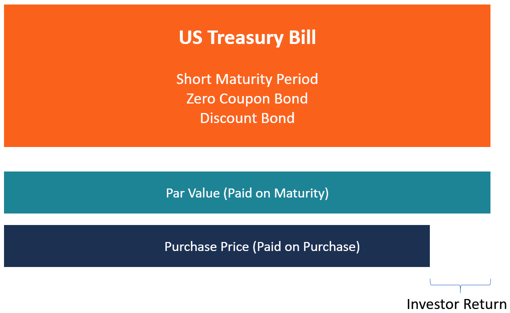

## Table of Contents

## What is a Treasury note?

A Treasury note is a type of loan that people give to the government. When you buy a Treasury note, you are lending money to the U.S. government, and in return, the government promises to pay you back with interest over a certain period of time. Treasury notes are different from other types of government securities because they have a fixed interest rate and they mature in 2 to 10 years.

These notes are considered very safe investments because they are backed by the full faith and credit of the U.S. government. This means that the government is promising to pay you back no matter what happens. People often buy Treasury notes to keep their money safe and to earn a little bit of interest while they wait for the note to mature. They can also be bought and sold in the financial markets before they mature, which makes them a flexible investment option.

## What are the different maturities available for Treasury notes?

Treasury notes come in different lengths of time before they mature. These lengths are called maturities. You can buy Treasury notes that will mature in 2 years, 3 years, 5 years, 7 years, or 10 years. This means that if you buy a 2-year note, you will get your money back after 2 years, plus the interest the government owes you.

Choosing the right maturity depends on what you want. If you need your money back soon, you might pick a 2-year or 3-year note. If you can wait longer, a 5-year, 7-year, or 10-year note might be better. Each type of note has a different interest rate, so you can pick the one that fits your plans and how much risk you want to take.

## How can an individual purchase Treasury notes?

You can buy Treasury notes directly from the U.S. government through a website called TreasuryDirect. To do this, you need to set up an account on TreasuryDirect.gov. Once you have an account, you can choose the type of Treasury note you want to buy, like a 2-year or a 10-year note. You'll need to decide how much money you want to invest and then place your order. The money will be taken from your bank account, and you'll get the Treasury note in your TreasuryDirect account.

Another way to buy Treasury notes is through a bank or a broker. Many banks and investment firms offer Treasury notes to their customers. You can talk to someone at your bank or contact a broker to find out how to buy them. They might charge you a fee for their services, but they can help you understand your options and make the process easier. Once you buy the notes, they can be held in your account at the bank or brokerage firm until they mature or until you decide to sell them.

## What is the minimum investment required to buy a Treasury note?

The smallest amount you can spend to buy a Treasury note is $100. This means you can start investing in Treasury notes without needing a lot of money. Whether you're buying them directly from the government through TreasuryDirect or through a bank or broker, $100 is the least you can invest.

After you buy a Treasury note, you can buy more in steps of $100. So, if you want to invest more, you can add $100, $200, or any other amount that is a multiple of $100. This makes it easy to increase your investment over time if you want to.

## How are Treasury notes auctioned?

Treasury notes are sold through a process called an auction. The U.S. Department of the Treasury holds these auctions regularly. When an auction happens, people and organizations can place bids to buy the notes. There are two ways to bid: competitively or non-competitively. In a competitive bid, you say how much interest you want to earn on the note. In a non-competitive bid, you agree to accept whatever interest rate is decided at the auction. Most individual investors use non-competitive bids because it's simpler and you're guaranteed to get some of the notes you want.

After the bidding time ends, the Treasury looks at all the bids. They start with the non-competitive bids and give those bidders the notes they asked for. Then, they look at the competitive bids, starting with the lowest interest rate asked for and moving up until all the notes are sold. The highest interest rate accepted in the competitive bids becomes the rate for everyone who got notes in that auction. This way, everyone knows what interest they will earn, and the Treasury can raise the money it needs.

## What is the difference between a Treasury note and a Treasury bond?

Treasury notes and Treasury bonds are both ways for the U.S. government to borrow money from people. The main difference between them is how long it takes for them to mature. Treasury notes have shorter times until they mature, usually between 2 and 10 years. On the other hand, Treasury bonds take much longer to mature, always 30 years. So, if you want your money back sooner, you might choose a Treasury note, but if you can wait a long time, a Treasury bond might be better.

Another difference is how often they pay interest. Treasury notes pay interest every six months until they mature. Treasury bonds also pay interest every six months, but because they last longer, you get more interest payments over time. Both are considered very safe investments because they are backed by the U.S. government, but the choice between them depends on how long you want to invest your money and how much interest you want to earn.

## How does the interest on Treasury notes work?

When you buy a Treasury note, you are lending money to the U.S. government. In return, the government pays you interest. This interest is paid every six months until the note matures. The amount of interest you earn depends on the interest rate set at the auction when you bought the note. For example, if you bought a $100 note with an interest rate of 2%, you would get $1 every six months.

The interest rate for Treasury notes is fixed, which means it stays the same for the entire time you own the note. This makes it easy to know exactly how much money you will earn over time. When the note matures, you get your original investment back, plus the last interest payment. So, if you bought a 5-year note, after 5 years, you would get your $100 back, plus the interest you earned over those 5 years.

## What are the tax implications of investing in Treasury notes?

When you invest in Treasury notes, the interest you earn is subject to federal income tax. This means you have to pay taxes on the interest to the U.S. government. However, the good news is that the interest from Treasury notes is exempt from state and local income taxes. So, you won't have to pay any state or city taxes on the interest you earn from your Treasury notes.

If you sell your Treasury notes before they mature, you might have to pay capital gains tax. This happens if you sell the notes for more than what you paid for them. The tax you pay depends on how long you held the notes and your income level. If you hold the notes for more than a year, you might pay a lower long-term capital gains tax rate. But if you sell them within a year, you'll pay the higher short-term capital gains rate, which is the same as your regular income tax rate.

## How do Treasury notes affect the economy?

Treasury notes help the economy by letting the government borrow money from people. When the government needs money for things like building roads or helping people, it can sell Treasury notes. People buy these notes because they are safe and they earn a little interest. This way, the government gets the money it needs without having to raise taxes right away. It's like the government is borrowing from its own people, and everyone knows the money will be paid back.

When lots of people buy Treasury notes, it can also affect how much money is available in the economy. If many people are putting their money into Treasury notes, there might be less money for other things like buying cars or houses. This can slow down the economy a bit. But, if the government uses the money from the notes to do good things, like fixing bridges or helping schools, it can help the economy grow. So, Treasury notes can be a way to balance what the government needs with what's good for the whole economy.

## What strategies can be used to optimize returns from Treasury notes?

To get the most out of your Treasury notes, you can think about when you buy them. If you think interest rates might go down, buying longer-term notes, like 10-year ones, could be a good idea. That's because if rates go down, the value of your notes might go up, and you can sell them for more money before they mature. On the other hand, if you think rates might go up, you might want to stick with shorter-term notes, like 2-year ones. That way, you can reinvest your money at higher rates when the notes mature.

Another way to make the most of your Treasury notes is to think about how they fit into your whole investment plan. Treasury notes are safe, but they don't usually give you big returns. So, you might want to mix them with other investments that could grow more, like stocks. This way, you can have some safe money in Treasury notes and some money that might grow faster in other places. Also, if you're in a high tax state, Treasury notes can be a good choice because you don't have to pay state taxes on the interest you earn.

## How do changes in interest rates impact the value of Treasury notes?

When interest rates go up, the value of Treasury notes that you already own can go down. This happens because new Treasury notes will be sold with higher interest rates, making the older ones with lower rates less attractive to buyers. If you want to sell your old Treasury notes before they mature, you might have to sell them for less money than you paid for them. This is because people would rather buy the new notes that pay more interest.

On the other hand, when interest rates go down, the value of your existing Treasury notes can go up. This is because your notes now have a higher interest rate than the new ones being sold. People will want to buy your notes because they pay more interest, so you can sell them for more money than you paid. This makes your investment worth more if you decide to sell it before it matures.

## What are the risks associated with investing in Treasury notes?

Investing in Treasury notes is usually very safe because they are backed by the U.S. government. This means the government promises to pay you back, no matter what happens. But there are still some risks you should know about. One risk is that interest rates might change. If interest rates go up after you buy your Treasury note, the value of your note might go down. This is because new notes will be sold with higher interest rates, making your old note less attractive to buyers. If you need to sell your note before it matures, you might get less money than you paid for it.

Another risk is inflation. Inflation means that the prices of things go up over time. If inflation goes up a lot, the interest you earn from your Treasury note might not be enough to keep up with the rising prices. This means the money you get back when your note matures might not buy as much as it used to. So, even though Treasury notes are safe, you need to think about how changes in interest rates and inflation might affect your investment.

## References & Further Reading

For further insights into the intricate workings of Treasury securities and investment strategies, several resources are invaluable. Those keen on understanding the basics and complexities of government bonds can start with comprehensive resources available on Investopedia. Their articles cover fundamental concepts, including Treasury securities, investment strategies, and detailed analyses of financial instruments.

The U.S. Department of the Treasury provides detailed reports and data sets essential for anyone interested in the practical aspects of investing in Treasury securities. These include current interest rates, auction results, and analyses of economic indicators affecting securities.

For professionals and scholars seeking a deeper understanding, financial analyses textbooks are indispensable. Classic works such as "Principles of Corporate Finance" by Richard A. Brealey and Stewart C. Myers offer foundational knowledge on the financial markets, including fixed income securities. Similarly, "Fixed Income Securities: Tools for Today’s Markets" by Bruce Tuckman and Angel Serrat is a crucial resource for detailed exploration of fixed income products, providing both theory and practice elements necessary for professionals in finance.

Books on algorithmic trading, such as "Algorithmic Trading: Winning Strategies and Their Rationale" by Ernest P. Chan, illuminate the increasing role of technology in trading. These resources explore algorithms' role in market dynamics, offering practical insights for optimizing trade execution and managing Treasury investments.

For those interested in market dynamics, "Market Microstructure Theory" by Maureen O'Hara is a recommended read. It provides an analytical approach to understanding how market structures affect trading and pricing, an essential aspect for anyone using algorithmic trading systems.

In addition to [books](/wiki/algo-trading-books), academic journals and articles provide updated research findings and theoretical perspectives. Journals like "The Journal of Finance" and "Financial Analysts Journal" regularly publish articles relevant to both fixed income securities and algorithmic trading. By engaging with these resources, investors and finance professionals can enhance their understanding, ensuring they are well-equipped to navigate and optimize investments in Treasury securities.

