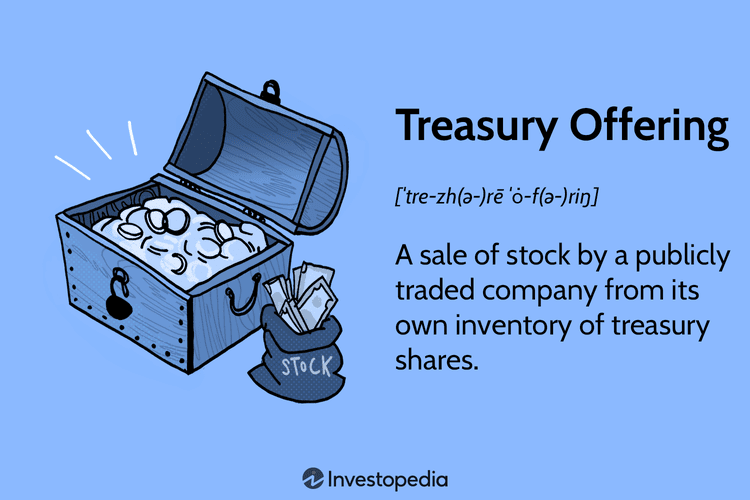

## Table of Contents

## What are treasury offerings?

Treasury offerings are when the government sells special kinds of bonds or securities to raise money. These are called treasury securities, and they can be things like treasury bills, notes, or bonds. The government does this to help pay for things it needs, like building roads or funding programs. People and businesses can buy these securities, and in return, they get their money back with some extra interest after a certain time.

When the government decides to offer these securities, it usually does so through an auction. This means that people and businesses can bid on how much they are willing to pay for the securities. The government then chooses the highest bids to sell the securities to. This process helps the government get the money it needs while also giving people a safe way to invest their money. Treasury offerings are important because they help keep the economy running smoothly by managing how much money is available.

## What is the purpose of treasury offerings?

Treasury offerings are a way for the government to get money it needs to pay for things like building roads, schools, and other important projects. When the government sells treasury securities, like bills, notes, or bonds, people and businesses can buy them. In return, the government promises to pay back the money with some extra interest after a certain time. This helps the government raise the funds it needs without having to increase taxes right away.

The process of selling these securities is done through auctions. This means that people and businesses can bid on how much they are willing to pay for the securities. The government then picks the highest bids to sell to. This way, the government can make sure it gets the best price for the securities. Treasury offerings are important because they help manage the amount of money in the economy, which can help keep things stable and running smoothly.

## How do treasury offerings work?

Treasury offerings are when the government sells special kinds of bonds or securities to get money. These securities are called treasury bills, notes, or bonds. People and businesses can buy them. When they do, the government promises to give their money back with some extra interest after a certain time. This helps the government pay for things like building roads or schools without raising taxes right away.

The government sells these securities through something called an auction. This means people and businesses can say how much they are willing to pay for the securities. The government then picks the highest bids to sell to. This way, the government can make sure it gets the best price for the securities. Treasury offerings help the government manage the money in the economy, which can keep things stable and running smoothly.

## What are the different types of treasury offerings?

Treasury offerings come in different types like treasury bills, treasury notes, and treasury bonds. Treasury bills, or T-bills, are short-term securities that usually last for a few weeks to a year. They are sold at a discount, which means you pay less than the amount you will get back when they mature. Treasury notes, or T-notes, last longer, from two to ten years. They pay interest every six months until they mature. Treasury bonds, or T-bonds, are the longest, lasting 20 or 30 years. They also pay interest every six months.

Each type of treasury offering helps the government in different ways. T-bills are good for short-term needs because they mature quickly. T-notes are useful for medium-term projects since they last longer and provide regular interest payments. T-bonds are used for long-term funding because they last the longest and also provide regular interest. By offering these different types, the government can raise money for various needs and time frames, helping to keep the economy stable.

## Who can participate in treasury offerings?

Anyone can participate in treasury offerings. This means that people, businesses, and even other countries can buy treasury securities like bills, notes, and bonds. You don't need to be rich or have a special job to take part. All you need is some money to invest and a way to buy the securities, like through a bank or a broker.

When the government wants to sell these securities, it holds an auction. At the auction, people and businesses can say how much they are willing to pay for the securities. The government then picks the highest bids to sell to. This way, everyone has a chance to buy treasury securities if they want to, and the government can make sure it gets the best price for them.

## What are the key mechanisms involved in treasury offerings?

Treasury offerings are when the government sells special kinds of bonds or securities to get money. These securities are called treasury bills, notes, or bonds. People and businesses can buy them through an auction. At the auction, people say how much they are willing to pay for the securities. The government then picks the highest bids to sell to. This way, the government can make sure it gets the best price for the securities.

The different types of treasury securities help the government in different ways. Treasury bills, or T-bills, are short-term and last from a few weeks to a year. They are sold at a discount, so you pay less than what you get back when they mature. Treasury notes, or T-notes, last longer, from two to ten years, and pay interest every six months. Treasury bonds, or T-bonds, are the longest, lasting 20 or 30 years, and also pay interest every six months. By offering these different types, the government can raise money for various needs and time frames, helping to keep the economy stable.

## What are the common constraints faced in treasury offerings?

When the government wants to sell treasury securities, they sometimes face challenges. One big challenge is making sure there are enough people and businesses interested in buying them. If not many people want to buy, the government might not get the money it needs. Another challenge is setting the right price for the securities. If the price is too high, people might not want to buy them. If it's too low, the government might not raise enough money.

Another constraint is the timing of the auctions. The government has to plan when to hold these auctions carefully. If they hold too many auctions close together, it might make people think the government needs a lot of money quickly, which could worry them. Also, the government has to think about how much money is already in the economy. If there's too much money, selling more securities might make things unstable. So, the government has to balance all these things to make sure treasury offerings work well.

## How do treasury offerings impact the economy?

Treasury offerings help the government get money it needs to pay for things like roads and schools. When the government sells treasury securities, like bills, notes, or bonds, people and businesses can buy them. This helps the government raise money without having to raise taxes right away. If lots of people want to buy these securities, it can mean the economy is doing well because people feel safe investing their money. But if not many people want to buy them, it might mean people are worried about the economy.

The way treasury offerings work can also affect how much money is in the economy. When the government sells more securities, it takes money out of people's hands and puts it into the government's hands. This can help control inflation, which is when prices go up too fast. But if the government sells too many securities, it might take too much money out of the economy, which can slow things down. So, the government has to be careful to balance how many securities it sells to keep the economy stable.

## What are the risks associated with participating in treasury offerings?

When you buy treasury securities, there are some risks you should know about. One risk is [interest rate](/wiki/interest-rate-trading-strategies) risk. This means that if interest rates go up after you buy a treasury security, the value of your security might go down. If you need to sell it before it matures, you might get less money back than you expected. Another risk is inflation risk. If inflation goes up a lot, the interest you earn on your treasury security might not be enough to keep up with the rising prices, so your money won't be worth as much when you get it back.

There's also the risk that the government might not be able to pay you back. This is called default risk, but it's very rare for the U.S. government because it has a good track record of paying its debts. Still, it's something to think about. Lastly, there's the risk of opportunity cost. This means that by putting your money into treasury securities, you might miss out on other investments that could give you a higher return. So, it's important to think about all these risks before deciding to participate in treasury offerings.

## How do governments regulate treasury offerings?

Governments have rules to make sure treasury offerings work well and are fair. They use something called the U.S. Department of the Treasury to manage these rules. The Treasury decides when to sell securities, how much to sell, and how to sell them. They do this through auctions, where people and businesses can bid on the securities. The government picks the highest bids to make sure they get the best price. They also set rules about who can buy the securities and how much they can buy to keep things fair for everyone.

The government also watches the economy to make sure selling treasury securities doesn't cause problems. They look at things like interest rates and inflation to decide how many securities to sell. If they sell too many, it might take too much money out of the economy and slow things down. If they don't sell enough, they might not have the money they need for important projects. By carefully managing these offerings, the government helps keep the economy stable and makes sure they can pay for things like roads and schools.

## What advanced strategies can be used to optimize participation in treasury offerings?

One advanced strategy to optimize participation in treasury offerings is to use a technique called laddering. This means buying treasury securities that mature at different times. For example, you could buy some that mature in one year, some in two years, and some in five years. This way, you get money back at different times, which can help you manage your cash flow better. It also helps you take advantage of different interest rates over time. If rates go up, you can reinvest the money from the shorter-term securities at the new, higher rates.

Another strategy is to use a bidding strategy at the auctions. Instead of just bidding the same amount every time, you can try to guess what other people might bid and adjust your bid to get the best deal. This can be tricky, but if you do it right, you might be able to buy securities at a lower price. You can also look at what's happening in the economy and use that information to decide when to buy. For example, if you think interest rates are going to go down, you might want to buy more securities now to lock in the higher rates. By using these strategies, you can make the most out of participating in treasury offerings.

## How do treasury offerings compare to other financial instruments in terms of mechanisms and constraints?

Treasury offerings are different from other financial instruments like stocks or corporate bonds in how they work and the rules they have. When the government sells treasury securities, like bills, notes, or bonds, they do it through an auction. People and businesses can bid on how much they are willing to pay for these securities. The government then picks the highest bids to sell to. This is different from buying stocks, where you can buy them directly from a stock market at any time. Treasury offerings also have rules about who can buy them and how much they can buy, to make sure it's fair for everyone. Stocks and corporate bonds don't have these same rules.

Another big difference is the risk and return. Treasury securities are seen as very safe because they are backed by the government. This means there's a low chance the government won't pay you back, but the interest you earn might be lower than what you could get from other investments. Stocks and corporate bonds can offer higher returns, but they also come with more risk. If a company does badly, the value of its stocks or bonds can go down a lot, and you might lose money. Treasury offerings also have to think about the economy, like inflation and interest rates, more than other financial instruments do. This is because selling too many securities can take too much money out of the economy and slow things down.

## References & Further Reading

[1]: ["Advances in Financial Machine Learning"](https://www.amazon.com/Advances-Financial-Machine-Learning-Marcos/dp/1119482089) by Marcos Lopez de Prado

[2]: ["Quantitative Trading: How to Build Your Own Algorithmic Trading Business"](https://www.amazon.com/Quantitative-Trading-Build-Algorithmic-Business/dp/1119800064) by Ernest P. Chan

[3]: ["Machine Learning for Algorithmic Trading"](https://github.com/stefan-jansen/machine-learning-for-trading) by Stefan Jansen

[4]: ["Evidence-Based Technical Analysis: Applying the Scientific Method and Statistical Inference to Trading Signals"](https://www.amazon.com/Evidence-Based-Technical-Analysis-Scientific-Statistical/dp/0470008741) by David Aronson

[5]: Fabozzi, F. J. (2004). ["Fixed Income Analysis,"](https://archive.org/details/fixedincomeanaly0002fabo) CFA Institute Investment Series.

[6]: Treynor, J. L., & Black, F. (1973). ["How to Use Security Analysis to Improve Portfolio Selection."](https://www.jstor.org/stable/2351280) Journal of Business, 46(1), 66-86.