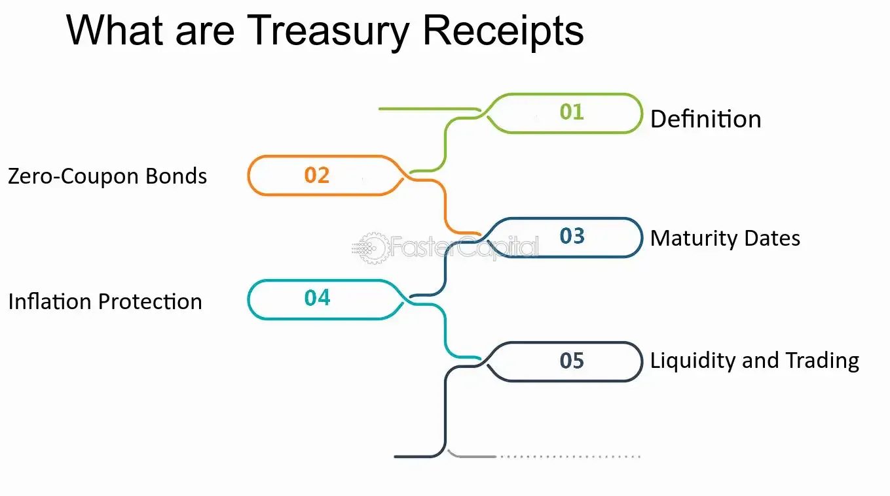

## Table of Contents

## What is a Treasury Receipt?

A Treasury Receipt is a type of financial product that represents ownership in a specific U.S. Treasury security. It's like a certificate that shows you own a part of a government bond, note, or bill. These receipts are often sold by banks or brokers and can be a way for people to invest in government securities without buying the actual bond directly.

When you buy a Treasury Receipt, you're not getting the actual Treasury security right away. Instead, you get a promise that you will receive the security at a future date. This can be useful for investors who want to lock in current interest rates or plan for future financial needs. Treasury Receipts are considered very safe because they are backed by the U.S. government, making them a popular choice for conservative investors.

## How does a Treasury Receipt work?

A Treasury Receipt is like a promise from a bank or broker that you will get a U.S. Treasury security later. When you buy a Treasury Receipt, you pay money now, but you don't get the actual bond, note, or bill right away. Instead, you get a receipt that says you will receive the Treasury security on a certain date in the future. This can be helpful if you want to plan your investments or lock in today's interest rates for something you'll need later.

When the date comes, the bank or broker gives you the Treasury security that your receipt promised. Until then, your money is safely invested in a government-backed security, which means it's very low risk. Treasury Receipts are popular because they are secure and let you plan your finances without having to buy the actual bond right away.

## What is the purpose of issuing a Treasury Receipt?

The main purpose of issuing a Treasury Receipt is to give people a way to invest in U.S. Treasury securities without having to buy the actual bond, note, or bill right away. When someone buys a Treasury Receipt, they are essentially buying a promise that they will get the Treasury security at a later date. This can be useful for people who want to lock in current interest rates or plan for future financial needs.

Treasury Receipts are also helpful because they make it easier for banks and brokers to sell parts of Treasury securities to more people. Instead of selling one big bond, they can break it into smaller pieces and sell those pieces as receipts. This way, more people can invest in safe, government-backed securities without needing a lot of money to buy a whole bond.

## Who can issue a Treasury Receipt?

Treasury Receipts are issued by banks and brokers. These financial institutions buy U.S. Treasury securities and then sell parts of them to people as Treasury Receipts. This way, they can offer smaller pieces of the securities to more people, making it easier for everyone to invest in safe, government-backed options.

The U.S. government itself does not issue Treasury Receipts directly. Instead, it issues the actual Treasury securities like bonds, notes, and bills. Banks and brokers then take these securities and create Treasury Receipts from them, which they sell to their customers. This process helps more people access government securities without needing to buy the whole bond at once.

## What are the different types of Treasury Receipts?

Treasury Receipts come in different types, mainly based on the kind of U.S. Treasury security they represent. The most common types are those linked to Treasury bonds, Treasury notes, and Treasury bills. Each type of receipt corresponds to the maturity period of the underlying security. For example, a receipt linked to a Treasury bond might have a longer maturity period, like 10 to 30 years, while one linked to a Treasury bill might mature in a few months.

These receipts can also be categorized by how they are sold. Some Treasury Receipts are sold at a discount, meaning you pay less than the face value of the security and get the full amount when it matures. Others might be sold at face value but with a promise of interest payments over time. This variety allows investors to choose the type of receipt that best fits their financial goals and timelines.

## How is a Treasury Receipt different from a Treasury Bill?

A Treasury Receipt and a Treasury Bill are both related to U.S. government securities, but they work differently. A Treasury Bill, or T-Bill, is a short-term debt obligation issued by the U.S. government with a maturity of one year or less. When you buy a T-Bill, you pay a discounted price and get the full face value when it matures. It's like a promise from the government that you'll get your money back with a little extra after a short time.

On the other hand, a Treasury Receipt is not issued directly by the government. Instead, banks and brokers buy Treasury securities, like T-Bills, and then sell parts of them as receipts. When you buy a Treasury Receipt, you're buying a promise from the bank or broker that you'll get the actual Treasury security at a future date. This means you don't get the security right away, but you can plan your investments and lock in current interest rates for later.

## What are the risks associated with investing in Treasury Receipts?

Investing in Treasury Receipts is generally considered very safe because they are backed by the U.S. government. This means the risk of losing your money is very low. However, there are still some risks to think about. One risk is interest rate risk. If interest rates go up after you buy a Treasury Receipt, the value of the receipt might go down. This is because new Treasury securities might offer higher interest rates, making your receipt less attractive to other investors if you wanted to sell it before it matures.

Another risk is inflation risk. If inflation goes up, the money you get back from your Treasury Receipt might not be worth as much as when you bought it. This means your investment might not keep up with the rising costs of things. Also, since you don't get the actual Treasury security right away, you might miss out on other investment opportunities that could offer better returns. While these risks are not as big as with other investments, it's good to know about them before you decide to buy a Treasury Receipt.

## How can one purchase a Treasury Receipt?

To buy a Treasury Receipt, you need to go through a bank or a broker. These financial institutions buy U.S. Treasury securities and then sell parts of them as receipts. You can visit a bank or contact a broker to see what kinds of Treasury Receipts they offer. They will explain the different types, like those linked to Treasury bonds, notes, or bills, and help you choose one that fits your needs. You'll need to fill out some forms and provide payment, usually through a bank transfer or check.

Once you've bought a Treasury Receipt, you'll get a document that promises you'll receive the actual Treasury security on a certain date in the future. This receipt will show details like the amount you paid, the date you'll get the security, and the type of security it's linked to. Until that date, your money is safely invested in a government-backed security, which means it's very low risk. When the time comes, the bank or broker will give you the Treasury security, and you can either keep it until it matures or sell it if you need the money sooner.

## What are the tax implications of holding a Treasury Receipt?

When you hold a Treasury Receipt, you need to think about taxes. The interest you earn from the Treasury security that the receipt represents is usually taxable at the federal level. This means you have to report this interest on your federal tax return and pay taxes on it. The interest is taxed as ordinary income, which means it's added to your other income and taxed at your regular income tax rate.

However, there's good news: the interest from Treasury Receipts is usually not taxed at the state or local level. This can be a big advantage if you live in a place with high state or local taxes. When you get the actual Treasury security and it matures, you might have to pay taxes on any profit you make if you sell it for more than you paid for the receipt. It's always a good idea to talk to a tax advisor to understand how Treasury Receipts will affect your taxes based on your specific situation.

## How do Treasury Receipts affect the economy?

Treasury Receipts help the economy by making it easier for people to invest in safe, government-backed securities. When banks and brokers sell Treasury Receipts, they are breaking down big Treasury securities into smaller pieces that more people can buy. This means more people can save and invest their money in a secure way, which can help them feel more confident about their financial future. When people feel confident, they are more likely to spend money, which can help the economy grow.

Also, Treasury Receipts help the government manage its money. When people buy Treasury Receipts, they are indirectly buying U.S. Treasury securities. This gives the government money it can use to pay for important things like roads, schools, and defense. By selling these securities through banks and brokers, the government can reach more investors and borrow money at a lower cost. This can help keep the economy stable and support government projects that benefit everyone.

## What are the historical trends in the use of Treasury Receipts?

Treasury Receipts have been around for a while, but their use has changed over time. In the past, they were a popular way for people to invest in government securities without having to buy the whole bond at once. This was especially helpful during times when interest rates were high, and people wanted to lock in those rates for the future. Banks and brokers would buy Treasury securities and then sell parts of them as receipts, making it easier for more people to invest.

In recent years, the use of Treasury Receipts has gone up and down depending on the economy. When interest rates are low, people might not be as interested in buying Treasury Receipts because they can get better returns from other investments. But when the economy is uncertain or interest rates are expected to rise, more people turn to Treasury Receipts because they are safe and let them lock in current rates. Overall, Treasury Receipts remain a useful tool for people who want to invest in a secure way and plan for the future.

## What advanced strategies can be used when investing in Treasury Receipts?

One advanced strategy when investing in Treasury Receipts is called laddering. This means you buy Treasury Receipts that mature at different times. For example, you might buy some that mature in one year, some in two years, and some in three years. This way, you get money back at different times, which can help you manage your cash flow better. It also lets you take advantage of different interest rates over time. If rates go up, you can reinvest the money from the shorter-term receipts at the new, higher rates.

Another strategy is to use Treasury Receipts as part of a diversified portfolio. This means you don't put all your money in one place. You might have some money in stocks, some in real estate, and some in Treasury Receipts. This can help lower your risk because if one type of investment goes down, the others might still be doing well. Treasury Receipts are very safe, so they can balance out riskier investments like stocks. By mixing different types of investments, you can protect your money and still have a chance to grow it over time.

## References & Further Reading

[1]: Fabozzi, F. J., & Mann, S. V. (2005). ["The Handbook of Fixed Income Securities"](https://www.mhebooklibrary.com/doi/book/10.1036/9781260473902?contentTab=true). McGraw-Hill Education.

[2]: Gomber, P., Arndt, B., Lutat, M., & Uhle, T. (2011). ["High-Frequency Trading"](https://papers.ssrn.com/sol3/papers.cfm?abstract_id=1858626) in N.M. Seifodine, A. Bensassi, & K. Madani (eds.) Computational Intelligence in Optimization - Applications and Implementations.

[3]: Lopez de Prado, M. (2018). ["Advances in Financial Machine Learning"](https://www.amazon.com/Advances-Financial-Machine-Learning-Marcos/dp/1119482089). Wiley.

[4]: Chan, E. (2009). ["Quantitative Trading: How to Build Your Own Algorithmic Trading Business"](https://github.com/ftvision/quant_trading_echan_book). Wiley.

[5]: Jansen, S. (2020). ["Machine Learning for Algorithmic Trading"](https://github.com/stefan-jansen/machine-learning-for-trading). Packt Publishing.