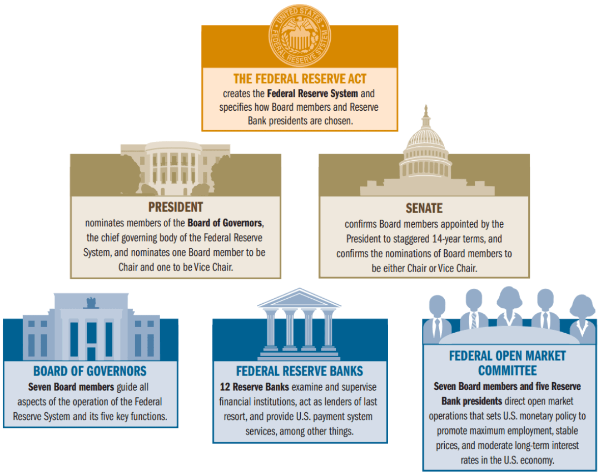

## Table of Contents

## What is the role of the Treasury Secretary?

The Treasury Secretary is a very important person in the U.S. government. They are in charge of the Department of the Treasury, which deals with money matters for the whole country. The Treasury Secretary helps make big decisions about the economy, like how to spend money, how to collect taxes, and how to keep the country's money safe.

One of the main jobs of the Treasury Secretary is to work with the President and Congress to create a budget for the country. They also help decide how much money the government should borrow and how to manage that debt. The Treasury Secretary also works to stop people from doing bad things with money, like money laundering or funding terrorism. They play a big role in making sure the country's financial system is strong and works well.

## What are the primary responsibilities of the Treasury Secretary?

The Treasury Secretary is the head of the U.S. Department of the Treasury and has many important jobs. One of their main responsibilities is to help make the country's budget. They work closely with the President and Congress to figure out how much money the government should spend and where it should spend it. They also decide how much money the government needs to borrow and how to manage that debt. This is important because it affects how much money people pay in taxes and how the government can help the economy grow.

Another big job of the Treasury Secretary is to keep the country's financial system safe and strong. They work to stop bad things from happening with money, like money laundering or funding terrorism. They also help make rules for banks and other financial places to make sure they are doing things the right way. The Treasury Secretary also keeps an eye on the economy to see if it's doing well or if it needs help. They give advice to the President and other leaders on what to do to keep the economy healthy.

## How is the Treasury Secretary appointed?

The Treasury Secretary is appointed by the President of the United States. When a new President is elected, or if the current Treasury Secretary leaves the job, the President picks someone they think will do a good job. This person is usually someone who knows a lot about money and the economy. The President can choose anyone they want, but they often pick someone who has worked in finance or government before.

After the President picks someone, that person needs to be approved by the Senate. The Senate is a group of people who help make laws in the U.S. They have a special meeting called a confirmation hearing where they ask the person a lot of questions. If most of the Senators think the person is a good choice, they vote to approve them. Once the Senate says yes, the person can officially become the Treasury Secretary and start their job.

## What is the historical background of the Treasury Secretary position?

The position of Treasury Secretary started a long time ago, in 1789, when the United States was just becoming a country. The first person to be Treasury Secretary was Alexander Hamilton. He was very important because he helped set up the country's money system. He made a plan for how the government should handle money, like how to collect taxes and how to pay off debts from the war. His ideas are still used today and helped make the country's economy strong.

Over the years, the job of the Treasury Secretary has changed and grown. As the country got bigger and the economy got more complicated, the Treasury Secretary had to do more things. They started working not just on the budget and taxes, but also on keeping the financial system safe from bad things like money laundering. They also began to play a bigger role in helping the President and other leaders make decisions about the economy. Today, the Treasury Secretary is one of the most important people in the government when it comes to money and the economy.

## Who was the first Treasury Secretary of the United States?

The first Treasury Secretary of the United States was Alexander Hamilton. He started his job in 1789, right after the country was formed. Hamilton was very important because he helped set up the country's money system. He made a plan for how the government should handle money, like how to collect taxes and how to pay off debts from the war.

Hamilton's ideas are still used today and helped make the country's economy strong. He believed in having a strong central government that could manage the country's money well. His work laid the foundation for the role of the Treasury Secretary, which has grown and changed over time but remains crucial to the nation's financial health.

## Can you name some notable Treasury Secretaries and their contributions?

Alexander Hamilton was the first Treasury Secretary and he did a lot to help the new country. He made a plan for how the government should handle money, like how to collect taxes and pay off debts from the war. His ideas helped make the country's money system strong and are still used today. Hamilton believed in having a strong central government that could manage the country's money well.

Another important Treasury Secretary was Andrew Mellon, who served during the 1920s. He helped the economy grow a lot during that time. Mellon believed in lowering taxes for rich people and businesses, thinking it would help the whole economy. His ideas were popular then, but they also led to some problems later on. Still, he is remembered for helping the economy during his time as Treasury Secretary.

Henry Paulson was Treasury Secretary during the 2008 financial crisis. He worked hard to stop the economy from getting worse. Paulson helped create a big plan to save banks and other financial places that were in trouble. His work helped the country get through a very tough time. Even though not everyone agreed with everything he did, many people think he did a good job in a very hard situation.

## How does the Treasury Secretary influence economic policy?

The Treasury Secretary has a big role in shaping the country's economic policy. They work closely with the President and Congress to make decisions about how to spend money, how to collect taxes, and how to manage the country's debt. The Treasury Secretary helps create the budget, which is like a plan for how the government will use its money. They also give advice on whether taxes should go up or down, and how to make the economy grow. This is important because these decisions affect everyone in the country, from how much money people take home to how businesses do.

The Treasury Secretary also helps keep the financial system safe and strong. They make rules for banks and other places that deal with money to make sure they are doing things the right way. They also work to stop bad things from happening with money, like money laundering or funding terrorism. By doing these things, the Treasury Secretary helps make sure the economy stays healthy and that people can trust the financial system. Their work can have a big impact on how well the economy does and how people feel about it.

## What is the relationship between the Treasury Secretary and the Federal Reserve?

The Treasury Secretary and the Federal Reserve work together but have different jobs. The Treasury Secretary is part of the government and helps make decisions about the country's money, like how to spend it and how to collect taxes. The Federal Reserve, on the other hand, is like a special bank that controls the country's money supply and sets interest rates. Even though they are separate, they need to work together to make sure the economy stays healthy.

The Treasury Secretary and the head of the Federal Reserve, called the Chair, talk to each other a lot. They share information and ideas about what's happening with the economy. The Treasury Secretary might tell the Federal Reserve about the government's plans for spending and taxes, and the Federal Reserve might tell the Treasury Secretary about what they are doing with interest rates. By working together, they can help make good decisions that keep the economy strong and stable.

## How does the Treasury Secretary manage national debt and fiscal policy?

The Treasury Secretary plays a big role in managing the national debt and making fiscal policy. The national debt is the total amount of money the government owes. The Treasury Secretary works with the President and Congress to decide how much money the government should borrow to cover its spending. They also help figure out how to pay back this debt over time. This is important because if the debt gets too big, it can cause problems for the economy. The Treasury Secretary makes sure the government can borrow money at good rates and that it can pay back what it owes without hurting the economy.

Fiscal policy is about how the government uses its money to help the economy. The Treasury Secretary helps make the budget, which is a plan for how the government will spend its money. They decide how much to spend on things like schools, roads, and helping people who need it. They also decide how much money to collect in taxes. If the economy is doing well, the Treasury Secretary might suggest spending less or raising taxes to keep things balanced. If the economy is struggling, they might suggest spending more or lowering taxes to help it grow. By making these decisions, the Treasury Secretary helps keep the economy healthy and stable.

## What role does the Treasury Secretary play in international finance and diplomacy?

The Treasury Secretary plays an important role in international finance and diplomacy. They represent the United States in meetings with other countries about money and the economy. They talk about things like trade, how to help poor countries, and how to stop bad things from happening with money, like money laundering. The Treasury Secretary works with groups like the International Monetary Fund (IMF) and the World Bank to make sure the world's economy stays strong and fair.

The Treasury Secretary also helps make rules for how money moves around the world. They work with other countries to stop people from hiding money or using it for bad things. This helps keep the world's financial system safe and trustworthy. By working with other countries, the Treasury Secretary helps make sure that the United States can trade and do business with other countries in a good way. This is important for keeping the country's economy healthy and strong.

## How has the role of the Treasury Secretary evolved over time?

The role of the Treasury Secretary has changed a lot since it started in 1789. The first Treasury Secretary was Alexander Hamilton, and he helped set up the country's money system. Back then, the job was mostly about making plans for how the government should handle money, like collecting taxes and paying off debts. Over time, as the country grew and the economy got more complicated, the Treasury Secretary had to do more things. They started working not just on the budget and taxes, but also on keeping the financial system safe from bad things like money laundering.

Today, the Treasury Secretary is one of the most important people in the government when it comes to money and the economy. They help make the country's budget, decide how much money the government should borrow, and manage the national debt. They also work to keep the financial system strong and safe, and they give advice to the President and other leaders on how to keep the economy healthy. The Treasury Secretary also plays a big role in international finance, working with other countries to make sure the world's economy stays strong and fair.

## What challenges does the current Treasury Secretary face in today's economic climate?

The current Treasury Secretary faces many challenges in today's economic climate. One big challenge is dealing with inflation, which is when prices for things like food and gas go up a lot. The Treasury Secretary has to work with the President and Congress to find ways to slow down inflation without hurting the economy too much. This can be hard because if they do too much, it might make people lose their jobs or businesses close down. If they do too little, prices keep going up and people have a hard time buying what they need.

Another challenge is managing the national debt, which is the total amount of money the government owes. The debt has been growing a lot, and the Treasury Secretary has to figure out how to borrow money at good rates and pay it back without causing problems for the economy. They also have to work with other countries on international issues, like trade and stopping bad things from happening with money. This can be tricky because what's good for the U.S. might not be good for other countries, and the Treasury Secretary has to find a balance that works for everyone.

## References & Further Reading

[1]: [Biais, B., Foucault, T., & Moinas, S. (2015). "Equilibrium Fast Trading."](https://www.sciencedirect.com/science/article/pii/S0304405X15000288) Review of Financial Studies, 28(7), 1767-1812.

[2]: ["The Flash Crash: The Impact of High-Frequency Trading on an Electronic Market"](https://www.cftc.gov/sites/default/files/idc/groups/public/@economicanalysis/documents/file/oce_flashcrash0314.pdf) by Andrei A. Kirilenko, Albert S. Kyle, Mehrdad Samadi, and Tugkan Tuzun, Journal of Finance, 2017.

[3]: ["Treasury Securities and Quotes."](https://home.treasury.gov/services/bonds-and-securities) U.S. Department of the Treasury.

[4]: ["Algorithmic Trading and DMA: An Introduction to Direct Access Trading Strategies"](https://www.amazon.com/Algorithmic-Trading-DMA-introduction-strategies/dp/0956399207) by Barry Johnson.

[5]: ["Market Liquidity: Theory, Evidence, and Policy"](https://academic.oup.com/book/55158) by Thierry Foucault, Marco Pagano, and Ailsa Roell.

[6]: Gomber, P., Arndt, B., Lutat, M., & Uhle, T. (2011). ["High-Frequency Trading."](https://papers.ssrn.com/sol3/papers.cfm?abstract_id=1858626) Business & Information Systems Engineering, 3(2), 71-79.