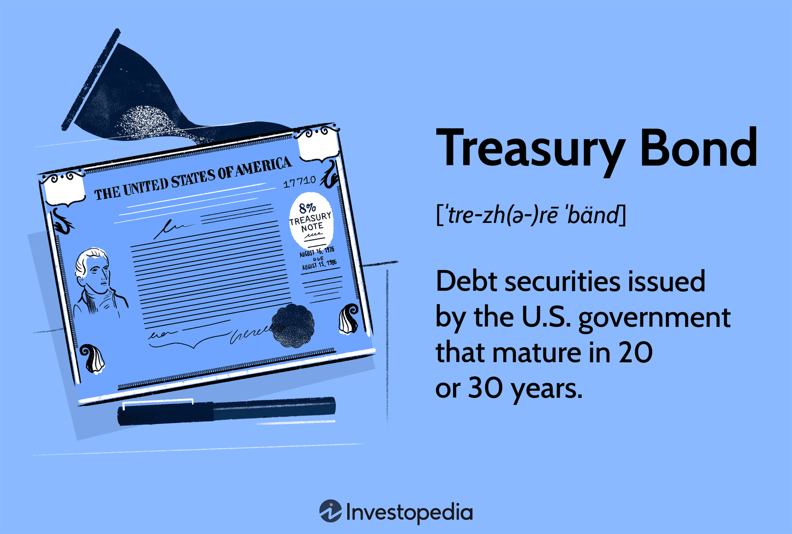

In an ever-evolving financial landscape, government bonds and treasury securities remain pivotal instruments in investment strategies. These financial instruments are characterized by their low-risk nature, serving as cornerstones for both individual and institutional investors seeking a haven in turbulent markets. Government bonds, backed by the full faith and credit of the issuing government, provide a secure platform for investment. Their risk profile is typically lower than that of corporate securities, making them attractive to those prioritizing capital preservation and steady returns.

The advent of algorithmic trading has significantly transformed the trading of these securities. By utilizing advanced computational techniques and sophisticated algorithms, the process of buying and selling treasury securities has become more efficient. Algorithmic trading enables market participants to execute trades at optimal prices and times with minimal human intervention, thus reducing the potential for errors and enhancing transaction speed. This technological advancement has broadened access, allowing more market participants to engage with these securities, which in turn enhances liquidity and pricing efficiency.



This article explores the intricacies of government bonds and treasury securities, with a focus on how algorithmic trading reshapes approaches to these financial instruments. Insights into the workings of algorithmic trading systems reveal how they leverage large volumes of financial data to make informed trading decisions. The integration of such systems into financial markets is a testament to the innovation unfolding in today's financial landscape.

Understanding these elements is critical for investors aiming to optimize their portfolios effectively while navigating modern financial markets. As financial technology continues to advance, keeping abreast of these developments will be key for investors seeking to maintain a competitive edge and achieve long-term financial stability.

## Table of Contents

## Understanding Government Bonds

Government bonds are a fundamental component of global finance, representing debt securities issued by a government to support its spending commitments. These instruments are pivotal in guiding economic stability and fiscal management for nations. Due to the backing by the issuing government's creditworthiness, government bonds are widely regarded as low-risk investments, providing a relatively secure option compared to corporate bonds or equities.

The primary types of government bonds include Treasury Bills (T-Bills), Treasury Notes (T-Notes), and Treasury Bonds (T-Bonds), each offering distinctive features concerning maturity and yield. T-Bills are short-term securities, typically maturing in less than one year. They do not pay interest but are sold at a discount, meaning investors receive the face value at maturity. The difference between the purchase price and the face value reflects the implied interest earned.

T-Notes have maturities ranging from two to ten years and provide investors with periodic interest payments, known as coupons, throughout their term. These payments make them attractive to those seeking a balance between risk and returns over a medium-term horizon. T-Bonds, the long-term option in government securities, have maturities extending up to 30 years. They offer fixed interest payments every six months, providing investors with a stable income stream over decades.

Mathematically, the valuation of government bonds can be approached using present value formulas. The present value $PV$ of a bond that pays periodic coupons can be calculated as follows:

$$

PV = \sum_{t=1}^{n} \frac{C}{(1 + r)^t} + \frac{F}{(1 + r)^n} 
$$

Here, $C$ represents the annual coupon payment, $r$ is the discount rate, $t$ is the time period, $n$ is the total number of periods, and $F$ denotes the face value of the bond.

These government-issued bonds serve dual purposes. Firstly, they provide a secure investment avenue for individuals and institutions seeking to mitigate risks associated with market [volatility](/wiki/volatility-trading-strategies). Secondly, they are critical for government fiscal policy, helping manage national debt, control inflation, and stabilize the economy. Through prudent issuance and management of these bonds, governments can effectively finance infrastructure projects, public services, and other significant expenditures, sustaining economic growth and stability over time.

## The Spectrum of Treasury Securities

Treasury securities serve as foundational investment tools that primarily consist of Treasury Bills (T-Bills), Treasury Notes (T-Notes), and Treasury Bonds (T-Bonds). These instruments are differentiated by their maturity periods and yield characteristics, catering to various investor needs for [liquidity](/wiki/liquidity-risk-premium), income, and risk management.

**Treasury Bills (T-Bills):** T-Bills are short-term securities with maturities ranging from a few days to one year. They are sold at a discount to their face value, and the profit for the investor is the difference between the purchase price and the amount paid back at maturity. T-Bills do not pay periodic interest, making them an attractive option for investors seeking high liquidity and minimal risk exposure. Their short maturity periods make them sensitive to changes in interest rates, but the government backing ensures that the yield, although low, is practically risk-free.

**Treasury Notes (T-Notes):** T-Notes are medium-term securities, typically with maturities of two to ten years. Unlike T-Bills, T-Notes pay semi-annual interest to investors, known as coupon payments, and return the principal at maturity. The yield on T-Notes reflects both the income from the coupon payments and any capital gains or losses realized if the notes are sold before maturity. The longer duration compared to T-Bills introduces a moderate level of interest rate risk, which can affect the market value of the notes over their lifespan.

**Treasury Bonds (T-Bonds):** T-Bonds are long-term debt securities with maturities extending up to 30 years. Similar to T-Notes, they offer periodic coupon payments and return the face value at maturity. The extended maturity makes T-Bonds sensitive to interest rate fluctuations, but they deliver consistent, long-lasting income streams due to their reliable coupon payments. Investors in T-Bonds typically seek either protection against inflation or a stable income source over the long term, accepting the associated interest rate and inflation risks.

These treasury securities, with their varying characteristics and terms, provide investors with a spectrum of options to match their financial goals and risk tolerance. They also play a crucial role in shaping fiscal policy, supporting governmental funding, and maintaining economic stability through secure investment opportunities.

## Role of Algorithmic Trading in Treasury Securities

Algorithmic trading employs high-speed data processing and pre-programmed algorithms to enhance the trading of treasury securities, substantially improving efficiency. This modern approach allows for the execution of transactions at optimal prices and precise times, significantly minimizing human error and maximizing transaction speed.

The key advantage of [algorithmic trading](/wiki/algorithmic-trading) is its ability to process a vast array of market indicators swiftly. This capability gives traders a significant edge by capturing profitable opportunities in the bond market. Algorithms can analyze historical and real-time data to identify patterns and trends that are not readily apparent to human traders. Consequently, these algorithms can make informed decisions about buying or selling treasury securities more effectively than manual trading methods.

In practice, algorithmic trading relies on a set of rules and conditions programmed into the system to automatically execute trades. For instance, a simple algorithm might be designed to buy a security when its moving average exceeds a certain threshold and sell when it falls below another. More complex algorithms incorporate sophisticated statistical models and [machine learning](/wiki/machine-learning) techniques to adapt to changing market conditions.

Python, one of the preferred languages for developing trading algorithms, provides robust libraries like NumPy and pandas for data analysis, and libraries such as scikit-learn for machine learning. An example of a trading algorithm using a moving average crossover strategy could be implemented as follows:

```python
import pandas as pd

def moving_average_strategy(prices, short_window, long_window):
    signals = pd.DataFrame(index=prices.index)
    signals['price'] = prices
    signals['short_mavg'] = prices.rolling(window=short_window, min_periods=1).mean()
    signals['long_mavg'] = prices.rolling(window=long_window, min_periods=1).mean()
    signals['signal'] = 0.0
    signals['signal'][short_window:] = np.where(signals['short_mavg'][short_window:] > signals['long_mavg'][short_window:], 1.0, 0.0)
    signals['positions'] = signals['signal'].diff()

    return signals

# Assume 'prices' is a pandas Series containing historical price data
signals = moving_average_strategy(prices, short_window=40, long_window=100)
```

Such strategies, while simplistic, illustrate the core principles underlying algorithmic trading: the utilization of historical data patterns to make automated trading decisions. As technology advances, algorithms continue to evolve, incorporating more advanced analytics and [artificial intelligence](/wiki/ai-artificial-intelligence) to further refine trading strategies and improve market outcomes for treasury securities. This evolution underscores the critical role algorithmic trading plays in modern financial markets, offering unprecedented precision and speed in the management of treasury securities.

## Challenges and Opportunities in Algo Trading

Algorithmic trading, while beneficial due to its transaction speed and cost efficiency, presents several challenges. One notable issue is the potential increase in market volatility. Algorithms, particularly those deployed in high-frequency trading, can react to market signals within milliseconds. This rapid response can exacerbate price swings and lead to unintended consequences like flash crashes. An infamous example is the Flash Crash of May 6, 2010, when the Dow Jones Industrial Average plunged about 1,000 points within minutes, partly due to algorithmic trading.

Technical failures also pose significant risks. Glitches within an algorithm's code or unexpected external factors can lead to erroneous trading orders. For instance, the 2012 Knight Capital incident resulted in a $440 million loss in 45 minutes due to a software error. Therefore, thorough testing and maintenance of algorithmic systems are essential to mitigate such risks.

Robust risk management is crucial for leveraging the advantages of algorithmic trading effectively. This includes implementing fail-safes within the algorithms, such as circuit breakers that halt trading in volatile conditions. Furthermore, compliance with regulatory standards must be prioritized. Regulatory bodies like the Securities and Exchange Commission (SEC) in the United States and the European Securities and Markets Authority (ESMA) in the European Union continually update rules to manage risks associated with algorithmic trading. Adhering to these standards helps prevent market abuse and ensures fair trading practices.

Advancements in artificial intelligence (AI) and machine learning are opening new avenues for developing sophisticated trading strategies. Machine learning algorithms, for example, are capable of analyzing vast amounts of data to identify complex patterns and forecast market trends with higher accuracy. These tools enable the creation of predictive models that can optimize trading strategies dynamically.

Python has become a popular programming language for building these advanced algorithmic trading systems due to its extensive libraries and frameworks such as NumPy, pandas, and scikit-learn. For instance, a basic linear regression model using Python for predicting treasury bond prices can be implemented as follows:

```python
import numpy as np
from sklearn.linear_model import LinearRegression

# Sample data: historical bond prices and interest rates
bond_prices = np.array([[100], [101], [102], [103], [104]])
interest_rates = np.array([2, 1.9, 1.8, 1.7, 1.6])

# Model initialization and training
model = LinearRegression()
model.fit(bond_prices, interest_rates)

# Predicting interest rate for a new bond price
new_bond_price = np.array([[105]])
predicted_rate = model.predict(new_bond_price)

print(f"Predicted Interest Rate: {predicted_rate[0]}")
```

These advancements are pushing the boundaries of what is achievable in financial markets, making algorithmic trading an ever-evolving field with promising opportunities for innovation. As technology progresses, the ability to harness its potential while mitigating risks will define successful engagement with algorithmic trading in treasury securities.

## Conclusion

Government bonds and treasury securities have long been regarded as foundational instruments within investment portfolios, prized for their inherent stability and potential for risk-adjusted returns. These securities provide a secure avenue for preserving capital while allowing investors to achieve consistent returns that are typically insulated from the volatility experienced in more speculative asset classes. The creditworthiness of national governments backing these financial instruments further ensures their appeal across a broad spectrum of investors, from individuals to large institutions.

The advent and integration of algorithmic trading have marked a transformative milestone in the way treasury securities are traded. Algorithmic trading leverages advanced data processing and analytics to enhance market efficiency, enabling trades to be executed at speeds and precision levels beyond human capability. By optimizing the timing and pricing of trades through sophisticated algorithms, this innovative approach not only broadens access to treasury markets but also imbues them with greater liquidity. This has opened new avenues for engagement, allowing a wider array of market participants to partake in the treasury securities market with improved returns.

However, the dynamic nature of modern financial markets necessitates that investors remain continuously informed and adaptable. As algorithmic trading evolves, so too do the strategies and tools required to harness its full potential. Regulators are continually updating standards to ensure market stability and integrity, necessitating that investors maintain a vigilant approach to compliance and risk management. Furthermore, as innovations in artificial intelligence and machine learning continue to push the boundaries of trading strategies, investors must be prepared to integrate these advanced technological tools into their investment frameworks.

In conclusion, while government bonds and treasury securities continue to offer a bedrock of stability within traditional investment strategies, the integration of algorithmic trading embodies a pivotal innovation that has redefined engagement in these markets. For investors aiming to fully exploit the benefits of these advancements, staying informed and adaptable is essential. By doing so, they can ensure that their portfolios remain resilient to the evolving dynamics and challenges presented by today’s financial landscapes, optimally positioning themselves for sustained success.

## References & Further Reading

Lopez de Prado, M. (2018). *Advances in Financial Machine Learning.* This book is a comprehensive guide on the application of machine learning techniques in financial markets. It explores innovative algorithmic strategies and provides practical insights into leveraging data science to enhance trading decisions. Lopez de Prado emphasizes the importance of rigorous hypothesis testing and probabilistic modeling, equipping readers with the tools necessary for developing advanced trading algorithms.

Fabozzi, F. J. (Ed.). (2005). *The Handbook of Fixed Income Securities.* This edited [volume](/wiki/volume-trading-strategy) remains a fundamental reference for understanding the various aspects of fixed income securities, including government bonds and treasury securities. It covers topics such as [interest rate](/wiki/interest-rate-trading-strategies) risk, valuation techniques, and portfolio management, offering a foundational understanding crucial for both novice and seasoned investors. This work provides context on the structural features and economic roles of these securities.

Chan, E. (2009). *Quantitative Trading: How to Build Your Own Algorithmic Trading Business.* Ernest Chan’s book offers a step-by-step approach to creating algorithmic trading systems, focusing on quantitative methods for strategy development. It's useful for traders looking to understand the process of building algorithms from scratch, emphasizing the [backtesting](/wiki/backtesting) of strategies and the importance of quantitative analysis in ensuring reliable performance.

Aronson, D. (2006). *Evidence-Based Technical Analysis: Applying the Scientific Method and Statistical Inference to Trading Signals.* In this work, Aronson applies scientific rigor to the evaluation of trading signals, utilizing statistical inference to determine the efficacy of technical analysis methods. The book challenges traditional assumptions of technical analysis by introducing an evidence-based framework, making it an invaluable resource for traders seeking to apply scientific principles to market strategies.

