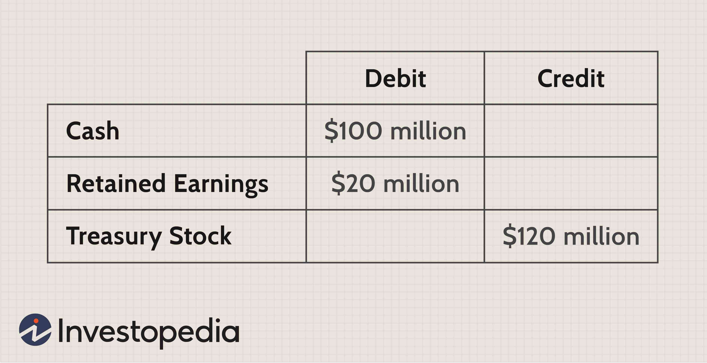

In corporate finance, treasury shares and treasury stock play significant roles in influencing a company's financial structure and strategic operations. These elements are key for investors and stakeholders, offering vital insights into a company's fiscal health and strategic initiatives. Understanding treasury shares and treasury stock is essential, as these factors contribute to the evaluation of a firm’s performance and affect important financial metrics.

Advancements in technology have introduced algorithmic trading as a crucial player in the trading and management of treasury shares. This form of trading utilizes automated systems and complex algorithms to execute orders, affecting the perception and market operations of these financial instruments. Algorithmic trading has the potential to efficiently manage large transactions, optimize financial strategies, and reduce trading costs, thereby affecting the valuation and movement of treasury stock.

This article examines the dynamics of treasury shares and treasury stock and evaluates how algorithmic trading influences these financial components. Investors and companies can leverage the strategic insights offered by understanding the interplay of these elements to improve financial decision-making and adapt to the rapidly changing financial landscape.

## Table of Contents

## Understanding Treasury Shares and Treasury Stock

Treasury shares, also referred to as treasury stock, are a significant component of a company's financial structure. These shares originate as part of the company's outstanding shares but are later repurchased by the issuing company. Once reacquired, these shares are held within the company's treasury and may either be reissued at a later date or permanently retired, depending on the strategic needs of the organization.

The decision to repurchase shares often aligns with several strategic objectives. One primary purpose is to mitigate dilution that occurs from incentive compensation programs, such as stock options granted to executives and employees. By reducing the number of outstanding shares, a company can curtail the dilution of existing shareholders’ equity, thereby enhancing the value of each remaining share. Another common reason is to positively impact shareholder value by reducing supply, which can, in turn, elevate the stock price, assuming demand remains constant or increases.

Moreover, the presence of treasury stock on a company’s financial statements directly influences key metrics used by investors. Notably, metrics such as Earnings Per Share (EPS) are affected. The formula for EPS is:

$$
\text{EPS} = \frac{\text{Net Income} - \text{Dividends on Preferred Stock}}{\text{Average Outstanding Shares}}
$$

When a company buys back its shares, the denominator—Average Outstanding Shares—decreases, potentially increasing the EPS, assuming net income remains stable. This improved EPS can be attractive to investors as it might suggest better profitability per share.

Investors must pay attention to treasury shares due to their impact on both corporate governance and financial distributions. Unlike outstanding shares, treasury shares do not [carry](/wiki/carry-trading) voting rights. Thus, while they are held in the treasury, they cannot influence shareholder votes, which might affect decisions on company policies or the election of the board. Additionally, these shares are not entitled to dividends, affecting the distribution of earnings among existing shareholders.

Therefore, understanding treasury shares is critical for investors aiming to assess a company’s fiscal strategies and their implications on shareholder returns and corporate governance.

## The Roles of Treasury Shares in Balance Sheets

Treasury shares are a critical element in understanding a company's balance sheet, as they are recorded as a deduction from shareholders' equity. This deduction reduces the total equity presented on the balance sheet, effectively reflecting the company's repurchase of its own outstanding shares. Importantly, treasury shares do not alter the asset side of the balance sheet, but they can influence key financial ratios and metrics used by investors for evaluating a company's financial health and strategic positioning.

For investors, comprehending the implications of treasury stock is essential, as it affects the company's equity—a core component of financial analysis. The presence of treasury shares implies a reduced number of shares outstanding, which can lead to an increase in Earnings Per Share (EPS) by spreading the net income over fewer shares. This maneuver could potentially inflate the perceived profitability of the company, thus requiring investors to adjust their analysis accordingly.

When a company accumulates a significant amount of treasury stock, it might indicate strategic maneuvers such as large-scale share buybacks. These buybacks can send signals to the market about the management's confidence in the company's future prospects or its intention to return surplus cash to shareholders. Additionally, a higher treasury stock balance may suggest that the company is attempting to enhance shareholder value by reducing market supply of its shares, consequently increasing demand and potentially the stock price.

The management of treasury shares is directly tied to a company's financial flexibility and its strategies pertaining to corporate activities like mergers and acquisitions. Retaining treasury shares provides a company with options to reissue these shares to finance future investments or acquisitions without the need to issue new shares, which could dilute existing shareholders' value. Therefore, treasury stock serves as a tool for strategic financial planning, allowing companies to respond adeptly to market opportunities and challenges while aligning with corporate growth objectives.

## The Influence of Algorithmic Trading on Treasury Stock

Algorithmic trading harnesses automated systems designed to execute trading orders with precision, leveraging extensive datasets and intricate strategies. This method has a profound impact on treasury stock by enhancing [liquidity](/wiki/liquidity-risk-premium) and minimizing transaction costs. 

Algorithmic trading systems utilize a range of computational techniques to process substantial volumes of market data, enabling swift execution of trades. High-frequency trading, a subset of [algorithmic trading](/wiki/algorithmic-trading), further accelerates this process, resulting in rapid fluctuations in market perceptions and stock prices. This [volatility](/wiki/volatility-trading-strategies), while often seen as a risk, can also be exploited by proficient traders to achieve advantageous pricing during treasury stock buybacks.

For companies engaging in large-scale buybacks of treasury stock, algorithmic trading offers significant advantages. By employing algorithms, firms can execute buybacks in a manner that minimizes market impact and optimizes capital structure. Algorithms can be programmed to break down substantial buyback orders into smaller, strategically-timed trades. This approach reduces the likelihood of distorting stock prices, thereby maintaining the stability of the stock valuation.

The integration of algorithmic trading into treasury stock management also provides a competitive advantage to traders and firms. The ability to anticipate and react to market movements through algorithm-driven insights allows for more informed decision-making. For instance, algorithms can analyze patterns in market behavior, such as trends in trading [volume](/wiki/volume-trading-strategy) and price changes, to determine the optimal timing for executing buyback orders.

Understanding the interaction between algorithmic trading and treasury stocks is crucial for stakeholders aiming to navigate the dynamic financial market effectively. As the incorporation of technology into financial strategies continues to grow, the synergy between algorithmic trading and treasury stock management is likely to increase, offering new avenues for efficient and strategic financial operations.

## Conclusion

Treasury shares are indispensable components in understanding a company's strategic objectives and financial health, as their treatment in balance sheets can highlight underlying corporate maneuvers. Their role in equity management and potential to influence key performance metrics solidifies their importance. As companies grapple with financial strategies, the integration of algorithmic trading in managing treasury stock offers enhanced agility. The precision and efficiency of algorithmic trading allow for optimized execution of stock buybacks and capital structuring, resulting in minimized transaction costs and increased market liquidity.

This evolving array of tools necessitates a vigilant approach by both companies and investors. While traditional financial management practices remain foundational, the increasing reliance on technology-driven trading methods reshapes the landscape. Stakeholders equipped with a comprehensive understanding of treasury stock dynamics and algorithmic influences are better positioned to anticipate market trends and make informed investment decisions.

Furthermore, as financial technologies advance, the synergy between treasury stock management and algorithmic trading is projected to intensify, offering novel opportunities for companies to enhance their financial strategies. This intersection promises a transformative impact on how financial decisions are made, emphasizing the need for continual adaptation and understanding in the face of a rapidly changing financial ecosystem.

## References & Further Reading

[1]: ["Advances in Financial Machine Learning"](https://www.amazon.com/Advances-Financial-Machine-Learning-Marcos/dp/1119482089) by Marcos Lopez de Prado

[2]: ["Machine Learning for Algorithmic Trading"](https://github.com/stefan-jansen/machine-learning-for-trading) by Stefan Jansen

[3]: ["Quantitative Trading: How to Build Your Own Algorithmic Trading Business"](https://www.amazon.com/Quantitative-Trading-Build-Algorithmic-Business/dp/1119800064) by Ernest P. Chan

[4]: ["The Intelligent Investor"](https://www.amazon.com/Intelligent-Investor-Definitive-Investing-Essentials/dp/0060555661) by Benjamin Graham

[5]: Lhabitant, F.S. (2004). ["Hedge Funds: Quantitative Insights."](https://www.wiley.com/en-us/Hedge+Funds%3A+Quantitative+Insights-p-9780470687772) John Wiley & Sons.

[6]: Damodaran, A. (2011). ["Applied Corporate Finance"](https://www.amazon.com/Applied-Corporate-Finance-Aswath-Damodaran-ebook/dp/B00P6SS6MU). Wiley Finance.

[7]: Harris, L. (2003). ["Trading and Exchanges: Market Microstructure for Practitioners"](https://www.amazon.com/Trading-Exchanges-Market-Microstructure-Practitioners/dp/0195144708). Oxford University Press.

[8]: Clarke, R.G. & Silva, H. (2020). ["Quantitative Equity Portfolio Management: An Active Approach to Portfolio Construction and Management."](https://www.mhprofessional.com/quantitative-equity-portfolio-management-second-edition-an-active-approach-to-portfolio-9781264268924-usa) McGraw-Hill Education.