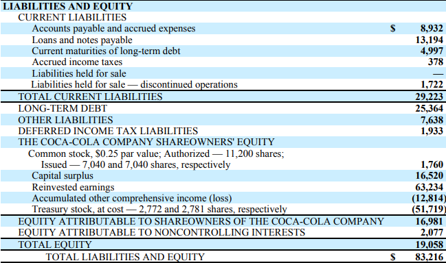

## Table of Contents

## What is treasury stock?

Treasury stock is shares of a company's stock that the company itself has bought back from investors. When a company buys back its own shares, those shares are no longer considered outstanding and are held in the company's treasury. This means they don't pay dividends and don't have voting rights.

Companies might buy back their own stock for several reasons. One reason is to increase the value of the remaining shares by reducing the total number of shares available. Another reason could be to have shares available for employee stock option plans or for future acquisitions. By holding treasury stock, a company can have more control over its stock price and overall financial strategy.

## How is treasury stock different from outstanding shares?

Treasury stock and outstanding shares are two different things. Outstanding shares are the total number of shares that a company has issued and that are owned by investors. These shares are out in the market, and they can be bought and sold by anyone. They also have voting rights and can receive dividends if the company decides to pay them.

On the other hand, treasury stock is the company's own shares that it has bought back from investors. These shares are not considered outstanding anymore because they are not in the hands of the public. They don't have voting rights and don't receive dividends. Companies keep these shares in their treasury for different reasons, like using them for employee stock options or to increase the value of the remaining shares by reducing the total number of shares available.

## Why do companies buy back their own stock?

Companies buy back their own stock for a few main reasons. One big reason is to make the value of the remaining shares go up. When a company buys back its shares, it reduces the total number of shares out there. With fewer shares, the value of each share can go up because the company's earnings are spread over fewer shares. This can make the stock more attractive to investors and can also show that the company thinks its stock is a good investment.

Another reason companies buy back their stock is to have shares ready for other uses. For example, they might need shares to give to employees as part of their pay through stock option plans. Or, they might use the shares to buy other companies without having to issue new stock. By keeping some shares in their treasury, companies can be more flexible with how they manage their business and finances.

## How is treasury stock recorded on a company's balance sheet?

Treasury stock is shown on a company's balance sheet as a negative number under shareholders' equity. This means it reduces the total equity of the company because the company spent money to buy back its own shares. When a company buys back its stock, it uses cash, which decreases its assets, and the treasury stock entry on the balance sheet reflects this decrease in equity.

For example, if a company spends $1 million to buy back its shares, it will record a $1 million reduction in cash and a $1 million increase in treasury stock. This keeps the balance sheet balanced because the decrease in assets (cash) is matched by the decrease in equity (treasury stock). It's a way to show that the company has fewer shares out there and less cash on hand.

## What are the financial implications of holding treasury stock?

When a company holds treasury stock, it means they've spent money to buy back their own shares. This can affect their finances in a few ways. First, it reduces the amount of cash the company has on hand because they used that cash to buy the shares. Less cash can mean the company has less money to spend on other things like growing the business or paying off debts. But, it can also make the value of the remaining shares go up because there are fewer shares out there, which can be good for the stock price.

Another financial impact of holding treasury stock is that it changes how the company looks on its balance sheet. Treasury stock is shown as a negative amount under shareholders' equity, which means it reduces the total equity of the company. This can make the company look less valuable overall on paper. However, if the company uses the treasury stock smartly, like giving it to employees or using it for acquisitions, it can also help the company in the long run by saving money and boosting morale or expanding the business.

## Can treasury stock be resold by the company, and if so, how?

Yes, a company can sell its treasury stock again if it wants to. They can sell these shares back to the public or use them for other things like giving them to employees or using them to buy other companies. When a company decides to sell treasury stock, it usually does it through the stock market or by offering the shares directly to investors or employees.

When the company sells treasury stock, it gets money back. This money can help the company because it increases the cash they have. On the balance sheet, selling treasury stock means the negative amount under shareholders' equity goes down or disappears, and the cash goes up. This can make the company look better financially because it has more money and less negative equity.

## What are the tax implications of buying and selling treasury stock?

When a company buys back its own stock, it usually doesn't have to pay taxes right away. The money spent on buying the stock comes out of the company's cash, but it's not seen as an expense that can be deducted from taxes. Instead, it's shown on the balance sheet as a change in equity. So, the company doesn't get a tax break for spending money on treasury stock.

If the company later decides to sell its treasury stock, the tax implications depend on whether they make a profit or a loss. If they sell the stock for more than they paid for it, the profit is usually treated as capital gains. The company might have to pay taxes on these gains, but the exact tax depends on the country's tax laws. If they sell the stock for less than they paid, it's a loss, and they might be able to use that loss to reduce their taxes in some cases. It's important for companies to understand these tax rules because they can affect how much money they keep after buying and selling their own stock.

## How does treasury stock affect earnings per share (EPS)?

When a company buys back its own stock and holds it as treasury stock, it can change the company's earnings per share (EPS). EPS is a number that shows how much money the company makes for each share of its stock. When a company buys back some of its shares, the total number of shares out there goes down. Because the company's earnings are now spread over fewer shares, the EPS usually goes up. This can make the company look more profitable to investors, which can be good for the stock price.

But, there's another thing to think about. When a company uses cash to buy back its stock, it has less money to spend on other things, like growing the business or paying off debts. If the company doesn't make more money after buying back the stock, the higher EPS might not last. So, while buying back stock can make EPS go up in the short term, it's important for the company to keep making money to keep the EPS high over time.

## What are the accounting methods for treasury stock (cost method vs. par value method)?

There are two main ways to account for treasury stock: the cost method and the par value method. The cost method is simpler and more common. When a company buys back its stock using the cost method, it records the cost of the shares as a negative amount under shareholders' equity on the balance sheet. If the company later sells these shares, it will record the money it gets from the sale as an increase in cash and will also adjust the treasury stock account. If the sale price is different from the cost, the difference goes into a special account called "additional paid-in capital" or "retained earnings," depending on whether it's a profit or a loss.

The par value method is more complicated. Under this method, when a company buys back its stock, it reduces the "common stock" account by the par value of the shares and reduces the "additional paid-in capital" account by the rest of the cost. If the company sells the shares again, it will increase the "common stock" account by the par value of the shares sold and the "additional paid-in capital" account by any amount over the par value. This method keeps track of the par value of the stock separately, which can be useful for some companies but is less common because it's more work to keep everything straight.

## How does the repurchase of stock impact a company's financial ratios?

When a company buys back its own stock, it can change many of its financial ratios. One important ratio that changes is the price-to-earnings (P/E) ratio. This ratio shows how much investors are willing to pay for each dollar of the company's earnings. When a company buys back its stock, it usually has fewer shares out there. Because the company's earnings are now spread over fewer shares, the earnings per share (EPS) goes up. If the stock price stays the same, a higher EPS means a lower P/E ratio, which can make the stock look cheaper and more attractive to investors.

Another ratio that changes is the debt-to-equity ratio. This ratio shows how much the company is borrowing compared to the money it gets from shareholders. When a company uses cash to buy back its stock, its cash goes down, but its total equity also goes down because treasury stock is shown as a negative amount on the balance sheet. If the company's debt stays the same but its equity goes down, the debt-to-equity ratio goes up. This can make the company look riskier to investors because it's borrowing more compared to what it's getting from shareholders. So, while buying back stock can make some ratios look better, it can also make other ratios look worse.

## What are the strategic considerations a company should evaluate before initiating a stock repurchase program?

Before a company decides to start buying back its own stock, it should think about a few important things. One big thing to consider is the company's cash position. Buying back stock uses up cash, so the company needs to make sure it has enough money left over to keep running the business and to handle any surprises. They should also think about their debt. If the company has a lot of debt, using cash to buy back stock might not be the best idea because it could make it harder to pay off the debt later.

Another thing to consider is what the company wants to achieve with the stock buyback. If the goal is to make the stock price go up by reducing the number of shares out there, the company needs to be sure that this will actually work. They should also think about other ways to use the money, like investing in new projects or paying down debt. The company should weigh the benefits of buying back stock against these other options to see which one will help the company the most in the long run.

## How do regulatory requirements affect the management of treasury stock?

When a company wants to buy back its own stock, it has to follow rules set by the government or financial regulators. These rules can be different depending on the country. For example, in the United States, the Securities and Exchange Commission (SEC) has rules that companies need to follow. One rule says that companies have to tell everyone when they start buying back their stock and how much they plan to buy. This is to make sure everything is open and fair, so investors know what's going on.

Another important thing is that companies can't use inside information to buy back their stock. This means they can't buy it back if they know something that could make the stock price go up or down that other people don't know. Also, some countries have rules about how much stock a company can buy back at one time. They might have to spread out their buying over time to not affect the stock price too much. These rules help make sure that the stock market stays fair and that companies don't do things that could trick investors.

## What is the understanding of Treasury Shares and Treasury Stock?

Treasury shares, also referred to as treasury stock, are a significant component of a company's financial structure. These shares originate as part of the company's outstanding shares but are later repurchased by the issuing company. Once reacquired, these shares are held within the company's treasury and may either be reissued at a later date or permanently retired, depending on the strategic needs of the organization.

The decision to repurchase shares often aligns with several strategic objectives. One primary purpose is to mitigate dilution that occurs from incentive compensation programs, such as stock options granted to executives and employees. By reducing the number of outstanding shares, a company can curtail the dilution of existing shareholders’ equity, thereby enhancing the value of each remaining share. Another common reason is to positively impact shareholder value by reducing supply, which can, in turn, elevate the stock price, assuming demand remains constant or increases.

Moreover, the presence of treasury stock on a company’s financial statements directly influences key metrics used by investors. Notably, metrics such as Earnings Per Share (EPS) are affected. The formula for EPS is:

$$
\text{EPS} = \frac{\text{Net Income} - \text{Dividends on Preferred Stock}}{\text{Average Outstanding Shares}}
$$

When a company buys back its shares, the denominator—Average Outstanding Shares—decreases, potentially increasing the EPS, assuming net income remains stable. This improved EPS can be attractive to investors as it might suggest better profitability per share.

Investors must pay attention to treasury shares due to their impact on both corporate governance and financial distributions. Unlike outstanding shares, treasury shares do not [carry](/wiki/carry-trading) voting rights. Thus, while they are held in the treasury, they cannot influence shareholder votes, which might affect decisions on company policies or the election of the board. Additionally, these shares are not entitled to dividends, affecting the distribution of earnings among existing shareholders.

Therefore, understanding treasury shares is critical for investors aiming to assess a company’s fiscal strategies and their implications on shareholder returns and corporate governance.

## References & Further Reading

[1]: ["Advances in Financial Machine Learning"](https://www.amazon.com/Advances-Financial-Machine-Learning-Marcos/dp/1119482089) by Marcos Lopez de Prado

[2]: ["Machine Learning for Algorithmic Trading"](https://github.com/stefan-jansen/machine-learning-for-trading) by Stefan Jansen

[3]: ["Quantitative Trading: How to Build Your Own Algorithmic Trading Business"](https://www.amazon.com/Quantitative-Trading-Build-Algorithmic-Business/dp/1119800064) by Ernest P. Chan

[4]: ["The Intelligent Investor"](https://www.amazon.com/Intelligent-Investor-Definitive-Investing-Essentials/dp/0060555661) by Benjamin Graham

[5]: Lhabitant, F.S. (2004). ["Hedge Funds: Quantitative Insights."](https://www.wiley.com/en-us/Hedge+Funds%3A+Quantitative+Insights-p-9780470687772) John Wiley & Sons.

[6]: Damodaran, A. (2011). ["Applied Corporate Finance"](https://www.amazon.com/Applied-Corporate-Finance-Aswath-Damodaran-ebook/dp/B00P6SS6MU). Wiley Finance.

[7]: Harris, L. (2003). ["Trading and Exchanges: Market Microstructure for Practitioners"](https://www.amazon.com/Trading-Exchanges-Market-Microstructure-Practitioners/dp/0195144708). Oxford University Press.

[8]: Clarke, R.G. & Silva, H. (2020). ["Quantitative Equity Portfolio Management: An Active Approach to Portfolio Construction and Management."](https://www.mhprofessional.com/quantitative-equity-portfolio-management-second-edition-an-active-approach-to-portfolio-9781264268924-usa) McGraw-Hill Education.