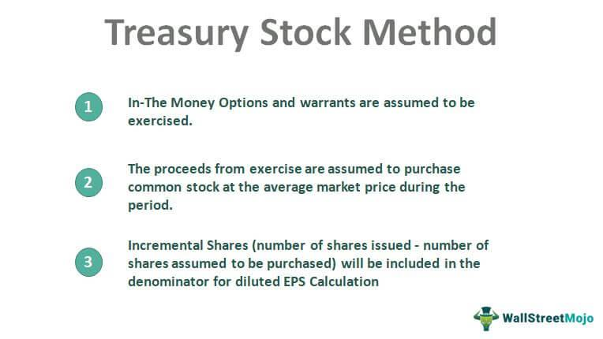

## Table of Contents

## What is the Treasury Stock Method?

The Treasury Stock Method is a way to figure out how stock options and warrants affect the number of shares a company has. When people exercise their stock options, they buy new shares, which means there are more shares in total. But, companies often use the money they get from these new shares to buy back some of their own shares from the market. These bought-back shares are called treasury stock. The Treasury Stock Method helps us understand how these two actions balance out and what the final number of shares will be.

To use the Treasury Stock Method, you first imagine that all the stock options and warrants are exercised. This means you add the number of new shares that would be created. Then, you calculate how much money the company would get from selling these new shares. With that money, the company would buy back shares at the current market price. The number of shares bought back is subtracted from the new shares created. The result is the net increase in the number of shares, which is important for figuring out things like earnings per share.

## Why is the Treasury Stock Method important for financial analysis?

The Treasury Stock Method is important for financial analysis because it helps analysts figure out how stock options and warrants will change the number of shares a company has. This is crucial because the number of shares affects important financial measures like earnings per share (EPS). When a company's EPS changes, it can impact how investors see the company's value and performance. By using the Treasury Stock Method, analysts can get a clearer picture of what the company's EPS might look like in the future, which helps them make better investment decisions.

Additionally, the Treasury Stock Method helps maintain the accuracy of financial statements. When companies issue stock options, it's important to show how these options will affect the company's finances once they are exercised. The Treasury Stock Method provides a standardized way to do this, ensuring that all companies report their potential share changes in the same way. This consistency makes it easier for investors and analysts to compare different companies and understand their financial health more accurately.

## How does the Treasury Stock Method affect earnings per share (EPS)?

The Treasury Stock Method affects earnings per share (EPS) by changing the number of shares a company has. When people exercise their stock options, new shares are created, which increases the total number of shares. This means the company's earnings are spread over more shares, which can lower the EPS. However, the company uses the money from selling these new shares to buy back some of its own shares. This reduces the total number of shares again, which can help keep the EPS from dropping too much.

For example, if a company has earnings of $100 and 10 shares, the EPS is $10 per share. If new stock options are exercised and 2 new shares are created, the total number of shares becomes 12, and the EPS drops to about $8.33 per share. But, if the company uses the money from the new shares to buy back 1 share, the total number of shares becomes 11, and the EPS rises to about $9.09 per share. So, the Treasury Stock Method helps show how the company's actions balance out and what the final EPS might be.

## Can you explain the steps involved in calculating the Treasury Stock Method?

To calculate the Treasury Stock Method, you first need to imagine that all the stock options and warrants are exercised. This means you count how many new shares would be created if everyone used their options. Then, you figure out how much money the company would get from selling these new shares. You do this by multiplying the number of new shares by the exercise price of the options. The exercise price is what people have to pay to get the new shares.

Next, you use the money the company got from the new shares to buy back some of its own shares. To find out how many shares the company can buy back, you divide the total money by the current market price of the stock. The shares the company buys back are called treasury stock. Finally, you subtract the number of shares bought back from the number of new shares created. The result is the net increase in the number of shares, which you can use to figure out the new earnings per share.

This method helps you see how the company's actions balance out. The new shares increase the total number of shares, which can lower earnings per share. But buying back shares reduces the total number of shares, which can help keep earnings per share from dropping too much. By following these steps, you can understand how stock options and warrants will affect the company's financial measures.

## What is the formula used in the Treasury Stock Method?

The Treasury Stock Method uses a simple formula to figure out how stock options and warrants change the number of shares a company has. First, you find out how many new shares are created when people use their stock options. You do this by looking at how many options there are and what they can be used for. Then, you calculate how much money the company gets from these new shares by multiplying the number of new shares by the price people pay to use their options. This price is called the exercise price.

Next, you use the money the company got to buy back some of its own shares. To find out how many shares the company can buy back, you divide the total money by the current price of the stock in the market. The shares the company buys back are called treasury stock. Finally, you subtract the number of shares bought back from the number of new shares created. The formula looks like this: New Shares - (Money from New Shares / Current Market Price) = Net Increase in Shares. This net increase in shares helps you understand how the company's earnings per share might change.

## How do stock options and warrants impact the Treasury Stock Method?

Stock options and warrants are important for the Treasury Stock Method because they can change the number of shares a company has. When people use their stock options or warrants, they buy new shares from the company. This means there are more shares overall. The Treasury Stock Method helps us see how these new shares affect the company's earnings per share. It does this by imagining that everyone uses their options and then figuring out how many new shares are created.

After figuring out the new shares, the Treasury Stock Method looks at how much money the company gets from selling these shares. The company uses this money to buy back some of its own shares from the market. These bought-back shares are called treasury stock. By subtracting the number of shares bought back from the new shares created, the Treasury Stock Method shows the net change in the number of shares. This helps us understand how the company's earnings per share might change because of stock options and warrants.

## What assumptions are typically made when applying the Treasury Stock Method?

When using the Treasury Stock Method, people usually assume that all stock options and warrants will be used. This means they think everyone with options will want to buy new shares. They also assume that the money from selling these new shares will be used to buy back other shares at the current market price. This helps them figure out how the total number of shares will change.

Another important assumption is that the stock's market price stays the same while all this happens. This makes the calculations simpler because they don't have to guess how the price might change. These assumptions help analysts understand how stock options and warrants might affect a company's earnings per share, even though in real life, things might not work out exactly as expected.

## How does the Treasury Stock Method differ from the If-Converted Method?

The Treasury Stock Method and the If-Converted Method are two ways to figure out how certain financial tools, like stock options and convertible securities, affect a company's earnings per share. The Treasury Stock Method is used for stock options and warrants. It imagines that everyone uses their options to buy new shares, and then the company uses the money from these new shares to buy back some of its own shares. This helps show how the total number of shares changes and what it means for earnings per share.

On the other hand, the If-Converted Method is used for convertible securities, like convertible bonds or preferred stock. This method imagines that all these securities are turned into common stock. It then adds the new shares from this conversion to the total number of shares without any buybacks. This way, it shows how the conversion would affect the earnings per share by simply increasing the number of shares. Both methods help analysts understand future earnings per share, but they work differently depending on the type of financial tool involved.

## What are common challenges or complexities in applying the Treasury Stock Method?

Applying the Treasury Stock Method can be tricky because it makes some guesses that might not happen in real life. For example, it assumes that everyone will use their stock options to buy new shares. But in reality, some people might not use their options at all. It also assumes that the price of the stock stays the same, which is not always true. If the stock price changes, it can mess up the calculations and make it harder to figure out the real effect on earnings per share.

Another challenge is figuring out the right numbers to use in the calculations. You need to know how many stock options there are, what price people pay to use them, and the current market price of the stock. Getting these numbers wrong can lead to mistakes in the final results. Also, different companies might have different kinds of stock options, which can make it more complicated to apply the method in the same way for all companies. Despite these challenges, the Treasury Stock Method is still a helpful tool for understanding how stock options can affect a company's earnings per share.

## How can the Treasury Stock Method be adjusted for anti-dilutive securities?

The Treasury Stock Method helps figure out how stock options and warrants can change the number of shares a company has. But sometimes, using this method can make the earnings per share look better, not worse. These are called anti-dilutive securities. When a security is anti-dilutive, it means that using it would actually increase the earnings per share instead of lowering it. This happens when the money from selling new shares is enough to buy back more shares than were created.

To adjust for anti-dilutive securities, you don't include them in the Treasury Stock Method calculations. If including a security would make the earnings per share go up, you leave it out. This way, the method only shows the impact of securities that could lower the earnings per share. By doing this, the Treasury Stock Method gives a clearer picture of how stock options and warrants might affect the company's financial health.

## What are the regulatory requirements or standards related to the Treasury Stock Method?

The Treasury Stock Method is guided by rules set by the Financial Accounting Standards Board (FASB) and the Securities and Exchange Commission (SEC). These rules are part of the Generally Accepted Accounting Principles (GAAP). The main rule is that companies have to show how stock options and warrants can change the number of shares and affect earnings per share. This helps investors understand the company's financial situation better. Companies must follow these rules when they report their financial statements, so everyone gets the same clear information.

The rules also say that companies should use the Treasury Stock Method to figure out the impact of stock options and warrants. This method imagines that everyone uses their options, and the company uses the money to buy back shares. But if using the method makes earnings per share look better instead of worse, those securities are left out. This keeps the financial reports honest and helps investors make smart choices. By following these standards, companies make sure their financial information is clear and easy to understand.

## How can advanced financial modeling incorporate the Treasury Stock Method for strategic decision-making?

Advanced financial modeling can use the Treasury Stock Method to help companies make smart choices about their stock options and warrants. By including this method in their models, companies can see how giving out stock options might change the number of shares they have. This helps them understand how their earnings per share could change in the future. If they see that giving out too many options could lower their earnings per share a lot, they might decide to give out fewer options or find other ways to reward their employees. This way, they can keep their earnings per share strong, which is important for keeping investors happy.

Using the Treasury Stock Method in financial models also helps companies plan for different situations. They can run different scenarios to see what would happen if the stock price goes up or down, or if more or fewer people use their options. This kind of planning helps them make better decisions about when to give out options, how to use the money from new shares, and how to buy back their own stock. By thinking about these things ahead of time, companies can be ready for whatever might happen and make choices that help them grow and succeed in the long run.

## What is Understanding Financial Modeling?

Financial modeling is an essential skill for financial analysts who need to make accurate forecasts and informed investment decisions. At its core, financial modeling involves the construction of integrated representations of a company’s financial performance, typically within spreadsheet software. These models are used to synthesize historical data with assumptions about future trends to predict future financial performance and evaluate investment risks.

### Historical Data Analysis

Historical data serves as the foundation of financial models, providing insights into a company's revenue trends, expense patterns, and capital expenditures over time. By analyzing this data, analysts can identify cyclical patterns or irregularities that may influence future performance. Using statistical methods such as regression analysis, analysts can establish relationships between different financial metrics, which facilitates the prediction of future financial outcomes.

### Key Types of Financial Models

**1. Discounted Cash Flow (DCF) Analysis**  
This method estimates the value of an investment based on its expected future cash flows. It involves forecasting the cash flows a company will generate, typically over a 5 to 10-year horizon, and discounting them back to their present value using a discount rate. This discount rate usually reflects the weighted average cost of capital (WACC). The core formula for DCF is:

$$

PV = \sum \frac{CF_t}{(1 + r)^t} 
$$

where $PV$ is the present value, $CF_t$ is the cash flow in year $t$, and $r$ is the discount rate.

**2. Three-Statement Model**  
This comprehensive model links the income statement, balance sheet, and cash flow statement into one dynamically integrated model. It enables analysts to project the financial performance of a company and understand how changes in one statement affect the others. This type of modeling is crucial for conducting what-if scenarios and sensitivity analyses.

**3. Valuation Models for Mergers and Acquisitions**  
These models assess the value and impact of a potential merger or acquisition. Analyses include evaluating synergies and the accretion/dilution impact on stakeholders, primarily through comparison of pre- and post-transaction financial metrics.

### Applications and Advantages

Financial models support various strategic decisions, including capital budgeting, financial forecasting, and scenario planning. They help assess financial health by enabling comparisons against industry benchmarks and previous performance metrics. Moreover, they assist in valuing securities, determining the impact of corporate actions, and strategically allocating resources.

### Software and Programming

While spreadsheets like Microsoft Excel are traditional tools for modeling, there has been an increasing integration of programming languages such as Python for more complex quantitative modeling. Python’s libraries, like NumPy and pandas, provide powerful tools for handling large datasets and performing intricate financial calculations efficiently. For instance, Python can automate repetitive tasks, conduct advanced statistical analyses, and even integrate [machine learning](/wiki/machine-learning) algorithms into financial models to capture non-linear relationships and predict trends more accurately.

### Conclusion

As financial markets continue to become more complex, the ability to build, interpret, and refine financial models remains a vital skill within the financial industry. Analysts armed with robust financial modeling skills can better navigate the uncertainties of financial forecasting and optimize their decision-making processes.

## What are Stock Valuation Techniques?

Stock valuation involves estimating the intrinsic value of a company's shares by employing various techniques, each with distinct strengths and limitations. Among the most popular methods are the Discounted Cash Flow (DCF) model and the Price/Earnings (P/E) ratio.

The Discounted Cash Flow (DCF) model is grounded in the principle that the value of a company is the present value of its projected future cash flows. This involves forecasting the company's cash flows over a specific period, typically five to ten years, and then discounting these cash flows to their present value using a discount rate, usually the company’s weighted average cost of capital (WACC). The formula for DCF is as follows:

$$

DCF = \sum_{t=1}^{n} \frac{CF_t}{(1 + r)^t} 
$$

where $CF_t$ represents the cash flow in period $t$, $r$ is the discount rate, and $n$ is the number of periods. This method is particularly useful as it takes into account the time value of money, providing a comprehensive measure of intrinsic value. However, its accuracy heavily depends on the quality of the input assumptions, such as cash flow projections and the discount rate, which can be subjective and challenging to estimate.

The Price/Earnings (P/E) ratio, another commonly used valuation method, is a market-based approach that compares a company's current share price to its earnings per share (EPS). The formula is:

$$

P/E = \frac{\text{Market Price per Share}}{\text{Earnings per Share}}
$$

This ratio provides a quick indication of how much investors are willing to pay per dollar of earnings, reflecting the market’s expectations of a company's future earnings growth. A higher P/E ratio may suggest that the market expects strong future growth, while a lower P/E may indicate undervaluation or potential financial challenges. However, it can be misleading when comparing companies in different industries with varying growth prospects or risk profiles.

Both DCF and P/E ratio are valuable tools, yet they are often used in conjunction to obtain a more nuanced perspective on a company's valuation. Combining these methodologies, alongside others like the Price/Sales (P/S) ratio, Price/Book (P/B) ratio, and the Gordon Growth Model, allows for a more holistic analysis by considering both intrinsic and market-based factors. This multifaceted approach enables investors and analysts to form a robust valuation framework, assisting in strategic investment decisions.

## What is the role of treasury stock?

Treasury stock refers to shares that were initially issued and subsequently repurchased by the issuing company. These shares do not confer voting rights, nor do they pay dividends, and they are not included in the total number of outstanding shares used to calculate financial metrics. The primary reasons a company might engage in stock repurchase include returning surplus capital to shareholders, attempting to improve financial ratios, or maintaining control over the company by reducing the number of shares available in the open market.

The repurchase of shares impacts a company’s equity structure. By reducing the overall number of outstanding shares, treasury stock can lead to an increase in earnings per share (EPS), assuming net income remains constant. This financial maneuver can make the company appear more profitable on a per-share basis, potentially enhancing its market valuation. However, the reduction in equity also means a reduction in shareholder capital, as the funds used for repurchasing shares are drawn from the company's reserves.

Calculating diluted earnings per share is an essential consideration when treasury stocks are involved. The treasury stock method is one approach used for this calculation, where it is assumed that all 'in the money' stock options and warrants are exercised. The proceeds from these exercises are then used to repurchase common shares at the average market price during the period. This method adjusts the number of shares outstanding, giving investors a more nuanced view of the company’s earnings performance.

For example, the treasury stock method can be expressed as:

$$
\text{Diluted EPS} = \frac{\text{Net Income}}{\text{Weighted Average Shares Outstanding} + \text{New Shares Issued from Converted Securities} - \text{Shares Repurchased}}
$$

In Python, an implementation of the treasury stock method for calculating diluted EPS might resemble:

```python
def calculate_diluted_eps(net_income, weighted_avg_shares, options, warrants, avg_market_price):
    new_shares = (options + warrants)
    repurchased_shares = (options + warrants) * avg_market_price
    diluted_shares = weighted_avg_shares + new_shares - repurchased_shares
    diluted_eps = net_income / diluted_shares
    return diluted_eps
```

In the broader context of financial strategy, companies must weigh the advantages of holding treasury stock, such as the potential to facilitate favorable EPS figures, against potential drawbacks, such as decreased [liquidity](/wiki/liquidity-risk-premium) and capital resources. Understanding the treasury stock mechanism and its implications is crucial for stakeholders aiming to assess a company's financial health and strategic financial maneuvers.

## References & Further Reading

[1]: Bergstra, J., Bardenet, R., Bengio, Y., & Kégl, B. (2011). ["Algorithms for Hyper-Parameter Optimization."](https://dl.acm.org/doi/10.5555/2986459.2986743) Advances in Neural Information Processing Systems 24.

[2]: ["Advances in Financial Machine Learning"](https://www.amazon.com/Advances-Financial-Machine-Learning-Marcos/dp/1119482089) by Marcos Lopez de Prado

[3]: ["Evidence-Based Technical Analysis: Applying the Scientific Method and Statistical Inference to Trading Signals"](https://www.amazon.com/Evidence-Based-Technical-Analysis-Scientific-Statistical/dp/0470008741) by David Aronson

[4]: ["Machine Learning for Algorithmic Trading"](https://github.com/stefan-jansen/machine-learning-for-trading) by Stefan Jansen

[5]: ["Quantitative Trading: How to Build Your Own Algorithmic Trading Business"](https://www.amazon.com/Quantitative-Trading-Build-Algorithmic-Business/dp/1119800064) by Ernest P. Chan