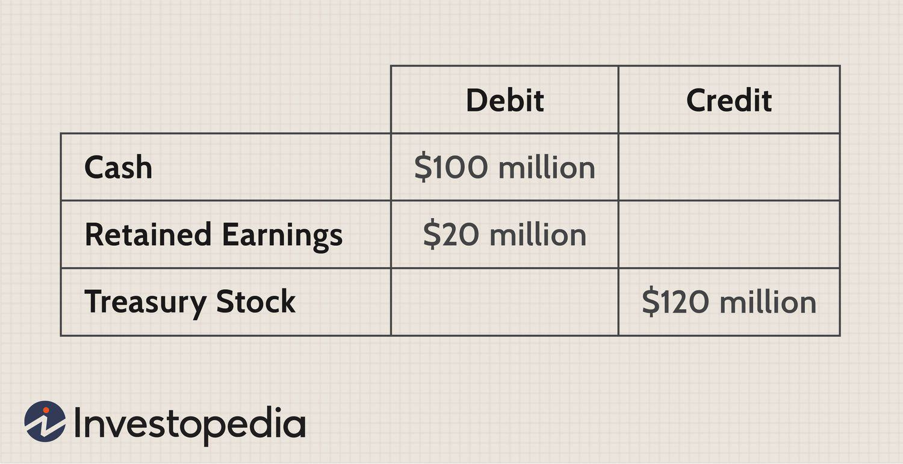

Share repurchase, commonly referred to as stock buyback, is a financial strategy where a company repurchases its own shares from the stock market. By doing so, the company effectively reduces the number of outstanding shares, which can lead to an increase in the stock's value. This occurs because the earnings per share (EPS) metric often improves when the total shares decrease, potentially making the stock more attractive to investors.

Companies engage in share repurchases for several strategic reasons. Firstly, it can help optimize their capital structure by decreasing outstanding equity and taking advantage of excess cash reserves. Secondly, it can enhance financial metrics such as return on equity (ROE) and EPS, which are key indicators of a company's profitability and financial health. Thirdly, it serves as a method of returning value to shareholders, often viewed more favorably than paying dividends due to its tax efficiency.



In addition, share repurchases can signal management’s confidence in the company's future performance, suggesting that they believe the current stock price is undervalued. This can attract positive attention from investors and analysts, further supporting the stock's market value.

The strategy of share repurchase is not only significant in the context of corporate finance but also plays a crucial role in algorithmic trading. Algorithmic trading systems use vast amounts of financial data, including public announcements of share buybacks, to make automated trading decisions. These systems can swiftly adjust their strategies based on buyback activities that may influence stock price movements and volatility.

In this article, we will explore several facets of share repurchase, including the concept of treasury stock, reasons for buybacks, and their implications on corporate finance and algorithmic trading. This discussion aims to provide a comprehensive understanding of how share repurchase strategies affect both companies and the broader financial market.

## Table of Contents

## What is Treasury Stock?

Treasury stock refers to the shares that a company reacquires from the public and holds in its own accounts. These shares were initially issued and available for trading in the stock market. Once repurchased, they are essentially taken out of circulation and held by the company itself. As a result, these shares do not confer voting rights and are ineligible for dividend distribution, distinguishing them from other shares held by public and institutional investors.

The motivations for a company to maintain treasury stock are often strategic. One primary use is for potential reissuance in [capital raising](/wiki/hedge-fund-capital-raising) activities. By holding these shares, the company retains the flexibility to reissue them in the future, perhaps during a secondary offering, without the need to authorize new shares, which can be a more time-consuming and regulatory-heavy process.

Furthermore, treasury stock can play a significant role in employee compensation plans. Companies may use these shares as part of stock option plans or other incentive programs, allowing them to compensate employees and executives without diluting existing shareholder value. This strategic use can help to align the interests of the company's workforce with those of its shareholders.

Accounting-wise, when a company repurchases its shares, the transaction is recorded in the equity section of the balance sheet as treasury stock, a contra-equity account that reduces total equity. The repurchase price does not affect profit or loss directly but impacts shareholder equity. Formulaically, if a company has `S` outstanding shares and repurchases `T` shares, the new number of outstanding shares becomes `S - T`. This reduction can alter key financial metrics, such as Earnings Per Share (EPS), which is calculated as:

$$
\text{EPS} = \frac{\text{Net Income}}{\text{Shares Outstanding}}
$$

Overall, managing treasury stock effectively requires understanding its impact on both the company's financial health and shareholder equity.

## Why Buy Back Shares?

Companies may buy back shares for several strategic reasons, primarily focusing on enhancing shareholder value. When a company repurchases its own shares, it effectively reduces the number of shares available in the open market. This reduction can lead to an increase in Earnings Per Share (EPS) since EPS is calculated as the net income divided by the outstanding shares. By decreasing the denominator in the EPS formula, the company can present a more favorable financial metric to its investors:

$$
\text{EPS} = \frac{\text{Net Income}}{\text{Outstanding Shares}}
$$

Beyond improving financial metrics, share repurchase often conveys a message of confidence from the company's management. When management decides to buy back shares, it can signal to the market that they perceive the company's stock as undervalued. This action may reassure investors regarding the company's future prospects and intrinsic value, potentially leading to a positive reevaluation of the stock price by the market.

Furthermore, share repurchases can serve as a strategic defense mechanism against hostile takeovers. In a hostile takeover, an acquiring company attempts to gain control of a target company against the wishes of its management and board of directors. By buying back shares, the company can limit the number of shares available to potential acquirers, making it more challenging for outsiders to accumulate a controlling stake. This tactic effectively raises the threshold needed for a would-be acquirer to succeed, thus protecting the company from unsolicited acquisition attempts.

In summary, share repurchases are a multifaceted strategy used by companies to enhance financial performance metrics, signal management's confidence in the stock's value, and protect against external acquisition threats. Each of these reasons highlights why share buybacks are an integral part of corporate financial strategies.

## Impact on Corporate Finance

Share repurchase affects a company's balance sheet, specifically in the stockholders' equity section. When a company buys back its shares, these shares become treasury stock, which is recorded as a contra-equity account. This means that the value of the repurchased shares is subtracted from the total equity. As a result, the stockholders' equity, comprised of common stock, retained earnings, and other components, experiences a reduction equivalent to the cost of the treasury stock.

From an accounting perspective, the treatment of treasury stock influences several financial metrics. For instance, by reducing the number of shares outstanding, share repurchases can enhance the earnings per share (EPS) since EPS is calculated by dividing net income by the number of outstanding shares:

$$
\text{EPS} = \frac{\text{Net Income}}{\text{Outstanding Shares}}
$$

This adjustment may depict a more favorable financial position and potentially increase the market value of the remaining shares.

Incorporating treasury stock into corporate finance requires meticulous accounting to ensure an accurate portrayal of a company's financial state. The purchase of treasury shares is not considered an investment, because it does not inherently increase the company’s value or capacity to generate revenue. Instead, it reflects a strategic allocation of resources, often aimed at capital structure optimization or signaling confidence to the market.

An example of how treasury stock affects financial statements can be illustrated through an accounting entry. Assuming a company repurchases 1,000 shares at $50 each, the journal entry would reduce cash and increase treasury stock by $50,000:

- Debit Treasury Stock $50,000.
- Credit Cash $50,000.

This transaction reduces the company's assets and equity, imposing implications for financial ratios such as the return on equity (ROE) and the debt-to-equity ratio. These ratios can become more attractive post-buyback, affecting stakeholders' perception and potentially altering investment decisions.

It's crucial for accountants and financial analysts to monitor these changes closely, as they provide insights into a company's strategic initiatives and overall financial health.

## Algorithmic Trading and Share Repurchase

Algorithmic trading systems integrate various data inputs to optimize trading strategies, and share repurchase announcements are a crucial component of this data landscape. Share repurchases, or stock buybacks, often lead to a rise in stock prices due to the reduced number of outstanding shares and the market's perception of increased value. Algorithmic traders leverage this information to anticipate and capitalize on potential upward [momentum](/wiki/momentum) in stock prices.

Upon the announcement of a share buyback, [algorithmic trading](/wiki/algorithmic-trading) models may trigger buy signals to exploit the anticipated price increase. This reaction is based on the historical behavior of stocks following repurchase announcements, where a decrease in supply can drive demand and price. For example, if a company announces a buyback plan to acquire 5% of its outstanding shares, the reduced float can enhance earnings per share (EPS), making the stock more attractive. The formula for EPS before and after the buyback exemplifies this:

$$
\text{EPS before buyback} = \frac{\text{Net Income}}{\text{Total Shares Outstanding}}
$$

$$
\text{EPS after buyback} = \frac{\text{Net Income}}{\text{Total Shares Outstanding} - \text{Shares Repurchased}}
$$

Algorithmic systems often use such financial metrics to predict short-term price movements. Moreover, the timing of buyback programs plays a critical role in trading strategies. Traders need to be aware of the specifics of these programs, which can vary in execution style, such as open market purchases or tender offers. Program timing can impact stock [volatility](/wiki/volatility-trading-strategies), as buybacks executed during periods of low volatility might stabilize prices, whereas those during high volatility might exacerbate fluctuations.

Volatility, represented by the standard deviation of stock returns, is another [factor](/wiki/factor-investing) that algorithmic trading models typically analyze. A simple Python snippet to calculate historical volatility might look like this:

```python
import numpy as np

def calculate_volatility(stock_prices):
    log_returns = np.log(stock_prices / np.roll(stock_prices, shift=1))[1:]
    return np.std(log_returns) * np.sqrt(252)  # Annualizing volatility

stock_prices = np.array([100, 101, 102, 98, 99, 105])
volatility = calculate_volatility(stock_prices)
print(f"Annualized Volatility: {volatility:.2f}")
```

Algorithmic traders include volatility metrics in their models to adaptively adjust their trading strategies around buybacks, aiming to optimize their entry and [exit](/wiki/exit-strategy) points based on expected price swings.

In conclusion, algorithmic trading systems that effectively incorporate data from share repurchase announcements can strategically exploit the subsequent market reactions. By considering the timing and characteristics of buyback programs, traders can enhance their algorithmic models to better navigate the complexities of stock volatility and price momentum.

## Conclusion

Share repurchase is a strategic tool in corporate finance that significantly influences stock prices, financial metrics, and shareholder value. By reducing the number of outstanding shares, companies can often enhance earnings per share (EPS), thereby potentially boosting the stock's market value. This action is not only indicative of a company’s confidence in its own financial health but also serves as a mechanism to return capital to shareholders without distributing direct dividends.

Understanding treasury stock and the effects of buybacks is essential for both corporate decision-makers and investors. For corporate leaders, this insight aids in making informed decisions on capital allocation and financial structuring. For investors, recognizing the intent and impact of buybacks can inform investment strategies and valuation models. When evaluating a company's long-term prospects, it is crucial to assess how buyback activities fit into the broader financial strategy.

Additionally, for algorithmic traders, monitoring share repurchase activities offers valuable insights into potential market movements. Buybacks often lead to adjustments in stock prices, which can trigger trading algorithms designed to capitalize on price fluctuations. Traders employing algorithms need to integrate data from buyback announcements to refine their strategies, manage risk, and optimize portfolio performance effectively. By anticipating shifts in stock volatility due to buybacks, algorithmic traders can enhance their decision-making processes, leading to improved trading outcomes.

## References & Further Reading

[1]: ["The Share Repurchase Revolution"](https://www.tapestrynetworks.com/wp-content/uploads/2024/03/IRRCI-Buybacks-and-the-Board-August-2016.pdf) by Harvard Business Review

[2]: ["Financial Management: Theory & Practice"](https://www.cengage.com/c/financial-management-theory-practice-16e-brigham-ehrhardt/9781337902601/?searchIsbn=ISBN%209781337902601) by Eugene F. Brigham and Michael C. Ehrhardt

[3]: ["The Effect of Share Repurchase on Stock Price"](https://www.investopedia.com/articles/investing/112013/impact-share-repurchases.asp) by The Wharton School

[4]: ["Capital Returns: Investing Through the Capital Cycle"](https://www.amazon.com/Capital-Returns-Investing-Through-Managers/dp/1137571640) by Edward Chancellor

[5]: ["Algorithmic and High-Frequency Trading"](https://www.cambridge.org/us/universitypress/subjects/mathematics/mathematical-finance/algorithmic-and-high-frequency-trading) by Álvaro Cartea, Sebastian Jaimungal, and José Penalva