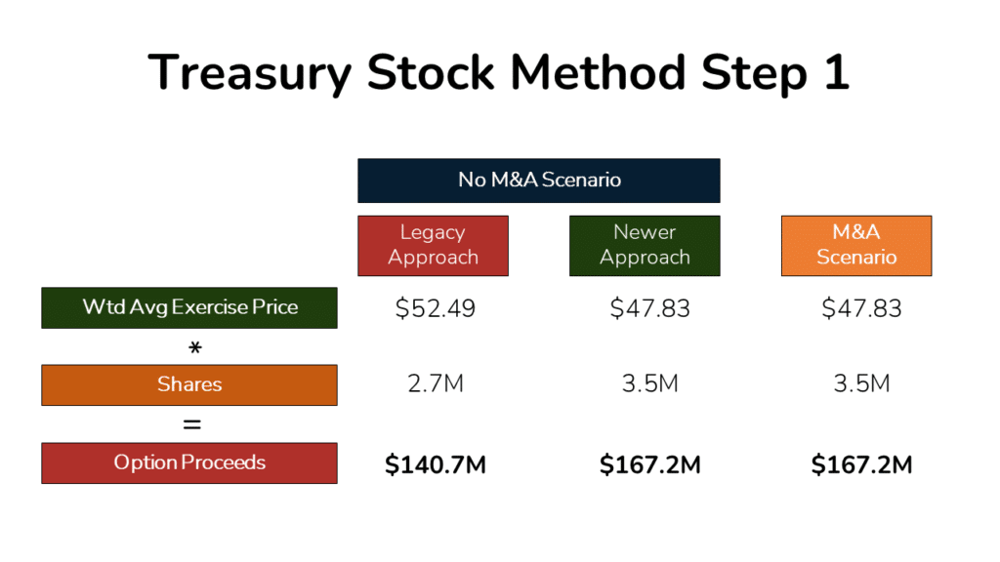

## Table of Contents

## What is treasury stock?

Treasury stock is when a company buys back its own shares from the stock market. When a company does this, the shares are no longer considered outstanding and are held by the company itself. This can happen for many reasons, like the company thinking its stock is undervalued or wanting to increase the value of the remaining shares by reducing the total number available.

By holding treasury stock, a company can later decide to reissue these shares if they need to raise money or use them for employee stock options. However, while the shares are held as treasury stock, they don't pay dividends and don't have voting rights. This can be a smart move for a company to manage its finances and stock value, but it also means fewer shares are available for investors to buy on the open market.

## How is treasury stock different from other types of stock?

Treasury stock is different from other types of stock because it's the company's own shares that it has bought back from the market. These shares are not owned by investors anymore but by the company itself. When a company buys back its shares, it takes them out of circulation, so there are fewer shares available for people to buy and sell on the stock market. This is different from regular stock, which is owned by shareholders and can be traded freely.

Another key difference is that treasury stock doesn't get dividends and doesn't have voting rights. Regular stock, on the other hand, usually comes with these rights. Shareholders with regular stock can vote on important company decisions and receive a portion of the company's profits as dividends. Treasury stock, however, just sits with the company until it decides what to do with it, like reissuing it or using it for employee stock options.

## Why do companies buy back their own shares?

Companies buy back their own shares for a few main reasons. One big reason is that they might think their stock is undervalued. This means they believe the price of their stock is lower than it should be, so they buy it back to get a good deal. Another reason is to increase the value of the remaining shares. When a company buys back its shares, it reduces the total number of shares out there. With fewer shares, each share can become more valuable because the company's earnings are spread over a smaller number of shares.

Another reason companies do this is to have shares ready for future use. They might need more shares to give to employees as part of their pay or to sell if they need to raise money quickly. By keeping some shares as treasury stock, the company can control when and how these shares are used. This can be a smart move to manage the company's finances and plan for the future, but it's important for companies to do this carefully so they don't spend too much money or make the stock price go up too high.

## What are the common methods used to acquire treasury stock?

Companies can acquire treasury stock in a few ways. One way is through open market purchases. This is when a company buys its own shares from the stock market, just like any other investor would. They can do this over time, buying shares little by little. Another way is through a tender offer. This is when the company makes a public offer to buy back a certain number of shares at a set price. Shareholders can then choose to sell their shares back to the company if they want to.

Another method is through a Dutch auction. In a Dutch auction, the company sets a range of prices at which it's willing to buy back its shares. Shareholders then tell the company how many shares they're willing to sell and at what price within that range. The company then picks the lowest price that lets them buy back the number of shares they want. This way, everyone who offered to sell at that price or lower gets to sell their shares. Each of these methods has its own advantages and can be used depending on what the company wants to achieve with the buyback.

## How does treasury stock affect a company's financial statements?

When a company buys back its own shares to hold as treasury stock, it affects the company's financial statements in a few ways. On the balance sheet, treasury stock is shown as a negative amount in the shareholders' equity section. This is because it represents a reduction in the company's equity, as money is being used to buy back the shares. The cost of the treasury stock is subtracted from the total equity, which can make the company's equity look smaller.

On the income statement, the buyback of treasury stock itself doesn't directly affect the company's profits or losses. However, the way the company pays for the buyback can impact the cash flow statement. If the company uses cash to buy back the shares, this will show up as a cash outflow in the financing activities section of the cash flow statement. This can reduce the company's cash on hand, which might affect how it manages its money in the future. Overall, buying back shares as treasury stock changes how the company's financial health looks on paper, and it's important for the company to think about these effects carefully.

## What are the legal and regulatory considerations for holding treasury stock?

When a company wants to buy back its own shares and hold them as treasury stock, there are important rules and laws it needs to follow. Different countries and regions have their own rules about how companies can do this. For example, in the United States, the Securities and Exchange Commission (SEC) has rules about how and when a company can buy back its shares. These rules are meant to make sure the process is fair and doesn't hurt investors. Companies need to be careful and follow these rules to avoid getting into trouble with the law.

Another thing to think about is how holding treasury stock might affect the company's taxes. In some places, there are special tax rules for treasury stock, and companies need to know about these to make sure they're doing everything right. Also, companies often need to tell their shareholders and the public about their plans to buy back shares. This is to keep everything open and honest, so investors know what's going on with the company's stock. By following these legal and regulatory rules, companies can manage their treasury stock without breaking any laws or causing problems for themselves or their investors.

## Can treasury stock be reissued, and if so, how?

Yes, treasury stock can be reissued. When a company decides it's time to bring those shares back into the market, they can sell them again. This can be done through the stock market, where the company might offer the shares to the public. Or, they might use the shares for other purposes, like giving them to employees as part of their pay. The price at which the company reissues the shares can be different from what they paid to buy them back, and this can affect the company's money situation.

The way a company reissues treasury stock can depend on the rules they have to follow. They need to make sure they're doing everything by the book, so they don't get into trouble with the law. When they reissue the shares, they have to report it to the people who watch over the stock market, like the SEC in the United States. This keeps everything fair and open for everyone involved. By reissuing treasury stock, the company can bring in more money or use the shares in other helpful ways, but they have to be careful to do it right.

## What are the tax implications of buying and selling treasury stock?

When a company buys back its own shares to hold as treasury stock, it doesn't usually have to pay taxes on the buyback itself. This is because the company is just moving money around within its own accounts. But, the way the company pays for the buyback can affect its taxes. If the company uses its profits to buy back the shares, it might have less money left to pay taxes on. Also, the shareholders who sell their shares back to the company might have to pay taxes on any profit they make from the sale, depending on the tax laws where they live.

When the company decides to reissue the treasury stock, the tax situation can get a bit more complicated. If the company sells the shares for more money than it paid to buy them back, it might have to pay taxes on the profit it makes from the sale. The exact tax rules can be different depending on where the company is based. It's important for the company to keep good records of how much it paid for the shares and how much it sells them for, so it can figure out the right amount of taxes to pay. This way, the company can make sure it's following all the tax laws and not paying more than it needs to.

## How do treasury stock transactions impact shareholders' equity?

When a company buys back its own shares to hold as treasury stock, it affects shareholders' equity by reducing it. This happens because the money the company uses to buy the shares comes out of its own cash, which is part of shareholders' equity. On the balance sheet, treasury stock is shown as a negative number in the shareholders' equity section. This makes the total equity smaller because the company is essentially taking money out of its own pocket to buy back the shares.

When the company decides to sell or reissue the treasury stock, shareholders' equity can change again. If the company sells the shares for more money than it paid to buy them back, the extra money goes back into shareholders' equity, making it bigger. But if the company sells the shares for less than it paid, shareholders' equity will go down even more. So, buying and selling treasury stock can make shareholders' equity go up or down, depending on how much the company pays and gets for the shares.

## What strategic purposes can treasury stock serve in corporate finance?

Companies use treasury stock as a strategic tool in corporate finance for several reasons. One key purpose is to increase the value of the remaining shares. When a company buys back its own shares, it reduces the total number of shares available on the market. This can make each share more valuable because the company's earnings are spread over fewer shares. This can be good for shareholders because it might make the price of their shares go up. Another reason is to have shares ready for future use. Companies might need shares to give to employees as part of their pay or to sell if they need to raise money quickly. By keeping some shares as treasury stock, the company can control when and how these shares are used.

Another strategic use of treasury stock is to signal to the market that the company thinks its stock is undervalued. When a company starts buying back its own shares, it tells investors that the company believes its stock price is too low. This can make investors feel more confident and might even encourage them to buy more shares. Also, holding treasury stock gives the company flexibility. They can decide later to reissue the shares if they need to raise money or use them for other purposes. This can be a smart way for the company to manage its finances and plan for the future, but it's important to do it carefully so they don't spend too much money or make the stock price go up too high.

## How can the management of treasury stock influence a company's stock price?

When a company buys back its own shares and holds them as treasury stock, it can make the stock price go up. This happens because there are fewer shares available on the market. When there are fewer shares, the company's earnings are spread over a smaller number of shares, which can make each share more valuable. Also, when a company starts buying back its own shares, it sends a message to investors that the company thinks its stock is a good deal. This can make investors feel more confident and want to buy more shares, which can push the stock price higher.

On the other hand, if a company sells its treasury stock back into the market, it can have the opposite effect. If the company sells a lot of shares at once, it can make the stock price go down because there are more shares available. But if the company sells the shares slowly over time, it might not have as big of an impact on the stock price. The way a company manages its treasury stock can show investors what the company thinks about its own value, and this can influence how much people are willing to pay for the stock.

## What are some real-world examples of companies using treasury stock effectively?

One example of a company using treasury stock effectively is Apple. A few years ago, Apple started a big program to buy back its own shares. They did this because they thought their stock was not as expensive as it should be. By buying back a lot of shares, Apple made the remaining shares more valuable. This made their stock price go up and made their shareholders happy. Apple also used some of the treasury stock to give to their employees as part of their pay, which helped keep their workers happy and motivated.

Another good example is IBM. IBM has been buying back its own shares for a long time. They do this to make their stock price go up and to show investors that they believe in their own company. By reducing the number of shares available, IBM makes each share worth more. This has helped keep their stock price strong even when the market is not doing well. IBM also uses the treasury stock to give to employees, which helps them keep good people working for them.

## What is Treasury Stock?

Treasury stock refers to the shares that a company reacquires from the public and holds in its own accounts. These shares were initially issued and available for trading in the stock market. Once repurchased, they are essentially taken out of circulation and held by the company itself. As a result, these shares do not confer voting rights and are ineligible for dividend distribution, distinguishing them from other shares held by public and institutional investors.

The motivations for a company to maintain treasury stock are often strategic. One primary use is for potential reissuance in [capital raising](/wiki/hedge-fund-capital-raising) activities. By holding these shares, the company retains the flexibility to reissue them in the future, perhaps during a secondary offering, without the need to authorize new shares, which can be a more time-consuming and regulatory-heavy process.

Furthermore, treasury stock can play a significant role in employee compensation plans. Companies may use these shares as part of stock option plans or other incentive programs, allowing them to compensate employees and executives without diluting existing shareholder value. This strategic use can help to align the interests of the company's workforce with those of its shareholders.

Accounting-wise, when a company repurchases its shares, the transaction is recorded in the equity section of the balance sheet as treasury stock, a contra-equity account that reduces total equity. The repurchase price does not affect profit or loss directly but impacts shareholder equity. Formulaically, if a company has `S` outstanding shares and repurchases `T` shares, the new number of outstanding shares becomes `S - T`. This reduction can alter key financial metrics, such as Earnings Per Share (EPS), which is calculated as:

$$
\text{EPS} = \frac{\text{Net Income}}{\text{Shares Outstanding}}
$$

Overall, managing treasury stock effectively requires understanding its impact on both the company's financial health and shareholder equity.

## Question: Why should a company buy back its own shares?

Companies may buy back shares for several strategic reasons, primarily focusing on enhancing shareholder value. When a company repurchases its own shares, it effectively reduces the number of shares available in the open market. This reduction can lead to an increase in Earnings Per Share (EPS) since EPS is calculated as the net income divided by the outstanding shares. By decreasing the denominator in the EPS formula, the company can present a more favorable financial metric to its investors:

$$
\text{EPS} = \frac{\text{Net Income}}{\text{Outstanding Shares}}
$$

Beyond improving financial metrics, share repurchase often conveys a message of confidence from the company's management. When management decides to buy back shares, it can signal to the market that they perceive the company's stock as undervalued. This action may reassure investors regarding the company's future prospects and intrinsic value, potentially leading to a positive reevaluation of the stock price by the market.

Furthermore, share repurchases can serve as a strategic defense mechanism against hostile takeovers. In a hostile takeover, an acquiring company attempts to gain control of a target company against the wishes of its management and board of directors. By buying back shares, the company can limit the number of shares available to potential acquirers, making it more challenging for outsiders to accumulate a controlling stake. This tactic effectively raises the threshold needed for a would-be acquirer to succeed, thus protecting the company from unsolicited acquisition attempts.

In summary, share repurchases are a multifaceted strategy used by companies to enhance financial performance metrics, signal management's confidence in the stock's value, and protect against external acquisition threats. Each of these reasons highlights why share buybacks are an integral part of corporate financial strategies.

## What is the impact on corporate finance?

Share repurchase affects a company's balance sheet, specifically in the stockholders' equity section. When a company buys back its shares, these shares become treasury stock, which is recorded as a contra-equity account. This means that the value of the repurchased shares is subtracted from the total equity. As a result, the stockholders' equity, comprised of common stock, retained earnings, and other components, experiences a reduction equivalent to the cost of the treasury stock.

From an accounting perspective, the treatment of treasury stock influences several financial metrics. For instance, by reducing the number of shares outstanding, share repurchases can enhance the earnings per share (EPS) since EPS is calculated by dividing net income by the number of outstanding shares:

$$
\text{EPS} = \frac{\text{Net Income}}{\text{Outstanding Shares}}
$$

This adjustment may depict a more favorable financial position and potentially increase the market value of the remaining shares.

Incorporating treasury stock into corporate finance requires meticulous accounting to ensure an accurate portrayal of a company's financial state. The purchase of treasury shares is not considered an investment, because it does not inherently increase the company’s value or capacity to generate revenue. Instead, it reflects a strategic allocation of resources, often aimed at capital structure optimization or signaling confidence to the market.

An example of how treasury stock affects financial statements can be illustrated through an accounting entry. Assuming a company repurchases 1,000 shares at $50 each, the journal entry would reduce cash and increase treasury stock by $50,000:

- Debit Treasury Stock $50,000.
- Credit Cash $50,000.

This transaction reduces the company's assets and equity, imposing implications for financial ratios such as the return on equity (ROE) and the debt-to-equity ratio. These ratios can become more attractive post-buyback, affecting stakeholders' perception and potentially altering investment decisions.

It's crucial for accountants and financial analysts to monitor these changes closely, as they provide insights into a company's strategic initiatives and overall financial health.

## What is the relationship between Algorithmic Trading and Share Repurchase?

Algorithmic trading systems integrate various data inputs to optimize trading strategies, and share repurchase announcements are a crucial component of this data landscape. Share repurchases, or stock buybacks, often lead to a rise in stock prices due to the reduced number of outstanding shares and the market's perception of increased value. Algorithmic traders leverage this information to anticipate and capitalize on potential upward [momentum](/wiki/momentum) in stock prices.

Upon the announcement of a share buyback, [algorithmic trading](/wiki/algorithmic-trading) models may trigger buy signals to exploit the anticipated price increase. This reaction is based on the historical behavior of stocks following repurchase announcements, where a decrease in supply can drive demand and price. For example, if a company announces a buyback plan to acquire 5% of its outstanding shares, the reduced float can enhance earnings per share (EPS), making the stock more attractive. The formula for EPS before and after the buyback exemplifies this:

$$
\text{EPS before buyback} = \frac{\text{Net Income}}{\text{Total Shares Outstanding}}
$$

$$
\text{EPS after buyback} = \frac{\text{Net Income}}{\text{Total Shares Outstanding} - \text{Shares Repurchased}}
$$

Algorithmic systems often use such financial metrics to predict short-term price movements. Moreover, the timing of buyback programs plays a critical role in trading strategies. Traders need to be aware of the specifics of these programs, which can vary in execution style, such as open market purchases or tender offers. Program timing can impact stock [volatility](/wiki/volatility-trading-strategies), as buybacks executed during periods of low volatility might stabilize prices, whereas those during high volatility might exacerbate fluctuations.

Volatility, represented by the standard deviation of stock returns, is another [factor](/wiki/factor-investing) that algorithmic trading models typically analyze. A simple Python snippet to calculate historical volatility might look like this:

```python
import numpy as np

def calculate_volatility(stock_prices):
    log_returns = np.log(stock_prices / np.roll(stock_prices, shift=1))[1:]
    return np.std(log_returns) * np.sqrt(252)  # Annualizing volatility

stock_prices = np.array([100, 101, 102, 98, 99, 105])
volatility = calculate_volatility(stock_prices)
print(f"Annualized Volatility: {volatility:.2f}")
```

Algorithmic traders include volatility metrics in their models to adaptively adjust their trading strategies around buybacks, aiming to optimize their entry and [exit](/wiki/exit-strategy) points based on expected price swings.

In conclusion, algorithmic trading systems that effectively incorporate data from share repurchase announcements can strategically exploit the subsequent market reactions. By considering the timing and characteristics of buyback programs, traders can enhance their algorithmic models to better navigate the complexities of stock volatility and price momentum.

## References & Further Reading

[1]: ["The Share Repurchase Revolution"](https://www.tapestrynetworks.com/wp-content/uploads/2024/03/IRRCI-Buybacks-and-the-Board-August-2016.pdf) by Harvard Business Review

[2]: ["Financial Management: Theory & Practice"](https://www.cengage.com/c/financial-management-theory-practice-16e-brigham-ehrhardt/9781337902601/?searchIsbn=ISBN%209781337902601) by Eugene F. Brigham and Michael C. Ehrhardt

[3]: ["The Effect of Share Repurchase on Stock Price"](https://www.investopedia.com/articles/investing/112013/impact-share-repurchases.asp) by The Wharton School

[4]: ["Capital Returns: Investing Through the Capital Cycle"](https://www.amazon.com/Capital-Returns-Investing-Through-Managers/dp/1137571640) by Edward Chancellor

[5]: ["Algorithmic and High-Frequency Trading"](https://www.cambridge.org/us/universitypress/subjects/mathematics/mathematical-finance/algorithmic-and-high-frequency-trading) by Álvaro Cartea, Sebastian Jaimungal, and José Penalva