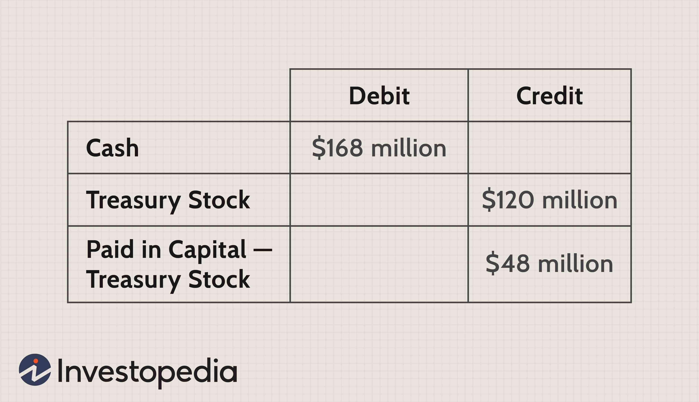

In finance, understanding the interplay between stocks, treasury stock, corporate finance, and algorithmic trading is vital for both new and seasoned investors. Stocks, representing ownership in a corporation, serve as a cornerstone of investment strategies, offering potential for growth and income. Meanwhile, treasury stock, which involves companies repurchasing their own shares, plays a pivotal role in shaping a firm's perceived market value and financial health. This maneuver can impact earnings per share and equity, underscoring its significance in corporate finance strategies.

In recent years, the advent of algorithmic trading has further transformed the financial landscape. By employing computer programs to execute trades based on predefined parameters, algorithmic trading facilitates faster and more efficient market transactions. This technology has reduced the emotional component of trading, allowing for more systematic and disciplined investment approaches.



This article explores these crucial components and their influence on the financial landscape. By focusing on key concepts such as treasury stock and algorithmic trading, we aim to provide insights into effective corporate finance strategies. As these strategies advance, they continue to play a foundational role in decision-making for both individual and institutional investors, driving the evolution of modern financial markets. Understanding these aspects is essential for navigating the complexities of today's financial environment and leveraging opportunities for competitive advantage.

## Table of Contents

## Understanding Stocks and Treasury Stock

Stocks play a crucial role in the financial ecosystem, serving as instruments of equity and opportunities for wealth creation. When individuals purchase stock in a company, they acquire a portion of ownership, entitling them to a share of the corporation's profits and assets. This ownership confers both potential rewards and risks, as the value of stocks can fluctuate based on a myriad of factors including the company’s financial performance, market conditions, and broader economic indicators.

Treasury stock, a key concept in corporate finance, consists of shares that a corporation has repurchased from the outstanding shares initially issued to the public. These shares are held in the company's treasury and can be reissued or retired altogether. The primary impact of repurchasing shares is on the company's equity and earnings per share (EPS). Since EPS is calculated as:

$$
\text{EPS} = \frac{\text{Net Income}}{\text{Average Outstanding Shares}}
$$

repurchasing shares effectively reduces the denominator, potentially increasing EPS, assuming net income remains constant. This increase is often perceived as a positive signal by investors, indicating that the company believes its shares are undervalued or that it seeks to improve financial ratios.

The strategic use of treasury stock can significantly influence a company's stock price and market valuation. When a company buys back shares, it can suggest management's confidence in the company's future prospects, leading to a positive market reaction. Additionally, reducing the number of shares available in the market can theoretically increase demand for the remaining shares, thereby boosting their market price. However, it's essential to note that while share buybacks can manipulate short-term stock valuations, they must be executed with careful consideration of the company's long-term capital needs and market conditions. Improperly timed or excessive buybacks can deplete cash reserves and limit the company's ability to invest in growth opportunities or weather financial downturns.

In summary, understanding stocks and treasury stock is integral for grasping how corporations manage equity to achieve strategic financial objectives. Investors and financial professionals must analyze the implications of share repurchases within the context of an organization's broader financial strategies and market conditions to make informed decisions.

## Impact of Treasury Stock on Corporate Finance

Treasury stock transactions significantly impact a corporation's financial health, as they involve repurchasing shares from the open market, which directly influence the company’s balance sheet. When a corporation buys back its stock, it reduces the number of outstanding shares, which can lead to an increase in the earnings per share (EPS) as the same amount of earnings is distributed over a smaller number of shares. This effect can make the company's financial performance appear more favorable, potentially attracting more investors and positively impacting the stock price.

On the balance sheet, treasury stock is listed as a contra equity account, which reduces total shareholders' equity because it represents shares that are no longer part of the public float. Furthermore, the corporation's cash reserves are depleted by the amount used to purchase the shares, thus impacting [liquidity](/wiki/liquidity-risk-premium) and capital structure. This reduction in cash reserves can affect the company's ability to finance operations, invest in new projects, or manage debt.

Understanding the strategic implications of treasury stock within corporate finance is crucial for effective financial management. Repurchasing shares can be a tactical decision reflecting management's confidence in the company's future performance and growth prospects. When managers believe their company's stock is undervalued, they may opt for buybacks as a means to invest in their own stock, a move often interpreted by the market as a positive signal about the company's intrinsic value.

Moreover, treasury stock can be a flexible financial tool. Companies may use these shares for future reissuance, which can be valuable for employee compensation plans or future merger and acquisition activities. The flexibility offered by holding treasury stock allows companies to respond dynamically to market conditions and strategic opportunities.

Accurate forecasting and a thorough understanding of treasury stock's effects are essential for aligning it with broader corporate finance strategies. Financial analysts and corporate managers must evaluate the opportunity costs and benefits of such transactions, considering factors such as the current economic environment, the company's financial position, and the potential changes in stock market conditions.

In summary, treasury stock transactions are a double-edged sword for corporate finance, providing both opportunities and challenges. By effectively managing treasury stock, companies can signal strength and confidence, potentially enhancing shareholder value while carefully balancing financial health and strategic objectives.

## Algorithmic Trading in the Financial Markets

Algorithmic trading utilizes sophisticated computer algorithms to automate trading activities by executing trades based on predefined criteria like timing, price, and [volume](/wiki/volume-trading-strategy). This approach enhances both the speed and efficiency of transactions, allowing firms to capitalize quickly on market opportunities. These algorithms can process vast amounts of data in real-time, identifying patterns and executing orders far quicker than a human trader could. By doing so, [algorithmic trading](/wiki/algorithmic-trading) minimizes the influence of human emotions, such as fear and greed, resulting in a more systematic and disciplined trading approach.

The introduction of algorithmic trading has significantly altered the landscape of financial markets. One of the most remarkable developments is high-frequency trading ([HFT](/wiki/high-frequency-trading-strategies)), which involves executing a large number of orders across multiple markets and decision parameters at extremely high speeds. HFT depends on advanced algorithms and high-speed data feeds to exploit minute price differentials, thereby providing liquidity and increasing the efficiency of financial markets. This rapid execution can be illustrated by the following Python snippet that simulates a basic high-frequency trading scenario using dummy stock data:

```python
import numpy as np

# Simulate stock price changes
stock_prices = np.random.randn(10000)

# Define a simple high-frequency trading algorithm
def simple_hft(prices):
    trades = 0
    for i in range(1, len(prices)):
        if prices[i] > prices[i-1]:  # Buying condition
            trades += 1
        elif prices[i] < prices[i-1]:  # Selling condition
            trades -= 1
    return trades

# Execute the algorithm
net_trades = simple_hft(stock_prices)
print(f"Net trades executed: {net_trades}")
```

While the advantages of algorithmic trading include increased market liquidity and more efficient pricing mechanisms, it also presents challenges. The reliance on technology introduces risks related to system failures and errors, potentially leading to market disruptions. Furthermore, the prevalence of high-frequency trading has raised concerns about increased market [volatility](/wiki/volatility-trading-strategies). The impact of algorithmic strategies was evident during the "Flash Crash" of 2010 when the U.S. stock market saw a rapid and largely unexplained decline in prices, partially attributed to automated trading strategies.

As algorithmic trading continues to evolve, it remains a crucial component of modern financial markets, offering both opportunities and challenges. Ensuring robust technological infrastructure and stringent regulatory oversight is essential to harness its benefits while mitigating associated risks.

## Advantages and Challenges of Algorithmic Trading

Algorithmic trading utilizes computer algorithms to automate trading, optimizing for factors such as speed and efficiency. One significant advantage of algorithmic trading is low latency, the minimal delay in processing trades, which is crucial in financial markets where timing can greatly affect profitability. This quick execution helps traders take advantage of price discrepancies that exist for only fractions of a second. In addition, algorithmic trading aims for best execution of trades, minimizing market impact and achieving the most favorable conditions based on execution benchmarks like volume-weighted average price (VWAP) or time-weighted average price (TWAP).

Another notable benefit is the reduction in transaction costs. By automating processes, algorithmic trading eliminates human errors and reduces labor costs associated with trading desks. Furthermore, algorithms can efficiently manage order splitting, ensuring large trades are executed in a manner that minimizes market disruption and price manipulation.

However, algorithmic trading presents challenges. A key issue is the heavy dependence on technology; any system failures, such as latency in networks or software bugs, can lead to missed opportunities or significant financial losses. Additionally, the speed at which trades are executed can lead to extreme market volatility, often exacerbating price swings during periods of uncertainty. The 2010 Flash Crash, where the U.S. stock market saw a rapid decline before quickly recovering, is a pertinent example of the potential market volatility associated with algorithms.

Moreover, regulatory compliance poses another challenge. With financial regulations continually evolving to address technological advancements, staying compliant requires ongoing investment in legal resources and risk management systems. Algorithmic trading firms must ensure their activities adhere to strict regulations to avoid legal repercussions and maintain market integrity.

Despite these challenges, the effective implementation of algorithmic trading necessitates a robust infrastructure and expert knowledge. This includes advanced hardware and software capable of handling vast amounts of data in real time, as well as skilled professionals who can develop, monitor, and adjust algorithms based on market conditions. Successful algorithmic trading strategies require continuous refinement and sophisticated analytical models to maintain a competitive edge in the marketplace.

## Strategic Management of Treasury Stock and Algorithmic Trading

Effective corporate finance strategy necessitates a proficient approach to the management of treasury stock and algorithmic trading. These tactics serve as pivotal instruments for enhancing a company's financial position and stock market performance. 

Companies like Apple exemplify the strategic use of treasury stock through share buybacks. By repurchasing shares, corporations can reduce the number of outstanding shares, which can potentially lead to an increase in earnings per share (EPS). This action often signifies management's confidence in the corporation's future prospects and can lead to elevated investor perceptions and valuations. Share buybacks can also be employed to utilize excess cash effectively, thereby optimizing the capital structure of the company.

Algorithmic trading complements these strategies by enabling corporations to execute trades with precision and minimal market impact. The utilization of complex algorithms in trading allows for the automation of buy and sell orders based on predefined criteria such as price, timing, or volume. This approach minimizes human error and emotion, leading to more consistent adherence to corporate finance strategies.

The synergy between treasury stock management and algorithmic trading becomes evident when considering the balance between supporting stock prices and executing trades efficiently. For instance, during a share buyback program, algotrading can be utilized to determine the optimal timing and conditions under which shares should be purchased to minimize costs and market disruption.

A typical algorithm involved might consist of the following steps in Python, showcasing a simplistic buyback strategy:

```python
import pandas as pd
import numpy as np

# Assuming data is a pandas DataFrame with time series data of stock prices
def calculate_moving_average(price_data, window):
    return price_data.rolling(window=window).mean()

def find_buyback_opportunities(price_data, short_window, long_window):
    short_ma = calculate_moving_average(price_data, short_window)
    long_ma = calculate_moving_average(price_data, long_window)

    # Identify buy opportunities when short MA crosses above long MA
    buy_signals = short_ma > long_ma
    return buy_signals

# Example usage:
# data = pd.read_csv('stock_prices.csv')
# opportunities = find_buyback_opportunities(data['Close'], short_window=50, long_window=200)
```

By investing in robust technological infrastructure and developing expert knowledge, companies can effectively harness the power of algorithmic trading. As market conditions evolve, these strategies will continue to provide corporations with a competitive edge in maximizing shareholder value and optimizing financial outcomes.

## Conclusion

Incorporating treasury stock strategies and algorithmic trading within corporate finance can provide competitive advantages to businesses and investors. Treasury stock management involves the strategic repurchase of outstanding shares by a corporation, which can enhance shareholder value and influence market perceptions. By reducing the number of shares available in the market, companies may increase their earnings per share (EPS), potentially making their stock more attractive to investors. This, in turn, can signal confidence in the company's future prospects.

Algorithmic trading contributes to these strategies by offering a framework for executing trades with increased precision and reduced latency. Through sophisticated algorithms, trades can be conducted on predefined criteria, optimizing market timing and minimizing human error. This technology supports greater liquidity and can lead to cost efficiencies, as trading costs are generally lower with algorithmic systems than with manual processes.

For financial professionals and investors, a comprehensive understanding of these areas is essential. Algorithmic trading strategies, in conjunction with well-managed treasury stock programs, can lead to enhanced decision-making capabilities and an improved ability to respond to market dynamics. As financial markets continue to evolve, remaining informed about advancements in these areas will be crucial for making strategic and informed financial decisions, ultimately contributing to sustained competitive advantages within the financial landscape.

## References & Further Reading

[1]: Berchovitch, E. (2018). ["The Board of Directors and Share Repurchases: Evidence from Canada."](https://onlinelibrary.wiley.com/doi/abs/10.1111/corg.12350) Journal of Corporate Finance, 50, 627-646.

[2]: Fama, E. F., & French, K. R. (2001). ["Disappearing dividends: changing firm characteristics or lower propensity to pay?"](https://www.sciencedirect.com/science/article/pii/S0304405X01000381) Journal of Financial Economics, 60, 3-43.

[3]: Kim, J., & Schremper, R. (2021). ["Treasury Stock Activities in Germany: A Descriptive Analysis."](https://journals.sagepub.com/doi/full/10.1177/21582440211047576) Cost Management & Financial Management Journal.

[4]: Gomber, P., Arndt, B., Lutat, M., & Uhle, T. (2011). ["High-Frequency Trading."](https://www.semanticscholar.org/paper/High-Frequency-Trading-Gomber-Arndt/3d0ba8179934e0a45e85a184d1ec526616e2e213) In Zhang, R. (Ed.), Handbook of Exchange Rates and Market Microstructure (pp. 75-86).

[5]: Goldstein, M. A., Kumar, P., & Graves, F. J. (2014). ["Computerized and High-Frequency Trading."](https://onlinelibrary.wiley.com/doi/pdfdirect/10.1111/fire.12031?download=true) The Financial Review, 49(2), 193-225.

[6]: ["Algorithmic Trading and DMA: An Introduction to Direct Access Trading Strategies"](https://www.amazon.com/Algorithmic-Trading-DMA-introduction-strategies/dp/0956399207) by Barry Johnson

[7]: Aldridge, I. (2009). ["High-Frequency Trading: A Practical Guide to Algorithmic Strategies and Trading Systems"](https://www.wiley.com/en-us/High+Frequency+Trading%3A+A+Practical+Guide+to+Algorithmic+Strategies+and+Trading+Systems-p-9780470579770) by Irene Aldridge

[8]: Cartea, A., Jaimungal, S., & Penalva, J. (2015). ["Algorithmic and High-Frequency Trading"](https://assets.cambridge.org/97811070/91146/frontmatter/9781107091146_frontmatter.pdf) by Alvaro Cartea et al.