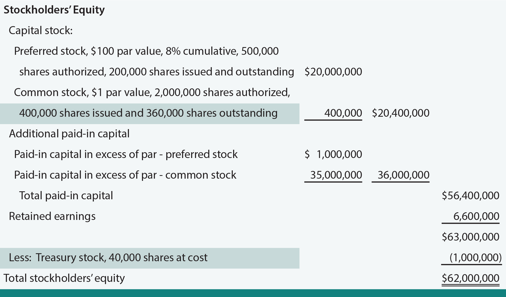

## Table of Contents

## What is treasury stock?

Treasury stock is when a company buys back its own shares from the stock market. These shares are no longer considered outstanding, which means they don't count in voting or dividend payments. Companies might do this for many reasons, like thinking their stock is a good deal or wanting to increase the value of the remaining shares.

When a company has treasury stock, it can either keep these shares or decide to sell them later. If they sell them, it's like issuing new stock but without changing the total number of shares the company is allowed to have. This can be a way for the company to raise money without going through the process of issuing new stock.

## How is treasury stock different from outstanding shares?

Treasury stock and outstanding shares are two different things. Treasury stock is when a company buys back its own shares from the market. These shares are not used for voting or getting dividends. They are like extra shares the company keeps in its pocket. On the other hand, outstanding shares are the total number of shares that people own and can vote with and get dividends from.

The main difference is that outstanding shares are actively owned by investors, while treasury stock is owned by the company itself. When a company buys back its shares, it reduces the number of outstanding shares because those shares are no longer in the hands of the public. This can make each remaining share more valuable because there are fewer shares overall. So, treasury stock affects the number of outstanding shares and can change how much a company is worth to its shareholders.

## Why do companies buy back their own stock?

Companies buy back their own stock for a few main reasons. One big reason is that they think their stock is a good deal. If they believe their stock is worth more than what it's selling for, they might buy it back to make money later when they sell it at a higher price. Another reason is to make their remaining shares more valuable. When a company buys back shares, it reduces the total number of shares out there. This can make each share worth more because there are fewer shares to divide the company's profits among.

Another reason companies buy back their stock is to show they believe in their own future. When a company spends money to buy its own shares, it's like saying, "We think our company is going to do well." This can make investors feel more confident and might even make the stock price go up. Sometimes, companies also buy back stock to use it for things like employee bonuses or to have extra shares ready if they need them later.

## What are the methods companies use to acquire treasury stock?

Companies usually use two main ways to buy back their own stock. One way is called the open market purchase. This is when the company goes to the stock market and buys its shares just like any other investor. They might do this slowly over time or all at once, depending on what they want. The other way is called a tender offer. This is when the company makes a public announcement and offers to buy back a certain number of shares at a specific price. Shareholders can choose to sell their shares back to the company at that price if they want to.

Sometimes, companies also use a method called a Dutch auction. This is a special kind of tender offer where the company says it will buy back shares, but it lets shareholders decide what price they want to sell at. The company then picks the lowest price that lets them buy back the number of shares they want. This can be a good way for the company to get a fair price for the shares it's buying back. Each method has its own reasons and can be used depending on what the company is trying to achieve with its buyback program.

## How is treasury stock recorded on a company's balance sheet?

Treasury stock is shown on a company's balance sheet as a negative number under the shareholders' equity section. This is because when a company buys back its own shares, it's like taking money out of the company's pocket. So, instead of adding to the company's value, treasury stock actually reduces it. The amount shown is the total cost of the shares the company bought back, and it stays as a negative until the company decides to sell those shares again or retire them.

If the company later decides to sell the treasury stock, the money they get from selling it goes back into the shareholders' equity section. This can either increase the company's value if they sell the shares for more than they paid, or it might not change much if they sell for the same price. But if they sell the shares for less than they paid, it can make the company's value go down even more. This is why keeping track of treasury stock on the balance sheet is important for understanding how much a company is really worth.

## What are the financial implications of holding treasury stock?

When a company holds treasury stock, it means they've spent money to buy back their own shares. This money could have been used for other things like growing the business or paying off debts. So, holding treasury stock can make the company's cash go down. But, it also means there are fewer shares out there, which can make each remaining share worth more. This can be good for the shareholders because they might see their shares go up in value.

Another thing about holding treasury stock is that it doesn't pay dividends or get voting rights. This means the company doesn't have to share its profits with these shares, which can be good for the company's bottom line. But, it also means that the company can't use these shares to vote on important decisions. If the company decides to sell the treasury stock later, they might make money if the stock price has gone up, or they might lose money if it's gone down. So, holding treasury stock can be a way to manage the company's finances and share value, but it comes with some risks and trade-offs.

## Can treasury stock be reissued, and if so, how?

Yes, treasury stock can be reissued. When a company decides to reissue its treasury stock, it can sell those shares back to the public or use them for other purposes like employee stock options or bonuses. To do this, the company usually sets a price for the shares and offers them for sale. If it's an open market sale, the company just sells the shares like any other investor would. If it's a private sale or part of an employee compensation plan, the company might offer the shares directly to specific people or groups.

The money the company gets from selling treasury stock goes back into the company's finances. This can help the company raise money without issuing new shares, which can be good because it doesn't increase the total number of shares the company is allowed to have. But, if the company sells the treasury stock for less than what they paid to buy it back, they might lose money on the deal. So, reissuing treasury stock is a way for the company to manage its shares and finances, but it needs to be done carefully to make sure it's a good move for the company.

## What are the legal and regulatory considerations regarding treasury stock?

When a company wants to buy back its own stock and hold it as treasury stock, it has to follow certain rules set by the government and financial regulators. In the United States, for example, the Securities and Exchange Commission (SEC) has rules that companies need to follow. One important rule is that companies have to tell everyone when they start a buyback program. This is called a public announcement. They also have to be careful not to do anything that could be seen as trying to trick people into thinking the stock is worth more than it really is.

Another thing companies need to think about is the laws in the state where they are based. Some states have rules about how much money a company can spend on buying back its own stock. They might also have rules about how the company can use the treasury stock once they have it. For example, some states say that companies can't vote with their treasury stock, and they have to be careful about how they sell it back to the public. All these rules are there to make sure that companies are fair and honest with their shareholders and the public.

## How does the repurchase of treasury stock affect earnings per share?

When a company buys back its own stock and turns it into treasury stock, it can make the company's earnings per share (EPS) go up. Earnings per share is the amount of money the company makes, divided by the number of shares people own. When a company buys back shares, it reduces the total number of shares out there. So, even if the company makes the same amount of money, that money is now split among fewer shares. This means each share gets a bigger piece of the pie, making the EPS higher.

This can be good for shareholders because a higher EPS can make the stock price go up. Investors often look at EPS to see how well a company is doing. If the EPS goes up, it can make people think the company is doing better and that the stock is worth more. But, it's important to remember that buying back stock uses up the company's money. If the company spends too much on buying back shares and doesn't have enough money left for other important things, it might not be a good move in the long run.

## What are the tax implications of buying and selling treasury stock?

When a company buys back its own stock to hold as treasury stock, it doesn't usually have to pay taxes right away. The money spent to buy the shares is not seen as a cost that can be taken off the company's taxes. But, if the company later sells the treasury stock for more money than they paid for it, they might have to pay taxes on the profit they made. This profit is called a capital gain, and it's taxed like any other money the company makes.

If the company sells the treasury stock for less money than they paid for it, they can't usually take that loss off their taxes. But, the money they get from selling the stock is seen as income for the company, so it might affect their overall tax situation. For shareholders who sell their stock back to the company, they might have to pay taxes on any profit they make from the sale. The exact tax rules can be different depending on where the company is and what kind of company it is, so it's a good idea for companies to talk to a tax expert to understand all the rules.

## How do investors view treasury stock in terms of company valuation?

Investors often see treasury stock as a good sign because it can make each share worth more. When a company buys back its own stock, it means there are fewer shares out there. So, if the company makes the same amount of money, that money is split among fewer shares. This can make the earnings per share go up, which can make the stock price go up too. Investors like this because it can mean their shares are worth more money.

But, investors also know that buying back stock uses up the company's money. If the company spends too much on buying back shares and doesn't have enough money left for other important things like growing the business or paying off debts, it might not be a good move. So, investors look at how much money the company is spending on treasury stock and what they're doing with the rest of their money. If it looks like the company is making smart choices, investors might think the company is worth more. But if it looks like the company is spending too much on buybacks, investors might worry and think the company is worth less.

## What advanced strategies involve the use of treasury stock in corporate finance?

Companies sometimes use treasury stock in smart ways to help their business. One way is called "greenmail." This is when a company buys back its stock from someone who wants to take over the company. By buying back the stock, the company can stop the takeover and keep control. Another strategy is using treasury stock for employee stock options. Instead of giving employees new shares, the company can give them treasury stock. This helps the company save money and keeps the total number of shares from going up, which can be good for the other shareholders.

Another advanced strategy is using treasury stock to manage the company's finances. For example, a company might buy back its stock when it thinks the stock is cheap. Later, if the stock price goes up, the company can sell the treasury stock for more money. This can be a way to make money for the company without having to issue new shares. It's like the company is investing in itself. These strategies show how treasury stock can be a powerful tool for companies to control their shares, manage their money, and plan for the future.

## What is the understanding of stocks and treasury stock?

Stocks play a crucial role in the financial ecosystem, serving as instruments of equity and opportunities for wealth creation. When individuals purchase stock in a company, they acquire a portion of ownership, entitling them to a share of the corporation's profits and assets. This ownership confers both potential rewards and risks, as the value of stocks can fluctuate based on a myriad of factors including the company’s financial performance, market conditions, and broader economic indicators.

Treasury stock, a key concept in corporate finance, consists of shares that a corporation has repurchased from the outstanding shares initially issued to the public. These shares are held in the company's treasury and can be reissued or retired altogether. The primary impact of repurchasing shares is on the company's equity and earnings per share (EPS). Since EPS is calculated as:

$$
\text{EPS} = \frac{\text{Net Income}}{\text{Average Outstanding Shares}}
$$

repurchasing shares effectively reduces the denominator, potentially increasing EPS, assuming net income remains constant. This increase is often perceived as a positive signal by investors, indicating that the company believes its shares are undervalued or that it seeks to improve financial ratios.

The strategic use of treasury stock can significantly influence a company's stock price and market valuation. When a company buys back shares, it can suggest management's confidence in the company's future prospects, leading to a positive market reaction. Additionally, reducing the number of shares available in the market can theoretically increase demand for the remaining shares, thereby boosting their market price. However, it's essential to note that while share buybacks can manipulate short-term stock valuations, they must be executed with careful consideration of the company's long-term capital needs and market conditions. Improperly timed or excessive buybacks can deplete cash reserves and limit the company's ability to invest in growth opportunities or weather financial downturns.

In summary, understanding stocks and treasury stock is integral for grasping how corporations manage equity to achieve strategic financial objectives. Investors and financial professionals must analyze the implications of share repurchases within the context of an organization's broader financial strategies and market conditions to make informed decisions.

## References & Further Reading

[1]: Berchovitch, E. (2018). ["The Board of Directors and Share Repurchases: Evidence from Canada."](https://onlinelibrary.wiley.com/doi/abs/10.1111/corg.12350) Journal of Corporate Finance, 50, 627-646.

[2]: Fama, E. F., & French, K. R. (2001). ["Disappearing dividends: changing firm characteristics or lower propensity to pay?"](https://www.sciencedirect.com/science/article/pii/S0304405X01000381) Journal of Financial Economics, 60, 3-43.

[3]: Kim, J., & Schremper, R. (2021). ["Treasury Stock Activities in Germany: A Descriptive Analysis."](https://journals.sagepub.com/doi/full/10.1177/21582440211047576) Cost Management & Financial Management Journal.

[4]: Gomber, P., Arndt, B., Lutat, M., & Uhle, T. (2011). ["High-Frequency Trading."](https://www.semanticscholar.org/paper/High-Frequency-Trading-Gomber-Arndt/3d0ba8179934e0a45e85a184d1ec526616e2e213) In Zhang, R. (Ed.), Handbook of Exchange Rates and Market Microstructure (pp. 75-86).

[5]: Goldstein, M. A., Kumar, P., & Graves, F. J. (2014). ["Computerized and High-Frequency Trading."](https://onlinelibrary.wiley.com/doi/pdfdirect/10.1111/fire.12031?download=true) The Financial Review, 49(2), 193-225.

[6]: ["Algorithmic Trading and DMA: An Introduction to Direct Access Trading Strategies"](https://www.amazon.com/Algorithmic-Trading-DMA-introduction-strategies/dp/0956399207) by Barry Johnson

[7]: Aldridge, I. (2009). ["High-Frequency Trading: A Practical Guide to Algorithmic Strategies and Trading Systems"](https://www.wiley.com/en-us/High+Frequency+Trading%3A+A+Practical+Guide+to+Algorithmic+Strategies+and+Trading+Systems-p-9780470579770) by Irene Aldridge

[8]: Cartea, A., Jaimungal, S., & Penalva, J. (2015). ["Algorithmic and High-Frequency Trading"](https://assets.cambridge.org/97811070/91146/frontmatter/9781107091146_frontmatter.pdf) by Alvaro Cartea et al.