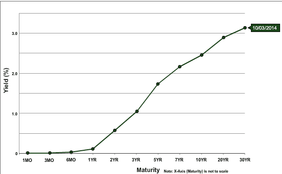

In the world of finance, treasury interest rates and the yield curve serve as vital indicators of economic health. The treasury yield curve, often referenced in market analyses, offers a graphical representation of the yields on U.S. Treasury securities across different maturities. This curve is not only a tool for visualizing medium to long-term interest rate expectations but also for assessing the overall direction of the economy. An understanding of its shape—whether normal, inverted, or flat—can yield insights into investors’ expectations and potential shifts in economic conditions.

Algorithmic trading, commonly referred to as algo trading, has gained prominence by harnessing the power of financial data insights to execute trades at speeds and volumes beyond human capabilities. This method uses complex algorithms and mathematical models to create strategies that swiftly respond to market conditions. By processing vast amounts of data, algorithmic traders are able to forecast market trends and execute numerous trades with precision.



This article explores the intersection of these elements, focusing on how treasury yield curves can be leveraged in algo trading. By integrating data from the yield curve, algorithmic trading systems can develop models to exploit market inefficiencies and anticipate changes. The strategic use of treasury yield curves allows for the incorporation of macroeconomic indicators into trading algorithms, thus enhancing decision-making and offering investors a systematic way to approach trades based on empirical data rather than speculative impulses.

## Table of Contents

## Understanding the Treasury Yield Curve

The treasury yield curve is a fundamental concept in finance that represents the relationship between interest rates and the maturities of U.S. Treasury securities. It is a graphical depiction where the x-axis denotes the maturity period of the securities, ranging from a few months to 30 years, and the y-axis displays the yield, or interest rate, associated with each maturity. This curve serves as an essential tool for investors, economists, and policymakers in assessing the state of the economy and making informed decisions.

The yield curve can assume different shapes, each carrying distinct economic implications:

1. **Normal Yield Curve**: Typically, the yield curve slopes upward, indicating that longer-term securities offer higher yields compared to short-term ones. This configuration suggests investor confidence in future economic growth, as a higher yield compensates for the risks associated with a longer investment duration.

2. **Inverted Yield Curve**: An inverted curve occurs when short-term yields exceed long-term ones, resulting in a downward slope. This phenomenon often signals an impending economic slowdown or recession. Historically, an inverted yield curve has been a reliable predictor of economic downturns, as investors anticipate lower interest rates in the future due to weakening economic conditions.

3. **Humped (or Bell-Shaped) Yield Curve**: A less common shape is the humped curve, where medium-term maturities have higher yields than both short-term and long-term ones. This shape may indicate economic uncertainty or transitional economic phases.

The shape and trajectory of the yield curve are influenced by various factors, including monetary policy, inflation expectations, and macroeconomic conditions. Market participants closely monitor changes in the yield curve to gauge the economic outlook. For instance, a steepening curve might suggest strong economic growth and rising inflation expectations, prompting central banks to consider tightening monetary policy. Conversely, a flattening or inverting curve could indicate slowing economic activity, leading to potential rate cuts to stimulate growth.

In practice, the yield curve is utilized to forecast macroeconomic trends and guide investment strategies. Analysts and investors alike study yield curve movements to make predictions about [interest rate](/wiki/interest-rate-trading-strategies) changes, inflation, and future economic performance. The yield curve's role extends beyond mere observation, as it can directly influence lending rates, bond prices, and the overall financial environment.

In conclusion, the treasury yield curve serves as a vital economic barometer, providing critical insights into current and future economic conditions. Its shape not only reflects the market's expectations regarding growth and inflation but also acts as a guide for strategic financial decision-making.

## Treasury Yields and Interest Rates

Treasury yields represent the return on investment for U.S. Treasury securities and are intricately linked to the interest rates established by financial authorities like the Federal Reserve. These yields are a reflection of the interest rate environment and are used by investors to assess economic conditions. Treasury yields typically provide insights into the market's expectations for future interest rates, inflation, and economic growth.

When analyzing treasury yields, it is essential to understand the role of the Federal Reserve, which sets the federal funds rate. This rate influences short-term interest rates, and by extension, affects treasury yields across different maturities. When the Federal Reserve signals an increase in the federal funds rate, short-term treasury yields tend to rise, reflecting investor expectations of higher interest rates. Conversely, indications of a rate cut typically result in lower yields.

High treasury yields often signify robust investor confidence in economic growth. They suggest that investors anticipate stable or increasing interest rates, which are usually associated with economic expansion. This confidence translates into a willingness to invest in riskier assets, affecting a wide array of financial products such as corporate bonds and equities. Conversely, low treasury yields often indicate that investors are seeking safety, which can point towards a lack of confidence in the economy's strength.

The yield curve, a graphical representation of treasury yields across different maturities, is a critical tool for predicting economic trends. A normal yield curve, which slopes upwards, indicates strong economic growth prospects. An inverted curve, where short-term yields exceed long-term yields, can signal an impending economic slowdown or recession. Meanwhile, a flat yield curve suggests uncertainty about future economic conditions.

Investors and market analysts closely observe these yield curve shifts to inform their investment strategies. A steepening curve often leads to strategies focused on longer-term investments, whereas an inverted curve may prompt a shift towards safer, short-term securities. Understanding these dynamics allows for more informed decision-making, as the yield curve provides a basis for anticipating economic cycles and adjusting portfolio allocations accordingly.

## The Rise of Algorithmic Trading

Algorithmic trading, commonly referred to as algo trading, has revolutionized the financial markets by employing computer algorithms to automate and accelerate trade execution based on predefined criteria. This technological advancement enhances trading efficiency by executing orders at speeds and frequencies unimaginable to human traders.

### Efficiency and Liquidity

Algo trading optimizes the trading process by reducing transaction costs and exploiting market opportunities as they arise. Algorithms can swiftly parse through vast amounts of financial data, uncover patterns, and execute trades in fractions of a second, leading to increased market [liquidity](/wiki/liquidity-risk-premium). The speed at which these trades occur not only absorbs market fluctuations but also narrows bid-ask spreads, subsequently enhancing overall market quality.

### Challenges of High Volatility

Despite its advantages, [algorithmic trading](/wiki/algorithmic-trading) has been criticized for contributing to market [volatility](/wiki/volatility-trading-strategies). Algorithms, particularly those not rigorously tested, can exacerbate price swings and market instability. Events such as the 2010 "Flash Crash," where a rapid and deep market decline occurred within minutes, highlight the potential risks when algorithms malfunction or amplify trading errors. Thus, it is crucial for developers and traders to implement safeguards and rigorous testing protocols.

### Expanding Role in Financial Markets

The growth of algorithmic trading continues to evolve, reshaping traditional trading approaches. Algorithms are no longer confined to simple buy and sell orders; they are capable of performing complex strategies, including statistical [arbitrage](/wiki/arbitrage), [market making](/wiki/market-making), and speculative strategies. The integration of [machine learning](/wiki/machine-learning) and [artificial intelligence](/wiki/ai-artificial-intelligence) has further propelled algo trading, allowing systems to adapt, learn from past data, and potentially predict future market dynamics.

Python, a popular programming language within algo trading, offers a comprehensive ecosystem for developing trading algorithms. Libraries such as `numpy`, `pandas`, and `scikit-learn` facilitate data analysis, while `zipline` and `QuantConnect Lean` provide powerful [backtesting](/wiki/backtesting) environments. An example of a simple moving average crossover strategy in Python might look like this:

```python
import pandas as pd

# Assume df is a pandas DataFrame with historical price data
def moving_average_strategy(df, short_window=40, long_window=100):
    # Calculate the short and long moving averages
    df['Short_MA'] = df['Close'].rolling(window=short_window, min_periods=1).mean()
    df['Long_MA'] = df['Close'].rolling(window=long_window, min_periods=1).mean()

    # Determine buy/sell signals
    df['Signal'] = 0  # No position
    df['Signal'][short_window:] = (
        df['Short_MA'][short_window:] > df['Long_MA'][short_window:]
    ).astype(int)  # Buy signal is 1 and sell is 0

    df['Position'] = df['Signal'].diff()

    return df

# Apply the strategy to a sample DataFrame
# df = moving_average_strategy(df)
```

This simple example highlights the capabilities of algorithmic traders to design, test, and deploy strategies with ease and precision. As financial markets increasingly integrate technology, algorithmic trading will continue to transform market structures and strategies, representing a pivotal element in the modern trading infrastructure.

## Interplay Between Yield Curves and Algo Trading

Algorithmic trading systems capitalize on treasury yield data to pinpoint lucrative trading opportunities. These systems leverage advanced computational algorithms to assess fluctuations in treasury yields and make decisions at speeds and accuracies that surpass human capability. By scrutinizing the shapes and movements of yield curves, traders can implement sophisticated strategies, including forecasting interest rate changes and identifying shifts in yield curve patterns.

The yield curve, a graph displaying the yield of Treasury securities against their maturities, is instrumental in algo trading. Its various shapes, such as 'normal', 'inverted', or 'humped', convey vital signals that algorithms analyze to predict market movements. For instance, an inverted yield curve, where short-term interest rates are higher than long-term ones, may indicate a looming economic downturn. Algorithmic systems can swiftly react to such shifts by adjusting trading strategies to mitigate risks or capitalize on potential opportunities.

The dynamism of yield curves requires that algo trading systems constantly update their models to integrate new data, creating a feedback loop. This loop is characterized by the interaction of algorithms with market conditions—algorithms respond to yield curve variations and, in turn, influence market dynamics through their trading activities. 

Python, a preferred language for financial modeling, provides the infrastructure for building these algorithms. A simple example of analyzing the yield curve might involve fetching real-time yield data and applying a model to detect shifts:

```python
import numpy as np
import matplotlib.pyplot as plt

# Sample treasury yield data
maturities = np.array([1, 3, 5, 10, 20, 30])
yields = np.array([0.1, 0.5, 0.75, 1.5, 2.0, 2.25])

plt.plot(maturities, yields, marker='o')
plt.title("Treasury Yield Curve")
plt.xlabel("Maturity (Years)")
plt.ylabel("Yield (%)")
plt.grid(True)
plt.show()

# Algorithm to detect inversion (simplified example)
def detect_inversion(yield_data):
    if yield_data[0] > yield_data[-1]:
        return "Inverted"
    return "Normal"

curve_type = detect_inversion(yields)
print(f"The yield curve is {curve_type}.")
```

This synergy between yield curves and algorithmic trading emphasizes the necessity for traders to possess a firm understanding of economic indicators and market conditions. Ultimately, the interplay between these financial elements influences not only individual trading strategies but also broader market trends.

## Implications for Investors and Traders

Understanding yield curves and interest rate dynamics is essential for traders and investors aiming to craft effective trading strategies. Yield curves, which illustrate the relationship between interest rates and different maturities of U.S. Treasury securities, serve as crucial indicators of economic trends and investor sentiment. For instance, a normal yield curve, where long-term interest rates are higher than short-term rates, typically signals economic expansion. In contrast, an inverted yield curve can indicate an impending economic slowdown. Therefore, accurately interpreting these curves can lead to more informed decision-making in financial markets.

Algorithmic trading, which executes trades based on predefined criteria at high speeds, requires diligent monitoring of economic indicators, including treasury yield data. These indicators help algorithms predict market movements, identify trading opportunities, and respond quickly to changes. Algorithms can implement strategies based on yield curve analysis, such as anticipating interest rate movements or detecting shifts in yield curves that may signal economic changes.

Continuous monitoring is crucial because market conditions can change rapidly. Traders must ensure their algorithms are set to respond promptly to newly released economic data, geopolitical events, and other factors that may affect yield curves and interest rates. For instance, if an algorithm detects an unexpected steepening of the yield curve, it might adjust its trading strategy to capitalize on anticipated shifts in investor sentiment or economic conditions.

Risk management remains vital in mitigating potential losses associated with the inherent volatility of algorithmic trading. This involves setting robust parameters within trading algorithms to limit exposure during turbulent market conditions. Techniques such as stop-loss orders, position sizing, and diversification across asset classes can help manage risk effectively. Additionally, traders should regularly backtest their algorithms against historical data to ensure their strategies remain viable under various market conditions.

In conclusion, for investors and traders leveraging algorithmic trading, a nuanced understanding of yield curves and their implications is indispensable. The dynamic nature of markets requires sophisticated strategies that can adapt to changing interest rate environments, emphasizing the significance of robust risk management practices. Embracing these insights allows market participants to optimize their trading strategies and navigate the complexities of modern financial markets effectively.

## Conclusion

The relationship between treasury interest rates, yield curves, and algorithmic trading is a pivotal area of focus for investors seeking to maximize their financial strategies. Treasury interest rates and yield curves serve as barometers for economic conditions, providing crucial data that informs wide-ranging investment decisions. For algorithmic trading systems, which rely on precise data inputs and rapid execution, these interest rates and yield curves offer a wealth of actionable insights. Through the analysis of yield curve shapes and shifts, algorithms can identify potential trading opportunities and optimize the timing of entry and [exit](/wiki/exit-strategy) points.

As financial markets continue to evolve, leveraging the interplay between treasury yields and algorithmic trading will become increasingly important. Market participants who adapt their strategies to incorporate these elements stand to gain significant advantages. The continued refinement of trading algorithms, driven by technological innovation, will further enhance the ability to predict market movements and adapt strategies accordingly. 

Furthermore, the integration of advanced machine learning techniques in algorithms is expected to improve pattern recognition and predictive capabilities, enabling traders to respond with greater agility to economic changes. For instance, sophisticated algorithms can be designed to detect yield curve inversions, which historically precede economic recessions, allowing traders to adjust their positions promptly. In Python, libraries such as NumPy and pandas could be employed to construct models that analyze historical yield curves and predict future trends. Here's a simple example of using Python to analyze yield curve data:

```python
import numpy as np
import pandas as pd

# Sample yield data
yield_data = {
    'maturity': [1, 2, 5, 10, 30],
    'yield': [0.15, 0.25, 0.50, 1.00, 2.00]
}

# Create a DataFrame
df = pd.DataFrame(yield_data)

# Calculate the average yield
average_yield = np.mean(df['yield'])

print(f"Average Yield: {average_yield:.2f}")
```

In conclusion, the dynamic relationships between treasury interest rates, yield curves, and algo trading will continue to shape investment landscapes. Embracing these interconnections, alongside advancements in technology, is essential for traders aiming to navigate and exploit the complexities of modern financial markets.

## References & Further Reading

[1]: Litterman, R., Scheinkman, J., & Weiss, L. (1991). ["Volatility and the Yield Curve."](https://www.semanticscholar.org/paper/Volatility-and-the-Yield-Curve-Litterman-Scheinkman/5f9c5f23a5d01b47e26a06ec08d4fac740910474) The Journal of Fixed Income, 1(1), 49-60.

[2]: ["Active Portfolio Management: A Quantitative Approach for Producing Superior Returns and Controlling Risk"](https://www.amazon.com/Active-Portfolio-Management-Quantitative-Controlling/dp/0070248826) by Richard C. Grinold and Ronald N. Kahn

[3]: Harvey, C. R. (1988). ["The Real Term Structure and Consumption Growth."](https://www.sciencedirect.com/science/article/pii/0304405X88900736) Journal of Financial Economics, 22(2), 305-333.

[4]: ["Algorithmic Trading and DMA: An Introduction to Direct Access Trading Strategies"](https://www.amazon.com/Algorithmic-Trading-DMA-introduction-strategies/dp/0956399207) by Barry Johnson

[5]: Campbell, J. Y., & Shiller, R. J. (1991). ["Yield Spreads and Interest Rate Movements: A Bird's Eye View."](https://www.nber.org/papers/w3153) The Review of Economic Studies, 58(3), 495-514.