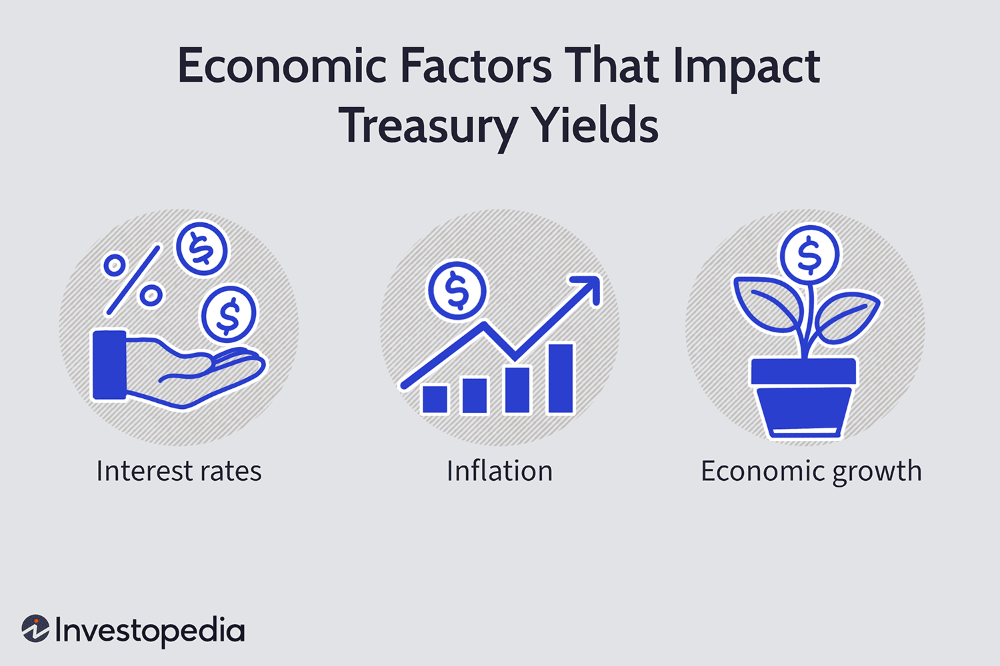

## Table of Contents

## What is a Treasury yield?

A Treasury yield is the return on investment that an investor can expect from buying a U.S. government bond, also known as a Treasury security. These bonds are issued by the U.S. Department of the Treasury and are considered very safe investments because they are backed by the full faith and credit of the U.S. government. The yield is expressed as an annual percentage rate, showing how much income the bond will generate over a year.

The yield on a Treasury bond changes based on several factors, including the bond's price, its face value, and the time left until it matures. When bond prices go up, yields go down, and when bond prices go down, yields go up. This inverse relationship is important for investors to understand. Treasury yields are closely watched by investors and economists because they can indicate the overall health of the economy and influence interest rates on loans and savings accounts.

## How are Treasury yields calculated?

Treasury yields are figured out by looking at the bond's price and how much it will pay when it matures. If you buy a bond for less than its face value, you can earn more than the bond's interest rate because you'll get the full face value back when it matures. For example, if you buy a $1,000 bond for $950, you'll get $1,000 back, making a $50 profit plus any interest the bond pays.

The most common way to calculate a Treasury yield is using the yield to maturity (YTM) formula. This formula takes into account the bond's current market price, its face value, the coupon [interest rate](/wiki/interest-rate-trading-strategies), and the time until the bond matures. It gives you the total return you can expect if you hold the bond until it matures. The calculation can be a bit tricky, but it helps investors understand what they might earn from their investment over time.

## What are the different types of Treasury securities?

There are three main types of Treasury securities: Treasury bills, Treasury notes, and Treasury bonds. Treasury bills, or T-bills, are short-term securities that mature in one year or less. They are sold at a discount from their face value, and when they mature, the government pays you the full face value. For example, you might buy a $1,000 T-bill for $950, and when it matures, you get $1,000, making a $50 profit. T-bills don't pay regular interest, so your return comes from the difference between what you paid and what you get back.

Treasury notes, or T-notes, are medium-term securities that mature between two and ten years. They pay interest every six months until they mature. When you buy a T-note, you get regular interest payments, and at the end, you get the face value of the note back. For example, if you buy a $1,000 T-note, you might get $20 every six months, and when it matures, you get the $1,000 back. T-notes are a good choice if you want steady income over a few years.

Treasury bonds, or T-bonds, are long-term securities that mature in 20 or 30 years. Like T-notes, they pay interest every six months. When you buy a T-bond, you receive regular interest payments, and at the end of the term, you get the face value of the bond back. For example, if you buy a $1,000 T-bond, you might get $30 every six months, and after 30 years, you get the $1,000 back. T-bonds are good if you want to invest for the long term and get steady income along the way.

## Why are Treasury yields important to investors?

Treasury yields are important to investors because they show how much money they can make from buying U.S. government bonds. These bonds are seen as very safe investments because they are backed by the U.S. government. The yield tells investors the return they can expect if they hold the bond until it matures. This helps them decide if buying a Treasury security is a good investment compared to other options like stocks or corporate bonds.

Yields also affect the economy in big ways. When Treasury yields go up, it often means that interest rates for loans and mortgages will go up too. This can make borrowing money more expensive, which might slow down the economy. On the other hand, when yields go down, borrowing becomes cheaper, which can help the economy grow. Investors watch Treasury yields closely because they give clues about where the economy might be headed and can help them make better investment choices.

## How do Treasury yields affect the economy?

Treasury yields have a big impact on the economy because they influence interest rates for loans and mortgages. When Treasury yields go up, it usually means that interest rates will go up too. This makes borrowing money more expensive for people and businesses. When loans are more expensive, people might buy fewer houses or cars, and businesses might not expand as much. This can slow down the economy because there's less spending and investment happening.

On the other hand, when Treasury yields go down, borrowing money becomes cheaper. Lower interest rates can encourage people to take out loans for things like buying a house or starting a business. When borrowing is cheaper, there's often more spending and investment, which can help the economy grow. Because Treasury yields can affect so many parts of the economy, they are watched closely by investors and policymakers to help understand and predict economic trends.

## What is the relationship between Treasury yields and interest rates?

Treasury yields and interest rates are closely connected. When Treasury yields go up, it usually means that interest rates will go up too. This happens because Treasury securities are seen as very safe investments. When people want to buy these safe investments and the demand goes up, the price of the bonds goes up, and the yield goes down. But if people want to sell their bonds, the price goes down, and the yield goes up. Banks and other lenders often use Treasury yields as a guide for setting their own interest rates on loans and mortgages.

When Treasury yields are high, borrowing money becomes more expensive. This can make people and businesses think twice before taking out loans for things like buying a house or expanding a business. On the other hand, when Treasury yields are low, borrowing money is cheaper. This can encourage more spending and investment, which can help the economy grow. So, changes in Treasury yields can have a big impact on the economy by affecting how much it costs to borrow money.

## What factors influence Treasury yields?

Treasury yields can go up or down because of many things. One big thing is how much people want to buy Treasury securities. If a lot of people want to buy them, the price goes up, and the yield goes down. If not many people want to buy them, the price goes down, and the yield goes up. Another thing that can change Treasury yields is inflation. If people think prices will go up a lot, they might want more money back from their investments, so yields can go up. The opposite can happen if people think inflation will be low.

Another factor that affects Treasury yields is what the government is doing with its money. If the government needs to borrow a lot of money by selling more Treasury securities, this can push yields up because there are more bonds for sale. Also, what the Federal Reserve does with interest rates can change Treasury yields. If the Fed raises interest rates, Treasury yields usually go up too. If the Fed lowers interest rates, yields can go down. Finally, what's happening in the world and the economy can make a difference. If there's a lot of uncertainty or risk, people might want to buy safe investments like Treasury securities, which can lower the yields.

## How do inflation expectations impact Treasury yields?

Inflation expectations have a big impact on Treasury yields. When people think that prices will go up a lot in the future, they want to get more money back from their investments to keep up with those higher prices. This means they might not want to buy Treasury securities unless the yields are higher. So, if inflation expectations go up, Treasury yields usually go up too. This is because investors need a higher return to make sure their money keeps its value over time.

On the other hand, if people think inflation will stay low, they might be okay with lower returns from their investments. This can make Treasury yields go down because investors are happy with smaller yields when they don't expect prices to rise much. So, the way people think about future inflation can really move Treasury yields up or down, depending on what they expect will happen with prices.

## What role does the Federal Reserve play in influencing Treasury yields?

The Federal Reserve, or the Fed, has a big say in what happens with Treasury yields. One way the Fed does this is by setting the federal funds rate, which is the interest rate banks charge each other for short-term loans. When the Fed raises this rate, it makes borrowing money more expensive, and this often leads to higher Treasury yields. On the other hand, if the Fed lowers the federal funds rate, borrowing becomes cheaper, and Treasury yields usually go down too.

The Fed also buys and sells Treasury securities in what's called open market operations. When the Fed buys a lot of Treasury securities, it puts more money into the economy, which can push yields down because there's more demand for the bonds. If the Fed sells a lot of Treasury securities, it takes money out of the economy, and this can push yields up because there are more bonds for sale. So, the Fed's actions can really move Treasury yields in one direction or the other, depending on what they're trying to do with the economy.

## How do global economic conditions affect Treasury yields?

Global economic conditions can have a big impact on Treasury yields. When there's a lot of uncertainty or risk in the world, like during a financial crisis or a big political event, investors often look for safe places to put their money. Treasury securities are seen as very safe because they're backed by the U.S. government. So, when the world feels risky, more people want to buy these safe investments, which can push up the price of Treasury securities and bring down the yields.

On the other hand, if the global economy is doing well and growing, investors might want to take more risks to get higher returns. They might move their money out of safe investments like Treasury securities and into riskier ones like stocks or corporate bonds. This can make the demand for Treasury securities go down, which can lower their prices and push up the yields. So, what's happening around the world can really change how much people want to buy or sell Treasury securities, which affects their yields.

## What is the yield curve and how does it relate to Treasury yields?

The yield curve is a graph that shows the interest rates, or yields, of Treasury securities over different lengths of time. It usually goes up, meaning that longer-term Treasury securities have higher yields than shorter-term ones. This makes sense because people want more money back if they have to wait longer to get it. The yield curve is important because it can tell us a lot about what people think will happen with the economy in the future.

Sometimes, the yield curve can do something unusual called "inverting." This happens when short-term Treasury yields are higher than long-term ones. An inverted yield curve can be a warning sign that people think the economy might slow down or even go into a recession. So, the shape of the yield curve, which is all about Treasury yields, is something that investors and economists watch closely to understand and predict what might happen with the economy.

## How can investors use Treasury yield data to make investment decisions?

Investors can use Treasury yield data to help them decide where to put their money. By looking at the yields, they can see how much they might earn from buying Treasury securities. If the yields are high, it means they could get a good return on their investment. But if the yields are low, they might want to look at other investments that could give them a better return. Also, by comparing the yields of different Treasury securities, like short-term T-bills and long-term T-bonds, investors can choose the ones that fit their investment goals and how long they want to keep their money tied up.

Another way investors use Treasury yield data is to understand what might happen with the economy. If the yield curve is going up, it usually means people think the economy will keep growing. But if the yield curve is flat or inverted, it might be a sign that the economy could slow down or go into a recession. By keeping an eye on these trends, investors can make smarter choices about when to buy or sell their investments. For example, if they see an inverted yield curve, they might decide to be more careful with their money or move it into safer investments.

## How are Treasury yields determined?

Treasury yields are primarily determined through an auction process managed by the U.S. Department of the Treasury. During these auctions, the Treasury issues various securities, including Treasury bills, notes, and bonds, to finance government spending. Participants, ranging from primary dealers to individual investors, submit bids that specify the quantity of the security they wish to purchase and the yield they are willing to accept. The auction can either be competitive or non-competitive. In a competitive bid, participants specify the yield they require, whereas, in a non-competitive bid, they agree to accept whatever yield results from the auction.

The yield of Treasury securities is fundamentally shaped by supply and demand dynamics. When demand for Treasury securities is high, prices rise, leading to a decrease in yields. Conversely, when demand falls, prices decrease, causing yields to rise. This inverse relationship between price and yield is a crucial principle in the fixed-income market. The formula for calculating yield is given by:

$$
\text{Yield} = \frac{\text{Coupon Payment}}{\text{Price}}
$$

The Federal Reserve and its monetary policy decisions significantly influence Treasury yields. By setting the federal funds rate, the Federal Reserve indirectly impacts short-term Treasury yields. When the Fed raises interest rates, borrowing costs increase, which can lead to higher yields as investors demand greater compensation for future inflation and interest rate risks. Conversely, lowering the federal funds rate generally results in lower yields. Additionally, the Federal Reserve's open market operations, including the purchase or sale of Treasury securities, directly affect their supply and [liquidity](/wiki/liquidity-risk-premium), thus influencing yields.

Investor sentiment and economic outlook are also critical determinants of Treasury yields. In times of economic uncertainty or downturns, investors often seek the safety of government securities, thereby driving up demand and reducing yields. Conversely, in periods of robust economic growth, investors may gravitate towards riskier assets with higher potential returns, reducing the demand for Treasuries and consequently driving yields higher. Factors such as inflation expectations, GDP growth projections, and geopolitical events can significantly sway investor sentiment, thereby influencing the overall demand for U.S. government securities. 

Understanding these dynamics is essential for stakeholders, as Treasury yields serve as key benchmarks for interest rates across the broader economy, influencing everything from mortgage rates to corporate borrowing costs.

## What Economic Factors Affect Treasury Yields?

Treasury yields are sensitive to a variety of economic indicators that provide insight into the overall health of the economy. Among these, inflation, interest rates, and GDP growth play pivotal roles in determining yield levels.

Inflation, the rate at which the general level of prices for goods and services is rising, erodes purchasing power and is a critical [factor](/wiki/factor-investing) influencing Treasury yields. As inflation expectations rise, investors demand higher yields to compensate for the loss in purchasing power over time. This relationship is driven by the need for investors to achieve real returns, which are adjusted for inflation. The formula to calculate real yield can be expressed as:

$$
\text{Real Yield} = \text{Nominal Yield} - \text{Inflation Rate}
$$

For example, if the nominal yield on a Treasury security is 3% and the inflation rate is 2%, the real yield would be 1%. Rising inflation expectations lead to an increase in nominal yields as investors seek to maintain the same real yield despite inflation's erosive impact.

Interest rates, particularly those set by central banks such as the Federal Reserve, also exert significant influence over Treasury yields. When the Federal Reserve adjusts the federal funds rate, it sets off a chain reaction impacting short-term interest rates, which then influence longer-term yields to varying degrees. An increase in the federal funds rate generally leads to a corresponding increase in Treasury yields as the opportunity cost of holding government securities rises, prompting investors to demand higher returns.

GDP growth, a measure of economic expansion, affects investor sentiment regarding risk. Strong GDP growth signifies a robust economy, which generally shifts investor preference towards riskier assets with potentially higher returns, such as equities. This shift in demand can lead to a decrease in demand for Treasuries, causing yields to rise as prices fall. Conversely, weak GDP growth or economic downturns increase the allure of safer assets like Treasury securities, driving yields down as demand increases.

These economic indicators are interrelated and collectively contribute to the determination of Treasury yields. Understanding their impact is crucial for investors to make informed decisions regarding fixed-income portfolios and for policymakers to anticipate economic trends and develop appropriate responses.

## What is the relationship between interest rates and Treasury yields?

The relationship between the Federal Reserve's interest rate policies and Treasury yields is a fundamental aspect of the financial landscape, reflecting the interconnectedness of monetary policy and market dynamics. Treasury yields, influenced by expectations of future interest rates, serve as a barometer for economic performance and financial stability.

### Federal Funds Rate and Its Influence on Treasury Yields

The federal funds rate, set by the Federal Reserve, is a critical tool for influencing economic activity. It is the interest rate at which banks lend to each other overnight. Changes in this rate can significantly impact Treasury yields. A rise in the federal funds rate typically signals an attempt to curb economic overheating and control inflation, leading investors to anticipate higher future rates. As a result, short-term Treasury yields tend to increase as securities are repriced to reflect the new interest rate environment. Conversely, a reduction in the federal funds rate is usually aimed at stimulating economic growth, exerting downward pressure on short-term yields.

In contrast, long-term Treasury yields are more influenced by expectations of future inflation and economic growth rather than immediate changes in the federal funds rate. Although not directly tied to present rate changes, long-term yields may still be affected indirectly over time as changing monetary policy alters economic outlooks.

### Ripple Effects on Consumer Loans, Mortgages, and Business Investments

The alteration in Treasury yields brought about by shifts in the federal funds rate reverberates across consumer loans, mortgages, and business investments. When Treasury yields increase, it results in higher borrowing costs, as the interest rates on consumer loans, such as mortgages and credit cards, are often pegged to these yields. For instance, the formula for a fixed-rate mortgage might be:

$$
\text{Mortgage Rate} = \text{Base Rate} + \text{Spread}
$$

Here, the Base Rate is typically linked to Treasury yields or the federal funds rate, while the Spread reflects the lender's risk premium. As Treasury yields rise, so does the Base Rate, increasing overall mortgage costs and potentially dampening consumer spending.

Business investments also feel the impact of changing Treasury yields. Higher yields increase the cost of capital, leading businesses to reassess expansion plans or delay capital-intensive projects. Conversely, lower yields can stimulate investment by reducing financing costs.

Ultimately, the interplay between the Federal Reserve's interest rate policies and Treasury yields profoundly influences various sectors of the economy. Understanding this relationship is crucial for making informed financial and policy decisions.

## References & Further Reading

[1]: Fabozzi, F. J. (2007). ["Fixed Income Analysis."](https://books.google.com/books/about/Fixed_Income_Analysis.html?id=lujLawVLS3YC) Wiley.

[2]: Gurkaynak, R. S., Levin, A., & Swanson, E. T. (2006). ["Does Inflation Targeting Anchor Long-Run Inflation Expectations? Evidence from Long-Term Bond Yields in the U.S., U.K., and Sweden."](http://refet.bilkent.edu.tr/Gurkaynak_Levin_Swanson_2006mar01.pdf) Journal of the European Economic Association.

[3]: Adrian, T., Crump, R. K., & Moench, E. (2013). ["Pricing the Term Structure with Linear Regressions."](https://www.newyorkfed.org/medialibrary/media/research/staff_reports/sr340.pdf) Journal of Financial Economics.

[4]: Lopez de Prado, M. (2018). ["Advances in Financial Machine Learning."](https://www.amazon.com/Advances-Financial-Machine-Learning-Marcos/dp/1119482089) Wiley.

[5]: Aronson, D. R. (2007). ["Evidence-Based Technical Analysis: Applying the Scientific Method and Statistical Inference to Trading Signals."](https://onlinelibrary.wiley.com/doi/book/10.1002/9781118268315) Wiley.