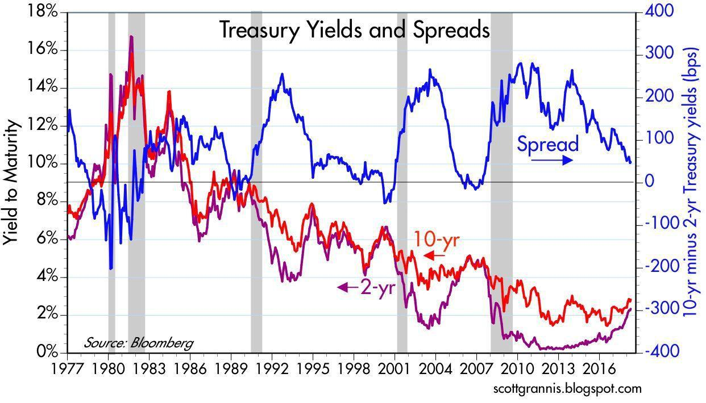

## Table of Contents

## What are Treasury yields?

Treasury yields are the interest rates that the U.S. government pays to borrow money by issuing Treasury securities like bonds, notes, and bills. These securities are considered very safe investments because they are backed by the full faith and credit of the U.S. government. The yield is essentially the return an investor can expect to earn if they hold the security until it matures. The yield is influenced by several factors, including the demand for the securities, the overall economic environment, and the Federal Reserve's monetary policy.

When people talk about Treasury yields, they often refer to the yield on the 10-year Treasury note, which is seen as a benchmark for other interest rates. If the yield on the 10-year Treasury goes up, it usually means that investors are demanding higher returns, which can happen when they think the economy is doing well or when they expect inflation to rise. On the other hand, if the yield goes down, it might mean that investors are looking for safer places to put their money, often during times of economic uncertainty. Changes in Treasury yields can affect everything from mortgage rates to the cost of borrowing for businesses and consumers.

## How are Treasury yields different from interest rates?

Treasury yields and interest rates are related but not the same thing. Treasury yields are the returns you get from investing in U.S. government securities like bonds, notes, and bills. They show how much the government pays to borrow money from investors. Interest rates, on the other hand, are the cost of borrowing money in general. They can be set by banks, credit card companies, or other lenders for loans, mortgages, and credit.

The main difference is that Treasury yields are specific to government securities, while interest rates apply to a wider range of financial products. Treasury yields can influence interest rates because they are seen as a benchmark for how safe and profitable investments should be. When Treasury yields go up, it often means that other interest rates will go up too, because lenders want to keep their rates competitive. But the reverse isn't always true; changes in other interest rates don't always directly affect Treasury yields.

## What factors influence Treasury yields?

Treasury yields are affected by many things. One big [factor](/wiki/factor-investing) is how much people want to buy Treasury securities. If a lot of people want to buy them, the price goes up, and the yield goes down. If fewer people want to buy them, the price goes down, and the yield goes up. Another factor is what's happening in the economy. If people think the economy will grow a lot, they might want higher yields because they expect more money from their investments. But if they think the economy might get worse, they might be happy with lower yields because they just want a safe place to put their money.

The Federal Reserve also plays a big role in Treasury yields. The Fed can change interest rates, and when it does, it can make Treasury yields go up or down. If the Fed raises interest rates, borrowing money becomes more expensive, and Treasury yields usually go up too. If the Fed lowers interest rates, borrowing money gets cheaper, and Treasury yields usually go down. Inflation is another thing that affects Treasury yields. If people think prices will go up a lot in the future, they will want higher yields to make up for the money they'll lose to inflation. So, Treasury yields are influenced by what people think about the economy, what the Fed does, and how much people want to buy government securities.

## How do Treasury yields affect the economy?

Treasury yields can have a big impact on the economy. When Treasury yields go up, it usually means that borrowing money becomes more expensive. This can affect things like mortgages, car loans, and business loans. If it costs more to borrow money, people and businesses might spend less, which can slow down the economy. On the other hand, if Treasury yields go down, borrowing money becomes cheaper. This can encourage people and businesses to borrow more and spend more, which can help the economy grow.

Another way Treasury yields affect the economy is through their influence on other interest rates. Because Treasury securities are seen as very safe, the yields on these securities set a kind of standard for other interest rates. When Treasury yields change, other interest rates often follow. For example, if Treasury yields go up, banks might raise the interest rates they charge for loans. This can make it harder for people to buy homes or for businesses to expand. If Treasury yields go down, banks might lower their rates, making it easier for people and businesses to borrow and spend, which can boost economic activity.

## What is the relationship between Treasury yields and bond prices?

Treasury yields and bond prices have an opposite relationship. When Treasury yields go up, bond prices go down. This happens because when new bonds are issued with higher yields, the old bonds with lower yields become less attractive to investors. To sell these old bonds, their prices have to drop so that their yields become more competitive with the new bonds.

On the other hand, when Treasury yields go down, bond prices go up. This is because the old bonds with higher yields become more attractive to investors. People are willing to pay more for these bonds because they offer better returns than the new bonds being issued with lower yields. So, the price of bonds goes up when yields go down, and it goes down when yields go up.

## How can investors use Treasury yields to make investment decisions?

Investors can use Treasury yields to help them decide where to put their money. If Treasury yields are going up, it might mean that the economy is doing well and people expect more growth. This could be a good time to invest in things like stocks or real estate, which might give higher returns. But if Treasury yields are going up, it also means that borrowing money is getting more expensive. So, investors might want to be careful about taking out loans to invest, because it could cost them more in the long run.

On the other hand, if Treasury yields are going down, it might mean that people are worried about the economy and want to keep their money safe. This could be a good time to buy Treasury securities, because they are very safe and their prices go up when yields go down. But if yields are low, it might also be a good time to borrow money, because it's cheaper. Investors could use this chance to take out loans for investments that might pay off more in the future, like starting a business or buying property.

## What is the yield curve and what does it indicate about future economic conditions?

The yield curve is a graph that shows the interest rates, or yields, of Treasury securities over different lengths of time, from short-term to long-term. It usually slopes upward, meaning that longer-term securities have higher yields than shorter-term ones. This happens because investors usually want more money for lending their money for a longer time, since there's more risk involved. But sometimes, the yield curve can be flat or even inverted, which means that short-term yields are higher than long-term yields.

When the yield curve is normal and slopes upward, it usually means that people think the economy will keep growing. But if the yield curve is flat or inverted, it can be a warning sign. An inverted yield curve, where short-term yields are higher than long-term yields, has often happened before the economy goes into a recession. This is because it shows that investors are worried about the future and think that interest rates will go down soon. So, the shape of the yield curve can give investors and economists a hint about what might happen in the economy in the future.

## How do central bank policies impact Treasury yields?

Central banks, like the Federal Reserve in the U.S., can have a big effect on Treasury yields. One way they do this is by changing the interest rates they control. When the central bank raises these rates, it makes borrowing money more expensive. This can make Treasury yields go up because new Treasury securities will have to offer higher yields to attract investors. On the other hand, if the central bank lowers interest rates, borrowing money gets cheaper, and Treasury yields usually go down because new securities can offer lower yields and still be attractive to investors.

Another way central banks influence Treasury yields is through their buying and selling of government securities, a process called open market operations. When a central bank buys Treasury securities, it increases the demand for them, which can push up their prices and lower their yields. If the central bank sells Treasury securities, it increases the supply, which can lower their prices and raise their yields. So, the actions of central banks can have a big impact on what happens to Treasury yields, which in turn can affect the whole economy.

## What are the historical trends in Treasury yields and what do they tell us?

Over the years, Treasury yields have gone up and down a lot. In the 1980s, they were really high, with the 10-year Treasury yield reaching over 15% at one point. This was because inflation was very high back then, and people wanted a lot of return on their investments to make up for it. But as the Federal Reserve worked to control inflation, Treasury yields started to come down. By the early 2000s, the 10-year yield was around 5%. After the 2008 financial crisis, the Federal Reserve lowered interest rates a lot to help the economy, and Treasury yields dropped even more, sometimes going below 2%.

These changes in Treasury yields tell us a lot about what was happening in the economy. When yields were high in the 1980s, it showed that people were worried about inflation and wanted high returns. When yields went down in the 2000s, it showed that the economy was more stable and inflation was under control. The big drop after the 2008 crisis showed that people were looking for safe places to put their money during a scary time. So, by looking at how Treasury yields have changed over time, we can see how the economy has been doing and what people were thinking about the future.

## How do global economic events influence U.S. Treasury yields?

Global economic events can have a big impact on U.S. Treasury yields. When there's trouble in the world, like a financial crisis or a big political change, people often want to put their money in safe places. U.S. Treasury securities are seen as very safe, so more people want to buy them. This can make the prices of these securities go up and their yields go down. For example, during the 2008 financial crisis, a lot of people around the world moved their money into U.S. Treasuries, which made their yields drop a lot.

On the other hand, when the global economy is doing well, people might want to take more risks with their money. They might move their money out of safe investments like U.S. Treasuries and into things like stocks or real estate, which can offer higher returns. This can make the demand for U.S. Treasuries go down, which can make their prices drop and their yields go up. So, what's happening in the world can push U.S. Treasury yields up or down, depending on whether people are looking for safety or wanting to take more risks.

## What are the different types of Treasury securities and how do their yields vary?

There are three main types of Treasury securities: Treasury bills, Treasury notes, and Treasury bonds. Treasury bills, or T-bills, are short-term securities that mature in a year or less. They are sold at a discount and don't pay interest until they mature. The yield on T-bills is the difference between the price you pay and the amount you get back when they mature. Treasury notes, or T-notes, are medium-term securities that mature in 2 to 10 years. They pay interest every six months and their yield is the [interest rate](/wiki/interest-rate-trading-strategies) they offer. Treasury bonds, or T-bonds, are long-term securities that mature in 20 to 30 years. Like T-notes, they pay interest every six months, and their yield is the interest rate they offer.

The yields on these different types of Treasury securities can vary a lot. Usually, the longer the time until a security matures, the higher its yield will be. This is because investors want more money for lending their money for a longer time, since there's more risk involved. So, T-bonds usually have higher yields than T-notes, and T-notes usually have higher yields than T-bills. But sometimes, things like what's happening in the economy or what the Federal Reserve is doing can make the yields on these securities go up or down in different ways.

## How can advanced statistical models be used to predict changes in Treasury yields?

Advanced statistical models can help predict changes in Treasury yields by looking at a lot of different information at the same time. These models can use things like past Treasury yield numbers, what's happening in the economy, what the Federal Reserve is doing, and even what's going on in the world. By putting all this information together, the models can find patterns and make guesses about what might happen to Treasury yields in the future. For example, if the model sees that the economy is growing fast and the Federal Reserve is raising interest rates, it might predict that Treasury yields will go up.

These models can also use something called [machine learning](/wiki/machine-learning), which means they can get better at making predictions over time. As they get more data and see how well their predictions worked, they can change how they work to make better guesses in the future. This can be really helpful for investors who want to know what might happen to Treasury yields, because it can help them decide where to put their money. But it's important to remember that even the best models can't predict the future perfectly, because there are always things that can happen that nobody expected.

## References & Further Reading

[1]: Bergstra, J., Bardenet, R., Bengio, Y., & Kégl, B. (2011). ["Algorithms for Hyper-Parameter Optimization."](https://papers.nips.cc/paper/4443-algorithms-for-hyper-parameter-optimization) Advances in Neural Information Processing Systems 24.

[2]: ["Advances in Financial Machine Learning"](https://www.amazon.com/Advances-Financial-Machine-Learning-Marcos/dp/1119482089) by Marcos Lopez de Prado

[3]: ["Evidence-Based Technical Analysis: Applying the Scientific Method and Statistical Inference to Trading Signals"](https://www.amazon.com/Evidence-Based-Technical-Analysis-Scientific-Statistical/dp/0470008741) by David Aronson

[4]: ["Machine Learning for Algorithmic Trading"](https://github.com/stefan-jansen/machine-learning-for-trading) by Stefan Jansen

[5]: ["Quantitative Trading: How to Build Your Own Algorithmic Trading Business"](https://books.google.com/books/about/Quantitative_Trading.html?id=j70yEAAAQBAJ) by Ernest P. Chan